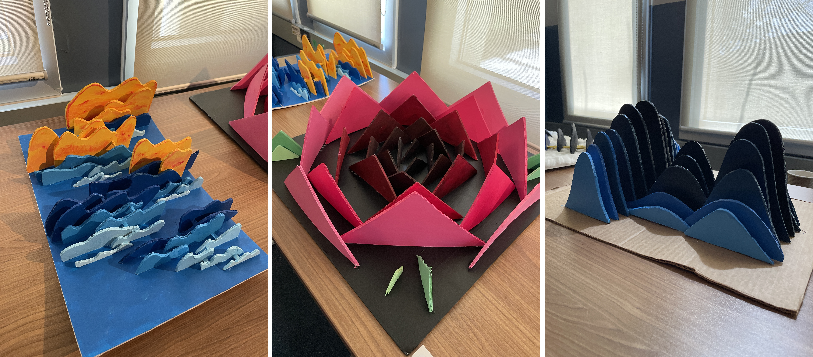
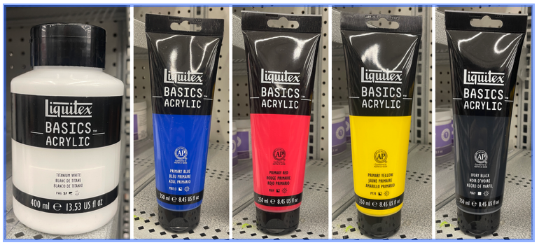
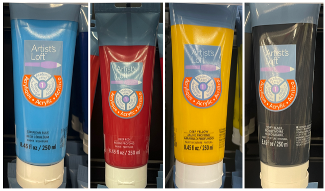

[MEDIAART 2DF3](README.md)

# Project 1 – Vector to Volume

<figure style="width: 100%; margin: auto;">
  
  <figcaption style="text-align: center; font-style: italic; margin-top: 0.5em;">
    Examples by previous students working with Project 1 – Vector to Volume
  </figcaption>
</figure>

## Required makerspace training

Before participating in laser cutting, complete the online **Thode Makerspace Training and Community** modules on **Avenue to Learn** and the required in-person training. See [Thode Makerspace: Equipment Training](https://library.mcmaster.ca/spaces/makerspace#tab-equipment-training) for enrollment information.

---

## Overview

In this project, students will collaborate in groups of **4 students** to design and construct a **three-dimensional composition** made from **two-dimensional vector-based shapes**.

The process includes **hand-sketching**, **digital design using Inkscape**, and **laser-cutting on birchwood**.  

Final compositions will demonstrate the application of Wong’s principles of form and composition, Samara’s approaches to form, space, and colour proportioning, and colour theory, while experimenting with physical materiality, repetition, layering, and three-dimensional structure.

> **This project is inspired by the paper-engineered sculptural work of <a href="https://www.mattshlian.com/">Matt Shlian</a>.**

### Software

This project uses:

- **Inkscape** — for creating and preparing vector files for laser cutting and engraving
- **Adobe InDesign** — for designing and assembling the project planning and final documentation PDFs

## Accessibility and learning support

- The written instructions contain the required steps. Demonstrations and external resources provide additional support.
- Group members may divide research, sketching, digital production, documentation, painting, assembly, and presentation responsibilities according to their strengths and access needs. Record each member’s contributions.
- You may use zoom, screen magnification, keyboard navigation, adapted input devices, colour-identification tools, or other assistive technology.
- If hand-sketching, colour mixing, lifting, sanding, laser-cutting, assembly, or another required process creates an access barrier, contact the instructor early to arrange an equivalent role or method that meets the same learning outcomes and makerspace safety requirements.
- Make planning and documentation PDFs text-based where possible. Use readable type, strong contrast, logical reading order, descriptive headings, and captions or image descriptions.

---

## Index

<!-- - [Part 1 – In-Class Work I: Brainstorm, sketch, and prepare laser-cut files](P1-InClassWork-I.md)
- [Part 2 – In-Class Work II: Plan colour and begin production](P1-InClassWork-II.md)
- [Final submission: Assembly, exhibition, and documentation](P1-Final-Submission.md) -->

---

## Notes

- Students must complete **Thode’s Makerspace Training Modules** on **Avenue to Learn** and the required **in-person training** before operating equipment or participating in laser production.
- A **laser-cutting session with the professor must be booked** in advance for production.  
  The instructor will confirm group printing schedules with the class. **Check Avenue for more information**.  
- **Several required materials are needed for this project**. Review the *Required Materials for Project 1* section below for the complete list, group responsibilities, estimated costs, and purchasing options.
- All production plates must be completed in Inkscape, the software required by the Makerspace for laser cutting.

> This is a collaborative project. All group members must make a documented contribution. Responsibilities may be divided in different ways when the workload remains fair and each student meets the project learning outcomes.

---

<!-- 
/////////////////
REQUIRED MATERIALS
/////////////////
-->

  

    Required Materials for Project 1
    
      Review the group and individual materials required for painting and assembly.
    
  

  

#### Materials charged through McMaster

Estimated cost per student: **$10 CAD — charged through McMaster accounts**. This includes:
  
- Fine-grit sandpaper (Project 1)
- Two Birchwood sheets (0.3 in thick, 24 × 12 in) per group (Project 1)
- High-quality paper and printing (Project 2)

#### Materials purchased by each group

Estimated shared cost per group of four students: **approximately $40 CAD**. Each group will need:

- *Bead Landing Jewelry Organizer* or equivalent paint-storage container
- Wood glue
- **Professional-quality acrylic brushes**
- **Primary-colour acrylic paints**

**Materials checklist**

- [ ] Each student assigned to painting has one suitable brush, or the group has confirmed an approved alternative role.
- [ ] The group has a small inexpensive brush for applying glue.
- [ ] The group has a paint-storage container with at least 15 separate compartments.
- [ ] The group has enough wood glue for assembly.
- [ ] The group has white and black acrylic paint.
- [ ] The group has at least two primary-colour acrylic paints: red, blue, or yellow.
- [ ] Any substitute materials meet the required size, quantity, and performance specifications.
  
These materials can be purchased at:

- <a href="https://www.michaels.com/">Michaels</a>, or
- <a href="https://g.co/kgs/x8QeG6p">Mixed Media Art Shop</a>, 1058 King St W, Hamilton, ON L8S 1G7

Detailed list with recommended purchasing options: 
    
##### Individual Materials

- **Acrylic Brush (Level 1: Academic, Medium–Large size)**
  - *Option:* <a href="https://www.michaels.com/product/simply-simmons-short-handle-flat-wash-brush-10472892?michaelsStore=5610&inv=2">Simply Simmons Short Handle Flat Wash Brush – **$5**</a>
  - *Option:* <a href="https://www.michaels.com/product/royal-langnickel-essentials-long-handle-flat-brush-10476226?michaelsStore=5610&inv=5">Royal & Langnickel® Essentials™ Long Handle Flat Brush – **$5**</a>

> Each student needs a brush suitable for applying smooth, even coats to birchwood. Craftsmanship and paint application are part of the assessment.

- **Cheap Brush** (small size, for glue application)

##### Group Materials (1 set per group)

- **Bead Landing Jewelry Organizer** (for storing mixed paints)  
  Size: 6.2 in × 4.7 in × 2 in, with at least 15 **separate** compartments
  - *Option:* <a href="https://www.michaels.com/product/30-container-bead-organizer-by-bead-landing-10164848">30 Container Bead Organizer by Bead Landing – **$18**</a>
  - *Option:* <a href="https://www.amazon.ca/Huaxiangoh-Containers-8-85x5-31x2-16in-Embroidery-Accessories/dp/B08GH8964N/ref=sr_1_10?dib=eyJ2IjoiMSJ9.I3YLW1Fb0_vOKsin33IJCeRn77bC5E07aT5U-P4Hmn21qQK5bZjlaNJ5VxsFbsDHPAIPy2-GUngmVRN8VzVm7GHG4CRCCUnL9j8w0BL53GK9QbJ6r2fb9Og20GK4YefBvxldUddOWNb30HDVBy0FoFmVZU6XERGR814ViD5-1AQxgBNQrs32odbIujZFgi95Gebx-o3rJ2k-tDaUhGHLkiTduc8HZkXOyWcV5SJZfYw5jMzmxD6CaEMwl1Jje0nGHaWyVZb70lYy9wJxpqV6D861vnHq-LsFQrkzAYWgNJE.j0KTphf1aHe7mRoGuJcCflx1M8itYuEK1yBCVFDBmMQ&dib_tag=se&gad_source=1&hvadid=679286654804&hvdev=c&hvexpln=0&hvlocphy=9060779&hvnetw=g&hvocijid=1908508043514503255--&hvqmt=e&hvrand=1908508043514503255&hvtargid=kwd-2257552828487&hydadcr=13567_13405808&keywords=bead%2Blanding%2Bjewelry%2Borganizer&mcid=a6023cbfe3ad3a9fb179bd3fcf439089&qid=1754154074&sr=8-10&th=1">30 Slots Diamond Painting Storage Containers – **$14**</a>

- **Wood Glue**  
    *Option:* Gorilla® Wood Glue (118.29 ml) – **$4.99 × 2**
  
- **Paint** All groups **must purchase**:
    - **White** and **Black** acrylic paint for base coating and adjusting value and saturation
    - At least **two** of the **primary colours**: Red, Blue, and/or Yellow

> Select the primary colours based on the hues needed for your group's gradient palette.

   

  

    

    <h4 role="heading" aria-level="6">
      Option 1:
      <a href="https://www.michaels.com/product/liquitex-basics-acrylic-paint-85oz-10474509?michaelsStore=5610&inv=1">
        Liquitex Basics Acrylics
      </a>
    </h4>

    <ul>
      <li>Titanium White (400 ml) – <strong>$19.99</strong></li>
      <li>Primary Blue (250 ml) – <strong>$13.99</strong></li>
      <li>Primary Red (250 ml) – <strong>$13.99</strong></li>
      <li>Primary Yellow (250 ml) – <strong>$13.99</strong></li>
      <li>Ivory Black (250 ml) – <strong>$13.99</strong></li>
    </ul>
  

  

    

    <h4 role="heading" aria-level="6">
      Option 2:
      <a href="https://www.michaels.com/product/acrylic-paint-by-artist's-loft-85oz-10517078?michaelsStore=5610&inv=3">
        Artist’s Loft Acrylic
      </a>
    </h4>

    <ul>
      <li>Titanium White (250 ml) × 2 – <strong>$10.49 × 2</strong></li>
      <li>Cerulean Blue (250 ml) – <strong>$10.49</strong></li>
      <li>Deep Red (250 ml) – <strong>$10.49</strong></li>
      <li>Deep Yellow (250 ml) – <strong>$10.49</strong></li>
      <li>Ivory Black (250 ml) – <strong>$10.49</strong></li>
    </ul>
  

> Prices and product availability are estimates and may change. Equivalent materials are acceptable when they meet the stated size, quantity, and performance requirements.

  

---

Credits: Jessica A. Rodríguez
