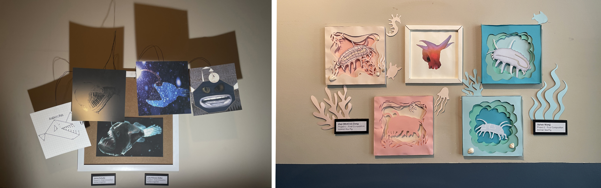

[MEDIA 2DF3](README.md)

-------------------------------------------------------------------------------

<h1 style="color: darkred;">Project 1 – Vector to Volume</h1> 
*Group Project (3–4 students)*

<figure style="width: 100%; margin: auto;">
  
  <figcaption style="text-align: center; font-style: italic; margin-top: 0.5em;">
    Examples by previous students working with Project 1 – Vector to Volume
  </figcaption>
</figure>

## Overview

In this project, students will collaborate in small groups (**3–4 students**) to design and construct a **three-dimensional composition** made from **two-dimensional vector-based shapes**.

Working from sketch to prototype, students will explore how flat geometry can be transformed into dynamic structures through repetition, layering, and spatial organization.  

The process includes **hand-sketching**, **digital design using Illustrator and Inkscape**, and **laser-cutting on birchwood**.  

Final compositions will demonstrate the application of **Wong’s Elements of Two-Dimensional Design** and **basic Colour Theory**, while experimenting with physical materiality and structure.

> **This project is inspired by the paper-engineered sculptural work of Matt Shlian.**

---

## Index

- [Part 1 – In-Class Work I: Brainstorm, Sketch & Laser-Cut Prep](P1-InClassWork-I.md)
- [Part 2 – In-Class Work II: Colour Planning & Final Assembly](P1-InClassWork-II.md)
- [Final Submission Guidelines](P1-Final-Submission.md)

---

## Notes

- A **laser-cutting session must be booked** at the **Thode Makerspace** in advance for production.  
  The instructor will confirm group printing schedules during Week 2.
- Students must complete **Thode’s Makerspace Training Modules** on **Avenue to Learn** prior to any laser-cutting session.
- **Required materials** include birchwood sheets (0.3 in thick, 24 × 12 in), paint, and basic tools.  
  > Estimated shared cost: **$50 per group**, charged through the **School of the Arts**.
- All plates must be designed in **Inkscape**, the software required by the Makerspace.

---

❗ **Reminder:** This is a collaborative project. Design work, cutting, and assembly must be shared equally among all group members. Participation, time management, and group communication will be factored into the evaluation.

---
