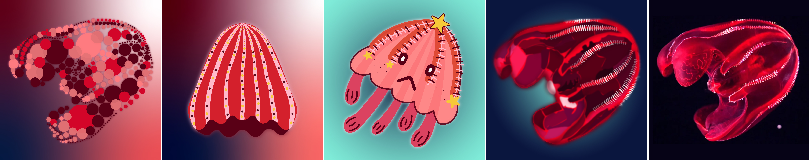

[MEDIA 2DF3](README.md) | [Project 2](P2-README.md)

-------------------------------------------------------------------------------

<h1 style="color: darkred;">P2 – In-Class Work I: Sketching & First Composition</h1>  
*Project 2 – In Pairs with Individual Work*

<figure style="width: 100%; margin: auto;">
  
  <figcaption style="text-align: center; font-style: italic; margin-top: 0.5em;">
    Examples by previous students.
  </figcaption>
</figure>

---

## Objective

Students will collaborate in **pairs** to create a **series of four compositions**, each offering a different visual interpretation of an assigned sea animal.

Each student will individually produce **two compositions**, ensuring a diverse range of styles—from **abstraction** to **figurative** to **realistic**.

The final works will be assembled together in a structured layout and showcased in an open exhibition.

**Software**:  
- Adobe Illustrator (primary tool for composition)  
  - ⚠️ **Do not use the Image Trace tool** in Adobe Illustrator or Photoshop ⚠️
- Adobe Photoshop (optional, for textures and image optimization only)

---

## Composition Breakdown

Each pair must create four compositions:

1. **Realistic Representation** (1 composition)  
   - Accurate and detailed rendering  
   - Focus on anatomy, texture, and shading  

2. **Figurative/Illustrative Interpretation** (1 composition)  
   - Stylized or expressive but still recognizable  
   - Can include collage or digital illustration

3. **Abstract Representations** (2 compositions)  
   - Geometric or minimalistic  
   - Inspired by **Gestalt principles**, **negative space**, or **shape simplification**

> Each student creates one abstract composition and either the realistic or figurative piece. Decide this collaboratively. You must **maintain the same aspect ratio** in all of your compositions to ensure visual consistency across the project.

---

<h3 style="color: darkred;">[30–45 min] Sketching & Planning</h3>

Before jumping into digital work, students will complete a guided **brainstorming session** and begin sketching.

### Brainstorming Questions:
- **Understanding the Animal**:
  - What are its key characteristics? (Shape, movement, texture, colour, patterns)
  - What makes it visually unique?

- **Style Exploration**:
  - What techniques are best for realistic/figurative representation?
  - How can it be simplified into geometric/abstract form?

- **Collaboration & Unity**:
  - What will visually connect your four compositions?
  - Will you share a colour palette, framing, or background style?
  - How will your pieces be displayed together?

### Group Submission Requirement:
Each pair must submit a brainstorming document that includes:  
- Answers to the questions above  
- A short summary (3–5 sentences) describing the group’s artistic direction  
- Rough sketches of all four compositions (2 per student)  
- Colour palette considerations  

**📤 Group Submission**. **Naming Protocol**: `Group-#-Notes.pdf`

---

<h3 style="color: darkred;">[Remaining Time] Start First Digital Composition</h3>

Each student begins working on either the **realistic** or **figurative** composition in **Adobe Illustrator**.  
Photoshop may be used for minor **texture or image effects** only.  

Each student must complete **at least 80%** of their realistic or figurative composition before the next class.

### Document Setup:

**Your Illustrator document must include the following settings for Logo Design:**
- **Naming Protocol**: `Lastname-Firstname-P2-1` or `Lastname-Firstname-P2-2`
- **Units:** Inches  
- **Size:** **6–8 inches** on its **longest side** (either width or height)
- **Bleed:** 0.3 in (on all sides) 
- **Color Mode:** RGB  
- **Raster Effects:** High (300 PPI)

**Required Layers:**
- **Guides Layer**: Include an inner rectangular border at **0.3 in** from the edges.  
- **Composition Layer**: This is where your main shapes should go.  
- **Background Layer**: Add any background colors or images here.

> **Maintain the same aspect ratio** in all of your compositions to ensure visual consistency across the project.
> ⚠️ **Important**: Make sure you follow the document setup instructions to avoid losing points.

### Useful Tools / Tutorials:

<iframe width="560" height="315" src="https://www.youtube.com/embed/NHivaPFLOps?si=ziXmH2AczRHg6nwo&amp;start=139" title="YouTube video player" frameborder="0" allow="accelerometer; autoplay; clipboard-write; encrypted-media; gyroscope; picture-in-picture; web-share" referrerpolicy="strict-origin-when-cross-origin" allowfullscreen></iframe>

<iframe width="560" height="315" src="https://www.youtube.com/embed/XeQo6fT0n_o?si=sCjUi25DDtKG4oB2&amp;start=139" title="YouTube video player" frameborder="0" allow="accelerometer; autoplay; clipboard-write; encrypted-media; gyroscope; picture-in-picture; web-share" referrerpolicy="strict-origin-when-cross-origin" allowfullscreen></iframe>

<iframe width="560" height="315" src="https://www.youtube.com/embed/qrGHs4d0yt0?si=REYnEhlwoJq-wlSh&amp;start=139" title="YouTube video player" frameborder="0" allow="accelerometer; autoplay; clipboard-write; encrypted-media; gyroscope; picture-in-picture; web-share" referrerpolicy="strict-origin-when-cross-origin" allowfullscreen></iframe>

<iframe width="560" height="315" src="https://www.youtube.com/embed/CtWyF72r1uM?si=UAuaNbY8w0UT_Re6&amp;start=139" title="YouTube video player" frameborder="0" allow="accelerometer; autoplay; clipboard-write; encrypted-media; gyroscope; picture-in-picture; web-share" referrerpolicy="strict-origin-when-cross-origin" allowfullscreen></iframe>

<iframe width="560" height="315" src="https://www.youtube.com/embed/SSPLw84kwq4?si=lPfTkZ-abhamI6Ka&amp;start=139" title="YouTube video player" frameborder="0" allow="accelerometer; autoplay; clipboard-write; encrypted-media; gyroscope; picture-in-picture; web-share" referrerpolicy="strict-origin-when-cross-origin" allowfullscreen></iframe>

<iframe width="560" height="315" src="https://www.youtube.com/embed/pYU1gSQJ8Qw?si=xIRBEP-Y1LO2sXt8&amp;start=139" title="YouTube video player" frameborder="0" allow="accelerometer; autoplay; clipboard-write; encrypted-media; gyroscope; picture-in-picture; web-share" referrerpolicy="strict-origin-when-cross-origin" allowfullscreen></iframe>

<iframe width="560" height="315" src="https://www.youtube.com/embed/RD5ph4yZ7Xs?si=MZ-4sc4mbasnuDtP&amp;start=139" title="YouTube video player" frameborder="0" allow="accelerometer; autoplay; clipboard-write; encrypted-media; gyroscope; picture-in-picture; web-share" referrerpolicy="strict-origin-when-cross-origin" allowfullscreen></iframe>

<iframe width="560" height="315" src="https://www.youtube.com/embed/LqMxioRA7_g?si=SMY8f8fB6nLzqTV_&amp;start=139" title="YouTube video player" frameborder="0" allow="accelerometer; autoplay; clipboard-write; encrypted-media; gyroscope; picture-in-picture; web-share" referrerpolicy="strict-origin-when-cross-origin" allowfullscreen></iframe>

---

<h3 style="color: darkred;">📥 Submission</h3>

1. Group brainstorming notes and sketches
   - **Naming Protocol**: `Group-#-Notes.pdf`

2. Two **Individual** Submission
   - **Naming:**  
     - `Lastname-Firstname-P2-1.pdf`  
     - `Lastname-Firstname-P2-2.pdf`

> 📌 **Failure to follow document setup or naming instructions may result in a grade deduction.**

---
