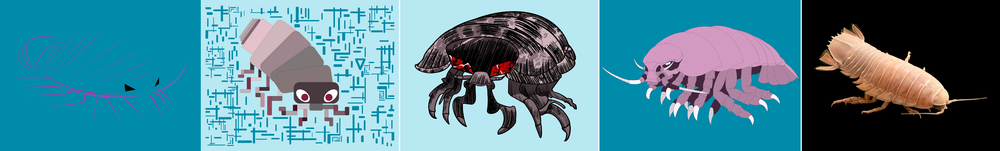

[MEDIA 2DF3](README.md) | [Project 2](P2-README.md)

-------------------------------------------------------------------------------

<h1 style="color: darkred;">P2 – In-Class Work II: Second Composition & Layout Planning</h1>  
*Project 2 – In Pairs with Individual Work*

<figure style="width: 100%; margin: auto;">
  
  <figcaption style="text-align: center; font-style: italic; margin-top: 0.5em;">
    Examples by previous students.
  </figcaption>
</figure>

---

## Objective

In this session, students will continue developing their compositions and begin planning their final exhibition layout.  
Each student will finalize their **two individual compositions**, and each pair will collaborate on the layout strategy for presentation.

**Software**:  
- Adobe Illustrator (primary tool for composition)  
  - ⚠️ **Do not use the Image Trace tool** in Adobe Illustrator or Photoshop ⚠️  
- Adobe Photoshop (optional, for textures and image optimization only)

---

<h3 style="color: darkred;">[1h–1h30m] Finalizing Digital Compositions</h3>

Continue developing your digital compositions based on your sketches from Part 1.  
Make refinements and add final details using Illustrator.  
Photoshop or Procreate may be used **only** for textures, effects, or image enhancements.

Each student must complete **at least 90%** of their **second** realistic or figurative composition before the next class.

### Document Setup:

**Your Illustrator document must include the following settings for Logo Design:**
- **Naming Protocol**: `Lastname-Firstname-P2-3` or `Lastname-Firstname-P2-4`
- **Units:** Inches  
- **Size:** **6–8 inches** on its **longest side** (either width or height)
- **Bleed:** 0.3 in (on all sides) 
- **Color Mode:** RGB  
- **Raster Effects:** High (300 PPI)

**Required Layers:**
- **Guides Layer**: Include an inner rectangular border at **0.3 in** from the edges.  
- **Composition Layer**: This is where your main shapes should go.  
- **Background Layer**: Add any background colors or images here.

> **Maintain the same aspect ratio** in all of your compositions to ensure visual consistency across the project.
> ⚠️ **Important**: Make sure you follow the document setup instructions to avoid losing points.

---

<h3 style="color: darkred;">[30 min] Exhibition Layout & Assembly Planning</h3>

Each group will begin planning their layout for the final exhibition. Discuss the visual presentation of your five-piece composition as a unified display.  

> *The fifth composition is the original photograph of the animation setup, using the same aspect ratio as your digital compositions.*
> **Final Print Size**: Each composition must measure **6–8 inches** on its **longest side** (either width or height)

### Consider the Following:
- **Framing/Border Thickness**: Should be consistent or intentionally varied  
- **Spacing Between Pieces**: Balanced visual spacing enhances clarity  
- **Overall Arrangement**: Explore grid-based or freeform layout  
- **Mounting Materials**: coming soon

### Group Submission Requirement:
Create a simple PDF with notes on your layout plan, material list, and arrangement ideas.  
Include a rough sketch or mock-up if helpful.

---

<h3 style="color: darkred;">📥 Submission</h3>

1. **Group Layout Planning PDF**  
   - **Naming Protocol**: `Group-#-Notes.pdf`

2. **Two Individual Composition PDFs**  
   - Each student submits their two finalized compositions  
   - **Naming Protocol:**  
     - `Lastname-Firstname-P2-3.pdf`  
     - `Lastname-Firstname-P2-4.pdf`

> 📌 **Failure to follow document setup or naming instructions may result in a grade deduction.**

---
