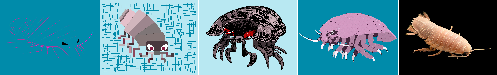

[← MEDIAART 2DF3](README.md) | [Project 2](P2-README.md)

---

<h1 style="color: darkred;">P2 – In-Class Work II: Second Composition & Print Layout Planning</h1>  
*Project 2 – In Pairs with Individual Work*

<figure style="width: 100%; margin: auto;">
  
  <figcaption style="text-align: center; font-style: italic; margin-top: 0.5em;">
    Examples by previous students.
  </figcaption>
</figure>

---

## Goal

During Part 2, each student will develop their **second individual composition**, completing the pair's series of four interpretations of the assigned animal. Each pair will also update their **Adobe InDesign planning document** and prepare a layout showing how the four compositions and the original photograph will fit together on the final **22 × 30 in Somerset paper**.

---

## Software

- **Adobe InDesign** — planning and project documentation
- **Adobe Illustrator** — vector-based composition and illustration
- **Adobe Photoshop** — raster-based composition, image manipulation, collage, texture, and digital painting

> **Do not use Image Trace in Adobe Illustrator or automated tracing techniques to generate the compositions.**

---

## Activity stages

Complete the following stages in order.

<!-- 
/////////////////
SECTION 1
/////////////////
-->

  

    1. Develop the second individual composition
    
      Create the abstract composition using the visual direction and technical specifications established during Part 1.
    
  

Each student will create their **second individual composition: the abstract interpretation** of the assigned animal.

The abstract composition should transform the animal through formal and conceptual experimentation rather than simply reproduce its appearance.

> Complete **at least 70% of your second composition for submission**.

Consider:

|  |  |  |
|---|---|---|
| Shape simplification | Fragmentation | Positive and negative space |
| Repetition | Scale | Cropping |
| Gestalt principles | Texture | Colour |
| Spatial relationships | Visual rhythm | Hierarchy |

The animal does not need to remain immediately recognizable, but the composition should develop from its **distinctive visual, anatomical, behavioural, or textural characteristics** identified during your research.

> Avoid creating an arbitrary abstract composition. There should be a clear relationship between your research, concept, and final visual decisions.

## Document setup

The second composition must use the **same dimensions, aspect ratio, and orientation** selected by the pair during Part 1.

Approved formats are:

| Format | Orientation |
|---|---|
| **6 × 8 in** | Portrait |
| **8 × 6 in** | Landscape |
| **6 × 6 in** | Square |
| **7 × 7 in** | Square |

> All four compositions and the original photograph must use the **same dimensions and aspect ratio**.

### Adobe Illustrator

If working in Illustrator:

| Setting | Requirement |
|---|---|
| Units | Inches |
| Size | Same dimensions selected by the pair |
| Bleed | 0.3 in on all sides |
| Colour Mode | RGB |
| Raster Effects | High — 300 PPI |

**Required layers:**

- **Guides**
- **Composition**
- **Background**

> The Guides layer must include an inner margin guide **0.3 in from the edges**. For submission, export the Illustrator composition as a **PDF with Preserve Illustrator Editing Capabilities enabled** so the layers and vector elements remain editable.

### Adobe Photoshop

If working in Photoshop:

| Setting | Requirement |
|---|---|
| Units | Inches |
| Size | Same dimensions selected by the pair |
| Resolution | 300 PPI |
| Colour Mode | RGB |
| Bit Depth | 16-bit recommended |

Maintain clearly organized and editable layers.

> Do not flatten the working Photoshop file. Save the final editable file as a **.TIFF** for submission.

## File naming

Save the second composition as:

- Illustrator: `Lastname-Firstname-P2-2.pdf`
- Photoshop: `Lastname-Firstname-P2-2.tiff`

> The file type depends on the software used to create the final composition.

<!-- 
/////////////////
SECTION 2
/////////////////
-->

  

    2. Complete and revise Composition 1
    
      Finalize the first composition by addressing the instructor feedback provided after the Part 1 submission.
    
  

Each student must also **complete Composition 1** from Part 1.

The instructor will provide feedback approximately **2 days after the Part 1 submission deadline**. Review this feedback carefully and make all required revisions before considering Composition 1 complete.

Revisions may address:

- Concept and visual interpretation
- Composition and hierarchy
- Colour
- Shape and spatial relationships
- Texture
- Representation
- Technical execution
- Document setup
- Overall relationship to the four-piece series

> **Composition 1 must be updated according to the instructor's feedback.** The version submitted with the final project should reflect these revisions rather than the original Part 1 submission.

---

## Submission

Each student must submit **two composition files**:

| Item | Required filename |
|---|---|
| Student 1 – Updated Composition 1 | `Lastname-Firstname-P2-1.pdf` or `.tiff` |
| Student 1 – Composition 2 | `Lastname-Firstname-P2-2.pdf` or `.tiff` |
| Student 2 – Updated Composition 1 | `Lastname-Firstname-P2-1.pdf` or `.tiff` |
| Student 2 – Composition 2 | `Lastname-Firstname-P2-2.pdf` or `.tiff` |

> **Failure to follow the planning-document requirements, composition specifications, print-layout requirements, file setup, or naming instructions may result in grade deductions.**

Review the **Printing Session instructions below** to make sure your files and final print document are prepared correctly. Check the [Final Submission Guidelines](P2-Final-Submission.md) for the remaining **printing, exhibition, and documentation requirements**.

---

<!-- 
/////////////////
PRINTING SESSION
/////////////////
-->

  

    Printing Session
    
      Revise the final compositions, prepare the 22 × 30 in Somerset print file, and attend the required printing session with the instructor during Week 12.
    
  

Before preparing the final printing document, both students must **review and address all feedback provided by the instructor on Compositions 1 and 2**, as well as any feedback related to the **overall cohesiveness of the four-composition series**.

> Only prepare the final print file after making the required revisions to all four compositions.

## Prepare the final Somerset print sheet

Each pair will receive **one 22 × 30 in sheet of Somerset paper** for printing the complete series.

Create a new **22 × 30 in Illustrator document** and import the final versions of all five images:

1. Student 1 – Realistic or Figurative Composition
2. Student 1 – Abstract Composition
3. Student 2 – Realistic or Figurative Composition
4. Student 2 – Abstract Composition
5. Original photograph

For the four student compositions:

- Import the final **Illustrator/PDF vector files** when the work was created in Illustrator.
- Import the final **TIFF files** when the work was created in Photoshop.
- Do not flatten or unnecessarily rasterize vector-based compositions before placing them into the final Illustrator document.

## Original photograph

Select a **high-quality photograph** of the assigned animal with enough resolution for the final print size.

You may:

- Crop the photograph to match the selected composition format.
- Resize the photograph as needed.
- Adjust its placement within the frame.

> **Do not distort or stretch the photograph.** Always maintain its original proportions when resizing.

The final photograph must use the **same dimensions and aspect ratio** as the four digital compositions.

## Arrange the print sheet

Place all five images within the **22 × 30 in Illustrator document**.

Consider:

- Orientation of the sheet
- Placement of all five images
- Consistent spacing
- Space for trimming
- Efficient use of the paper
- Alignment
- Relationship between the five images

> Do not scale individual compositions differently to make them fit. All five images must maintain the dimensions selected during Part 1.

The complete print layout should demonstrate careful use of the Somerset sheet while leaving sufficient space for trimming.

## Printing Session – Week 12

Printing will take place during **Week 12**.

The instructor will provide the available session times and additional scheduling information through **Avenue to Learn**.

Each pair must:

1. Select one of the available printing sessions.
2. Attend the scheduled session **with the instructor**.
3. Arrive on time with the **final revised compositions and completed 22 × 30 in printing document in a USB file**.
4. Print the complete five-image series on the provided Somerset paper.

> **Attendance at the scheduled printing session is required.**

This printing session is worth **2 points** and will be evaluated in person.

If a pair misses its scheduled session:

- The pair will **lose the 2 points assigned to the printing session**.
- The students must still **contact the instructor and reschedule another printing session**.
- The final project must still be printed with the instructor before the exhibition.

> Missing the original appointment does not remove the printing requirement. The project cannot be printed independently as a substitute for the required session.

---

Credits: Jessica A. Rodríguez