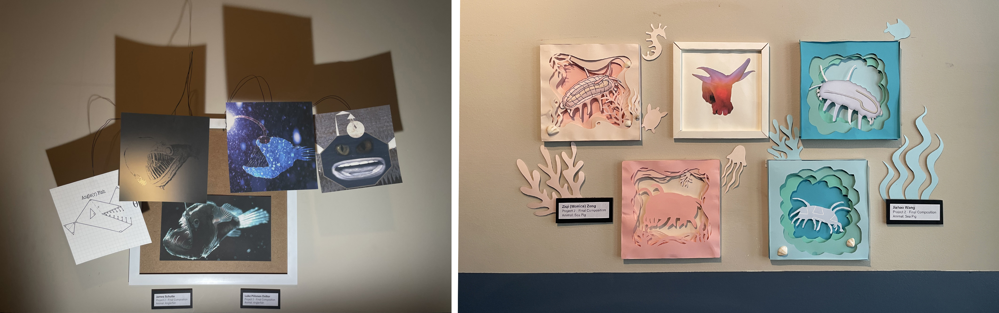

[MEDIA 2DF3](README.md)

-------------------------------------------------------------------------------

<h1 style="color: darkred;">Project 2 – Morphologies</h1> 
*In Pairs with Individual Work*

<figure style="width: 50%; margin: auto;">
  
  <figcaption style="text-align: center; font-style: italic; margin-top: 0.5em;">
    Examples by previous students working with the Morphologies of Animals from the Deep Sea.
  </figcaption>
</figure>

## Overview

In this project, students will work in **pairs** to create a **series of four digital compositions** that explore different visual interpretations of an animal. Each student will produce **two compositions individually**: one abstract and one either realistic or figurative.  

Compositions will range in style from **abstraction** to **realism**, challenging students to apply formal design principles and techniques across varied representational modes. The final project will be showcased in a public exhibition.

> **The assigned animal will be announced in class.**  
> **Animal selection will happen through a randomized draw, in class.**

---

## Index

- [Part 1 – In-Class Work I: Sketching & First Composition](P2-InClassWork-I.md)
- [Part 2 – In-Class Work II: Second Composition & Layout Planning](P2-InClassWork-II.md)
- [Final Submission Guidelines](P2-Final-Submission.md)

---

❗ **Reminder:** All parts of this project involve both collaborative planning and individual execution. Be sure to follow all file setup, submission protocols, and deadlines as outlined in each linked document.

---
