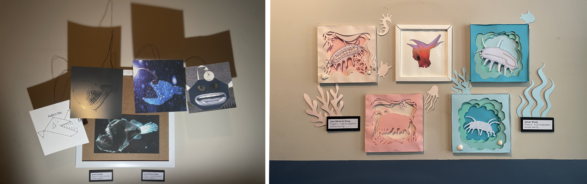

[MEDIAART 2DF3](README.md)

---

<h1 style="color: darkred;">Project 2 – Morphologies</h1> 
*In Pairs with Individual Work*

<figure style="width: 100%; margin: auto;">
  
  <figcaption style="text-align: center; font-style: italic; margin-top: 0.5em;">
    Examples by previous students working with Morphologies of Animals from the Deep Sea.
  </figcaption>
</figure>

---

## Overview

In this project, students will work in **pairs** to develop a series of **four digital compositions exploring different visual interpretations of an assigned animal**.

> **The assigned animal will be announced in class. Animal selection will take place through a randomized draw.**

Each student will create **two individual compositions**:

1. **One abstract interpretation**
2. **One realistic or figurative interpretation**

Working from research and sketching through digital production and final print preparation, students will explore how the same subject can be transformed through different approaches to **form, composition, colour, image-making, visual hierarchy, and representation**.

> This project combines **collaborative planning with individual execution**. Both students are responsible for ensuring that the four compositions function together as a visually cohesive series. Follow all document setup, production, submission, and exhibition requirements outlined in each section.

---

## Software

- **Adobe InDesign** — planning and project documentation
- **Adobe Illustrator** — vector-based composition and illustration
- **Adobe Photoshop** — raster-based composition, image manipulation, collage, texture, and digital painting

> You may use **Illustrator, Photoshop, or a combination of both** to create the final compositions. Choose the software according to the visual approach and techniques required by your design.

> **Do not use Image Trace in Adobe Illustrator or automated tracing techniques to generate the compositions.** 

---

## Index

+ [Part 1 – In-Class Work I: Sketching & First Composition](P2-InClassWork-I.md)
+ [Part 2 – In-Class Work II: Second Composition & Layout Planning](P2-InClassWork-II.md)
+ [Final Submission Guidelines](P2-Final-Submission.md)

---

## Materials charged through McMaster

Estimated cost per student: **$10 CAD — charged through McMaster accounts**. This includes:

- High-quality paper and printing (Project 2)
- Fine-grit sandpaper (Project 1)
- Two Birchwood sheets (0.3 in thick, 24 × 12 in) per group (Project 1)

---

Credits: Jessica A. Rodríguez