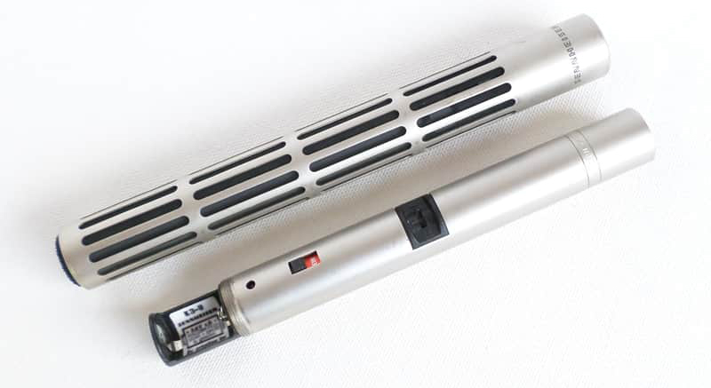
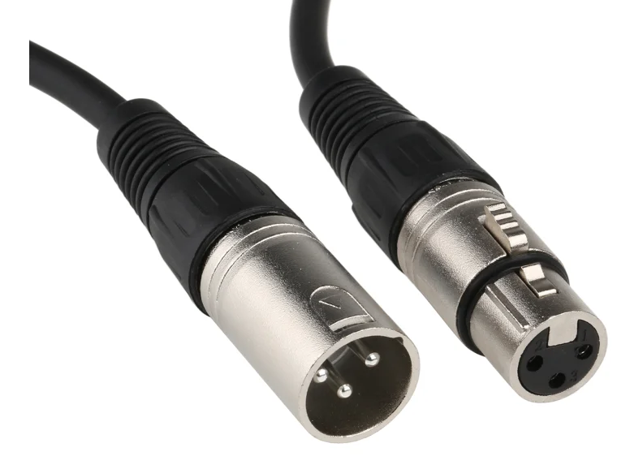

[MEDIAART 2B06](README.md)

-------------------------------------------------------------------------------

<h1 style="color: darkred;">Available Audio Equipment</h1>

### ZOOM H4N Handheld

Portable audio recorder used to capture production sound, ambient audio, and Foley. In this course, it should be used during filming to record cleaner sound than the camera’s built-in microphone. Can be mounted on-camera, placed closer to the sound source, or pair it with a shotgun microphone for improved clarity. Always monitor with headphones and record in WAV format.

- 📘 [Operation Manual](https://www.zoom.co.jp/sites/default/files/products/downloads/pdfs/E_H4nSP_0.pdf){:target="_blank"}
- ▶️ How to use the Zoom H4N portable audio recorder: [link to YouTube video](https://www.youtube.com/watch?v=xP9AKt5JBcI){:target="_blank"}

### ZOOM H4N Handheld PRO

Upgraded version of the H4n with lower-noise preamps and improved audio quality. Recommended for capturing dialogue (if applicable), detailed Foley, and subtle ambient sound. Locking XLR inputs provide a more stable connection when using external microphones.

- 📘 [Operation Manual](https://zoomcorp.com/media/documents/E_H4n_Pro_REV3.pdf){:target="_blank"}
- ▶️ The 3 Ways I Use My Zoom H4N Pro: [link to YouTube video](https://www.youtube.com/watch?v=2oA8_Y5pXyw){:target="_blank"}

### ZOOM H4N SP Handheld

Similar functionality to the original H4n, but often bundled with additional accessories (windscreen, case, etc.). Suitable for production audio, ambient recording, and Foley capture. Use in the same way as the standard H4n, following proper gain staging and monitoring practices.  

- 📘 [Operation Manual](https://www.zoom.co.jp/sites/default/files/products/downloads/pdfs/E_H4nSP_0.pdf){:target="_blank"}

________________________________________________________________________

<h1 style="color: darkred;">Microphones</h1>  

### RODE Microphone System Wireless Go II

Compact wireless microphone system used to capture clean production audio directly from a subject. In this course, it can be clipped onto an interviewee to record clear, isolated sound while filming. The dual-channel system allows recording two sources simultaneously, and on-board recording provides a backup in case of signal dropouts.  

- 📘 [User Guide](https://rode.com/en-ca/user-guides/wireless-go-ii){:target="_blank"}
- ▶️ RODE Wireless GO II Beginners Guide: [link to YouTube video](https://www.youtube.com/watch?v=Ewl-_rzIehk){:target="_blank"}

________________________________________________________________________

<h1 style="color: darkred;">Shotgun Microphones</h1>

### RODE VideoMic NTG On-Camera Shotgun Microphone

A versatile, broadcast-grade microphone that functions as both an on-camera shotgun mic and a full-featured USB microphone for computers and mobile devices.  

- 📘 [User Guide](https://rode.com/en-ca/user-guides/videomic-ntg){:target="_blank"}
- ▶️ Features and Specifications: [link to YouTube video](https://www.youtube.com/watch?v=c4SHRya4d6I){:target="_blank"}

### Sennheiser Condenser (ME 80)

The Sennheiser ME 80 is used in film and news gathering for location recording, prized for its high directionality and clear sound, often mounted on a boom pole or directly on a camera. This microphone required external power to work.    
> Using Phantom Power (Recommended via XLR Input): The Zoom H4n provides switchable 24V or 48V phantom power through its dual XLR combo jacks.  

- 📘 [User Manual](https://www.manualslib.com/products/Sennheiser-Me-80-9520660.html){:target="_blank"}
- ▶️ Mic Overview: [link to YouTube video](https://www.youtube.com/watch?v=JL_mRrzJXfc){:target="_blank"}

### Cable XLR to XLR

An XLR to XLR cable is a balanced audio cable with a 3-pin female connector on one end and a 3-pin male connector on the other. It is the standard for professional audio, used to connect microphones, mixers, and active speakers.   

- ▶️ XLR Audio Cable Tips: [link to YouTube video](https://www.youtube.com/watch?v=ryxO9Bf-pas&t=4s){:target="_blank"}
  > ⚠️ High level audio: lower your volume  

________________________________________________________________________

Credits: Jessica A. Rodríguez

**AI Disclosure**:  
AI tools (Gemini and ChatGPT) was used for **editing and clarity only**. AI is not used to generate original course content.
