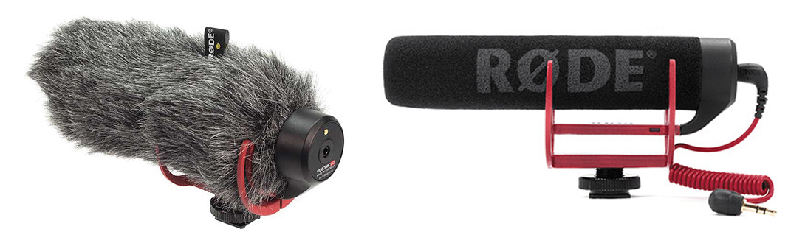
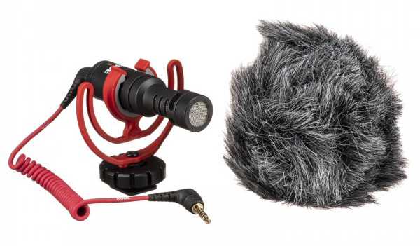
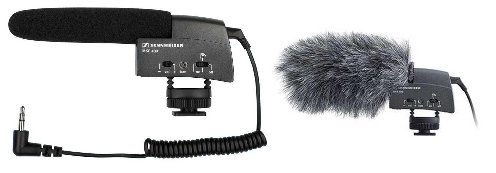
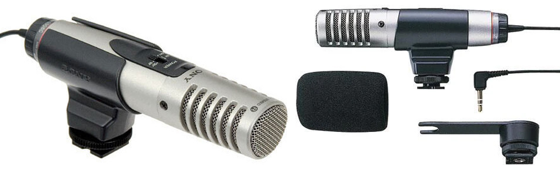
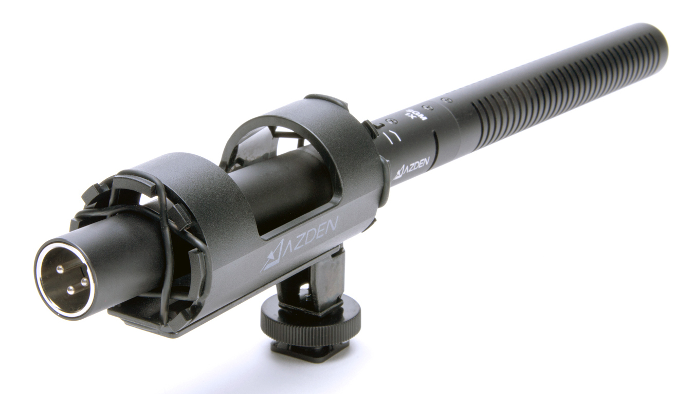
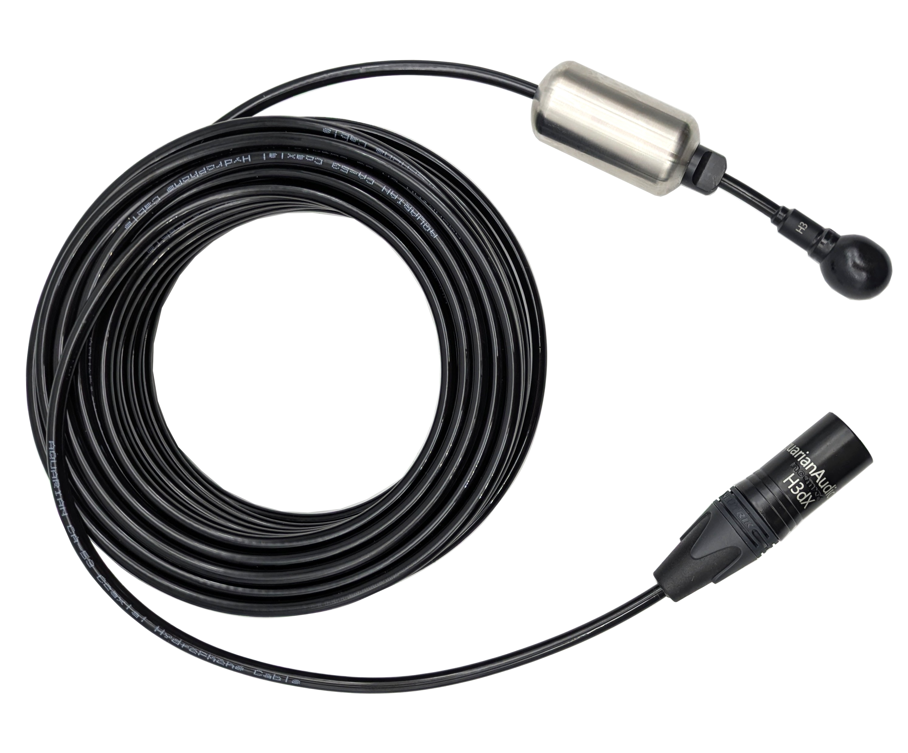
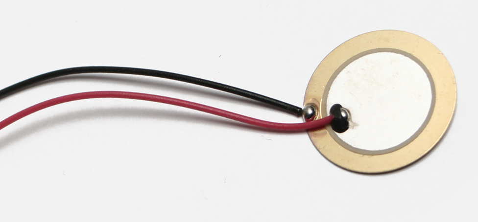

[MEDIAART 2B06](README.md)

-------------------------------------------------------------------------------

<h1 style="color: darkred;">Available Audio Equipment</h1>

________________________________________________________________________

<h2 style="color: darkred;">On-Camera & Direct-Input Microphones</h2>  

### RODE Microphone System Wireless Go II

Compact wireless microphone system used to capture clean production audio directly from a subject. In this course, it can be clipped onto an interviewee to record clear, isolated sound while filming. The dual-channel system allows recording two sources simultaneously, and on-board recording provides a backup in case of signal dropouts.  

- 📘 [User Guide](https://rode.com/en-ca/user-guides/wireless-go-ii){:target="_blank"}
- ▶️ RODE Wireless GO II Beginners Guide: [link to YouTube video](https://www.youtube.com/watch?v=Ewl-_rzIehk){:target="_blank"}

### RODE VideoMic NTG On-Camera Shotgun Microphone

Directional on-camera shotgun microphone used to capture focused sound from the subject directly in front of the camera. In this course, it is suitable for interviews, close-ups, and controlled narrative scenes where the camera is positioned near the subject. It offers better clarity than built-in camera microphones and allows manual gain control to avoid distortion.    

- 📘 [User Guide](https://rode.com/en-ca/user-guides/videomic-ntg){:target="_blank"}
- ▶️ Features and Specifications: [link to YouTube video](https://www.youtube.com/watch?v=c4SHRya4d6I){:target="_blank"}

### RODE Shotgun (VIDEOMIC GO)

Lightweight, plug-and-play on-camera shotgun microphone. Ideal for simple setups and quick shoots where mobility is important. Captures directional sound from the front of the camera and improves overall audio quality compared to internal camera microphones. Best used in relatively quiet environments.   

### RODE VideoMicro Compact On-Camera Microphone 

Compact and portable directional microphone that mounts directly onto the camera. Suitable for capturing general production audio and ambient sound in controlled settings. Works well for small crews and lightweight setups but should be positioned close to the subject for best results.   

### Sennheiser Shotgun (MKE 400)

Compact on-camera shotgun microphone designed for focused sound capture directly in front of the camera. Suitable for interviews, documentary-style shooting, and controlled narrative scenes where the camera is positioned close to the subject. Provides clearer audio than built-in camera microphones and works best in moderately quiet environments.

### Sony Shotgun Cam Mount (ECM-MS908C)

On-camera stereo shotgun microphone that captures directional sound with a wider stereo image. Useful for recording environmental sound and general production audio. Best suited for run-and-gun setups where mobility is important and external recorders are not being used.

________________________________________________________________________  

<h2 style="color: darkred;">Handheld Recorders</h2>  

### ZOOM H4N Handheld

Portable audio recorder used to capture production sound, ambient audio, and Foley. In this course, it should be used during filming to record cleaner sound than the camera’s built-in microphone. Can be mounted on-camera, placed closer to the sound source, or pair it with a shotgun microphone for improved clarity. Always monitor with headphones and record in WAV format.

- 📘 [Operation Manual](https://www.zoom.co.jp/sites/default/files/products/downloads/pdfs/E_H4nSP_0.pdf){:target="_blank"}
- ▶️ How to use the Zoom H4N portable audio recorder: [link to YouTube video](https://www.youtube.com/watch?v=xP9AKt5JBcI){:target="_blank"}

### ZOOM H4N Handheld PRO

Upgraded version of the H4n with lower-noise preamps and improved audio quality. Recommended for capturing dialogue (if applicable), detailed Foley, and subtle ambient sound. Locking XLR inputs provide a more stable connection when using external microphones.

- 📘 [Operation Manual](https://zoomcorp.com/media/documents/E_H4n_Pro_REV3.pdf){:target="_blank"}

### ZOOM H4N SP Handheld

Similar functionality to the original H4n, but often bundled with additional accessories (windscreen, case, etc.). Suitable for production audio, ambient recording, and Foley capture. Use in the same way as the standard H4n, following proper gain staging and monitoring practices.  

- 📘 [Operation Manual](https://www.zoom.co.jp/sites/default/files/products/downloads/pdfs/E_H4nSP_0.pdf){:target="_blank"}

________________________________________________________________________ 

<h2 style="color: darkred;">Field Recording Microphones</h2>  

### Cable XLR to XLR

Standard professional audio cable used to connect microphones to the Zoom H4n recorder. Required for condenser and shotgun microphones listed below. Provides balanced audio signal and supports phantom power when needed.  

- ▶️ XLR Audio Cable Tips: [link to YouTube video](https://www.youtube.com/watch?v=ryxO9Bf-pas&t=4s){:target="_blank"}

### Sennheiser ME 80 (Condenser Shotgun)

  

Highly directional condenser shotgun microphone used for focused sound capture in narrative scenes. Best mounted on a boom pole or positioned close to the subject. Requires phantom power (24V or 48V) via the Zoom H4n XLR input.  

- ▶️ Mic Overview: [link to YouTube video](https://www.youtube.com/watch?v=JL_mRrzJXfc){:target="_blank"}

### Azden Professional Shotgun - SGM 1X

  

Directional shotgun microphone suitable for dialogue and controlled scene recording. Connect via XLR to the Zoom H4n. Some models may operate on battery power; confirm settings before recording.

- ▶️ Mic Overview: [link to YouTube video](https://www.youtube.com/watch?v=rHcKKyfQqc4){:target="_blank"}

### Azden Professional Shotgun - SGM 2X

Higher-output shotgun microphone designed for extended reach and focused sound pickup. Suitable for boom use in narrative filming. Connect via XLR and monitor gain levels carefully to avoid distortion.

### Hydrophone

  

Specialized microphone designed to record underwater sound. Can be used to capture subtle textures such as water movement, vibrations, or resonant tones when submerged in water. In this course, it may be used experimentally for abstract or atmospheric sound design. Must only be used in water environments and handled carefully to protect cables and connections.

- ▶️ Recording Underwater Sounds in Ponds with my Hydrophones: [link to YouTube video](https://www.youtube.com/watch?v=TfF_i1OztQw){:target="_blank"}

### DIY Contact Microphone

  

Microphone designed to capture vibrations directly from solid surfaces rather than airborne sound. Useful for recording subtle textures such as metal, wood, glass, or mechanical objects. In this course, it can be used for experimental Foley and detailed sound design. Attach firmly to the surface and monitor levels carefully, as vibration signals can be strong and uneven.

- ▶️ 20 Contact Microphone Experiments: [link to YouTube video](https://www.youtube.com/watch?v=cgFEfTZ58Eo){:target="_blank"}

________________________________________________________________________ 

<h2 style="color: darkred;">Microphone Stands & Boom Support</h2>  

Microphone stands and boom poles are used to position microphones accurately and keep them stable during recording. Boom stands and boom poles allow you to suspend a shotgun microphone above or near the subject without entering the frame. Short stands are useful for table-level or close-surface recording (Foley, ambience, object sound).

 

- Boom Stand - Yorkville (MS 206)
- Boom Pole with/ 5/8"-27 Female Thread
- Boom Pole 
- Microphone Stand - K&M
- Microphone Stand - K&M (short) 

When using a Zoom H4n recorder on a stand, you must book either:
- A camera tripod, or
- A stand with a 5/8"-27 female thread adapter (limited availability — ask the instructor in advance).

________________________________________________________________________

Credits: Jessica A. Rodríguez

**AI Disclosure**:  
AI tools (Gemini and ChatGPT) was used for **editing and clarity only**. AI is not used to generate original course content.
