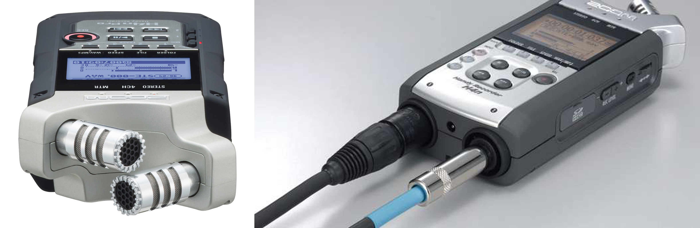
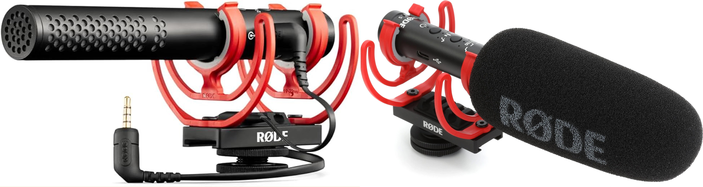
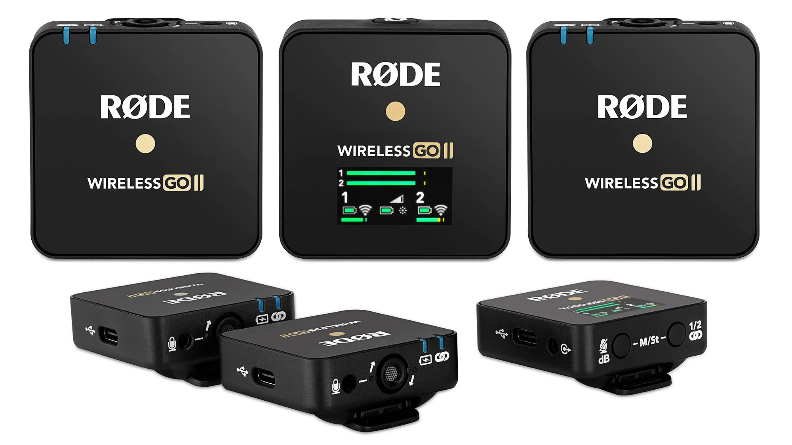
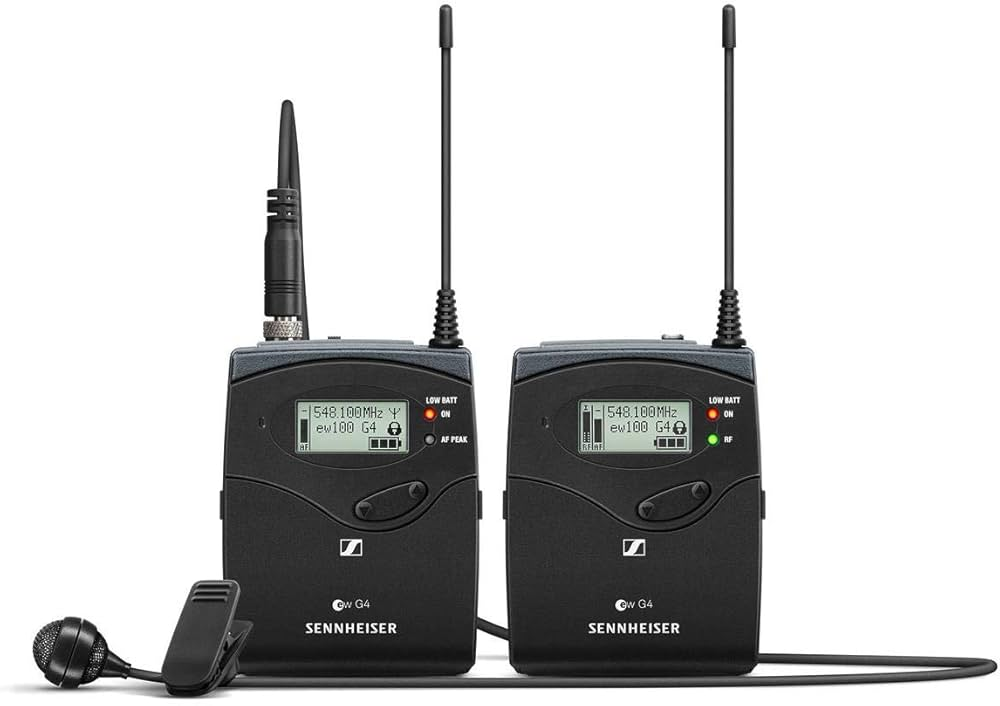

[MEDIAART 2B06](README.md)

-------------------------------------------------------------------------------

<h1 style="color: darkred;">Available Audio Equipment</h1>

**Note**: This page highlights the equipment we will use in **Week 2**; descriptions of other available equipment will be introduced later in the course.

<!--
### ZOOM H4N Handheld

Popular and versatile handheld audio recorder used by musicians, podcasters, and filmmakers for high-quality field recording and multi-track recording

- 📘 [Operation Manual](https://www.zoom.co.jp/sites/default/files/products/downloads/pdfs/E_H4nSP_0.pdf){:target="_blank"}
- ▶️ How to use the Zoom H4N portable audio recorder: [link to YouTube video](https://www.youtube.com/watch?v=xP9AKt5JBcI){:target="_blank"}
-->

### RODE VideoMic NTG On-Camera Shotgun Microphone

A versatile, broadcast-grade microphone that functions as both an on-camera shotgun mic and a full-featured USB microphone for computers and mobile devices.  

- 📘 [User Guide](https://rode.com/en-ca/user-guides/videomic-ntg){:target="_blank"}
- ▶️ Features and Specifications: [link to YouTube video](https://www.youtube.com/watch?v=c4SHRya4d6I){:target="_blank"}

### RODE Microphone System Wireless Go II

Ultra-compact, dual-channel wireless microphone system known for its versatility, ease of use, and on-board recording capabilities.

- 📘 [User Guide](https://rode.com/en-ca/user-guides/wireless-go-ii){:target="_blank"}
- ▶️ RODE Wireless GO II Beginners Guide: [link to YouTube video](https://www.youtube.com/watch?v=Ewl-_rzIehk){:target="_blank"}

### Audio-Technica Wireless Lavalier (AT899)

Wired, subminiature omnidirectional condenser lavalier microphone. The standard AT899 model includes a power module with an XLR output and can be powered by a 1.5V AA battery or phantom power.

- 📘 [User Manual](https://ats.emory.edu/_includes/documents/studios/manuals/Audio%20Technica%20at899_ss%20Manual.pdf){:target="_blank"}

________________________________________________________________________

Credits: Jessica A. Rodríguez

**AI Disclosure**:  
AI tools (Microsoft CoPilot and ChatGPT) is be used for **editing and clarity only**. All ideas, instructional decisions, and assignment constraints are authored by the me, the instructor (Jessica A. Rodriguez). AI is not used to generate original course content.
