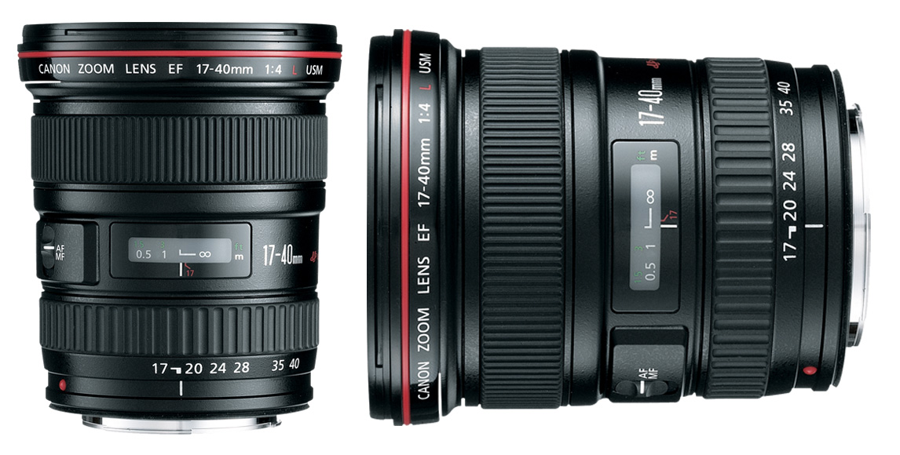
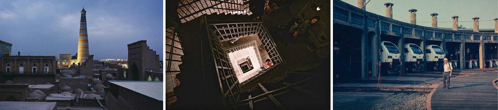

[MEDIAART 2B06](README.md)

-------------------------------------------------------------------------------

<h1 style="color: darkred;">Available DSLR Cameras</h1>

A **DSLR (Digital Single-Lens Reflex) camera** uses a single interchangeable lens for both viewing and recording the image.

Inside a DSLR, a mirror reflects light from the lens into the optical viewfinder so you can see directly through the lens. When recording begins, the mirror flips up, allowing light to reach the digital sensor.

---

The following DSLR cameras are available for Media Art students to rent. All models offer similar manual controls and image quality and are suitable for the Photo Film and Time-Based Media assignments.

### Canon EOS Rebel T4i / EOS 650D

Reliable entry-level DSLR with full manual controls. Ideal for learning exposure, focus, and composition fundamentals for both still and video work.

- 📘 Camera Manual: [link to manual](https://gdlp01.c-wss.com/gds/5/0300007695/01/eosrt4i-eos650d-im-c-en.pdf){:target="_blank"}
- ▶️ Intro Video: [link to YouTube video](https://www.youtube.com/watch?v=ENKDeSRfeFk){:target="_blank"}

### Canon EOS Rebel T5i / EOS 700D

Updated version of the T4i with improved autofocus and handling. Suitable for controlled shooting and tripod-based filming.

- 📘 Camera Manual: [link to manual](https://gdlp01.c-wss.com/gds/5/0300010905/02/eos-rebelt5i-700d-im2-en.pdf){:target="_blank"}
- ▶️ Intro Video: [link to YouTube video](https://www.youtube.com/watch?v=eXglxC0IN7Q){:target="_blank"}

### Canon EOS Rebel T7i / EOS 800D

More recent DSLR model with enhanced autofocus and improved low-light performance while maintaining the same core controls and workflow.

- 📘 Camera Manual: [link to manual](https://gdlp01.c-wss.com/gds/1/0300026121/01/eos-rebelt7i-800d-bim-3l.pdf){:target="_blank"}
- ▶️ Intro Video: [link to YouTube video](https://www.youtube.com/watch?v=4QTmDk_ZSmc){:target="_blank"}

________________________________________________________________________

<h1 style="color: darkred;">Camera Stabilization</h1> 

Tripods provide stable, fixed framing for interviews, locked-off shots, and controlled camera movement (pan and tilt). Models with fluid heads allow smoother motion for narrative filming. Available: 
- Manfrotto - Large for DSLR Camera (190XDB)
- Manfrotto - Large for DSLR Camera (Element MII)
- Manfrotto (190D) - Large for DSLR Camera
- Manfrotto - XL with Fluid Drag & Bag (MVK500AM)
- Manfrotto - XL with Fluid Drag & Bag (MVT502AM)

Monopods offer partial stabilization while allowing greater mobility. Useful for documentary-style shooting or when working in tight spaces where a full tripod is impractical. Available: 
- Manfrotto - Photo Monopod (679B)

Tripod Dollies attach to a tripod and allow smooth rolling movement across flat surfaces. They are used for controlled tracking shots and subtle camera motion while maintaining the stability of the tripod. Dollies must always be used together with a compatible tripod. Available: 
- Cine/Video Dolly - Manfrotto - Small
- Cine/Video Dolly - Manfrotto - Medium
- Cine/Video Dolly - Manfrotto - Large

________________________________________________________________________

<h1 style="color: darkred;">Available Lens</h1>

## Zoom Lenses

Zoom lenses have **variable focal lengths**, allowing you to change framing without physically moving the camera.  

### Canon 17–40mm f/4 L USM

Wide-angle zoom lens suitable for expansive establishing shots and environmental compositions. Useful when working in tight interior spaces or when emphasizing spatial relationships within a scene. The constant f/4 aperture supports consistent exposure while zooming.

- 📘 [Tech Overview](https://www.canon.ca/en/product?name=EF_17-40mm_f/4L_USM&category=/en/products/Lenses/EF-Lenses/Ultra-Wide-Zoom){:target="_blank"}
- [Examples from Lomography](https://www.lomography.com/lenses/13817-canon-ef-17-40-mm-f-4-l-usm/photos){:target="_blank"}

<figure style="width: 100%; margin: auto;">
  
  <figcaption style="text-align: center; font-style: italic; margin-top: 0.5em;">
    Credits: (left & centre) photographs by razruxa; (right) photograph by billykuo  
  </figcaption>
</figure> 

### Canon 24-105mm 1:3.5-5.6 IS STM

Versatile zoom lens suitable for a wide range of shots, from wide establishing frames to medium close-ups. Useful in narrative filming when flexibility is needed without changing lenses. 

- 📘 [Tech Overview](https://www.canon.ca/en/product?name=EF_24-105mm_f/3.5-5.6_IS_STM&category=/en/products/Lenses/EF-Lenses/Standard-Zoom){:target="_blank"}
- [Examples from Lomography](https://www.lomography.com/lenses/4251-canon-ef-24-105-f-3-5-5-6-stm/photos){:target="_blank"}

<figure style="width: 100%; margin: auto;">
  
  <figcaption style="text-align: center; font-style: italic; margin-top: 0.5em;">
    Credits: Photographs by grunrader 
  </figcaption>
</figure>  

### Canon 24-105mm 1:4 L IS II USM

Professional-grade zoom lens with a constant f/4 aperture. Useful for maintaining consistent exposure while zooming and for controlled narrative setups requiring reliable image quality.

- 📘 [Tech Overview](https://www.canon.ca/en/product?name=RF_24%E2%80%93105mm_F4_L_IS_USM&category=/en/products/Lenses/RF-Lenses/Standard-Zoom){:target="_blank"}
- [Examples from Lomography](https://www.lomography.com/lenses/1404-canon-ef-24-105mm-f-4-l-usm/photos){:target="_blank"}

<figure style="width: 100%; margin: auto;">
  
  <figcaption style="text-align: center; font-style: italic; margin-top: 0.5em;">
    Credits: (left) Frozen Chicago by paulsager, (centre) Photograph by andcon, (right) Young lovers kiss through a warped fence by shaysegev 
  </figcaption>
</figure>  

## Wide-Angle Prime Lenses

Prime lenses have a fixed focal length and cannot zoom. Wide-angle primes **provide a broader field of view** and allow more of the environment to enter the frame.

### Canon 24mm 1:1.4 L II USM

Wide-angle prime with a fast aperture, suitable for low-light narrative scenes and environmental compositions with shallow depth of field.

- 📘 [Tech Overview](https://www.canon.ca/en/product?name=EF_24mm_f/1.4L_II_USM&category=/en/products/Lenses/EF-Lenses/Wide-Angle){:target="_blank"}
- [Examples from Lomography](https://www.lomography.com/lenses/2481-canon-24mm-f-1-4l-ii-usm/photos){:target="_blank"}

<figure style="width: 100%; margin: auto;">
  
  <figcaption style="text-align: center; font-style: italic; margin-top: 0.5em;">
    Credits: (left & centre) Photographs by sommarbroken, (centre), (right) Небоскрёбы by film_evgen
  </figcaption>
</figure>  

### Canon 24mm 1:2.8

Compact and lightweight wide-angle prime. Suitable for handheld filming and environmental shots with a natural perspective.

- 📘 [Tech Overview](https://www.canon.ca/en/product?name=EF-S_24mm_f/2.8_STM&category=/en/products/Lenses/EF-Lenses/Wide-Angle){:target="_blank"}
- [Examples from Lomography](https://www.lomography.com/lenses/4333-canon-ef-24mm-f2-8/photos){:target="_blank"}
  > ⚠️ Content Warning: Some visual examples on this page include fine art nude photography presented in an artistic context.

<figure style="width: 100%; margin: auto;">
  
  <figcaption style="text-align: center; font-style: italic; margin-top: 0.5em;">
    Credits: (left & right) Photographs by stefankarelyang, (centre), (centre) Warehouse 6?, George Town by drdrewhonolulu 
  </figcaption>
</figure>  

### Canon 24mm 1:2.8 IS USM

Wide-angle lens with image stabilization, useful for handheld filming and static scenes in varied lighting conditions.

- 📘 [Tech Overview](https://www.canon.ca/en/product?name=EF_24mm_f/2.8_IS_USM&category=/en/products/Lenses/EF-Lenses/Wide-Angle){:target="_blank"}
- [Examples from Lomography](https://www.lomography.com/lenses/1647-canon-ef-24mm-f-2-8-is-usm/photos){:target="_blank"}

<figure style="width: 100%; margin: auto;">
  
  <figcaption style="text-align: center; font-style: italic; margin-top: 0.5em;">
    Credits: (left & right) Photographs by cyauzen, (centre), (centre) Photographs by mannequin 
  </figcaption>
</figure>  

### Canon 35mm 1:2

Provides a natural field of view with image stabilization. Suitable for handheld narrative filming and low-light scenes.  

- 📘 [Tech Overview](https://www.canon.ca/en/product?name=EF_35mm_f/2_IS_USM&category=){:target="_blank"}
- [Examples from Lomography](https://www.lomography.com/lenses/10505-canon-35mm-f2-ltm/photos){:target="_blank"}

<figure style="width: 100%; margin: auto;">
  
  <figcaption style="text-align: center; font-style: italic; margin-top: 0.5em;">
    Credits: (left) Photograph by h5, (centre) Munich Subway by daehee9119, (right) Photograph by chat-perdu 
  </figcaption>
</figure>  

## Standard and Telephoto Prime Lenses

Standard primes (~35mm–70mm) provide a **natural perspective similar to human vision**. Telephoto primes (>70mm) **compress distance and narrow the field of view**, making distant subjects appear closer.

### Canon 50mm 1:1.4 USM

Standard prime lens suitable for close-ups and medium shots. Offers shallow depth of field and strong subject separation. 

- 📘 [Tech Overview](https://www.canon.ca/en/product?name=EF_50mm_f/1.4_USM&category=/en/products/Lenses/EF-Lenses/Standard-Medium-Telephoto){:target="_blank"}
- [Examples from Lomography](https://www.lomography.com/lenses/392-canon-ef-50mm-f-1-4-usm/photos){:target="_blank"}

<figure style="width: 100%; margin: auto;">
  
  <figcaption style="text-align: center; font-style: italic; margin-top: 0.5em;">
    Credits: (left) VLADISLAVA by anciano, (centre) Walk along the streets of Ivanovo by anciano, (right) JUNE by sommarbroken 
  </figcaption>
</figure>

### Canon 50mm 1:1.2L USM

Very fast prime lens offering extremely shallow depth of field and strong subject isolation. Suitable for stylized narrative scenes and controlled lighting setups. 

- 📘 [Tech Overview](https://www.canon.ca/en/product?name=EF_50mm_f/1.2L_USM&category=/en/products/Lenses/EF-Lenses/Standard-Medium-Telephoto){:target="_blank"}
- [Examples from Lomography](https://www.lomography.com/lenses/1177-ef-50mm-f-1-2l-usm/photos){:target="_blank"}

<figure style="width: 100%; margin: auto;">
  
  <figcaption style="text-align: center; font-style: italic; margin-top: 0.5em;">
    Credits: (left & centre) Shoot the night by chilledvondub, (right) The fastest of glass by anciano by chilledvondub
  </figcaption>
</figure>  

### Canon 85mm 1:1.8 USM

Telephoto prime that provides flattering compression and strong background blur. Useful for portrait-style framing and isolating subjects from a distance. 

- 📘 [Tech Specs](https://www.canon.ca/en/product?name=EF_85mm_f/1.8_USM&category=/en/products/Lenses/EF-Lenses/Standard-Medium-Telephoto){:target="_blank"}
- [Examples from Lomography](https://www.lomography.com/lenses/3491-canon-ef-85mm-f-1-8-usm/photos){:target="_blank"}
  > ⚠️ Content Warning: Some visual examples on this page include Boudoir Photography and may include fine art nude photography, both presented in an artistic context.

<figure style="width: 100%; margin: auto;">
  
  <figcaption style="text-align: center; font-style: italic; margin-top: 0.5em;">
    Credits: (left) by pablofurso, (centre & right) NICOLE by anthonystone 
  </figcaption>
</figure>

________________________________________________________________________

Credits: Jessica A. Rodríguez

**AI Disclosure**:  
AI tools (Gemini and ChatGPT) was used for **editing and clarity only**. AI is not used to generate original course content.
