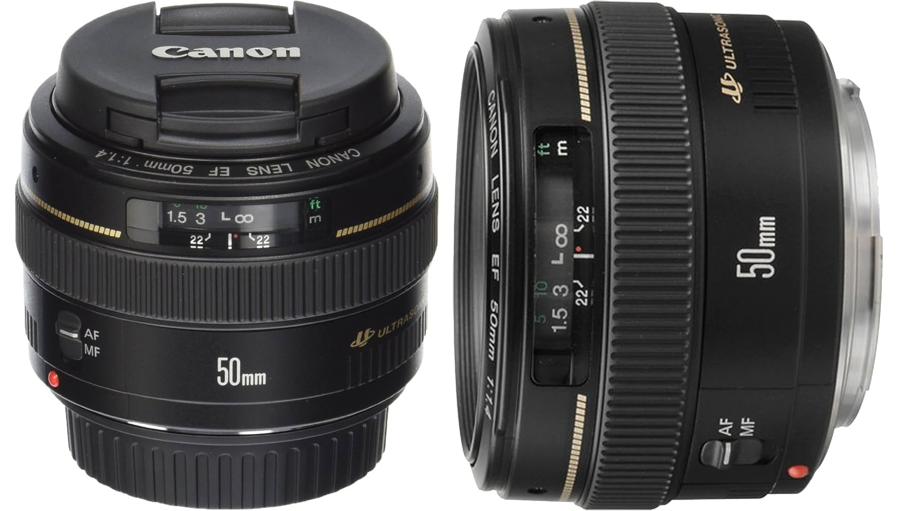
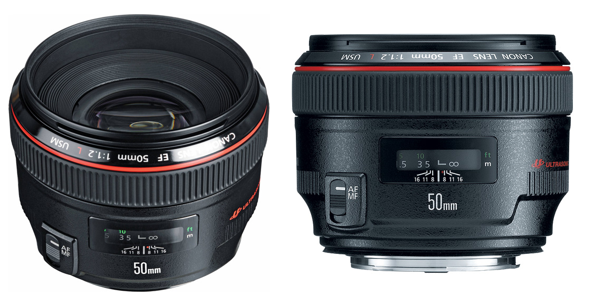
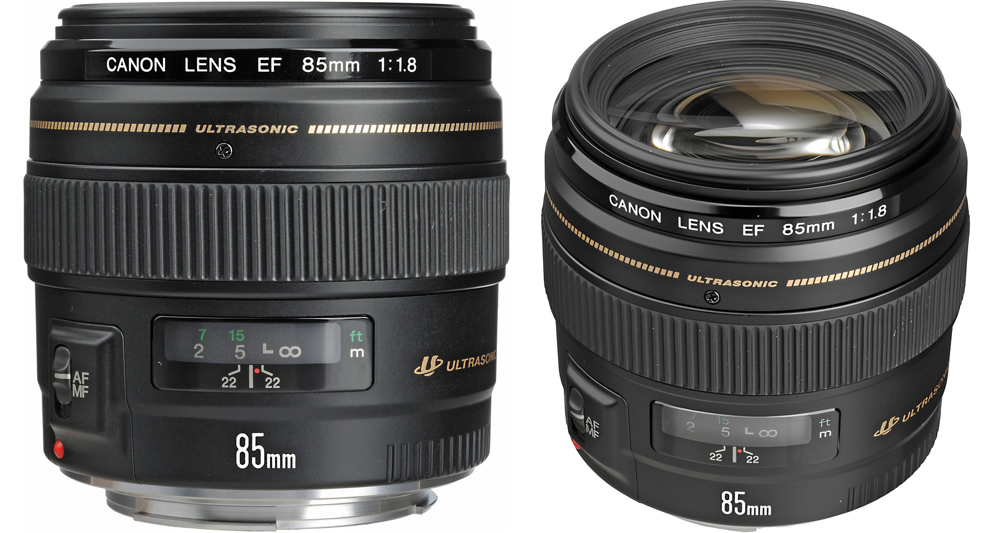
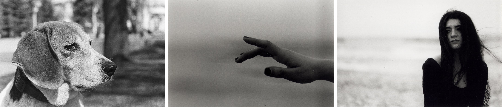

[MEDIAART 2B06](README.md)

-------------------------------------------------------------------------------

<h1 style="color: darkred;">Available DSLR Cameras</h1>

The following DSLR cameras are available for Media Art students to rent.  
All models offer similar controls and image quality and are well suited for the **Photo Film (Black & White)** assignment.

### Canon EOS Rebel T4i / EOS 650D

A reliable entry-level DSLR with full manual controls, ideal for learning exposure, focus, and composition fundamentals.

- 📘 Camera Manual: [link to manual](https://gdlp01.c-wss.com/gds/5/0300007695/01/eosrt4i-eos650d-im-c-en.pdf){:target="_blank"}
- ▶️ Intro Video: [link to YouTube video](https://www.youtube.com/watch?v=ENKDeSRfeFk){:target="_blank"}

### Canon EOS Rebel T5i / EOS 700D

An updated version of the T4i with improved autofocus and handling, suitable for controlled still photography and tripod-based shooting.

- 📘 Camera Manual: [link to manual](https://gdlp01.c-wss.com/gds/5/0300010905/02/eos-rebelt5i-700d-im2-en.pdf){:target="_blank"}
- ▶️ Intro Video: [link to YouTube video](https://www.youtube.com/watch?v=eXglxC0IN7Q){:target="_blank"}

### Canon EOS Rebel T7i / EOS 800D

A more recent DSLR model with enhanced autofocus and low-light performance, while maintaining the same core controls and workflow.

- 📘 Camera Manual: [link to manual](https://gdlp01.c-wss.com/gds/1/0300026121/01/eos-rebelt7i-800d-bim-3l.pdf){:target="_blank"}
- ▶️ Intro Video: [link to YouTube video](https://www.youtube.com/watch?v=4QTmDk_ZSmc){:target="_blank"}

📌 *Regardless of the camera model you are assigned, the core controls and concepts demonstrated in class apply across all three.* 

________________________________________________________________________

<h1 style="color: darkred;">Available Lens</h1>

<!--

### Canon 24-105mm 1:3.5-5.6 IS STM

A versatile prime lens with a natural field of view and wide aperture, ideal for low-light shooting and controlled depth of field.

- 📘 [Tech Overview](https://www.canon.ca/en/product?name=EF_50mm_f/1.4_USM&category=/en/products/Lenses/EF-Lenses/Standard-Medium-Telephoto){:target="_blank"}
- [Examples from Lomography](https://www.lomography.com/lenses/392-canon-ef-50mm-f-1-4-usm/photos){:target="_blank"}

<figure style="width: 100%; margin: auto;">
  
  <figcaption style="text-align: center; font-style: italic; margin-top: 0.5em;">
    Credits: (left) VLADISLAVA by anciano, (centre) Walk along the streets of Ivanovo by anciano, (right) JUNE by sommarbroken 
  </figcaption>
</figure>  

### Canon 24-105mm 1:4 L IS II USM

A versatile prime lens with a natural field of view and wide aperture, ideal for low-light shooting and controlled depth of field.

- 📘 [Tech Overview](https://www.canon.ca/en/product?name=EF_50mm_f/1.4_USM&category=/en/products/Lenses/EF-Lenses/Standard-Medium-Telephoto){:target="_blank"}
- [Examples from Lomography](https://www.lomography.com/lenses/392-canon-ef-50mm-f-1-4-usm/photos){:target="_blank"}

<figure style="width: 100%; margin: auto;">
  
  <figcaption style="text-align: center; font-style: italic; margin-top: 0.5em;">
    Credits: (left) VLADISLAVA by anciano, (centre) Walk along the streets of Ivanovo by anciano, (right) JUNE by sommarbroken 
  </figcaption>
</figure>  

### Canon 24mm 1:1.4 L II USM

A versatile prime lens with a natural field of view and wide aperture, ideal for low-light shooting and controlled depth of field.

- 📘 [Tech Overview](https://www.canon.ca/en/product?name=EF_50mm_f/1.4_USM&category=/en/products/Lenses/EF-Lenses/Standard-Medium-Telephoto){:target="_blank"}
- [Examples from Lomography](https://www.lomography.com/lenses/392-canon-ef-50mm-f-1-4-usm/photos){:target="_blank"}

<figure style="width: 100%; margin: auto;">
  
  <figcaption style="text-align: center; font-style: italic; margin-top: 0.5em;">
    Credits: (left) VLADISLAVA by anciano, (centre) Walk along the streets of Ivanovo by anciano, (right) JUNE by sommarbroken 
  </figcaption>
</figure>  

### Canon 24mm 1:2.8

A versatile prime lens with a natural field of view and wide aperture, ideal for low-light shooting and controlled depth of field.

- 📘 [Tech Overview](https://www.canon.ca/en/product?name=EF_50mm_f/1.4_USM&category=/en/products/Lenses/EF-Lenses/Standard-Medium-Telephoto){:target="_blank"}
- [Examples from Lomography](https://www.lomography.com/lenses/392-canon-ef-50mm-f-1-4-usm/photos){:target="_blank"}

<figure style="width: 100%; margin: auto;">
  
  <figcaption style="text-align: center; font-style: italic; margin-top: 0.5em;">
    Credits: (left) VLADISLAVA by anciano, (centre) Walk along the streets of Ivanovo by anciano, (right) JUNE by sommarbroken 
  </figcaption>
</figure>  

### Canon 24mm 1:2.8 IS USM

A versatile prime lens with a natural field of view and wide aperture, ideal for low-light shooting and controlled depth of field.

- 📘 [Tech Overview](https://www.canon.ca/en/product?name=EF_50mm_f/1.4_USM&category=/en/products/Lenses/EF-Lenses/Standard-Medium-Telephoto){:target="_blank"}
- [Examples from Lomography](https://www.lomography.com/lenses/392-canon-ef-50mm-f-1-4-usm/photos){:target="_blank"}

<figure style="width: 100%; margin: auto;">
  
  <figcaption style="text-align: center; font-style: italic; margin-top: 0.5em;">
    Credits: (left) VLADISLAVA by anciano, (centre) Walk along the streets of Ivanovo by anciano, (right) JUNE by sommarbroken 
  </figcaption>
</figure>  

### Canon 35mm 1:2

A versatile prime lens with a natural field of view and wide aperture, ideal for low-light shooting and controlled depth of field.

- 📘 [Tech Overview](https://www.canon.ca/en/product?name=EF_50mm_f/1.4_USM&category=/en/products/Lenses/EF-Lenses/Standard-Medium-Telephoto){:target="_blank"}
- [Examples from Lomography](https://www.lomography.com/lenses/392-canon-ef-50mm-f-1-4-usm/photos){:target="_blank"}

<figure style="width: 100%; margin: auto;">
  
  <figcaption style="text-align: center; font-style: italic; margin-top: 0.5em;">
    Credits: (left) VLADISLAVA by anciano, (centre) Walk along the streets of Ivanovo by anciano, (right) JUNE by sommarbroken 
  </figcaption>
</figure>  

--> 

### Canon 50mm 1:1.4 USM

A versatile prime lens with a natural field of view and wide aperture, ideal for low-light shooting and controlled depth of field.

- 📘 [Tech Overview](https://www.canon.ca/en/product?name=EF_50mm_f/1.4_USM&category=/en/products/Lenses/EF-Lenses/Standard-Medium-Telephoto){:target="_blank"}
- [Examples from Lomography](https://www.lomography.com/lenses/392-canon-ef-50mm-f-1-4-usm/photos){:target="_blank"}

<figure style="width: 100%; margin: auto;">
  
  <figcaption style="text-align: center; font-style: italic; margin-top: 0.5em;">
    Credits: (left) VLADISLAVA by anciano, (centre) Walk along the streets of Ivanovo by anciano, (right) JUNE by sommarbroken 
  </figcaption>
</figure>

### Canon 50mm 1:1.2L USM

A professional L-series prime lens with an extremely wide aperture, producing very shallow depth of field and strong subject isolation in low-light conditions. 

- 📘 [Tech Overview](https://www.canon.ca/en/product?name=EF_50mm_f/1.2L_USM&category=/en/products/Lenses/EF-Lenses/Standard-Medium-Telephoto){:target="_blank"}
- [Examples from Lomography](https://www.lomography.com/lenses/1177-ef-50mm-f-1-2l-usm/photos){:target="_blank"}

<figure style="width: 100%; margin: auto;">
  
  <figcaption style="text-align: center; font-style: italic; margin-top: 0.5em;">
    Credits: (left & centre) Shoot the night by chilledvondub, (right) The fastest of glass by anciano by chilledvondub
  </figcaption>
</figure>

### Canon 85mm 1:1.8 USM

A short telephoto prime lens that compresses space and isolates subjects, well suited for portraits and shooting with distance while maintaining soft background blur.

- 📘 [Tech Specs](https://www.canon.ca/en/product?name=EF_85mm_f/1.8_USM&category=/en/products/Lenses/EF-Lenses/Standard-Medium-Telephoto){:target="_blank"}
- [Examples from Lomography](https://www.lomography.com/lenses/3491-canon-ef-85mm-f-1-8-usm/photos){:target="_blank"}
  > ⚠️ Content Warning: Some visual examples on this page include Boudoir Photography and may include fine art nude photography, both presented in an artistic context.

<figure style="width: 100%; margin: auto;">
  
  <figcaption style="text-align: center; font-style: italic; margin-top: 0.5em;">
    Credits: (left) by pablofurso, (centre & right) NICOLE by anthonystone 
  </figcaption>
</figure>

________________________________________________________________________

Credits: Jessica A. Rodríguez

**AI Disclosure**:  
AI tools (Microsoft CoPilot and ChatGPT) was used for **editing and clarity only**. All ideas, instructional decisions, and assignment constraints are authored by the me, the instructor (Jessica A. Rodriguez). AI is not used to generate original course content.
