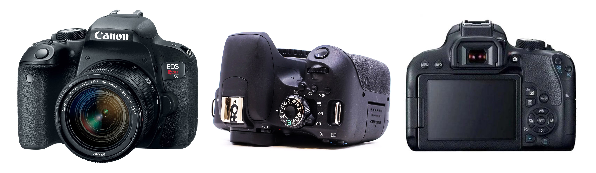
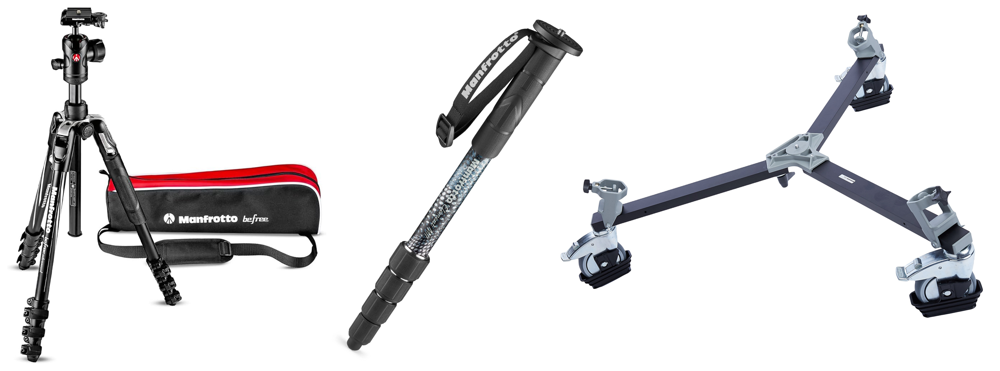
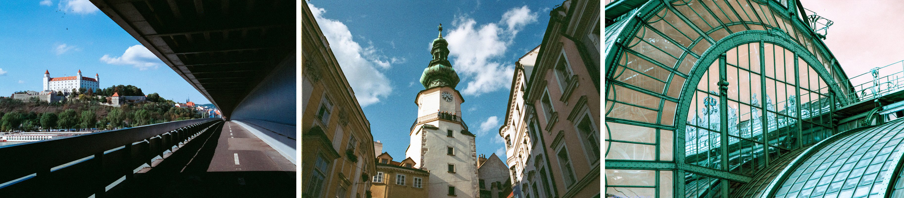
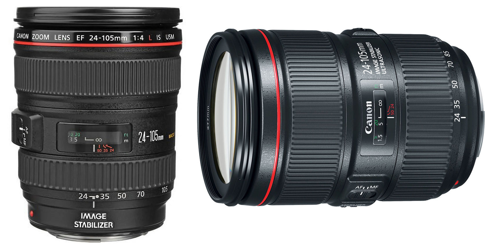
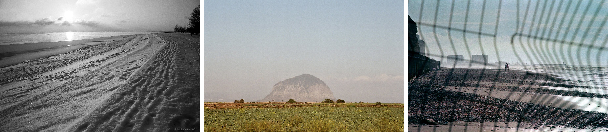
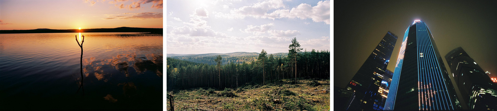
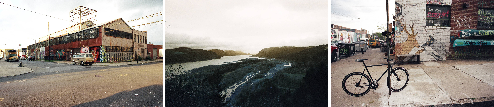

[MEDIAART 2B06](README.md)

# Cameras, Stabilization Equipment, and Lenses

Use this page to review the available DSLR cameras, camera supports, and lenses before booking equipment.

Confirm that the selected camera, lens, batteries, and accessories are compatible before the recording session.

<!--
/////////////////
SECTION 1
/////////////////
-->

  

    1. DSLR cameras
    
      Review the available Canon DSLR cameras, their main features, manuals, and introductory tutorials.
    
  

## What is a DSLR camera?

A **DSLR**, or Digital Single-Lens Reflex camera, uses one interchangeable lens for viewing and recording the image.

Inside a DSLR, a mirror reflects light from the lens into the optical viewfinder. When recording begins, the mirror moves out of the way, allowing light to reach the digital sensor.

The following DSLR cameras are available for Media Art students to book. All three models provide similar manual controls and are suitable for photography and time-based media projects.

## Canon EOS Rebel T4i / EOS 650D

A reliable entry-level DSLR with full manual controls. It is suitable for learning exposure, focus, composition, photography, and video recording.

- [Read the camera manual](https://gdlp01.c-wss.com/gds/5/0300007695/01/eosrt4i-eos650d-im-c-en.pdf){:target="_blank"}
- [Watch an introductory tutorial](https://www.youtube.com/watch?v=ENKDeSRfeFk){:target="_blank"}

## Canon EOS Rebel T5i / EOS 700D

An updated version of the T4i with improved autofocus and handling. It is suitable for handheld recording, controlled shooting, and tripod-based filming.

- [Read the camera manual](https://gdlp01.c-wss.com/gds/5/0300010905/02/eos-rebelt5i-700d-im2-en.pdf){:target="_blank"}
- [Watch an introductory tutorial](https://www.youtube.com/watch?v=eXglxC0IN7Q){:target="_blank"}

## Canon EOS Rebel T7i / EOS 800D

A more recent DSLR model with improved autofocus and low-light performance while maintaining a similar manual-control workflow.

- [Read the camera manual](https://gdlp01.c-wss.com/gds/1/0300026121/01/eos-rebelt7i-800d-bim-3l.pdf){:target="_blank"}
- [Watch an introductory tutorial](https://www.youtube.com/watch?v=4QTmDk_ZSmc){:target="_blank"}

> The Canon EOS Rebel T7i uses a different battery type from the T4i and T5i. When using a T7i, confirm that the booked backup camera and batteries are compatible.

<!--
/////////////////
SECTION 2
/////////////////
-->

  

    2. Tripods and camera stabilization
    
      Compare tripods, monopods, and tripod dollies for static framing, handheld support, and controlled camera movement.
    
  

## Tripods

Tripods provide stable framing for interviews, static shots, photography, and controlled camera movement.

Tripods with fluid heads can also support smoother panning and tilting during narrative or documentary recording.

Available tripods:

- Manfrotto Large DSLR Tripod, `190XDB`
- Manfrotto Large DSLR Tripod, `Element MII`
- Manfrotto Large DSLR Tripod, `190D`
- Manfrotto XL Tripod with Fluid Drag and Bag, `MVK500AM`
- Manfrotto XL Tripod with Fluid Drag and Bag, `MVT502AM`

When using a tripod:

- Extend the legs safely.
- Keep the centre column as low as practical.
- Level the camera.
- Tighten the tripod head before recording.
- Confirm that the tripod does not block a door, walkway, road, or accessibility route.
- Turn lens Image Stabilization off for static tripod recording unless the technical walkthrough instructs otherwise.

## Monopods

Monopods provide partial stabilization while allowing greater mobility.

They are useful for documentary recording, longer handheld sessions, and locations where a full tripod is impractical.

Available monopod:

- Manfrotto Photo Monopod, `679B`

A monopod does not provide the same stability as a tripod. The camera operator must continue supporting and controlling the equipment.

## Tripod dollies

Tripod dollies attach beneath a compatible tripod and allow the camera to roll across a flat surface.

They can support:

- Controlled tracking shots
- Slow movement toward or away from a subject
- Side-to-side camera movement
- Stable movement while maintaining the height and support of a tripod

Available dollies:

- Manfrotto Small Cine/Video Dolly
- Manfrotto Medium Cine/Video Dolly
- Manfrotto Large Cine/Video Dolly

> A tripod dolly must be used with a compatible tripod. Use dollies only on smooth, level surfaces and confirm that the route is free from cables, obstacles, stairs, and uneven flooring.

<!--
/////////////////
SECTION 3
/////////////////
-->

  

    3. Lenses
    
      Compare the focal lengths, aperture ranges, stabilization features, and visual characteristics of the available lenses.
    
  

Before booking a lens, confirm:

- The focal length or zoom range
- The minimum and maximum aperture
- Camera compatibility
- Whether the lens includes Auto Focus
- Whether the lens includes Image Stabilization
- Whether it provides the framing and depth of field required for the project

## Zoom lenses

Zoom lenses have **variable focal lengths**, allowing the field of view and framing to change without replacing the lens.

### Canon 17–40mm f/4 L USM

A wide-angle zoom lens suitable for establishing shots, environmental compositions, and tight interior spaces.

Its constant `f/4` maximum aperture supports consistent exposure while changing the focal length.

- [Review the technical specifications](https://www.canon.ca/en/product?name=EF_17-40mm_f/4L_USM&category=/en/products/Lenses/EF-Lenses/Ultra-Wide-Zoom){:target="_blank"}
- [View photographic examples](https://www.lomography.com/lenses/13817-canon-ef-17-40-mm-f-4-l-usm/photos){:target="_blank"}

<figure class="media-card">
  
  <figcaption>
    Credits: left and centre photographs by razruxa; right photograph by billykuo.
  </figcaption>
</figure>

### Canon 24–105mm f/3.5–5.6 IS STM

A versatile zoom lens that can produce wide establishing views, medium shots, and closer framing without changing lenses.

The available maximum aperture changes depending on the selected focal length.

- [Review the technical specifications](https://www.canon.ca/en/product?name=EF_24-105mm_f/3.5-5.6_IS_STM&category=/en/products/Lenses/EF-Lenses/Standard-Zoom){:target="_blank"}
- [View photographic examples](https://www.lomography.com/lenses/4251-canon-ef-24-105-f-3-5-5-6-stm/photos){:target="_blank"}

<figure class="media-card">
  
  <figcaption>
    Credits: photographs by grunrader.
  </figcaption>
</figure>

### Canon 24–105mm f/4 L IS II USM

A professional zoom lens with a constant `f/4` maximum aperture.

It is useful for narrative, documentary, and controlled production setups that require flexible framing and consistent exposure while zooming.

- [Review the technical specifications](https://www.canon.ca/en/product?name=RF_24%E2%80%93105mm_F4_L_IS_USM&category=/en/products/Lenses/RF-Lenses/Standard-Zoom){:target="_blank"}
- [View photographic examples](https://www.lomography.com/lenses/1404-canon-ef-24-105mm-f-4-l-usm/photos){:target="_blank"}

<figure class="media-card">
  
  <figcaption>
    Credits: left, *Frozen Chicago* by paulsager; centre photograph by andcon; right, *Young Lovers Kiss Through a Warped Fence* by shaysegev.
  </figcaption>
</figure>

## Wide-angle prime lenses

Prime lenses have one fixed focal length and cannot zoom.

Wide-angle prime lenses provide a broader field of view and allow more of the environment to enter the frame.

### Canon 24mm f/1.4 L II USM

A wide-angle prime lens with a large maximum aperture.

It is suitable for low-light recording, environmental compositions, and wide images with a shallow depth of field.

- [Review the technical specifications](https://www.canon.ca/en/product?name=EF_24mm_f/1.4L_II_USM&category=/en/products/Lenses/EF-Lenses/Wide-Angle){:target="_blank"}
- [View photographic examples](https://www.lomography.com/lenses/2481-canon-24mm-f-1-4l-ii-usm/photos){:target="_blank"}

<figure class="media-card">
  
  <figcaption>
    Credits: left and centre photographs by sommarbroken; right, *Небоскрёбы* by film_evgen.
  </figcaption>
</figure>

### Canon 24mm f/2.8

A compact and lightweight wide-angle prime lens.

It is suitable for handheld filming, moving shots, and environmental framing.

- [Review the technical specifications](https://www.canon.ca/en/product?name=EF-S_24mm_f/2.8_STM&category=/en/products/Lenses/EF-Lenses/Wide-Angle){:target="_blank"}
- [View photographic examples](https://www.lomography.com/lenses/4333-canon-ef-24mm-f2-8/photos){:target="_blank"}

> **Content warning:** Some examples on the linked page include fine-art nude photography.

<figure class="media-card">
  
  <figcaption>
    Credits: left and right photographs by stefankarelyang; centre, *Warehouse 6?, George Town* by drdrewhonolulu.
  </figcaption>
</figure>

### Canon 24mm f/2.8 IS USM

A wide-angle prime lens with Image Stabilization.

It is useful for handheld filming, continuous shots, environmental compositions, and recording under varied lighting conditions.

- [Review the technical specifications](https://www.canon.ca/en/product?name=EF_24mm_f/2.8_IS_USM&category=/en/products/Lenses/EF-Lenses/Wide-Angle){:target="_blank"}
- [View photographic examples](https://www.lomography.com/lenses/1647-canon-ef-24mm-f-2-8-is-usm/photos){:target="_blank"}

<figure class="media-card">
  
  <figcaption>
    Credits: left and right photographs by cyauzen; centre photograph by mannequin.
  </figcaption>
</figure>

### Canon 35mm f/2

A prime lens that provides a natural field of view.

It is suitable for handheld narrative filming, moving shots, environmental portraits, and low-light scenes.

- [Review the technical specifications](https://www.canon.ca/en/product?name=EF_35mm_f/2_IS_USM&category=){:target="_blank"}
- [View photographic examples](https://www.lomography.com/lenses/10505-canon-35mm-f2-ltm/photos){:target="_blank"}

<figure class="media-card">
  
  <figcaption>
    Credits: left photograph by h5; centre, *Munich Subway* by daehee9119; right photograph by chat-perdu.
  </figcaption>
</figure>

## Standard and telephoto prime lenses

Standard prime lenses provide a relatively natural perspective.

Telephoto prime lenses narrow the field of view, compress spatial distance, and make it possible to isolate a subject from farther away.

### Canon 50mm f/1.4 USM

A standard prime lens suitable for medium shots, interviews, close-ups, and shallow depth of field.

- [Review the technical specifications](https://www.canon.ca/en/product?name=EF_50mm_f/1.4_USM&category=/en/products/Lenses/EF-Lenses/Standard-Medium-Telephoto){:target="_blank"}
- [View photographic examples](https://www.lomography.com/lenses/392-canon-ef-50mm-f-1-4-usm/photos){:target="_blank"}

<figure class="media-card">
  
  <figcaption>
    Credits: left, *VLADISLAVA* by anciano; centre, *Walk Along the Streets of Ivanovo* by anciano; right, *JUNE* by sommarbroken.
  </figcaption>
</figure>

### Canon 50mm f/1.2 L USM

A very fast prime lens offering an extremely shallow depth of field and strong subject isolation.

It is suitable for stylized narrative scenes and controlled low-light setups.

- [Review the technical specifications](https://www.canon.ca/en/product?name=EF_50mm_f/1.2L_USM&category=/en/products/Lenses/EF-Lenses/Standard-Medium-Telephoto){:target="_blank"}
- [View photographic examples](https://www.lomography.com/lenses/1177-ef-50mm-f-1-2l-usm/photos){:target="_blank"}

<figure class="media-card">
  
  <figcaption>
    Credits: left and centre, *Shoot the Night* by chilledvondub; right, *The Fastest of Glass* by anciano.
  </figcaption>
</figure>

### Canon 85mm f/1.8 USM

A telephoto prime lens that creates visual compression and strong background blur.

It is useful for portrait-style framing, details, interviews, and isolating subjects from a distance.

- [Review the technical specifications](https://www.canon.ca/en/product?name=EF_85mm_f/1.8_USM&category=/en/products/Lenses/EF-Lenses/Standard-Medium-Telephoto){:target="_blank"}
- [View photographic examples](https://www.lomography.com/lenses/3491-canon-ef-85mm-f-1-8-usm/photos){:target="_blank"}

> **Content warning:** Some examples on the linked page include boudoir and fine-art nude photography.

<figure class="media-card">
  
  <figcaption>
    Credits: left photograph by pablofurso; centre and right, *NICOLE* by anthonystone.
  </figcaption>
</figure>

---

Credits: Jessica A. Rodríguez