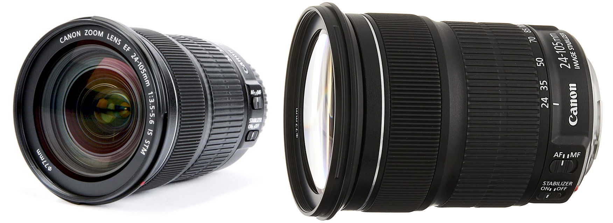
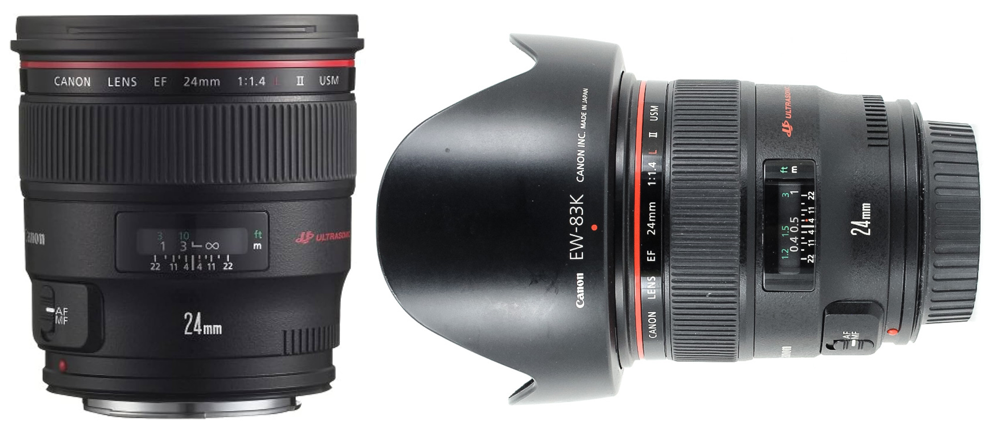
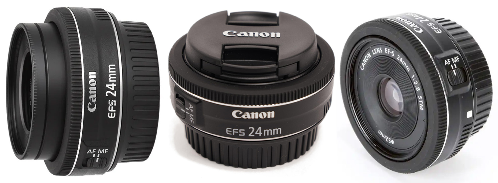
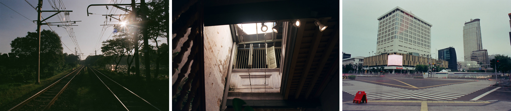
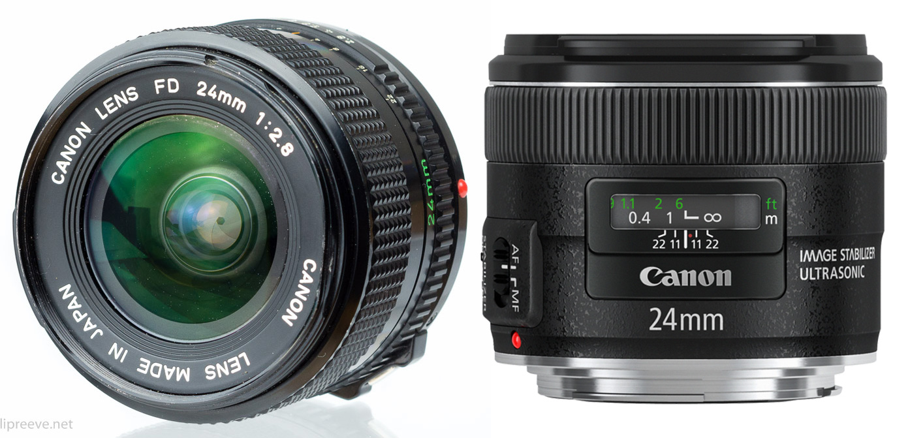
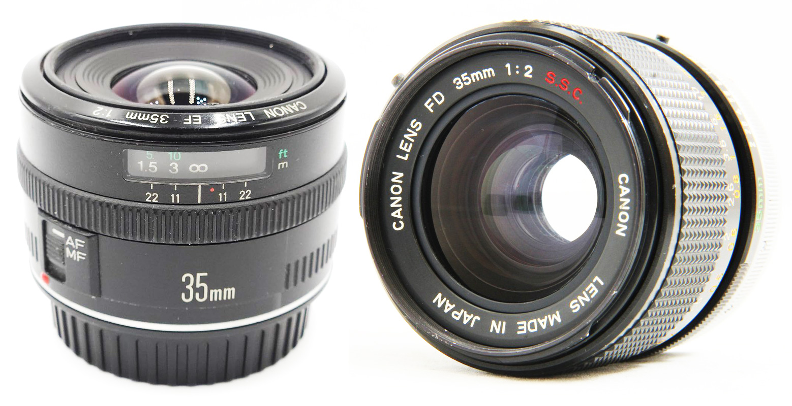
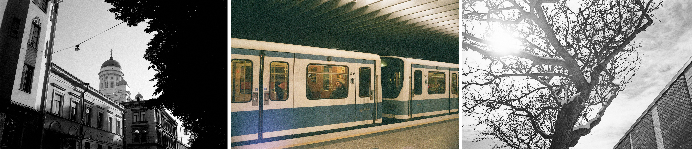

[MEDIAART 2B06](README.md)

-------------------------------------------------------------------------------

<h1 style="color: darkred;">Available DSLR Cameras</h1>

A **DSLR (Digital Single-Lens Reflex) camera** is a digital camera that uses a single interchangeable lens for both viewing and recording an image.  

Inside a DSLR, **a mirror reflects light** from the lens up into the optical viewfinder, allowing you to see the scene directly through the lens. When you take a photo or start recording, the mirror flips up, letting light reach the digital sensor so the image can be recorded.  

<figure style="width: 80%; margin: auto; display: flex; justify-content: left; gap: 1em;">
  
  
</figure> 

---

The following DSLR cameras are available for Media Art students to rent.  
All models offer similar controls and image quality and are well suited for the **Photo Film (Black & White)** assignment.

### Canon EOS Rebel T4i / EOS 650D

A reliable entry-level DSLR with full manual controls, ideal for learning exposure, focus, and composition fundamentals.

- 📘 Camera Manual: [link to manual](https://gdlp01.c-wss.com/gds/5/0300007695/01/eosrt4i-eos650d-im-c-en.pdf){:target="_blank"}
- ▶️ Intro Video: [link to YouTube video](https://www.youtube.com/watch?v=ENKDeSRfeFk){:target="_blank"}

### Canon EOS Rebel T5i / EOS 700D

An updated version of the T4i with improved autofocus and handling, suitable for controlled still photography and tripod-based shooting.

- 📘 Camera Manual: [link to manual](https://gdlp01.c-wss.com/gds/5/0300010905/02/eos-rebelt5i-700d-im2-en.pdf){:target="_blank"}
- ▶️ Intro Video: [link to YouTube video](https://www.youtube.com/watch?v=eXglxC0IN7Q){:target="_blank"}

### Canon EOS Rebel T7i / EOS 800D

A more recent DSLR model with enhanced autofocus and low-light performance, while maintaining the same core controls and workflow.

- 📘 Camera Manual: [link to manual](https://gdlp01.c-wss.com/gds/1/0300026121/01/eos-rebelt7i-800d-bim-3l.pdf){:target="_blank"}
- ▶️ Intro Video: [link to YouTube video](https://www.youtube.com/watch?v=4QTmDk_ZSmc){:target="_blank"}

📌 *Regardless of the camera model you are assigned, the core controls and concepts demonstrated in class apply across all three.* 

________________________________________________________________________

<h1 style="color: darkred;">Available Lens</h1>

## Zoom Lenses

Zoom lenses have **variable focal lengths**, allowing you to change your field of view without moving your feet.  

### Canon 24-105mm 1:3.5-5.6 IS STM

Ideal for general-purpose photography (landscapes, portraits, events) and smooth, quiet video recording due to its STM motor.    

- 📘 [Tech Overview](https://www.canon.ca/en/product?name=EF_24-105mm_f/3.5-5.6_IS_STM&category=/en/products/Lenses/EF-Lenses/Standard-Zoom){:target="_blank"}
- [Examples from Lomography](https://www.lomography.com/lenses/4251-canon-ef-24-105-f-3-5-5-6-stm/photos){:target="_blank"}

<figure style="width: 100%; margin: auto;">
  
  <figcaption style="text-align: center; font-style: italic; margin-top: 0.5em;">
    Credits: Photographs by grunrader 
  </figcaption>
</figure>  

### Canon 24-105mm 1:4 L IS II USM

Best for a wide range of subjects, including landscapes, portraits, and events, when image quality and a constant f/4 aperture are prioritized in a versatile single-lens solution.  

- 📘 [Tech Overview](https://www.canon.ca/en/product?name=RF_24%E2%80%93105mm_F4_L_IS_USM&category=/en/products/Lenses/RF-Lenses/Standard-Zoom){:target="_blank"}
- [Examples from Lomography](https://www.lomography.com/lenses/1404-canon-ef-24-105mm-f-4-l-usm/photos){:target="_blank"}

<figure style="width: 100%; margin: auto;">
  
  <figcaption style="text-align: center; font-style: italic; margin-top: 0.5em;">
    Credits: (left) Frozen Chicago by paulsager, (centre) Photograph by andcon, (right) Young lovers kiss through a warped fence by shaysegev 
  </figcaption>
</figure>  

## Wide-Angle Prime Lenses

Prime lenses have a **fixed focal length** (e.g., exactly 50mm) and **cannot zoom**. **Wide-Angle Prime Lenses (<35mm)** have a very broad field of view, allowing you to fit more of a scene into the frame.

### Canon 24mm 1:1.4 L II USM

Excellent choice for low-light situations (like astrophotography or wedding receptions), environmental portraits, and architecture/landscape photography where high performance and a wide aperture are crucial.  

- 📘 [Tech Overview](https://www.canon.ca/en/product?name=EF_24mm_f/1.4L_II_USM&category=/en/products/Lenses/EF-Lenses/Wide-Angle){:target="_blank"}
- [Examples from Lomography](https://www.lomography.com/lenses/2481-canon-24mm-f-1-4l-ii-usm/photos){:target="_blank"}

<figure style="width: 100%; margin: auto;">
  
  <figcaption style="text-align: center; font-style: italic; margin-top: 0.5em;">
    Credits: (left & centre) Photographs by sommarbroken, (centre), (right) Небоскрёбы by film_evgen
  </figcaption>
</figure>  

### Canon 24mm 1:2.8

Best for street photography or as a lightweight, sharp walk-around option on a crop-sensor body, allowing you to be less obtrusive.  

- 📘 [Tech Overview](https://www.canon.ca/en/product?name=EF-S_24mm_f/2.8_STM&category=/en/products/Lenses/EF-Lenses/Wide-Angle){:target="_blank"}
- [Examples from Lomography](https://www.lomography.com/lenses/4333-canon-ef-24mm-f2-8/photos){:target="_blank"}
  > ⚠️ Content Warning: Some visual examples on this page include fine art nude photography presented in an artistic context.

<figure style="width: 100%; margin: auto;">
  
  <figcaption style="text-align: center; font-style: italic; margin-top: 0.5em;">
    Credits: (left & right) Photographs by stefankarelyang, (centre), (centre) Warehouse 6?, George Town by drdrewhonolulu 
  </figcaption>
</figure>  

### Canon 24mm 1:2.8 IS USM

General wide-angle shooting in varied lighting conditions where the Image Stabilization is a benefit for handheld shooting of static subjects, especially if a faster f/1.4 lens is out of budget or not needed.  

- 📘 [Tech Overview](https://www.canon.ca/en/product?name=EF_24mm_f/2.8_IS_USM&category=/en/products/Lenses/EF-Lenses/Wide-Angle){:target="_blank"}
- [Examples from Lomography](https://www.lomography.com/lenses/1647-canon-ef-24mm-f-2-8-is-usm/photos){:target="_blank"}

<figure style="width: 100%; margin: auto;">
  
  <figcaption style="text-align: center; font-style: italic; margin-top: 0.5em;">
    Credits: (left & right) Photographs by cyauzen, (centre), (centre) Photographs by mannequin 
  </figcaption>
</figure>  

### Canon 35mm 1:2

Ideal for general-purpose, street, and documentary photography, providing a natural field of view and a fast aperture with image stabilization for excellent low-light handheld performance.  

- 📘 [Tech Overview](https://www.canon.ca/en/product?name=EF_35mm_f/2_IS_USM&category=){:target="_blank"}
- [Examples from Lomography](https://www.lomography.com/lenses/10505-canon-35mm-f2-ltm/photos){:target="_blank"}

<figure style="width: 100%; margin: auto;">
  
  <figcaption style="text-align: center; font-style: italic; margin-top: 0.5em;">
    Credits: (left) Photograph by h5, (centre) Munich Subway by daehee9119, (right) Photograph by chat-perdu 
  </figcaption>
</figure>  

## Standard and Telephoto Prime Lenses

Prime lenses have a **fixed focal length** (e.g., exactly 50mm) and **cannot zoom**. **Standard (Normal) Prime Lenses (~35mm–70mm)** provide a field of view similar to the human eye, offering a natural perspective with minimal distortion. **Telephoto Prime Lenses (>70mm)** have a narrow field of view and act like a telescope to "pull" distant subjects closer.  

### Canon 50mm 1:1.4 USM

Good for general everyday use, portraits, and low-light photography, offering a natural perspective close to the human eye and a shallow depth of field.  

- 📘 [Tech Overview](https://www.canon.ca/en/product?name=EF_50mm_f/1.4_USM&category=/en/products/Lenses/EF-Lenses/Standard-Medium-Telephoto){:target="_blank"}
- [Examples from Lomography](https://www.lomography.com/lenses/392-canon-ef-50mm-f-1-4-usm/photos){:target="_blank"}

<figure style="width: 100%; margin: auto;">
  
  <figcaption style="text-align: center; font-style: italic; margin-top: 0.5em;">
    Credits: (left) VLADISLAVA by anciano, (centre) Walk along the streets of Ivanovo by anciano, (right) JUNE by sommarbroken 
  </figcaption>
</figure>

### Canon 50mm 1:1.2L USM

Best for professional portraiture, weddings, and artistic low-light shooting where its extremely wide f/1.2 aperture delivers exceptional subject isolation and beautiful background blur (bokeh).  

- 📘 [Tech Overview](https://www.canon.ca/en/product?name=EF_50mm_f/1.2L_USM&category=/en/products/Lenses/EF-Lenses/Standard-Medium-Telephoto){:target="_blank"}
- [Examples from Lomography](https://www.lomography.com/lenses/1177-ef-50mm-f-1-2l-usm/photos){:target="_blank"}

<figure style="width: 100%; margin: auto;">
  
  <figcaption style="text-align: center; font-style: italic; margin-top: 0.5em;">
    Credits: (left & centre) Shoot the night by chilledvondub, (right) The fastest of glass by anciano by chilledvondub
  </figcaption>
</figure>

### Canon 85mm 1:1.8 USM

Classic choice for portraits and events, providing flattering compression and a fast aperture to isolate your subject with a blurred background while working from a comfortable distance.  

- 📘 [Tech Specs](https://www.canon.ca/en/product?name=EF_85mm_f/1.8_USM&category=/en/products/Lenses/EF-Lenses/Standard-Medium-Telephoto){:target="_blank"}
- [Examples from Lomography](https://www.lomography.com/lenses/3491-canon-ef-85mm-f-1-8-usm/photos){:target="_blank"}
  > ⚠️ Content Warning: Some visual examples on this page include Boudoir Photography and may include fine art nude photography, both presented in an artistic context.

<figure style="width: 100%; margin: auto;">
  
  <figcaption style="text-align: center; font-style: italic; margin-top: 0.5em;">
    Credits: (left) by pablofurso, (centre & right) NICOLE by anthonystone 
  </figcaption>
</figure>

________________________________________________________________________

Credits: Jessica A. Rodríguez

**AI Disclosure**:  
AI tools (Microsoft CoPilot and ChatGPT) was used for **editing and clarity only**. All ideas, instructional decisions, and assignment constraints are authored by the me, the instructor (Jessica A. Rodriguez). AI is not used to generate original course content.
