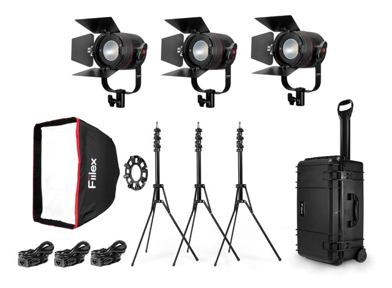

[MEDIAART 2B06](README.md)

-------------------------------------------------------------------------------

<h1 style="color: darkred;">Available Lighting</h1>

**Note**: This page highlights the equipment we will use in **Week 2**; descriptions of other available equipment will be introduced later in the course.

### Light Kit - Fiilex 360 LED (Large - 3 Lights) -- Using during Production Day

A highly portable and powerful professional lighting solution that typically includes three P360 series LED lights, stands, accessories, and a durable rolling travel case.  

- 📘 [Tech Specs](https://fiilex.com/downloads/Legacy/P360_Data_Sheet_20161208.pdf){:target="_blank"}
- 📘 [User Manual](https://fiilex.com/downloads/Legacy/P360_P360EX_User_Manual_20160616.pdf){:target="_blank"}
- ▶️ Fiilex P360 LED Light Kit Tutorial: [link to YouTube video](https://www.youtube.com/watch?v=cDljJxLn7pY){:target="_blank"}

### Light Kit - Fiilex 360EX Led (Large - 3 Lights) -- Also available

Difference between the Fiilex 360 & the Fiilex 360EX: the Fiilex 360EX has brighter lights.  

- 📘 [Tech Specs](https://fiilex.com/products/Fixtures_Kits_FLXP3CLR-K300-KIT.php){:target="_blank"}
- 📘 [User Manual](https://fiilex.com/downloads/Legacy/P360_P360EX_User_Manual_20160616.pdf){:target="_blank"}

________________________________________________________________________

Credits: Jessica A. Rodríguez

**AI Disclosure**:  
AI tools (Microsoft CoPilot and ChatGPT) was used for **editing and clarity only**. All ideas, instructional decisions, and assignment constraints are authored by the me, the instructor (Jessica A. Rodriguez). AI is not used to generate original course content.
