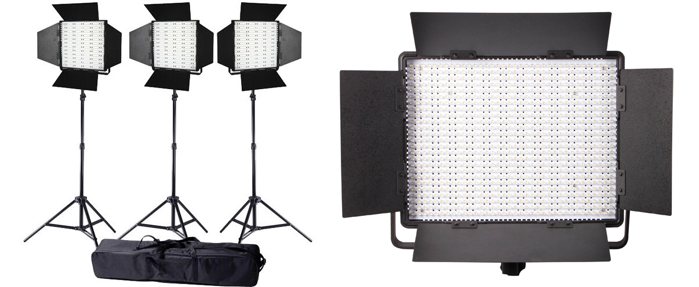
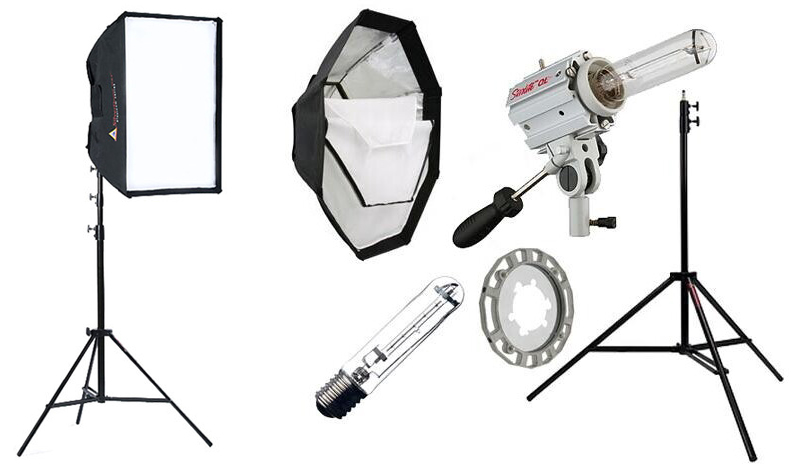
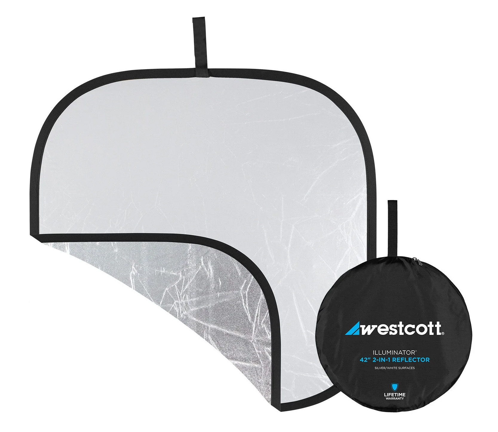
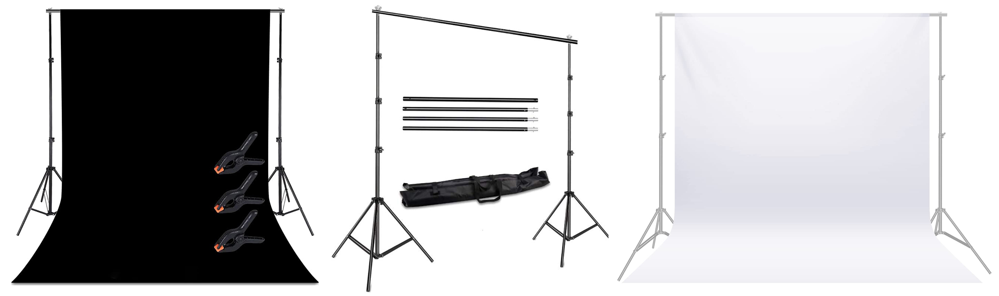

[MEDIAART 2B06](README.md)

# Lighting Equipment

Use this page to review the available lighting kits, individual lights, reflectors, backdrops, and support equipment before booking.

<!--
/////////////////
SECTION 1
/////////////////
-->

  

    1. Lighting kits and individual lights
    
      Compare the available LED and tungsten lights for interviews, narrative scenes, and controlled indoor setups.
    
  

## Fiilex P360 LED Kit

A three-light, bi-colour, dimmable LED kit suitable for controlled indoor setups.

The kit can be used as a three-point lighting system:

- **Key light:** Main source of illumination
- **Fill light:** Controls the depth of the shadows
- **Back light:** Separates the subject from the background

The adjustable colour temperature makes the kit useful for matching daylight, artificial light, or mixed lighting conditions.

**Equipment booking name:** `Light Kit - Fiilex 360 LED (Large - 3 Lights)`

- [Review the technical specifications](https://fiilex.com/downloads/Legacy/P360_Data_Sheet_20161208.pdf){:target="_blank"}
- [Read the user manual](https://fiilex.com/downloads/Legacy/P360_P360EX_User_Manual_20160616.pdf){:target="_blank"}
- [Watch the Fiilex P360 tutorial](https://www.youtube.com/watch?v=cDljJxLn7pY){:target="_blank"}

## Fiilex P360EX LED Kit

A versatile three-light LED kit with adjustable intensity and colour temperature.

It is suitable for:

- Dramatic lighting
- Chiaroscuro
- Interviews
- Controlled studio setups
- Recreating natural light indoors
- Key, fill, and back-light arrangements

The light can be diffused to produce softer illumination or used more directly to create stronger contrast and sharper shadows.

**Equipment booking name:** `Light Kit - Fiilex 360EX LED (Large - 3 Lights)`

- [Review the technical specifications](https://fiilex.com/products/Fixtures_Kits_FLXP3CLR-K300-KIT.php){:target="_blank"}
- [Read the user manual](https://fiilex.com/downloads/Legacy/P360_P360EX_User_Manual_20160616.pdf){:target="_blank"}

## Fiilex single LED light

A compact and portable LED unit suitable for smaller setups where a complete three-light kit is unnecessary.

It may be used as:

- A fill light
- A back light
- A hair light
- An accent light
- A motivated light source within a scene
- A small practical light for close-ups or details

**Equipment booking name:** `Fiilex - LED Single Light (Small)`

## Ianiro 1000W three-light kit

A high-output tungsten lighting kit that produces strong, directional illumination and dramatic contrast.

The lights produce warm light at approximately `3200 K`. Use an appropriate White Balance or colour-temperature gel when combining them with daylight or LED sources.

This kit is most suitable for controlled indoor environments.

**Equipment booking name:** `Light Kit - Ianiro 1000W (Large - 3 Lights)`

- [Watch an introduction to the Ianiro Red Head kit](https://www.youtube.com/watch?v=pgGYyoTrp_g){:target="_blank"}
- [Watch an overview of Ianiro Red Head lights](https://www.youtube.com/watch?v=qz70qL94mo4){:target="_blank"}

> Tungsten lights become very hot. Do not touch the housing or bulb while the light is operating. Turn the lights off and allow them to cool completely before moving or packing them.

## Ledgo LG-900CSCII three-panel LED kit

A three-panel, bi-colour LED kit that provides soft and even illumination.

Each panel has adjustable:

- Brightness
- Colour temperature
- Direction
- Distance from the subject

The kit is suitable for interviews, narrative scenes, and controlled lighting arrangements. It can be configured as a key, fill, and back-light system or used to create broad, natural-looking illumination.

**Equipment booking name:** `Light Kit – Ledgo LG-900CSCII (3-Panel LED Kit)`

- [Read the user manual](https://resource.holdan.co.uk/LEDGO/manuals/LEDGO_LG-600CSC_900CSC_1200CSC.pdf){:target="_blank"}
- [Watch a Ledgo three-light kit demonstration](https://www.youtube.com/watch?v=ZMgHT-ACXuc&t=7s){:target="_blank"}

## Photoflex Starlite Kit

A single tungsten light with a softbox that produces broad, diffused illumination.

It is suitable for:

- Interviews
- Close-ups
- Portrait-style framing
- Soft key lighting
- Interior scenes requiring reduced shadow contrast

The light has a fixed colour temperature of approximately `3200 K`.

**Equipment booking name:** `Photoflex Starlite Kit (Single Light)`

- [Read the user manual](https://upload.cyfrowe.pl/cyfrowe/pdf/StarLite_QL_2065780452.pdf){:target="_blank"}
- [Watch a Photoflex Starlite demonstration](https://www.youtube.com/watch?v=uAju33gORGA){:target="_blank"}

> The Photoflex Starlite produces significant heat. Keep the softbox away from walls, backdrops, paper, clothing, and other flammable materials. Allow it to cool before handling or packing.

## Lighting safety

<fieldset class="equipment-checklist">
  <legend>Confirm the lighting setup before turning on the lights</legend>

  <label class="checklist-item">
    <input type="checkbox">
    
      <strong>Stabilize every stand.</strong>
      Extend the stand legs fully and use sandbags when available.
    
  </label>

  <label class="checklist-item">
    <input type="checkbox">
    
      <strong>Tighten every control.</strong>
      Confirm that the light, tilt mechanism, stand sections, and accessories are secured.
    
  </label>

  <label class="checklist-item">
    <input type="checkbox">
    
      <strong>Organize the electrical cables.</strong>
      Keep cables away from doors, walkways, stairs, and accessibility routes.
    
  </label>

  <label class="checklist-item">
    <input type="checkbox">
    
      <strong>Maintain ventilation.</strong>
      Do not cover ventilation openings or place powered lights against walls, fabric, or other surfaces.
    
  </label>

  <label class="checklist-item">
    <input type="checkbox">
    
      <strong>Check the heat level.</strong>
      Treat tungsten fixtures as hot surfaces and allow them to cool before handling.
    
  </label>

  <label class="checklist-item">
    <input type="checkbox">
    
      <strong>Keep the setup supervised.</strong>
      Do not leave powered lighting equipment unattended.
    
  </label>
</fieldset>

<!--
/////////////////
SECTION 2
/////////////////
-->

  

    2. Light control and backgrounds
    
      Review reflectors, backdrops, stands, and sandbags used to shape light and control the visual background.
    
  

## Silver and white reflector

A portable reflector redirects an existing light source without requiring electrical power.

The two surfaces create different effects:

- **White side:** Produces softer, more natural fill light
- **Silver side:** Produces a brighter, stronger, and more directional reflection

Reflectors are useful for:

- Reducing shadows on a face
- Redirecting window light
- Bouncing sunlight outdoors
- Adding fill light without another powered fixture
- Creating highlights or visual separation
- Controlling contrast in interviews and close-ups

**Equipment booking name:** `42 in Silver-White Reflector`

- [Watch reflector techniques for video](https://www.youtube.com/watch?v=wdOSnxjFVUQ){:target="_blank"}
- [Watch a tutorial on low-cost reflector alternatives](https://www.youtube.com/watch?v=yg_p6FGo8cU){:target="_blank"}

> Do not aim the silver side directly into a person’s eyes under intense sunlight. Adjust the reflector gradually and check the subject’s comfort.

## Backdrops and support systems

Backdrop systems control the visual background and reduce distractions within the frame.

A backdrop may be used to:

- Create a neutral interview background
- Produce a controlled studio environment
- Hide distracting architectural elements
- Create a high-contrast or chiaroscuro composition
- Separate the subject from the surrounding room
- Establish a consistent background across multiple takes

### Black backdrop

A black backdrop absorbs light and can support:

- Chiaroscuro
- Low-key lighting
- Strong subject separation
- Dark or minimal compositions
- Controlled shadow areas

### White backdrop

A white backdrop reflects more light and can support:

- Bright, neutral compositions
- High-key lighting
- Clean interview backgrounds
- Even illumination
- Minimal visual environments

### Available backdrop equipment

The backdrop components must be booked separately:

- `Backdrop Stand – Cameron`
- `Neewer Backdrop Stand`
- `Black Backdrop`
- `White Backdrop`
- `Sandbags`

[Watch the backdrop-stand tutorial](https://www.youtube.com/watch?v=ppy6S3nBl7w){:target="_blank"}

## Set up the backdrop safely

<fieldset class="equipment-checklist">
  <legend>Prepare the backdrop and support system</legend>

  <label class="checklist-item">
    <input type="checkbox">
    
      <strong>Confirm all components.</strong>
      Check that the stands, crossbar, backdrop, clamps, and sandbags are present.
    
  </label>

  <label class="checklist-item">
    <input type="checkbox">
    
      <strong>Assemble the stand before attaching the backdrop.</strong>
      Connect the stands and crossbar at a low height before raising the complete system.
    
  </label>

  <label class="checklist-item">
    <input type="checkbox">
    
      <strong>Use at least two people.</strong>
      One person should support each side while raising, lowering, or moving the backdrop system.
    
  </label>

  <label class="checklist-item">
    <input type="checkbox">
    
      <strong>Stabilize both stands.</strong>
      Place sandbags on the base of each stand to reduce the risk of tipping.
    
  </label>

  <label class="checklist-item">
    <input type="checkbox">
    
      <strong>Check the surrounding space.</strong>
      Keep the stands and backdrop away from doors, walkways, exits, lights, heaters, and accessibility routes.
    
  </label>

  <label class="checklist-item">
    <input type="checkbox">
    
      <strong>Keep the backdrop away from hot lights.</strong>
      Do not allow fabric or paper backgrounds to touch tungsten fixtures or other hot equipment.
    
  </label>

  <label class="checklist-item">
    <input type="checkbox">
    
      <strong>Lower the stand before removing the backdrop.</strong>
      Do not attempt to remove or fold the backdrop while the system is fully raised.
    
  </label>
</fieldset>

## Sandbags

Sandbags stabilize:

- Light stands
- Backdrop stands
- Reflector supports
- Other approved production equipment

Place a sandbag across the lowest section of the stand or over a stand leg. Do not hang it from a raised adjustment knob or unstable section.

> Sandbags reduce the risk of tipping, but they do not make an unsafe setup acceptable. Keep stands supervised and position them outside active walkways.

---

Credits: Jessica A. Rodríguez