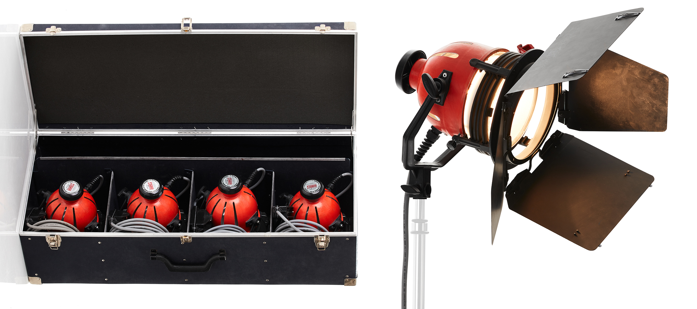

[MEDIAART 2B06](README.md)

-------------------------------------------------------------------------------

<h1 style="color: darkred;">Available Lighting Equipment</h1>

### Light Kit - Fiilex 360 LED (Large - 3 Lights)

Bi-color, dimmable LED kit suitable for controlled indoor setups. Use as a three-point lighting system (key, fill, backlight) or to shape contrast in interviews and narrative scenes. Ideal for balancing colour temperature and maintaining lighting consistency across shots.

- 📘 [Tech Specs](https://fiilex.com/downloads/Legacy/P360_Data_Sheet_20161208.pdf){:target="_blank"}
- 📘 [User Manual](https://fiilex.com/downloads/Legacy/P360_P360EX_User_Manual_20160616.pdf){:target="_blank"}
- ▶️ Fiilex P360 LED Light Kit Tutorial: [link to YouTube video](https://www.youtube.com/watch?v=cDljJxLn7pY){:target="_blank"}

### Light Kit - Fiilex 360EX Led (Large - 3 Lights)

Versatile LED kit with adjustable intensity and colour temperature. Suitable for dramatic lighting, controlled studio setups, or recreating natural light indoors. Can be diffused for softer looks or used more directly for higher contrast scenes.

- 📘 [Tech Specs](https://fiilex.com/products/Fixtures_Kits_FLXP3CLR-K300-KIT.php){:target="_blank"}
- 📘 [User Manual](https://fiilex.com/downloads/Legacy/P360_P360EX_User_Manual_20160616.pdf){:target="_blank"}

### Fiilex - LED Single Light (Small) 

Compact and portable LED unit. Useful for practical fills, accent lighting, or small interior scenes where a full kit is unnecessary. Can also serve as a hair light or motivated light source within a scene.

### Light Kit - Ianiro 1000W (Large - 3 Lights) 

High-output tungsten lights for strong directional lighting and dramatic contrast. Best for controlled indoor environments. Produces warmer light (3200K), so consider white balance adjustments or gel use when mixing with daylight. 

- ▶️ Ianiro Red Head Light Kit: [link to YouTube video](https://www.youtube.com/watch?v=pgGYyoTrp_g){:target="_blank"}
- ▶️ Ianiro RED Head LED Lights: [link to YouTube video](https://www.youtube.com/watch?v=qz70qL94mo4){:target="_blank"}

### Light Kit – Ledgo LG-900CSCII (3-Panel LED Kit)

Three bi-color LED panels that provide soft, even illumination with adjustable intensity and colour temperature. Suitable for interviews, interior narrative scenes, and controlled lighting setups. Can be used as a key–fill–back configuration or positioned to create balanced, natural-looking light. 

- 📘 [User Manual](https://resource.holdan.co.uk/LEDGO/manuals/LEDGO_LG-600CSC_900CSC_1200CSC.pdf){:target="_blank"}
- ▶️ LEDGO 3 head 560 LED lighting Kit: [link to YouTube video](https://www.youtube.com/watch?v=ZMgHT-ACXuc&t=7s){:target="_blank"}

________________________________________________________________________
