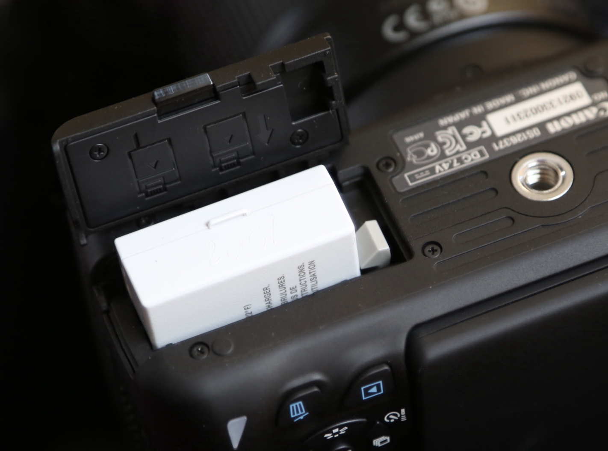

[MEDIAART 2B06](../README.md)

# W1 — DSLR Photography

This walkthrough introduces the camera controls and settings needed for the **Photo Film** activity.

Throughout the course, you will use Canon EOS Rebel T4i, T5i, and/or T7i.

[Check the tech specs of these DSLR cameras](../Cameras.md){:target="_blank"}

By the end of the walkthrough, you should be able to:

- prepare the camera for a new shoot
- control aperture, ISO, focus, and framing
- review photographs on the camera
- transfer, organize, and back up your files

<!-- 

  

    Week 1 settings
    
      Check these settings before you begin photographing.
    
  

  

Use the following settings for the Photo Film activity:

- **Shooting mode:** Aperture Priority (`Av`)
- **Image quality:** RAW + JPEG
- **White balance:** Auto White Balance (`AWB`)
- **ISO:** Begin at 100 or 200
- **Focus:** Begin with Autofocus (`AF`)
- **Image Stabilization:** On when handheld; off when using a tripod
- **Flash:** Off
- **Auto Exposure Bracketing:** Off

Each photograph will create two files when using RAW + JPEG. Keep both files when transferring your work.

  

 -->

  

    1. Locate the main camera controls
    
      Identify the buttons, rings, and switches used during the activity.
    
  

  

## Camera body

**Shutter button**  
Press halfway to focus. Press fully to take the photograph.

**Mode dial**  
Selects the shooting mode. Use `Av` for this activity.

**Power switch**  
Turns the camera on and off. Turn the camera off before removing the lens or SD card.

## Lens controls

**AF/MF switch**

- `AF` uses autofocus.
- `MF` allows you to focus with the focus ring.

**Focus ring**  
Adjusts focus when the lens is set to `MF`.

**Zoom ring**  
Changes the focal length on a zoom lens, such as an 18–55 mm lens.

**Image Stabilization switch**  
Reduces camera shake during handheld photography.

## Viewing and mounting

**Viewfinder**  
Use it to frame the photograph while looking through the camera.

**LCD screen**  
Displays menus, live view, and captured photographs.

**Tripod mount**  
Attaches the camera to a tripod.

  

  

    1. Prepare the camera
    
      Check the battery, insert the SD card, and confirm that the camera is ready to use.
    
  

  

Before turning on the camera:

1. Check that the battery is charged.
2. Insert an SD card.
3. Confirm that the lens is securely attached.
4. Remove the lens cap.
5. Turn on the camera.

### Format the SD card

Format the card in the camera before beginning a new shoot.

> **Warning:** Formatting deletes every file on the card. Confirm that you have copied any files you need before continuing.

  <iframe
    src="https://www.youtube.com/embed/lrHP-7HTn3o?si=Hkpjs8w1LbQtn7zG"
    title="How to format an SD card in a Canon DSLR camera"
    allow="accelerometer; autoplay; clipboard-write; encrypted-media; gyroscope; picture-in-picture; web-share"
    allowfullscreen>
  </iframe>

  

  

    3. Use the camera menu
    
      Learn the buttons used to change settings and review photographs.
    
  

  

- **Menu:** Opens the full camera menu.
- **Navigation arrows:** Move through menus and photographs.
- **SET:** Confirms a selection.
- **Playback:** Opens captured photographs.
- **Live View:** Displays the camera view on the LCD screen.
- **Q:** Opens the Quick Control screen.
- **Erase:** Deletes the selected photograph during playback.

### Quick Control screen

The `Q` button provides access to the settings used most often.

### Initial setup

1. Press `Q`.
2. Set the shooting mode to `Av`.
3. Set Image Quality to **RAW + JPEG**.
4. Set White Balance to **AWB**.
5. Confirm that flash and exposure bracketing are off.

  <iframe
    src="https://www.youtube.com/embed/XZxC7vGaQWE?si=A5YPSkFbYKYX-90F"
    title="Canon DSLR menu and basic settings"
    allow="accelerometer; autoplay; clipboard-write; encrypted-media; gyroscope; picture-in-picture; web-share"
    allowfullscreen>
  </iframe>

> Check these settings whenever you borrow a camera. Another user may have changed them.

  

  

    4. Understand exposure
    
      Learn how aperture, shutter speed, and ISO affect image brightness.
    
  

  

**Exposure** describes how light or dark a photograph appears.

- **Balanced exposure:** The important details remain visible.
- **Overexposure:** The photograph is too bright and may lose highlight detail.
- **Underexposure:** The photograph is too dark and may lose shadow detail.

Exposure is controlled by three settings:

- **Aperture:** The size of the lens opening.
- **Shutter speed:** How long the sensor receives light.
- **ISO:** How strongly the camera responds to light.

For Week 1, use **Aperture Priority (`Av`)**. You select the aperture and ISO, and the camera selects the shutter speed.

  

  

    5. Set the aperture
    
      Use the f-stop to control depth of field and how much of the scene appears sharp.
    
  

  

Aperture is measured in **f-stops**.

- A **wide aperture**, such as `f/3.5` or `f/5.6`, creates a shallow depth of field. The subject may appear sharp while the background appears blurred.
- A **narrow aperture**, such as `f/8` or `f/11`, creates a deeper depth of field. More of the scene may appear sharp.

A smaller f-number means a wider opening. A larger f-number means a narrower opening.

### Set the aperture

1. Turn the mode dial to `Av`.
2. Use the main control dial to select an f-stop.
3. Begin with one of these options:
   - `f/4` or `f/5.6` for a blurred background
   - `f/8` or `f/11` for more of the scene in focus
4. Take a test photograph and review it.

  <iframe
    src="https://www.youtube.com/embed/OBf9pbXMMC0?si=7cP-9zbh_uJloTqH"
    title="How to set aperture on a Canon DSLR camera"
    allow="accelerometer; autoplay; clipboard-write; encrypted-media; gyroscope; picture-in-picture; web-share"
    allowfullscreen>
  </iframe>

  

  

    6. Set the ISO
    
      Begin with a low ISO and raise it only when the photograph is too dark or the shutter speed is too slow.
    
  

  

ISO affects image brightness and visible digital noise.

- Begin with **ISO 100 or 200** outdoors or in bright light.
- Try **ISO 400 or 800** when there is less light.
- Use a higher ISO only when necessary.
- Higher ISO values can produce more visible noise.

### A simple Week 1 rule

1. Set the aperture for the depth of field you want.
2. Take a test photograph.
3. If the photograph is too dark, increase the ISO.
4. If the shutter speed becomes too slow for handheld photography, increase the ISO or use a tripod.

  <iframe
    src="https://www.youtube.com/embed/VHa82yZ1Pjo?si=Sb5gCwQtmqSD3etl"
    title="How to set ISO on a Canon DSLR camera"
    allow="accelerometer; autoplay; clipboard-write; encrypted-media; gyroscope; picture-in-picture; web-share"
    allowfullscreen>
  </iframe>

<video controls>
  <source src="imgs/13.mp4" type="video/mp4">
  Your browser does not support the video tag.
</video>

  

  

    7. Focus and stabilize the camera
    
      Confirm the focal point and reduce camera shake before taking the photograph.
    
  

  

## Autofocus

Begin with the lens set to `AF`.

1. Place the main subject within the selected focus area.
2. Press the shutter button halfway.
3. Wait for the camera to confirm focus.
4. Press the shutter button fully.

## Manual focus

Use `MF` when autofocus does not select the intended subject or when you need precise control.

1. Set the lens switch to `MF`.
2. Turn the focus ring slowly.
3. Use Live View or image magnification to check sharpness.
4. Take a test photograph.

## Image Stabilization

- Turn Image Stabilization **on** when photographing handheld.
- Turn Image Stabilization **off** when using a tripod.
- Hold the camera with both hands and keep your elbows close to your body.
- Pause before pressing the shutter.

  

  

    8. Compose and take the photograph
    
      Check framing, focus, light, and contrast before pressing the shutter.
    
  

  

Before taking each photograph:

1. Identify the main subject.
2. Decide what should remain inside and outside the frame.
3. Check the direction and quality of the light.
4. Look for clear differences between light and dark areas.
5. Confirm the focal point.
6. Press the shutter halfway to focus.
7. Press the shutter fully to take the photograph.
8. Review the result before changing the composition.

Remember that the final sequence will be black and white. Pay attention to shape, texture, light, shadow, and contrast rather than colour alone.

  

  

    9. Review photographs on the camera
    
      Check focus, framing, and exposure before leaving the location.
    
  

  

After taking a photograph:

1. Press the **Playback** button.
2. Use the navigation arrows to move between photographs.
3. Use the zoom controls to inspect focus.
4. Check:
   - Is the main subject sharp?
   - Is the framing intentional?
   - Are important highlights too bright?
   - Are important shadows too dark?
5. Retake the photograph when necessary.

> Avoid deleting photographs during the shoot unless you are certain they are unusable. A larger screen may reveal details that are difficult to see on the camera.

  

  

    10. Transfer and back up your files
    
      Copy the photographs to your computer, confirm the transfer, and create a backup.
    
  

  

After the shoot:

1. Turn off the camera.
2. Remove the SD card.
3. Insert the card into a card reader.
4. Open the SD card and locate the `DCIM` folder.
5. Create a folder on your computer using a clear name, such as:

   `Lastname_PhotoFilm_Date`

6. Copy the RAW and JPEG files into the folder.
7. Open several files to confirm that they copied correctly.
8. Copy the folder to an external drive or cloud storage.
9. Eject the SD card safely before removing it.

Do not edit files directly from the SD card.

Keep the original files unchanged. Create a separate folder for edited photographs.

  

  

    11. Recharge and return the camera
    
      Charge the battery and return all borrowed equipment in good condition.
    
  

  

Before returning the camera:

1. Confirm that your files have been transferred and backed up.
2. Turn off the camera.
3. Replace the lens cap.
4. Recharge the battery.
5. Return the camera, battery, charger, lens, strap, and any other borrowed items.

  

---

Credits: Jessica A. Rodríguez
