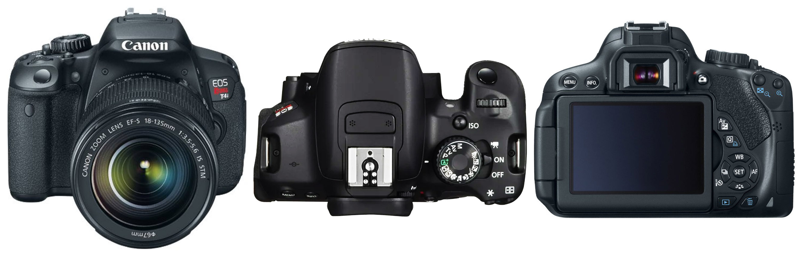
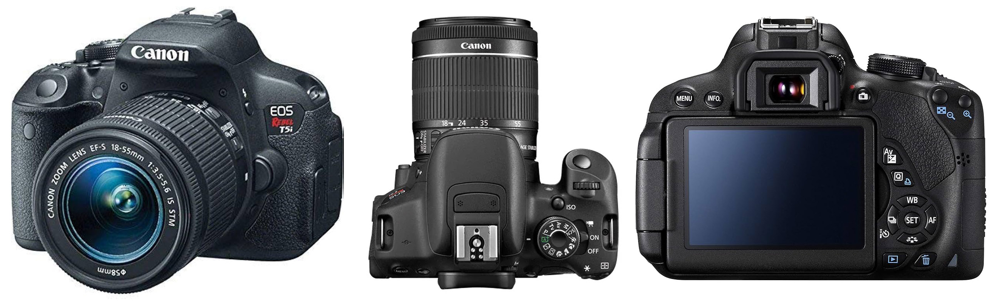

[ART 1TI3](README.md)

-------------------------------------------------------------------------------

<h1 style="color: darkred;">W1 — Tech Walkthrough: Intro to DSLR Photography for B&W Photo Film</h1>

## Objective

This technical walkthrough introduces the **essential DSLR camera controls and concepts** needed to produce a **black-and-white photo sequence** for the first assignment: **Photo Film (Individual)**.

By the end of this session, students should be able to:

- Confidently operate the **Canon EOS Rebel T4i / T5i / T7i** in manual or semi-manual modes  
- Understand how **framing, composition, and depth of field** are controlled through camera settings  
- Use the camera and tripod to make **intentional photographic decisions** without additional lighting equipment  
- Recognize how **light, contrast, and focus** function as primary visual elements in black-and-white photography  

This walkthrough prioritizes:
- **Control over exposure**
- **Intentional focus and depth of field**
- **Clear, stable framing using a tripod**

📌 *The goal is not technical mastery of every function, but practical control of the camera to support compositional clarity and thoughtful image-making.*

---

<h3 style="color: darkred;">Available DSLR Cameras</h3>

The following DSLR cameras are available for Media Art students to rent.  
All models offer similar controls and image quality and are well suited for the **Photo Film (Black & White)** assignment.

You will be working with the **camera + tripod only** (no external lighting).

### Canon EOS Rebel T4i / EOS 650D

A reliable entry-level DSLR with full manual controls, ideal for learning exposure, focus, and composition fundamentals.

- 📘 Camera Manual: [link to manual](https://gdlp01.c-wss.com/gds/6/0300007696/01/eosrt4i-eos650d-im-c-es.pdf)
- ▶️ Intro Video: [link to YouTube video](https://www.youtube.com/watch?v=ENKDeSRfeFk)

### Canon EOS Rebel T5i / EOS 700D

An updated version of the T4i with improved autofocus and handling, suitable for controlled still photography and tripod-based shooting.

- 📘 Camera Manual: [link to manual](https://gdlp01.c-wss.com/gds/5/0300010905/02/eos-rebelt5i-700d-im2-en.pdf)
- ▶️ Intro Video: [link to YouTube video](https://www.youtube.com/watch?v=eXglxC0IN7Q)

### Canon EOS Rebel T7i / EOS 800D

A more recent DSLR model with enhanced autofocus and low-light performance, while maintaining the same core controls and workflow.

- 📘 Camera Manual: [link to manual](https://gdlp01.c-wss.com/gds/1/0300026121/01/eos-rebelt7i-800d-bim-3l.pdf)
- ▶️ Intro Video: [link to YouTube video](https://www.youtube.com/watch?v=4QTmDk_ZSmc)

📌 *Regardless of the camera model you are assigned, the core controls and concepts demonstrated in class apply across all three.*  

---

<h3 style="color: darkred;">Camera Anatomy — Getting Familiar</h3>  

📌 *At this stage, the goal is spatial familiarity — knowing where things are before learning how to use them.*

---

### Core External Components

**Shutter Button**  
The button used to take a photograph. Press halfway to activate autofocus; press fully to capture the image.

**Mode Dial**  
Selects the camera’s shooting mode (Manual, Aperture Priority, etc.). We will review these modes later.

**Power Switch**  
Turns the camera on and off. Always switch the camera off before changing lenses.

---

### Lens & Focus Controls

**Lens**  
The optical element that determines field of view and depth of field. For Week 1, you will use the standard kit lens.

**AF / MF Switch (on the lens)**  
- **AF (Autofocus):** Camera automatically focuses  
- **MF (Manual Focus):** Focus is adjusted manually using the focus ring  

📌 *Leave lenses on MF*

**Focus Ring**  
Used to manually adjust focus when the lens is set to MF.

**Zoom Ring (if applicable)**  
Controls focal length on zoom lenses (e.g., 18–55mm).

---

### Storage & Power

**Memory Card Slot**  
Holds the SD card where images are stored.  
Always confirm a card is inserted before shooting.

**Battery Compartment**  
Contains the rechargeable battery.  
A low battery may prevent the camera from turning on or saving images.

---

### Viewing & Mounting

**Viewfinder**  
Allows you to frame the image optically. Useful in bright environments.

**LCD Screen**  
Displays menus, image playback, and live view when enabled.

**Tripod Mount (Bottom of Camera)**  
Used to securely attach the camera to a tripod for stable framing and consistent composition.

---
