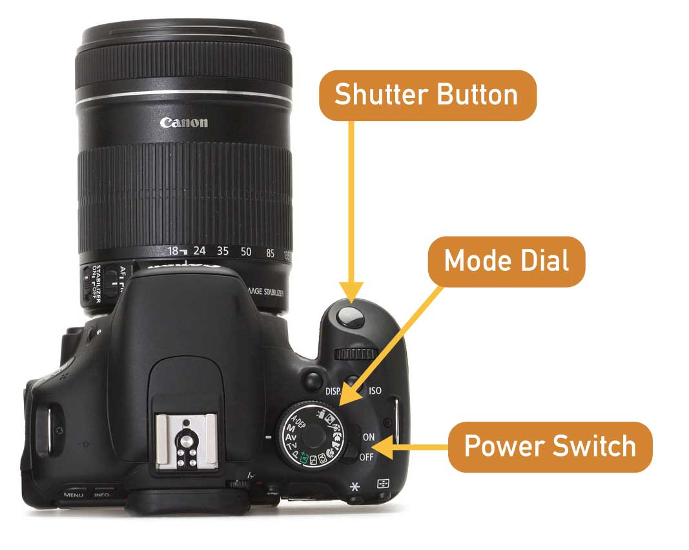
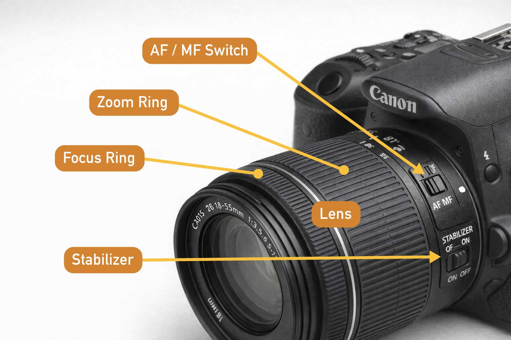
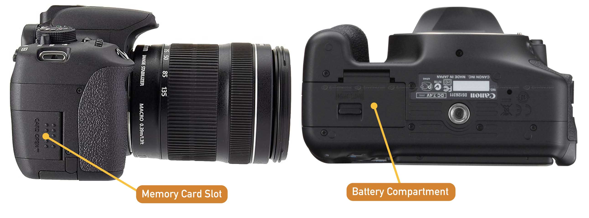
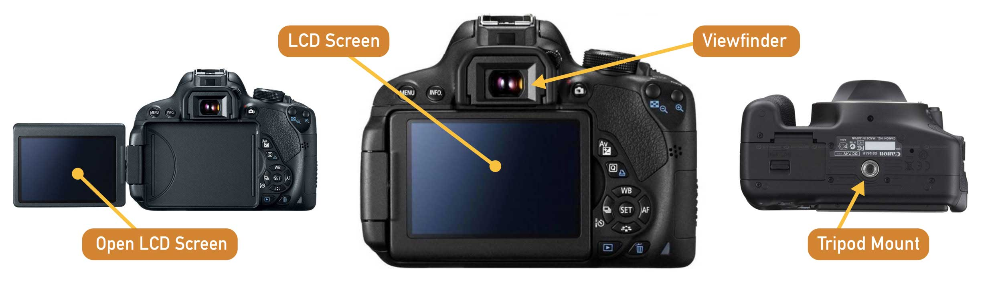
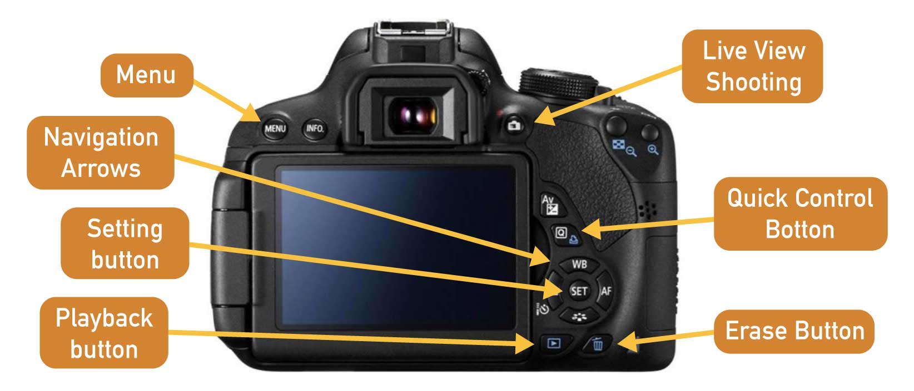
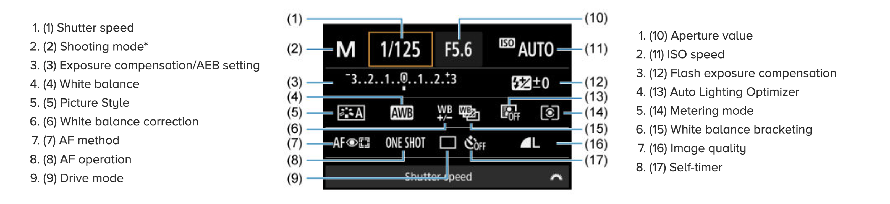
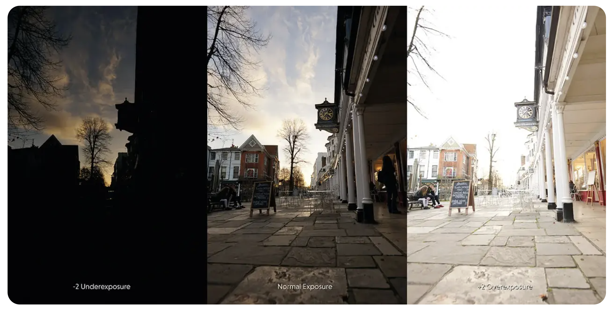
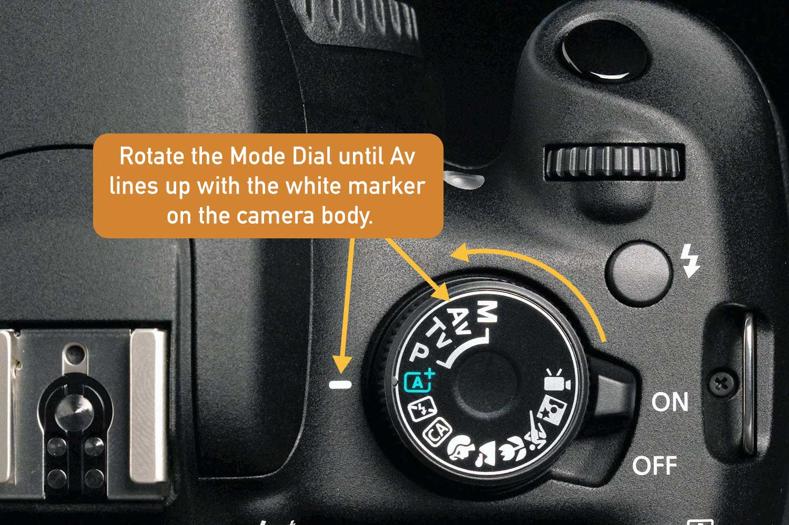
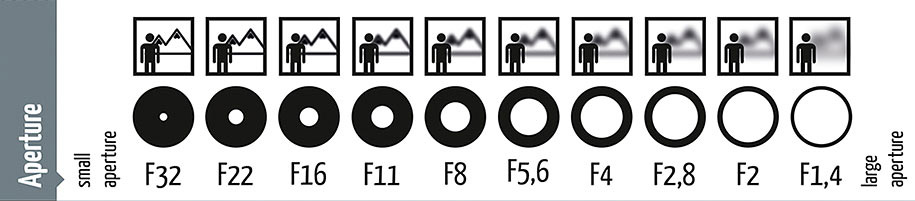
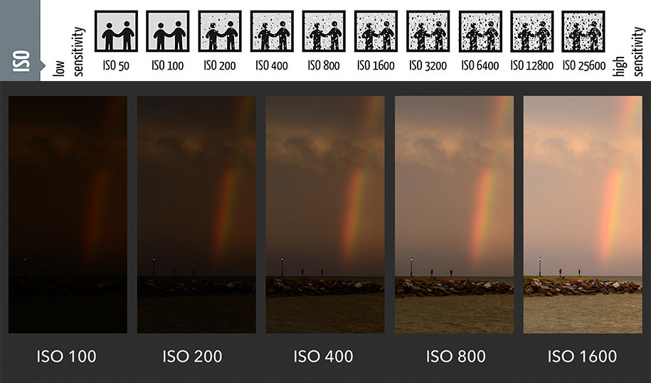

[MEDIAART 2B06](../README.md)

-------------------------------------------------------------------------------

<h1 style="color: darkred;">W1 — Tech Walkthrough</h1>
<h2 style="color: darkred;">Intro to DSLR Photography for Photo Film Activity</h2>

## Objective

This technical walkthrough introduces the **essential DSLR camera controls and workflows** required to produce a **black-and-white photo sequence** for the first assignment: **Photo Film (Individual)**.  

Check [Available DSLR Cameras](../Cameras.md){:target="_blank"}  

By the end of this session, students should be able to:

- Confidently operate the **Canon EOS Rebel T4i / T5i / T7i** using a **limited, intentional set of camera settings**  
- Understand how **framing, composition, focus, and depth of field** are shaped through aperture, ISO, and camera positioning  
- Use a **tripod-based workflow** to make stable, deliberate photographic decisions  
- Read and evaluate images on the camera, and **properly transfer and save files** to a computer  
- Recognize how **light and contrast** function as primary visual elements in black-and-white photography  

This walkthrough prioritizes:
- **Intentional exposure decisions** (rather than automatic settings)  
- **Manual focus and depth of field awareness**  
- **Clear, stable framing and careful image review**  

📌 *The goal is not technical mastery of every camera function, but practical control of the camera as a tool for composition, light, and meaning-making.*

---

<h3 style="color: darkred;">Camera Anatomy — Getting Familiar (Camera Off)</h3>  

📌 *At this stage, the goal is spatial familiarity — knowing where things are before learning how to use them.*

---

### Core External Components

**Shutter Button**  
The button used to take a photograph. Press halfway to activate autofocus; press fully to capture the image.

**Mode Dial**  
Selects the camera’s shooting mode (Manual, Aperture Priority, etc.). We will review these modes later.

**Power Switch**  
Turns the camera on and off. Always switch the camera off before changing lenses.

---

### Lens & Focus Controls

**Lens**  
The optical element that determines field of view and depth of field. For Week 1, you will use the standard kit lens.

**AF / MF Switch (on the lens)**  
- **AF (Autofocus):** Camera automatically focuses  
- **MF (Manual Focus):** Focus is adjusted manually using the focus ring  

📌 *Leave lenses on MF*

**Focus Ring**  
Used to manually adjust focus when the lens is set to MF.

**Zoom Ring (if applicable)**  
Controls focal length on zoom lenses (e.g., 18–55mm).

**Stabilizer (IS)**  
Reduces camera shake when shooting handheld; turn OFF when using a tripod.

---

### Storage & Power

**Memory Card Slot**  
Holds the SD card where images are stored.  
Always confirm a card is inserted before shooting.

**Battery Compartment**  
Contains the rechargeable battery.  
A low battery may prevent the camera from turning on or saving images.

---

### Viewing & Mounting

**Viewfinder**  
Allows you to frame the image optically. Useful in bright environments.

**LCD Screen**  
Displays menus, image playback, and live view when enabled.

**Tripod Mount (Bottom of Camera)**  
Used to securely attach the camera to a tripod for stable framing and consistent composition.

---

<h3 style="color: darkred;"> General Camera Settings (Camera On) </h3>  

Before adjusting exposure settings, become familiar with the main camera buttons used to navigate menus and playback images.

- **Menu** — Opens the main camera settings and configuration options.  
- **Navigation Arrows** — Move through menus and adjust selected settings.  
- **Setting Button (SET)** — Confirms a selection or applies a setting.  
- **Playback Button** — Displays captured photos on the screen.  
- **Live View Shooting** — Activates the LCD screen for composing and focusing images.  
- **Quick Control Button (Q)** — Opens quick access to commonly used shooting settings.  
- **Erase Button** — Deletes the currently selected image during playback.

---

### Quick Control Button (Q) - Menu

---

### Initial Setup

1. **Insert an SD card** into the Memory Card Slot.  
2. **Turn on the camera.**  
3. Follow the tutorial below to learn how to navigate the camera menu and adjust basic settings.
4. Set **Image Quality** to **RAW + JPEG**  
  - JPEG files are used for quick viewing and submission if needed  
  - RAW files preserve full image data for later learning and practice
5. Follow the remaining settings shown in the video:

<iframe width="560" height="315" src="https://www.youtube.com/embed/XZxC7vGaQWE?si=A5YPSkFbYKYX-90F" title="YouTube video player" frameborder="0" allow="accelerometer; autoplay; clipboard-write; encrypted-media; gyroscope; picture-in-picture; web-share" referrerpolicy="strict-origin-when-cross-origin" allowfullscreen></iframe>  

📌 *It is highly recommended to check these settings every time you rent a camera*  

---

### Formatting the SD Card

Before starting a new shoot, format the SD card **in the camera** to avoid file conflicts.

<iframe width="560" height="315" src="https://www.youtube.com/embed/lrHP-7HTn3o?si=Hkpjs8w1LbQtn7zG" title="YouTube video player" frameborder="0" allow="accelerometer; autoplay; clipboard-write; encrypted-media; gyroscope; picture-in-picture; web-share" referrerpolicy="strict-origin-when-cross-origin" allowfullscreen></iframe>  

📌 *It is highly recommended to format SD Card every time you rent a camera*  

---

<h3 style="color: darkred;"> More Camera Settings — What to Use for Week 1 (Camera On) </h3>   

For the first activity and **Photo Film** assignment, we will use a **limited set of camera settings**.  
This is intentional: it allows you to focus on **framing, composition, depth of field, and light** rather than navigating complex menus.  

📌 *Photos will be captured in colour and converted to black and white later using Adobe Photoshop.*  

---

### What Is Exposure?

**Exposure** refers to how much light reaches the camera’s sensor when a photograph is taken.
+ **Normal Exposure** is achieved when the brightness/darkness of an image is generally considered to have a range of tones and to faithfully represent the scene being photographed. 
+ **Over Exposure** is when too much light is collected by the sensor, and the image looks too bright and washed out.
+ **Under Exposure** is when not enough light is collected by the sensor, and the image looks too dark and dull.

Exposure is controlled by three settings:
- **Aperture** — how much light enters the lens
- **Shutter Speed** — how long light reaches the sensor
- **ISO** — how sensitive the sensor is to light

📌 *For Week 1, you will primarily control exposure through **aperture** and **ISO**, while the camera assists by setting the shutter speed.*

---

### Shooting Mode

**Aperture Priority (Av)** — *Primary mode for Week 1*. In this mode:  

- **You select the aperture (f-stop)**  
  > *Aperture* is the size of the opening in the lens that controls how much light enters the camera and how much of the image appears in focus.

- **The camera automatically sets the shutter speed**  
  > *Shutter speed* is the amount of time the camera’s shutter remains open, controlling exposure and how motion is rendered.

- **This mode gives you direct control over depth of field**  
  > Aperture determines depth of field (how much is in focus), while the camera adjusts shutter speed to maintain proper exposure based on your aperture choice.

📌 *Use Aperture Priority for the Photo Film Activity.*

---

### Aperture (f-stop)  

Aperture = size of opening  

Each aperture (above) represents a **halving** or **doubling** of the **volume of light**:  
+ f/4 lets in twice as much light as f/5.6
+ f/11 lets in half as much light as f/8
These increments are called a **full ‘stop’** because they represent the halving or doubling of the light.   

Aperture controls **depth of field** and how much of the image appears in focus.  

- **Wide aperture (f/3.5 – f/5.6)**  
  → Shallow depth of field  
  → Subject isolation, blurred background

- **Narrow aperture (f/8 – f/11)**  
  → Deeper depth of field  
  → More of the scene in focus

 

📌 *The Aperture is the first setting you should always set up*  

Follow this tutorial to setup your aperture:  

<iframe width="560" height="315" src="https://www.youtube.com/embed/OBf9pbXMMC0?si=vasQj9nKITVfXyQE" title="YouTube video player" frameborder="0" allow="accelerometer; autoplay; clipboard-write; encrypted-media; gyroscope; picture-in-picture; web-share" referrerpolicy="strict-origin-when-cross-origin" allowfullscreen></iframe>

---

### ISO

ISO controls the camera’s **sensitivity to light**.

- Start with **ISO 100 or 200**
- Increase ISO only if the image becomes too dark
- Higher ISO = more digital noise (especially visible in B&W)

📌 *Use the lowest ISO possible for the lighting conditions.*  

How to setup ISO:   

<iframe width="560" height="315" src="https://www.youtube.com/embed/VHa82yZ1Pjo?si=Sb5gCwQtmqSD3etl" title="YouTube video player" frameborder="0" allow="accelerometer; autoplay; clipboard-write; encrypted-media; gyroscope; picture-in-picture; web-share" referrerpolicy="strict-origin-when-cross-origin" allowfullscreen></iframe>

<video height="315" controls>
  <source src="imgs/13.mp4" type="video/mp4">
  Your browser does not support the video tag.
</video>

---

### Focus Mode

**Manual Focus (MF)** — *Default for Week 1*

- Set the lens switch to **MF**
- Use the **focus ring** on the lens to adjust focus manually
- Take time to confirm what is sharp before pressing the shutter

Manual focus encourages:
- Greater attention to **depth of field**
- Clear identification of the **focal point**
- Slower, more deliberate image-making

---

### White Balance

- Set to **Auto White Balance (AWB)**
- Color accuracy is not the focus for this assignment

How to setup AWB (Automatic White Balance) --first 30 seconds:   

<iframe width="560" height="315" src="https://www.youtube.com/embed/syodAm98LiA?si=6oTEtfkDfLa6JapQ" title="YouTube video player" frameborder="0" allow="accelerometer; autoplay; clipboard-write; encrypted-media; gyroscope; picture-in-picture; web-share" referrerpolicy="strict-origin-when-cross-origin" allowfullscreen></iframe>

---

### Stability & Framing

- Always use a **tripod**
- Turn **Image Stabilization OFF** when the camera is mounted on a tripod
- Take time to adjust framing carefully before shooting

---

<h3 style="color: darkred;">Reviewing & Saving Your Photos</h3>

This final step ensures that your images are **properly reviewed, saved, and backed up** after shooting.

---

### Reviewing Images on the Camera

After taking a photograph:

1. Press the **Playback** button to view your image on the LCD screen.
2. Use the **Navigation Arrows** to move between images.
3. Check the following:
   - Is the image **in focus**?
   - Is the framing intentional?
   - Are highlights overly bright or shadows too dark?
4. Use the **Zoom** function to inspect focus and detail.

📌 *Do not delete images in the field unless you are certain they are unusable.*

---

### Transferring Photos to Your Computer

Once you are done shooting:

#### Option 1 — Using an SD Card Reader (Recommended)

1. Turn the camera **off**.
2. Remove the **SD card** from the camera.
3. Insert the SD card into a **card reader** connected to your computer.
4. Open the SD card folder and locate the **DCIM** folder.
5. Copy your images to a clearly named folder on

📌 *Always save your photos in your computer after a day of work.*

---
