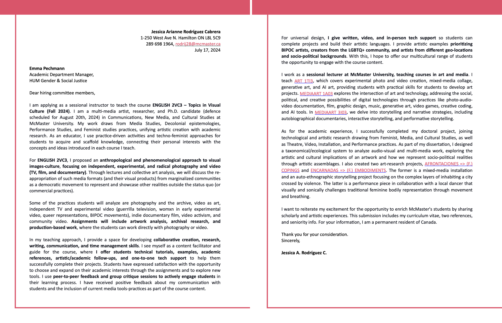

[MEDIAART 2B06](../README.md)

# W12 — Final Cut Framework

## Final Package and Portfolio Preparation

This technical walkthrough supports the [W12 — Final Cut](../WeekIns/WI-W12.md){:target="_blank"} activity and submission.

<!-- 
/////////////////
SECTION 1
/////////////////
-->

<details class="tutorial-section">
  <summary>
    <span class="section-title">1. Prepare the Final Film Package</span>
    <span class="section-description">
      Present the completed short film through representative stills, accurate information, concise writing, credits, and clear document design.
    </span>
  </summary>

<div class="section-content" markdown="1">

## Why prepare a final package?

The final package is more than a course submission. It introduces the film clearly and gives other people the information needed to screen, discuss, archive, or publish it accurately.

These materials are commonly used in:

- Festival and screening submissions
- Exhibition programs
- Artist portfolios and websites
- Grant and residency applications
- Academic or professional application packages

Your package should include:

1. One representative still
2. Basic film information
3. A logline
4. A short synopsis
5. Complete credits
6. A clear and consistent page design

## Select a representative still

A still frame may be the first image someone sees before watching the film. Select an image that communicates the film's tone, visual quality, and central subject or action.

Choose a frame that:

- Clearly shows the main subject, action, or environment
- Represents the visual style of the film
- Has strong composition, lighting, and focus
- Reflects an important moment without requiring a detailed explanation
- Can be exported as a high-quality PNG

Avoid:

- Blurry or accidentally soft frames
- Transitional frames caught between actions
- Images that are unintentionally too dark or overexposed
- Frames containing interface elements, playback controls, or timecode

<div class="video-wrapper">
  <iframe
    src="https://www.youtube.com/embed/K_t5ueWaDT4?si=KnTqtnHhXjz--EcU"
    title="How to export a still frame from Adobe Premiere Pro"
    allow="accelerometer; autoplay; clipboard-write; encrypted-media; gyroscope; picture-in-picture; web-share"
    allowfullscreen>
  </iframe>
</div>

## Provide accurate film information

Basic film information identifies the work and allows it to be referenced correctly.

Include:

- **Title**
- **Director**
- **Country**, when requested or relevant to the submission
- **Year of completion**
- **Runtime**, using a consistent format such as `00:01:00`

> **Example: *2 AM COFFEE***  
> **Director:** Ayush Karki  
> **Country:** United States  
> **Year of completion:** 2023  
> **Runtime:** 00:01:49

<div class="video-wrapper">
  <iframe
    src="https://www.youtube.com/embed/SR__amDl1c8?si=CZORMnhiXA-bowoO"
    title="2 AM COFFEE short film by Forrain"
    allow="accelerometer; autoplay; clipboard-write; encrypted-media; gyroscope; picture-in-picture; web-share"
    allowfullscreen>
  </iframe>
</div>

## Revise the logline

A logline introduces the film's central action, situation, or tension in one sentence.

Review [W7 — Pre-Production Framework: Logline](TW-W7.html#write-a-one-sentence-logline){:target="_blank"} and revise the original logline so it accurately reflects the completed film.

> **Example: *2 AM COFFEE***  
> A man bikes to a quiet gas station at 2 a.m. for coffee, only to return and find his unlocked bike gone.

## Write a short synopsis

A synopsis gives a fuller description than the logline while remaining concise. It should help someone understand the film's progression without describing every shot.

**Structure:** `Character + situation → development → outcome or shift`

Include:

- The main character and context
- The key action or progression
- The central shift, complication, or outcome
- Only information the viewer experiences in the film

Do not over-explain the concept or list every plot detail. Depending on the application, you may reveal the ending; follow the specific submission instructions.

> **Example: *2 AM COFFEE***  
> During a quiet 2 a.m. coffee run, a man stops at a nearly empty gas station and leaves his bike outside. What begins as an ordinary late-night routine changes when he steps back into the dark and realizes that the bike is no longer there. The film transforms a familiar action into a brief moment of vulnerability, tension, and disorientation.

## Prepare complete credits

Credits identify who contributed to the film and make each person's work visible. They are professionally and ethically important.

Only include roles that apply to the project. Use each person's preferred name and spell it consistently.

### Credit template

```text
Director / Editor: Full Name
Camera / Cinematography: Full Name
Performer: Full Name
Sound Design: Full Name
Music: Track Title — Creator, Website, Licence
Sound Effects: Sound Title — Creator, Website, Licence
Foley: Recorded by Full Name
Additional Collaborators: Full Name (role)
Location / Location Support: Location Name, City
```

When one person completed several roles, combine them:

```text
Director / Editor / Camera: Maria Lopez
```

> **Example:**  
> **Director / Editor / Camera:** Maria Lopez  
> **Performer:** Tamara Smith  
> **Music:** *Morning Drift* — Blue Dot Sessions, source and licence information  
> **Sound Effects:** *Door Creak* — Freesound user `soundmonger`, source and licence information  
> **Foley:** Recorded by Maria Lopez  
> **Additional Collaborators:** Samantha Guizar, production assistance  
> **Location Support:** Factory Media Centre, Hamilton

> **Example: *2 AM COFFEE***  
> **Writer / Director:** Ayush Karki  
> **Cinematography:** Robidh Basnet  
> **Performer:** Abdulhaq Alrudaini

## Design the information sheet

Use alignment, hierarchy, contrast, proximity, balance, and white space to make the document clear and visually coherent.

- Use one or two legible fonts
- Establish a clear hierarchy with headings and subheadings
- Align text and images consistently
- Keep margins and spacing generous
- Place the still at a useful size without overwhelming the page
- Avoid unnecessary decorative elements
- Check that links, names, titles, and credits are easy to scan
- Export the completed document as a PDF

> The information sheet represents the film professionally. Design decisions should support the work rather than compete with it.

## Final-package checklist

<fieldset class="equipment-checklist">
  <legend>Complete before submitting</legend>

  <label class="checklist-item">
    <input type="checkbox">
    <span>
      <strong>Export one representative still as a PNG.</strong>
      Confirm that the image is sharp, well composed, and free from interface elements.
    </span>
  </label>

  <label class="checklist-item">
    <input type="checkbox">
    <span>
      <strong>Verify all film information.</strong>
      Check the title, names, year, country when included, and exact runtime.
    </span>
  </label>

  <label class="checklist-item">
    <input type="checkbox">
    <span>
      <strong>Revise the logline and synopsis.</strong>
      Make sure both texts describe the completed film rather than the original plan.
    </span>
  </label>

  <label class="checklist-item">
    <input type="checkbox">
    <span>
      <strong>Credit every collaborator and sourced element.</strong>
      Include creators, titles, sources, and licences for external sound or visual materials.
    </span>
  </label>

  <label class="checklist-item">
    <input type="checkbox">
    <span>
      <strong>Proofread and export the information sheet.</strong>
      Check spelling, hierarchy, spacing, image quality, and PDF readability.
    </span>
  </label>
</fieldset>

</div>
</details>

<!-- 
/////////////////
SECTION 2
/////////////////
-->

<details class="tutorial-section">
  <summary>
    <span class="section-title">2. Build and Maintain a CV or Resume</span>
    <span class="section-description">
      Record education, creative work, technical skills, presentations, and service, then adapt the document for each opportunity.
    </span>
  </summary>

<div class="section-content" markdown="1">

## Understand the difference

A **CV** is a detailed record of education, creative and professional activity, presentations, awards, publications, and service. It can grow over time.

A **resume** is usually a shorter, targeted document that foregrounds the experience most relevant to a particular job or opportunity.

Maintain one complete master CV, then create shorter versions for specific applications.

## Recommended sections

Possible sections include:

- **Education**
- **Creative and professional experience**
- **Technical skills**
- **Exhibitions, screenings, performances, and selections**
- **Awards, grants, and funding**
- **Publications or research**, when relevant
- **Arts service and community involvement**
- **Professional and artistic associations**

For public presentations, include:

`Year — Title of work — Event or venue — City, province/state, country — Role`

<figure class="media-card">
  
  <figcaption>
    Excerpts from Jessica A. Rodríguez's CV.
  </figcaption>
</figure>

## Adapt the order to the opportunity

The CV should not be treated as a fixed document. Reorder and edit it so the most relevant information appears first.

| Application context | Information to foreground |
|---|---|
| **Arts application** | Exhibitions, screenings, performances, artistic production, grants, and collaborations |
| **Film or production role** | Production credits, screenings, editing, cinematography, sound, and technical workflows |
| **Graduate program** | Education, research interests, creative practice, writing, and selected presentations |
| **Creative-industry role** | Relevant employment, production skills, software, teamwork, project management, and outcomes |

## Record the skills developed in this course

Only list tools and processes you can use with reasonable confidence. Skills from this course may include:

- Adobe Premiere Pro
- Adobe Audition
- DSLR camera operation using manual settings
- Basic lighting setup and exposure control
- Video editing and sequence organization
- Basic colour correction
- Production sound recording
- Foley and sound-design workflows
- Exporting and preparing screening files

Do not describe one brief exposure to software as advanced expertise. Use accurate levels such as **basic**, **working knowledge**, **intermediate**, or **advanced** when the distinction is useful.

## Add course presentations

The following examples show how course projects may be recorded. Replace all placeholders with accurate information.

```text
February 12, 2026 — “Title of Work” — Come As You Art, public exhibition,
Lyons Family Studio, McMaster University, Hamilton, Ontario, Canada — Artist

2026 — “Title of Work” — Come As You Art: Photo Film, online exhibition — Artist
Public access: https://media-studio-art.github.io/come-as-you-art/

April 7, 2026 — “Title of Work” — In One Minute, public screening,
Concert Hall, McMaster University, Hamilton, Ontario, Canada — Filmmaker
```

## Use application language accurately

Some employers and institutions use applicant-tracking or document-management systems to organize submissions and search for relevant experience. Read the posting carefully and name the skills, software, and experience you genuinely possess using clear terminology.

You may use an AI tool to identify recurring priorities in a posting without uploading your CV. Useful questions include:

- What skills and responsibilities appear most often in this posting?
- Which experiences should be easiest to find in a resume for this role?
- Which software, production methods, or collaboration skills are explicitly requested?
- Does the posting emphasize creative production, technical work, research, administration, or public engagement?

Use this analysis to improve clarity and relevance. Do not copy language mechanically, invent experience, or exaggerate your level of expertise.

## CV and resume checklist

<fieldset class="equipment-checklist">
  <legend>Maintain an accurate professional record</legend>

  <label class="checklist-item">
    <input type="checkbox">
    <span>
      <strong>Create a complete master CV.</strong>
      Add new projects, screenings, exhibitions, employment, awards, and service as they occur.
    </span>
  </label>

  <label class="checklist-item">
    <input type="checkbox">
    <span>
      <strong>Use consistent entry formatting.</strong>
      Keep dates, titles, venues, locations, and roles in the same order throughout the document.
    </span>
  </label>

  <label class="checklist-item">
    <input type="checkbox">
    <span>
      <strong>Describe skills accurately.</strong>
      List software and production methods only when you can explain or demonstrate how you used them.
    </span>
  </label>

  <label class="checklist-item">
    <input type="checkbox">
    <span>
      <strong>Create a shorter targeted version.</strong>
      Prepare a one- or two-page resume that can be adapted for jobs, grants, screenings, or further study.
    </span>
  </label>

  <label class="checklist-item">
    <input type="checkbox">
    <span>
      <strong>Proofread the final PDF.</strong>
      Check names, dates, alignment, hierarchy, links, and page breaks.
    </span>
  </label>
</fieldset>

</div>
</details>

<!-- 
/////////////////
SECTION 3
/////////////////
-->

<details class="tutorial-section">
  <summary>
    <span class="section-title">3. Prepare Portfolio Materials</span>
    <span class="section-description">
      Select and present work through a portfolio, demo reel, or work-sample document using consistent information and strong documentation.
    </span>
  </summary>

<div class="section-content" markdown="1">

## What is a professional dossier?

A **dossier** is a group of materials that documents your creative practice and professional experience. An application may request one combined PDF or several separate files.

Common dossier materials include:

- A CV or resume
- A web or PDF portfolio
- A demo reel
- A work-sample document or works list
- An artist bio
- An artist statement
- A cover letter or letter of intent

Always follow the application's file, page, word-count, duration, and naming requirements.

## Portfolio

A portfolio is a selected presentation of creative work. Prepare a web portfolio, a PDF portfolio, or both.

<figure class="media-card">
  
  <figcaption>
    Excerpts from Jessica A. Rodríguez's design portfolio.
  </figcaption>
</figure>

Select work based on relevance rather than quantity. When an application requests a small sample, choose approximately **four to five projects** that demonstrate the strongest fit.

For each project, include:

- **Title**
- **Year**
- **Author and collaborator credits**
- **Medium or format**
- **Short description**
- **Representative images**
- **Public links**, when available
- **Presentation context**, when relevant

### Write a project description

A common description length is **150–250 words**, although every application has different requirements.

**Structure:** `Title and format + central idea + materials or process + presentation context or outcome`

The description should explain:

- What the project is
- What question, idea, or experience it explores
- How it was made
- How it was presented or experienced
- Your role when the work was collaborative

A web portfolio may include a longer description, but the essential information should appear early.

<figure class="media-card">
  
  <figcaption>
    Excerpts from Jessica A. Rodríguez's artistic portfolio.
  </figcaption>
</figure>

## Demo reel

A **demo reel** is a short video presenting selected excerpts of film, video, animation, motion graphics, cinematography, editing, sound, or media-art work.

A reel is commonly **one to two minutes**, unless the application gives a different limit.

- Open with strong work immediately
- Keep clips short and purposeful
- Make your role clear in collaborative work
- Use concise project or role labels when needed
- Balance sound levels carefully
- Keep transitions simple
- End with your name and relevant contact or portfolio information
- Revise the reel for the type of work you are applying for

<figure class="media-card">
  <video controls preload="metadata">
    <source src="imgs/138.mp4" type="video/mp4">
    Your browser does not support embedded video.
  </video>
  <figcaption>
    Jessica A. Rodríguez's 2016 demo reel, focused on experimental-video techniques.
  </figcaption>
</figure>

## Work-sample document or works list

A work-sample document presents individual artworks or projects in a consistent format. It is often requested for exhibitions, grants, residencies, festivals, and arts applications.

A useful structure is one work per page.

Include:

- Representative image
- Title
- Year
- Author and collaborator credits
- Medium
- Dimensions, when applicable
- Duration or runtime for time-based work
- Format, such as single-channel video or interactive installation
- Short description
- Public or password-protected link, when applicable

An application may also request:

- Exhibition or screening history
- Technical requirements
- Installation instructions
- Passwords or access instructions
- A note explaining your role in collaborative work

<figure class="media-card">
  
  <figcaption>
    Excerpts from Jessica A. Rodríguez's work-sample document for <em>afrontaciones</em>.
  </figcaption>
</figure>

## Portfolio-materials checklist

<fieldset class="equipment-checklist">
  <legend>Prepare work for review</legend>

  <label class="checklist-item">
    <input type="checkbox">
    <span>
      <strong>Select work for the specific opportunity.</strong>
      Prioritize relevance, quality, and range rather than including every project.
    </span>
  </label>

  <label class="checklist-item">
    <input type="checkbox">
    <span>
      <strong>Use accurate and consistent project information.</strong>
      Confirm titles, dates, media, dimensions, durations, roles, and collaborator credits.
    </span>
  </label>

  <label class="checklist-item">
    <input type="checkbox">
    <span>
      <strong>Choose strong documentation.</strong>
      Use high-quality stills, installation views, interface images, or process documentation that helps explain the work.
    </span>
  </label>

  <label class="checklist-item">
    <input type="checkbox">
    <span>
      <strong>Check every link and media file.</strong>
      Test public access, passwords, playback, audio, captions, and file permissions.
    </span>
  </label>

  <label class="checklist-item">
    <input type="checkbox">
    <span>
      <strong>Follow the submission limits.</strong>
      Confirm page count, file size, duration, number of samples, naming format, and accepted file types.
    </span>
  </label>
</fieldset>

</div>
</details>

<!-- 
/////////////////
SECTION 4
/////////////////
-->

<details class="tutorial-section">
  <summary>
    <span class="section-title">4. Write an Artist Bio and Artist Statement</span>
    <span class="section-description">
      Distinguish professional biography from first-person practice writing and prepare adaptable versions for different word limits.
    </span>
  </summary>

<div class="section-content" markdown="1">

## Artist bio

An **artist bio** is a short professional introduction explaining who you are, what you make, and the background that helps situate your practice. It is commonly written in the **third person**.

A bio may address:

- Your name and current professional role
- Where you are based or the geographic context of your practice
- The media, formats, or disciplines in which you work
- The themes, questions, or methods shaping your practice
- Relevant education or training
- Selected exhibitions, screenings, performances, publications, awards, or grants

Information about nationality, cultural background, or multiple geographic contexts may be included when it is relevant and when you choose to foreground it. Use language that accurately reflects how you identify and situate your practice.

Avoid generic descriptions such as “passionate artist” or “creative person.” Name the actual media, methods, themes, and contexts of your work.

## Prepare several bio lengths

It is useful to maintain standard versions that can be adapted to application limits:

- **100 words** for short programs and event pages
- **250 words** for portfolios, exhibitions, and applications
- **Up to 500 words** for major dossiers or institutional contexts that request a longer biography

Write the shortest version first. Expand it by adding context rather than repeating the same information.

### 100-word bio structure

Include:

- Name
- Professional role or artistic identity
- Current base or relevant geographic context
- Main media or format
- Main themes or methods
- One concise background point

> **Example:**  
> Jessica A. Rodríguez is a Mexican-Canadian media artist, designer, researcher, and educator based in Hamilton, Ontario. Working across installation, performance, video, sound, printmaking, and creative coding, she explores relationships among technology, language, memory, migration, and the body. Her practice is informed by feminist and Latin American perspectives and frequently develops through interdisciplinary collaboration. Rodríguez holds a PhD in Communication, New Media, and Cultural Studies from McMaster University, where she teaches media arts, design, and digital storytelling. She is a co-founder of the artistic platform andamio.in.

### 250-word bio structure

Add:

- A fuller explanation of the practice
- Relevant education or professional experience
- Selected collectives, collaborations, exhibitions, screenings, awards, or grants

> **Example:**  
> Jessica A. Rodríguez is a Mexican-Canadian media artist, designer, researcher, and educator based in Hamilton, Ontario. Her work explores relationships among technology, language, memory, migration, and the body through installation and performance, combining video, sound, printmaking, and creative coding. Informed by feminist and Latin American perspectives, her practice treats computational systems and code as expressive and culturally situated forms.  
>  
> Rodríguez's research-creation projects move between live audiovisual performance, electronic literature, visual music, and installation. Collaboration is central to this work, bringing her into dialogue with artists working in sound, movement, writing, and design.  
>  
> She holds a PhD in Communication, New Media, and Cultural Studies from McMaster University and currently teaches media arts, design, and digital storytelling through practice-based and collaborative approaches. She is a co-founder of andamio.in and a member of RGGTRN and GRUPO D'BINIS, collectives that explore algorithmic Latin American music and live audiovisual performance.

### Longer bio structure

For a longer biography, add selected details about:

- Research and creative methods
- Professional trajectory
- Community or collaborative context
- Representative presentations and publications
- Awards or grants

A longer bio should still be selective. It should not reproduce the full CV.

## Artist statement

An **artist statement** explains the practice from the artist's perspective. It is usually written in the **first person** and focuses on what the work does, how it is made, and why it matters.

A statement should help the reader understand:

- What kind of work you make
- What questions or concerns guide the practice
- Which materials, media, or methods you use
- How you approach the creative process
- Why the work matters in relation to audience, place, identity, memory, politics, technology, community, or another relevant context

The tone may be direct, reflective, or poetic, but the text should remain specific and understandable to someone unfamiliar with the work.

## Prepare two statement lengths

- **150 words** for short applications, project pages, and screening materials
- **300 words** for portfolios, residencies, grants, or exhibition proposals

Write the 150-word version first, then expand it by adding process, context, and examples.

### 150-word statement structure

`Practice + central questions + materials or methods + purpose or context`

### 300-word statement structure

Add:

- A fuller explanation of process or methodology
- More context for the themes or influences
- A clearer account of how the work relates to audiences, communities, technologies, or places

> An artist bio introduces **you professionally**. An artist statement explains **your practice in your own voice**. Do not combine them unless an application explicitly requests one integrated text.

## Artist-writing checklist

<fieldset class="equipment-checklist">
  <legend>Review the bio and statement</legend>

  <label class="checklist-item">
    <input type="checkbox">
    <span>
      <strong>Use the correct point of view.</strong>
      Write the bio in third person and the statement in first person unless the application requests otherwise.
    </span>
  </label>

  <label class="checklist-item">
    <input type="checkbox">
    <span>
      <strong>Name specific media, themes, and methods.</strong>
      Replace generic claims with concrete descriptions of the practice.
    </span>
  </label>

  <label class="checklist-item">
    <input type="checkbox">
    <span>
      <strong>Match the requested word count.</strong>
      Do not submit a longer version and expect the reviewer to edit it.
    </span>
  </label>

  <label class="checklist-item">
    <input type="checkbox">
    <span>
      <strong>Confirm every professional detail.</strong>
      Check degrees, organizations, locations, titles, awards, and presentation history.
    </span>
  </label>

  <label class="checklist-item">
    <input type="checkbox">
    <span>
      <strong>Read the text aloud.</strong>
      Remove repetition, vague language, and sentences that do not sound natural in your voice.
    </span>
  </label>
</fieldset>

</div>
</details>

<!-- 
/////////////////
SECTION 5
/////////////////
-->

<details class="tutorial-section">
  <summary>
    <span class="section-title">5. Tailor a Cover Letter or Letter of Intent</span>
    <span class="section-description">
      Connect your experience and goals to a specific job, program, exhibition, residency, grant, or festival.
    </span>
  </summary>

<div class="section-content" markdown="1">

## Write for a specific opportunity

A **cover letter** or **letter of intent** is a brief document tailored to one opportunity. It should explain what you are applying for, why the opportunity matters, and why your experience or project is relevant.

Most cover letters are approximately one page. Some graduate programs or arts applications permit one to two pages. Follow the stated requirements.

A strong letter should:

- State the specific position, program, or opportunity
- Explain why you are interested in that organization or context
- Highlight the most relevant experience, skills, or project
- Demonstrate that you understand the opportunity
- Make a clear connection between your background and the stated priorities
- End with a direct and professional closing

<figure class="media-card">
  
  <figcaption>
    Example of a sessional-instructor application letter by Jessica A. Rodríguez.
  </figcaption>
</figure>

## Job applications in creative industries

Focus on:

- Why you want this specific role
- How your experience connects to its responsibilities
- Relevant technical, creative, collaborative, and organizational skills
- Evidence that you understand the company, studio, centre, or institution

**Structure:** `Position + interest in the organization + relevant experience + relevant skills + closing fit`

## Graduate programs in creative fields

Focus on:

- Why you want to pursue further study
- The questions, themes, or areas of practice shaping your work
- How your education and creative experience prepared you
- Why the specific program, faculty, facilities, or research context fits
- What you hope to develop through the degree

**Structure:** `Program + creative or research interests + relevant background + program fit + future goals`

## Exhibitions, residencies, grants, and festivals

These letters often function as statements of intent. Focus on:

- Why you are applying
- Which project or body of work you are presenting
- How the work connects to the call, theme, community, or venue
- What the opportunity would support or make possible
- Relevant background demonstrating that the project can be completed

**Structure:** `Opportunity + project or practice + relevance to the context + supporting experience + intended outcome`

## Use AI for analysis and revision carefully

You may use an AI tool to analyze a posting or call before drafting. Ask it to identify:

- Main responsibilities and priorities
- Required skills or experience
- Repeated terms and themes
- Information that should appear early in the letter
- Questions the application expects you to answer

You may also paste a draft and request targeted revision support, such as:

- Improve clarity and flow without replacing my voice
- Identify repetition or vague language
- Point out where I need a concrete example
- Check whether the letter addresses the stated criteria
- Suggest minimal edits that make the letter more concise

Always verify the result. AI tools may introduce incorrect details, generic language, or claims you did not make. The final letter remains your responsibility.

## Application-letter checklist

<fieldset class="equipment-checklist">
  <legend>Complete before sending</legend>

  <label class="checklist-item">
    <input type="checkbox">
    <span>
      <strong>Name the correct opportunity and organization.</strong>
      Remove references copied from earlier applications.
    </span>
  </label>

  <label class="checklist-item">
    <input type="checkbox">
    <span>
      <strong>Explain the specific fit.</strong>
      Connect your experience or project to the actual responsibilities, theme, program, or context.
    </span>
  </label>

  <label class="checklist-item">
    <input type="checkbox">
    <span>
      <strong>Use concrete evidence.</strong>
      Support major claims with a relevant project, role, skill, result, or example.
    </span>
  </label>

  <label class="checklist-item">
    <input type="checkbox">
    <span>
      <strong>Follow all length and formatting requirements.</strong>
      Confirm page count, file type, naming format, and requested headings or questions.
    </span>
  </label>

  <label class="checklist-item">
    <input type="checkbox">
    <span>
      <strong>Proofread the complete application.</strong>
      Check names, titles, dates, links, attachments, spelling, and consistency with the CV and portfolio.
    </span>
  </label>
</fieldset>

</div>
</details>

---

Credits: Jessica A. Rodríguez