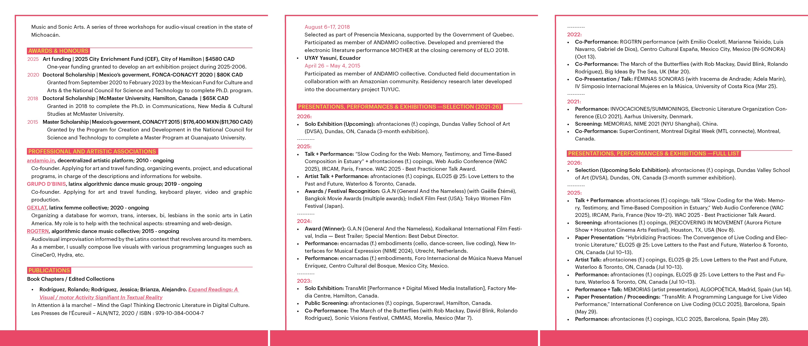
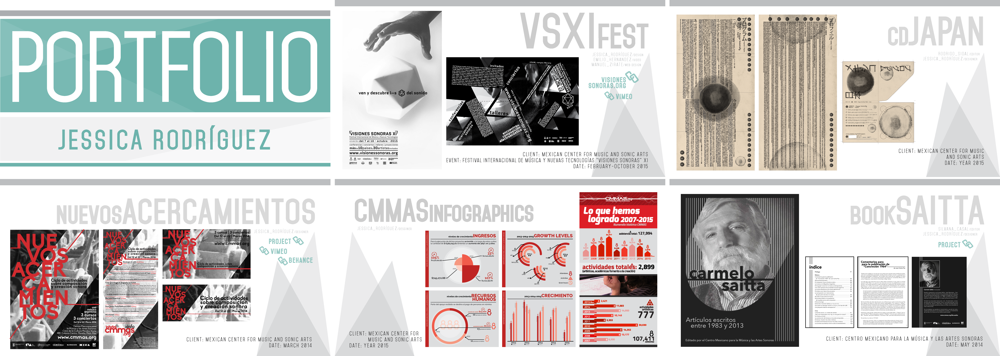
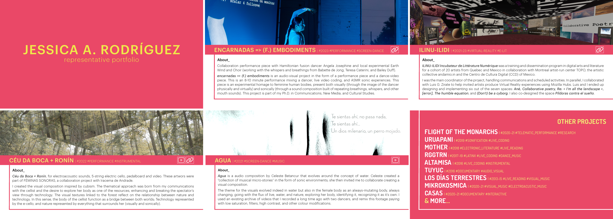
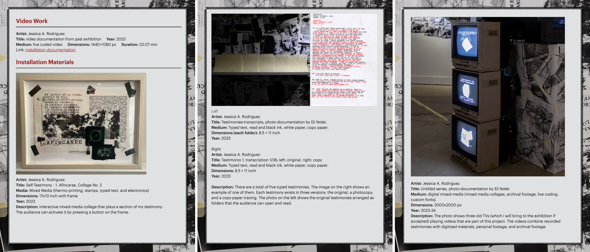

[MEDIAART 2B06](../README.md)

-------------------------------------------------------------------------------

<h1 style="color: darkred;">W12 — Final Cut Framework</h1>
<h2 style="color: darkred;">Final Package & Portfolio Preparation</h2>

This document supports the <a href="../WeekIns/WI-W12.md" target="_blank">W12 - Final Cut</a> by extending the work beyond picture lock, sound mix, and colour refinement into the professional presentation of the finished short film.

This framework focuses on **preparing a clear, well-designed final submission package** while also **introducing the basics of artist portfolios and film/art CVs**. This document helps students organize, write, and present their project for academic, artistic, and early professional contexts.

---

## Sections

<ul>
  <li><a href="#final-package">Final Package</a></li>
  <li><a href="#dossier">Dossier Basics</a></li>
</ul>

---

<h2 id="final-package" style="color: darkred;">Final Package</h2>

Your final package is more than a required submission for this course. **It is a way of presenting your short film clearly and professionally**.  

The materials you prepare (stills, film information, logline, synopsis, and credits) are commonly used in festival submissions, screening programs, portfolios, websites, and application packages.  

A strong final package **helps others quickly understand your work, your role in it, and how to present it accurately**.

---

### Representative Stills

Still frames are **one of the main ways a film is introduced before anyone watches it**. A strong still can quickly **communicate the tone, visual quality, and overall identity** of your project. 

> For your PDF information sheet, including one representative still **helps make the document more engaging and gives the viewer an immediate sense of your film’s visual language**.

Choose frames that:

- clearly show the **main subject or action**  
- represent the **visual style** of your project  
- have **good composition and lighting**  
- reflect key moments in your sequence (beginning, middle, or end)
- Export in PNG (higher quality)

Avoid:

- blurry frames  
- transitional frames (mid-motion unless intentional)  
- frames that are too dark or overexposed  

  <iframe 
    src="https://www.youtube.com/embed/K_t5ueWaDT4?si=KnTqtnHhXjz--EcU"
    title="YouTube video player"
    frameborder="0"
    allow="accelerometer; autoplay; clipboard-write; encrypted-media; gyroscope; picture-in-picture; web-share"
    allowfullscreen
    style="position: absolute; top: 0; left: 0; width: 100%; height: 100%;">
  </iframe>

  

---

### Film Information

Basic film information **identifies the work clearly** and allows **others to reference it correctly**.

Include the following:

- **Title**    
- **Director**  
- **Year of Completion**  
- **Runtime** (example: `1 min` or `00:01:00`)  

> Example:  
> **Title:** *2 AM COFFEE*  
> **Director:** Ayush Karki   
> **Country:** United States 
> **Year of Completion:** 2023  
> **Runtime:** 00:01:49

  <iframe 
    src="https://www.youtube.com/embed/SR__amDl1c8?si=CZORMnhiXA-bowoO"
    title="YouTube video player"
    frameborder="0"
    allow="accelerometer; autoplay; clipboard-write; encrypted-media; gyroscope; picture-in-picture; web-share"
    allowfullscreen
    style="position: absolute; top: 0; left: 0; width: 100%; height: 100%;">
  </iframe>

  

---

### Logline

A logline gives a very short introduction to your film. It should communicate the central action, situation, or tension in one or two sentences.

➡️ Review the <a href="https://jac307.github.io/MediaArtTutorials/MEDIAART2B06/TechWalks/TW-W7.html#logline" target="_blank" rel="noopener noreferrer"><strong>W7 — Pre-Production Framework: Logline</strong></a>. 

> Example (*2 AM COFFEE*):  
> *A man bikes to a quiet gas station at 2 a.m. for a coffee, only to return and find his unlocked bike gone.*

---

#### Short Synopsis — Structure

A synopsis gives a **slightly fuller description of the film than a logline**. It should help someone understand the shape of the film without over-explaining it.  

Simple structure to write your synopsis:

**Character + Situation → Development → Outcome (without revealing everything)**  

- Introduce the **main character and context**  
- Describe the **key action or progression**  
- Indicate the **shift or outcome** (keep it concise)
- ⚠️ Do not fully explain the ending —keep some ambiguity.
- Keep your synopsis focused on what the viewer experiences, not on every detail of the plot.

> Example (*2 AM COFFEE*):  
> *During a quiet 2 a.m. coffee run, a man stops at a nearly empty gas station and leaves his bike outside. What begins as an ordinary late-night routine changes when he steps back into the dark and realizes the bike is no longer there. In that sudden disruption, the film transforms a familiar everyday action into a brief moment of vulnerability, tension, and disorientation.*

---

### Credits

Credits **identify who made the film and recognize the work of everyone involved**. This is **important both professionally and ethically**. Proper credits acknowledge collaboration, make production roles visible, and help you avoid presenting shared work as if it were completed entirely by one person.  

Template

**Director / Editor:** Your Name with Lastname  
**Camera / Cinematography:** Collaborator Name (only if other)  
**Performer:** Performer Name (only if other)  
**Sound Design (Music, Sound Effects, Foley, Ambient Sound):** Name, Author, & Website, or Author (if recorded specifically for the project)  
**Additional Collaborators:** Name (production assistance), Name (location support)...  
**Locations / Location Support:** Location Name, City   

Tips:

- Only include roles that are actually relevant to your project  
- Use people’s names accurately and consistently  
- If you worked alone, you may list multiple roles under your own name  
- If you used music, sound, or visual materials created by others, make sure they are properly credited  

> Example:  
> **Director / Editor / Camera:** Maria Lopez  
> **Performer:** Tamara Smith  
> **Music:** *Morning Drift* — Blue Dot Sessions [downloaded from FreeSound]  
> **Sound Effects:** *Door Creak* — Freesound user `soundmonger` [downloaded from FreeSound]  
> **Foley:** Recorded by Maria Lopez  
> **Additional Collaborators:** Samantha Guizar (production assistance)  
> **Locations / Location Support:** Factory Media Centre, Hamilton  

> Example (*2 AM COFFEE*):  
> **Writer/Director** Ayush Karki   
> **Cinematography** Robidh Basnet  
> **Performer:** Abdulhaq Alrudaini  

---

### Design

**Design matters**. Use the layout, alignment, hierarchy, and composition principles you practiced in Design Fundamentals to build a document that is clear, intentional, and visually coherent.

Take the time to properly format your document:

- choose a consistent **font style and size**
- create a clear **hierarchy of information** with headings and subheadings
- align text, images, and spacing carefully
- position your still image thoughtfully within the page
- avoid making the image too large, where it overwhelms the text, or too small, where it loses impact
- keep your still image at a readable size — **around 1/3 of a page is recommended**
- use **margins** and **white space** to avoid a crowded layout
- keep the layout clean, readable, and visually balanced
- avoid too many fonts, colours, or decorative elements
- make sure all information is easy to scan quickly

Think about:

- **alignment** — are elements lined up clearly?
- **contrast** — is the text easy to read?
- **proximity** — are related items grouped together?
- **balance** — does the page feel visually stable?
- **emphasis** — what do you want the viewer to notice first?

> ⚠️ This document represents your project professionally.

---

<h2 id="dossier" style="color: darkred;">Dossier Basics</h2>

A **dossier** is a larger support document that brings together multiple professional and creative materials in one file.   

In some cases, an application will specifically ask for a dossier. In other cases, it may not use that word, but it may still ask you to submit a combination of the following materials as separate files or grouped together in one PDF.  It is important to read submission requirements carefully and prepare your files in advance.  

<ul>
  <li><a href="#resume">CV or Resume</a></li>
  <li><a href="#portfolio">Portfolio Materials</a>
    <ul>
      <li>Portfolio</li>
      <li>Demo Reel</li>
      <li>Work Sample Document (Works List)</li>
    </ul>
  </li>
  <li><a href="#written">Written Professional Materials</a>
    <ul>
      <li>Artist Bio</li>
      <li>Artist Statement</li>
      <li>Cover Letter or Letter of Intent</li>
    </ul>
  </li>
</ul>

---

<h2 id="resume" style="color: navy;">CV or Resume</h2>

A document that outlines your education, professional experience, exhibitions, screenings, skills, awards, publications, and other relevant experience.

Recommended sections include:

- **Education**
- **Professional Work**  
  Prioritize creative and artistic work first when relevant.
- **Art Service**  
  Volunteer work, organizing, coordination, or support roles in art-related spaces.
- **Professional and Artistic Associations**  
  Collectives, organizations, networks, unions, or memberships connected to your practice.
- **Awards and Funding**
- **Performances / Exhibitions / Screenings / Selections**  
  Include the **year**, **title of the work**, **event or venue name**, **city**, **country**, and your **role** when relevant (for example: artist, filmmaker, performer, collaborator, editor, sound designer). 

Depending on the job, call, or submission, you should re-arrange your CV to highlight the experience most relevant to that specific application.

- For **art applications**, emphasize public presentations, exhibitions, screenings, performances, and artistic production.
- For **film applications**, emphasize public presentations, screenings, selections, and film-related production work.
- For **post-graduate applications**, emphasize education, artistic research, writing, and creative practice.
- For **creative industries applications**, emphasize education, relevant creative work, technical skills, collaborative projects, professional experience, and art service when applicable.

Your CV should not be treated as a fixed document. It should be adjusted depending on the context, making the most relevant experience easier to find quickly.  

  
  

    Excerpts from my (Jessica A. Rodriguez) CV.
  

### Recommendations

For **technical skills**, include the software, tools, and production skills you can use confidently.  

For this course, you can already list software such as **Adobe Premiere Pro**, since you have used it across several projects and at multiple stages of the production process, including editing, sequencing, sound integration, colour correction, and final export.

You may also include other relevant production skills, such as:
- **DSLR camera operation** with **manual camera settings**
- **basic lighting setup**
- **video editing**

Make a general **CV/Resume** document and add every new activity as soon as it happens so you do not forget it later. You can include both **in-person** and **online exhibitions or screenings**.

As part of this course, you can already add presentations such as:

- **February 12, 2026**, *"Title of the Work"*, screening presented at **Come As You Art**, public exhibition, Lyons Family Studio, McMaster University, Hamilton, Ontario, Canada. **Artist**.
- **2026**, *"Title of the Work"* at **Come As You Art: Photo Film**, online exhibition. **Artist**.Public access: [https://media-studio-art.github.io/come-as-you-art/](https://media-studio-art.github.io/come-as-you-art/)
- **April 7, 2026**, *"Title of the Work"*, screening presented at **In One Minute**, public screening, Concert Hall, McMaster University, Hamilton, Ontario, Canada. 

Keep a full CV document with all your experience. In a separate file, prepare a **one-page or two-page version** that you can adapt for specific jobs, submissions, grants, screenings, or graduate school applications.

Remember that **design matters**. Your CV should be clear, readable, and well organized.

### AI Tip 

You can use AI to help revise and adapt your document.

For larger companies, and sometimes medium-sized companies as well, applications may first be reviewed through automated systems before a person reads them. These systems may scan CVs and resumes for keywords, skills, software, job titles, and types of experience that match the posting. This means that the language you use in your document matters.

One useful strategy is to paste the **job posting, call for submissions, or application description** into an AI tool and ask it to identify the main skills, priorities, and repeated terms. Then, revise your CV to make the most relevant experience more visible and easier to find.

This does **not** mean you should copy the posting word for word or exaggerate your experience. It means you should make sure your document clearly names the tools, skills, and types of work you actually have, using language that matches the application when appropriate.

You **don't** need to upload your CV into an AI tool to do this. You can begin by asking questions like:

- What are the main skills, experiences, and priorities emphasized in this application?
- Which parts of a creative CV should be foregrounded for this opportunity?
- What keywords or types of experience appear most important in this posting and for this centre, company, conference, or department?
- Are there software names, technical skills, or types of experience I should name more clearly in my CV?
- What kinds of experience seem most valued here: creative production, collaboration, research, public presentation, technical skills, or administration?

Use AI as a tool to help you **read the application more strategically**, not to invent experience or write a misleading CV for you.  

---

<h2 id="portfolio" style="color: navy;">Portfolio Materials</h2>

  
  

    Excerpts from my (Jessica A. Rodriguez) Design Portfolio.
  

### Portfolio

A portfolio is a selection of your creative work presented in a clear, organized, and visually coherent format. You may prepare your portfolio as a **web portfolio** and/or as a **PDF portfolio** ready to send. It is a good idea to have both.  

> Depending on the application, you may be asked to submit only a small selection of work. In that case, select **4–5 representative projects** that are most relevant to the opportunity.  

Whichever format you use, keep the presentation of information **consistent** across projects. Use the same structure, same order of information, and a similar visual logic throughout the portfolio.   

Remember that **design matters**. Your portfolio should be engaging to look at, easy to navigate, and strong enough to represent your work professionally. The layout, image choices, and structure should help communicate the quality and character of each project.

For each project, include:

- **Title**  
- **Year**  
- **Author** and other relevant **credits**  
- **Links**, when applicable    
  This may include published videos, websites, interviews, online exhibitions, or other public materials related to the project.  
- **Short description**    
- **Representative images**    
  These may include finished work, installation views, film stills, interface views, and, when relevant, behind-the-scenes images or process documentation.    

**Short description:**    

A good standard length is **150–250 words**, since this is common in applications for programs, festivals, residencies, grants, and exhibitions. A useful formula for writing the description is:    

- **Project title / format + central idea or concern + materials, methods, or process + presentation context or outcome**.   
- Focus on the project’s concept, form, process, and context without becoming too vague or overly promotional.  

For **web portfolios**, you can extend this description up to **500 words**, while still making sure the main information is clear within the first **150–250 words**.  

  
  

    Excerpts from my (Jessica A. Rodriguez) Artistic Portfolio.
  

---

### Demo Reel

A **demo reel** is a short video that presents selected excerpts of your work. These are especially common in film, video, animation, motion graphics, editing, cinematography, sound, and media arts applications.

Demo reels should usually be **1–2 minutes long**.

**Tips:**

- **Open with strong work immediately**  
  Do not wait until the middle or end to show your best material.

- **Keep clips short and purposeful**  
  Each clip should demonstrate something clearly and move quickly.

- **Make your role clear**  
  If the work was collaborative, indicate what you did: director, editor, cinematographer, animator, sound designer, performer, etc.

- **Use clean titles or captions when needed**  
  Include your name and, if useful, brief labels for projects or roles.

- **Pay attention to sound**  
  Audio levels should be clean and balanced. Do not let the music overpower the clips. If you use music, make sure it supports the reel rather than distracting from it.

- **Keep transitions simple**  
  Avoid unnecessary visual effects, decorative titles, or flashy transitions unless they are directly relevant to the kind of work you are applying for.

- **End clearly**  
  Include your name and contact information, portfolio link, or website at the end if appropriate.

Like a portfolio or CV, a demo reel should not be treated as a fixed file. You should revise it depending on the application and the kind of work you want to highlight.  

  
  <video controls style="display: block; width: 100%; height: auto;">
    <source src="imgs/138.mp4" type="video/mp4">
    Your browser does not support the video tag.
  </video>

  

    Demo Reel (2016) focused on techniques I (Jessica A. Rodriguez) used for experimental video.
  

---

### Work Sample Document (Works list)

A **work sample document** is a file that presents individual artworks or projects in a clear, consistent, and easy-to-review format. These are often requested for exhibitions, grants, and other arts applications.  

A good approach is to present **one work per page**, keeping the format consistent throughout the document.

For each work, include:

- **Representative image**  
  This may be a still frame, installation view, documentation photo, interface capture, or another image that best represents the work
- **Title**
- **Year**
- **Author** and other relevant **credits**
- **Medium**
- **Dimensions**  
  For example: height × width × depth, using cm or inches consistently
- **Duration / Runtime**  
  For time-based media, include the full running time
- **Format**  
  For example: single-channel video, multi-channel installation, live performance, interactive website, digital print, projection-based installation
- **Short description**
- **Link**, if applicable  
  For example: Vimeo link, website, online exhibition, project page, or documentation page

Depending on the application, you may also need to include:

- **Exhibition, screening, or presentation history**
- **Technical requirements**
  Important information needed to present or install the work.
- **Access information**  
  Such as password-protected links or instructions for experiencing the work

  
  

    Excerpts from my own (Jessica A. Rodriguez) work sample document (afrontaciones project).
  

---

<h2 id="written" style="color: navy;">Written Professional Materials</h2>

### Artist Bio

A short professional introduction that explains who you are, what kind of work you make, and your background. Artist bios are often written in the **third person**, especially for exhibitions, festivals, conferences, websites, and printed programs.  

An artist bio responds to:  

- Who are you?
- Where are you based or working from?
- What kind of work do you make?
- What themes, questions, or methods shape your practice?
- What background or training is relevant?
- What key presentations, exhibitions, screenings, awards, or grants help position your work?

It is important to include your **country**, since this helps situate your practice professionally, geographically, and culturally. In some cases, you may want to include **two countries** if that reflects your background, identity, or artistic context more accurately, for example:

- **Mexican artist based in Canada**
- **Artist working between Mexico and Canada**
- **Mexican-Canadian media artist**
- **Artist from Mexico currently based in Canada**

Make sure the tone stays professional, specific, and clear. Avoid vague phrases such as “passionate artist” or “deeply interested in creativity.” Focus instead on the actual forms, methods, themes, and contexts of your work.

### Versions

It is a good idea to prepare **three standard versions** of your bio:

- a **100-word version**
- a **250-word version**
- a **500-word version**

This helps you respond quickly to different application requirements without rewriting the text from scratch every time.

**Recommendation:** Write the **100-word version first**, then expand it into the **250-word version**, and finally into the **500-word version**. This helps you keep the information consistent across all three.

#### 100-Word Bio

Use this version for short programs, screening notes, event pages, festival booklets, or websites with limited space.

**Include:**

- **Name**
- **Current role or identity as an artist / filmmaker / designer / researcher**
- **Country** or **country + current base**
- **Main media, format, or area of practice**
- **Main themes, concerns, or approaches**
- **One brief background point**  
  This could be your program, institution, location, or a relevant area of experience.

#### 250-Word Bio

Use this version for applications, exhibition texts, conference programs, portfolios, or professional websites.

**Include:**

- Everything from the **100-word version**
- A fuller explanation of your **creative practice**
- Your **training, education, or professional background**
- A few **representative presentations, screenings, exhibitions, collaborations, awards, or grants**

#### 500-Word Bio

Use this version for major applications, residencies, grant files, long-form websites, professional dossiers, or institutional contexts that ask for a more developed biography.

**Include:**

- Everything from the **250-word version**
- More detail about your **creative practice, research, methods, or community context**
- A stronger sense of your **professional trajectory**
- A short list of **representative presentations, exhibitions, screenings, residencies, awards, or grants**

This longer version should still read like a bio, not a full CV. The final section can briefly mention selected achievements without becoming a long inventory.

---

### Artist Statement

A short text that explains your creative practice, themes, methods, and concerns. It focuses on what your work does, how you work, and why that work matters.

Artist statements are usually written in the **first person**. Unlike a bio, which introduces you professionally, the artist statement speaks from your own voice and reflects how you understand your practice.

In artist statements, **writing matters**. The text should be clear, intentional, and well written. Depending on the application, the tone may be more direct and professional, or more reflective and poetic. The statement should sound like you, but it should also help someone unfamiliar with your practice understand what you do.  

> Some applications may ask for a **video artist statement** instead of, or in addition to, a written one.

### Versions

It is a good idea to prepare **two standard versions** of your statement:

- a **150-word version**
- a **300-word version**

**Recommendation:** Write the **150-word version first**, then expand it into the **300-word version**. This helps you keep the information consistent across both versions.  

Your artist statement should help the reader understand:

- **What kind of work you make**
- **What questions, themes, or concerns shape your practice**
- **What materials, media, or methods you work with**
- **How you approach making**
- **Why this work matters to you and/or to the context in which it is presented**

#### 150-Word Version

Use this version for shorter applications, project pages, screening notes, exhibition support material, or forms with limited space.

**Include:**

- A brief description of your **practice**
- Your main **themes, concerns, or questions**
- Your main **media, materials, or methods**
- A short explanation of what motivates or grounds the work

#### 300-Word Version

Use this version for portfolios, grant applications, residency applications, exhibition proposals, and other contexts where you have more space.

**Include:**

- Everything from the **150-word version**
- A fuller explanation of your **process or methodology**
- More context for your **themes, influences, or artistic concerns**
- A clearer sense of why the work matters in relation to audience, place, memory, politics, identity, technology, community, or another relevant context

---

### Cover Letter or Letter of Intent

A **cover letter** or **letter of intent** is a brief document tailored to a specific opportunity. 

Cover letters are usually **one page**. In some cases, especially for **post-graduate applications in creative fields**, they may be **one to two pages**, depending on the instructions and the amount of detail requested.

> Like a CV, this document should never be treated as fixed. It should be revised for each application.
> Avoid writing one generic letter and sending it everywhere. The reader should be able to tell that the letter was written for that specific opportunity.

A strong cover letter or letter of intent should:

- clearly state **what you are applying for**
- explain **why you are interested**
- highlight the **most relevant parts of your background**
- show that you understand the **context of the position, program, or opportunity**
- make a clear case for **why your experience, work, or goals fit**

### Expectations by Context

#### Job applications in the creative industries

These letters should be **direct and specific**. The main goal is to show:

- why you want this specific role
- how your experience connects to the responsibilities of the job
- what technical, creative, collaborative, or organizational skills you bring
- why you are a good fit for the company, studio, centre, or institution

A useful formula is:

**Position + interest in the organization + relevant experience + relevant skills + closing fit**

#### Post-graduate school in creative fields

These letters should explain not only your background, but also your **creative interests, research direction, and reasons for applying to that specific program**. The main goal is to show:

- why you want to pursue graduate study
- what questions, themes, or areas of practice shape your work
- how your past education and creative experience have prepared you
- why this specific program, department, faculty, or institution is a good fit
- what you hope to develop through the degree

A useful formula is:

**Program + creative/research interests + relevant background + why this program + future goals**

#### Exhibitions, residencies, grants, festivals, and other arts applications

These letters often functions more like a **statement of intent**. The main goal is to show:

- why you are applying to this opportunity
- why your work fits the theme, context, or goals of the call
- what project, practice, or body of work you are presenting
- why this opportunity matters for your development or for the project itself

A useful formula is:

**Opportunity + project/practice + why the fit makes sense + relevant background + closing intention**

### AI Tip

Like CVs and resumes, cover letters may also be reviewed by automated systems before a person reads them, especially in larger organizations and some medium-sized ones. This means that the language you use matters.

#### Use AI without uploading your letter

Paste the **job posting, call for applications, or program description** into an AI tool and ask it to help you identify what matters most:

- What are the main skills, experiences, and priorities emphasized in this application?
- What should a cover letter foreground for this role, program, or opportunity?
- What keywords or themes appear most important in this posting?
- What kinds of experience seem most valued here: technical skills, collaboration, leadership, research, creative practice, community work, or public presentation?
- What should be highlighted in a letter for this specific company, department, gallery, festival, or residency?

This step helps you understand the application more strategically before you start revising your letter.

#### Paste your draft and ask for targeted revision help

If you want, you can also copy and paste your draft into an AI tool and ask for **revision support**. The important thing is to tell the AI **not to replace your voice** or rewrite the whole letter in generic language.

Useful prompts include:

- Improve clarity, flow, and structure without changing my tone or voice.
- Point out repetition, vague phrases, or weak sentences.
- Suggest where I can be more specific.
- Check whether this letter clearly matches the application.
- Identify places where I should name relevant skills, experience, or context more directly.
- Keep my wording as much as possible and only suggest minimal edits.
- Help me make this letter more concise without making it sound generic.

Always **proofread the final version yourself**.

AI can help you identify priorities, improve structure, or point out unclear sections, but it may also flatten your tone, introduce incorrect details, or make the writing sound generic.  

________________________________________________________________________

Credits: Jessica A. Rodríguez

**AI Disclosure**:  
AI tools (ChatGPT) were used for **editing and clarity only**. AI is not used to generate original course content.

