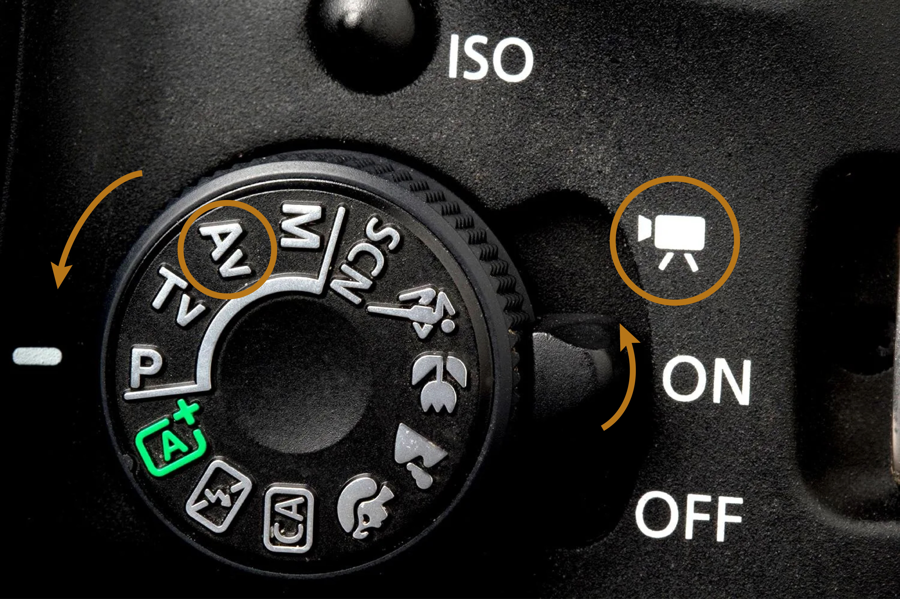
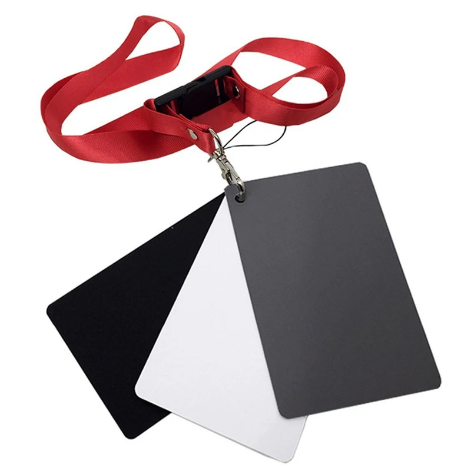
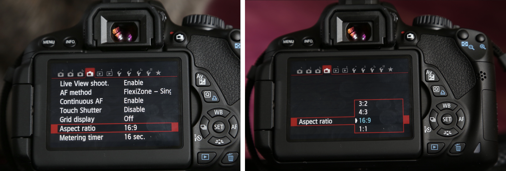
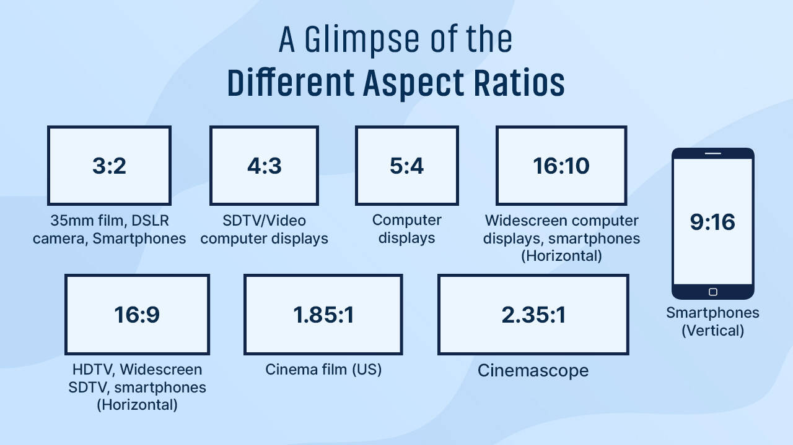
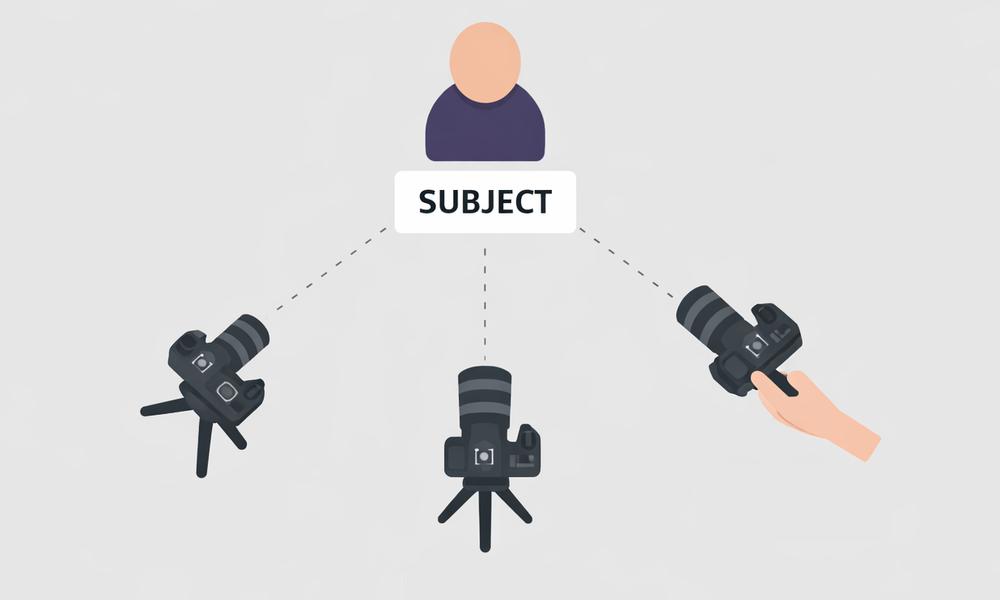
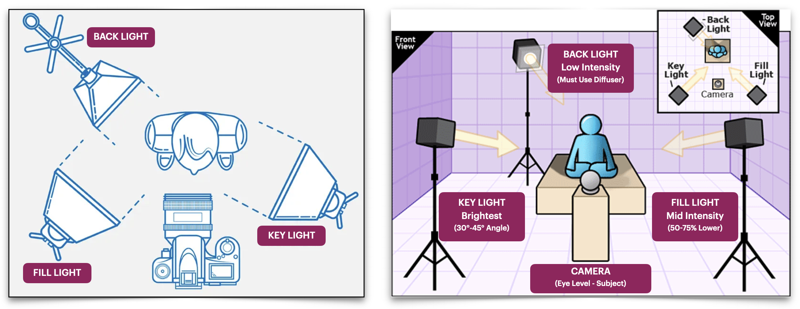
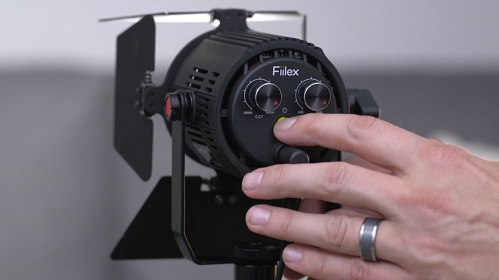

[MEDIAART 2B06](../README.md)

-------------------------------------------------------------------------------

<h1 style="color: darkred;">W2 — Tech Walkthrough</h1>
<h2 style="color: darkred;">Chiaroscuro Interview: Camera, Lighting & Audio Setup</h2>

## Objective

This technical walkthrough supports the **Chiaroscuro Interview (Pairs)** assignment.  
The goal is to establish a **clear workflow** that prioritizes **light, framing, and sound clarity**.  

### By the end of this session, students should be able to:

- Apply **aperture, ISO, and camera placement** to maintain consistent exposure across a multi-camera setup
- Set and maintain **manual white balance** for consistent color and skin tones across multiple cameras
- Set up a **basic three-point lighting arrangement**, adjusting key, fill, and back light to shape contrast 
- Configure and record **audio** using different microphones   

📌 *For Week 2, the emphasis is on lighting contrast, interview framing, and controlled environments.* 

---

<h2 style="color: darkred;"> Camera Settings (Video) </h2> 

### Camera Lenses

[Available DSLR Cameras & Lenses](../Cameras.md){:target="_blank"}  

On Week 2, you will work with **three cameras**, each with a different lenses. Setup the lens for each camera first, then go over the rest of the settings below.    

- **Camera A:** Default kit lens (static - on tripoid)
- **Camera B:** *50mm* or *85mm* (static - on tripoid)
- **Camera C:** *50mm* (moving - handheld)

<iframe width="560" height="315" src="https://www.youtube.com/embed/xS-sM2wvPHI?si=5zIiVux5CBlGrBEt" title="YouTube video player" frameborder="0" allow="accelerometer; autoplay; clipboard-write; encrypted-media; gyroscope; picture-in-picture; web-share" referrerpolicy="strict-origin-when-cross-origin" allowfullscreen></iframe>

--- 

### 1. Camera Mode
- Camera on **Video Mode**
- Use **Aperture Priority (Av)**.

  

### Aperture (f-stop)

- Set your aperture first
- **Recommendation for Chiaroscuro**: narrow aperture (f/8-f/11)

### ISO
- Increase only if the image is too dark **after positioning the lights**
- Use lighting to control exposure before increasing ISO
- **Recommendation for Chiaroscuro**: low ISO (100-200)

### Shutter Speed

+ In **Aperture Priority Video Mode**, shutter speed is **automatically set by the camera**
+ Shutter speed is determined by:
  + Your selected aperture (f-stop). Lower f-number = faster shutter speed
  + The available light in the scene. Low light conditions = slower shutter speed
    
---

## 2. White Balance

White Balance is the **appearance of Color** determined by the **pigments present in the subject**, and the **light illuminating it**.   

In Week 1, you used **Auto White Balance (AWB)**. In this mode, the camera automatically analyzes the scene and adjusts color temperature to neutralize what it assumes should be white.   

For Week 2, we will switch to **Custom White Balance** to maintain consistent skin tones in all three cameras. Follow this tutorial to set **White Balance manually**.      

<iframe width="560" height="315" src="https://www.youtube.com/embed/QwZGrSQ2IFI?si=hfWZiGNOUDEp6Zo_" title="YouTube video player" frameborder="0" allow="accelerometer; autoplay; clipboard-write; encrypted-media; gyroscope; picture-in-picture; web-share" referrerpolicy="strict-origin-when-cross-origin" allowfullscreen></iframe>  

     

> A **3 in 1 Balance Card Set (2"x 3")** will be available for White Balance (this item is included on the Department rentals).

---

## 3. Aspect Ratio & Resolution

An aspect ratio is the **proportional relationship between** an image or screen's **width and height**, expressed as two numbers separated by a colon.  

For Week 2, set your aspect ratio to **16:9** and record at **1920 × 1080 (Full HD)**.
> *All three cameras must use the same aspect ratio.*  

#### How to set the aspect ratio:
- Go to **Menu**
- Navigate to the **fourth menu tab**
- Select **Display ratio**
- Choose **16:9**

     

  

---

<h2 style="color: darkred;"> Space & Lighting Setup </h2>  

## 1. Backdrop / Background Setup

📌 *The background should remain darker than the subject to support chiaroscuro.*

### Backdrop (If Available)
- Place backdrop **1–1.5 meters behind the subject**
- Prevent light spill onto the background

<iframe width="560" height="315" src="https://www.youtube.com/embed/ppy6S3nBl7w?si=__vTHJHWHWVtj5s8" title="YouTube video player" frameborder="0" allow="accelerometer; autoplay; clipboard-write; encrypted-media; gyroscope; picture-in-picture; web-share" referrerpolicy="strict-origin-when-cross-origin" allowfullscreen></iframe>

  

### Without a Backdrop
- Choose an **uncluttered background**
- Allow the background to fall into shadow

---

## 3. Camera Placement

- **Camera A:** eye-level, directly facing the subject (on tripoid)  
- **Camera B:** positioned 30–45° to left or right side (on tripoid)   
- **Camera C:** flexible (moving around), focused on details (handheld)  

---

## 4. Lighting Setup (Three-Point Logic)

This assignment uses a **three-point lighting approach for chiaroscuro**. Check the [Available Lighting Equipment](../Lighting.md){:target="_blank"}.  

  

### Key Light 
- **Position:** Close to the subject, slightly above, at a steep 45-90 degree angle to create strong contrast and shape (often short lighting).
- **Modifier:** Use a softbox to control spill and create focused light.
  > A softbox is a light modifier that surrounds a light source with reflective interior walls and a translucent front diffuser. 
- **Power:** Set as the primary exposure source; adjust for desired highlight intensity.

### Fill Light
- **Position:** Can be used as a very low-power fill opposite the key for minimal detail, or positioned to light a specific background element.
- **Power:** Very low; its purpose is to add dimension without flattening the high-contrast look. 

### Back (Rim) Light
- **Position:** Behind the subject, aimed at the edge of their hair/shoulders to create separation from the dark background just o specific zones.   
- **Modifier:** Can be a bare light or small softbox; keep power low.

#### Setup Fiilex P360 LED Light Kit

<iframe width="560" height="315" src="https://www.youtube.com/embed/cDljJxLn7pY?si=3-i8h0O1lKp7e-am" title="YouTube video player" frameborder="0" allow="accelerometer; autoplay; clipboard-write; encrypted-media; gyroscope; picture-in-picture; web-share" referrerpolicy="strict-origin-when-cross-origin" allowfullscreen></iframe>  

  

#### Lighting 101: Intro to Light Placement

<iframe width="560" height="315" src="https://www.youtube.com/embed/nqMQZG68Wkc?si=wkut27qgbl3T2Xdc" title="YouTube video player" frameborder="0" allow="accelerometer; autoplay; clipboard-write; encrypted-media; gyroscope; picture-in-picture; web-share" referrerpolicy="strict-origin-when-cross-origin" allowfullscreen></iframe>

  

---

## 5. Lighting Intensity & Color Temperature (Warmth)

Use the **control knobs on the back of the light** to adjust:

- **Light intensity** (brightness)
- **Color temperature** (warm ↔ cool)  

 

---

<h2 style="color: darkred;"> Audio Recording Method </h2>  

You will **record audio directly into two of your cameras (A & B)** using two a lapel microphone and a shotgun microphone.  

Check the [Available Microphones](../Audio.md){:target="_blank"}.   

Follow this tutorial to setup the **RODE VideoMic NTG On-Camera Shotgun Microphone** to your **main camera (A)**:  

<iframe width="560" height="315" src="https://www.youtube.com/embed/v_iq4i9zmGA?si=r-7RjE0QbbsV_jgq" title="YouTube video player" frameborder="0" allow="accelerometer; autoplay; clipboard-write; encrypted-media; gyroscope; picture-in-picture; web-share" referrerpolicy="strict-origin-when-cross-origin" allowfullscreen></iframe>

     

Follow one of these tutorials to setup the **lapel Microphone** to your **side camera (B)**:  

#### Connect CAMERA to Rode Wireless GO II Microphone

> Note: You only need to setup one microphone.   

<iframe width="560" height="315" src="https://www.youtube.com/embed/jp1e7pZZQ-0?si=zysMniDdCKgcV38K" title="YouTube video player" frameborder="0" allow="accelerometer; autoplay; clipboard-write; encrypted-media; gyroscope; picture-in-picture; web-share" referrerpolicy="strict-origin-when-cross-origin" allowfullscreen></iframe>

  

#### Connect CAMERA to Audio-Technica Wireless Lavalier (AT899)

Coming soon

#### Basics of Audio for Video:  

<iframe width="560" height="315" src="https://www.youtube.com/embed/gULyPx-F_Xs?si=wZaEcUW5hbBq9HVX" title="YouTube video player" frameborder="0" allow="accelerometer; autoplay; clipboard-write; encrypted-media; gyroscope; picture-in-picture; web-share" referrerpolicy="strict-origin-when-cross-origin" allowfullscreen></iframe>

    

________________________________________________________________________

Credits: Jessica A. Rodríguez

**AI Disclosure**:  
Microsoft CoPilot and ChatGPT was used for **editing and clarity only**, as well as to create some to the **image visualizations**. All ideas, instructional decisions, and assignment constraints are authored by the me, the instructor (Jessica A. Rodriguez). AI is not used to generate original course content.
