[MEDIAART 2B06](../README.md)

# W2 — Chiaroscuro Interview

## Camera, Lighting, and Audio Setup

This technical walkthrough supports the **Chiaroscuro Interview** activity.

You will work in pairs to prepare a three-camera interview using controlled lighting, consistent camera settings, and externally connected microphones.

Before beginning, review
- [available camera equipment](../Cameras.md){:target="_blank"}
- [available lighting equipment](../Lighting.md){:target="_blank"}
- [available audio equipment](../Audio.md){:target="_blank"}

<!-- 
/////////////////
SECTION 1
/////////////////
-->

<details class="tutorial-section">
  <summary>
    <span class="section-title">1. Space and Background</span>
    <span class="section-description">
      Select and arrange a background that supports strong contrasts between light and shadow.
    </span>
  </summary>

<div class="section-content" markdown="1">

## Create a chiaroscuro background

**Chiaroscuro** uses strong contrasts between illuminated and shadowed areas.

The background does not need to be completely black. The main goal is to control where light falls and prevent distracting visual details from competing with the subject.

## Working with a backdrop

1. Place the backdrop approximately **1–1.5 metres behind the subject**.
2. Keep the subject far enough from the backdrop to reduce shadows and light spill.
3. Direct the lights toward the subject rather than toward the backdrop.
4. Check that the edges of the backdrop remain outside the camera frame.

<div class="media-grid media-grid--two photography-examples--sixteen-nine">

  <figure class="media-card">
    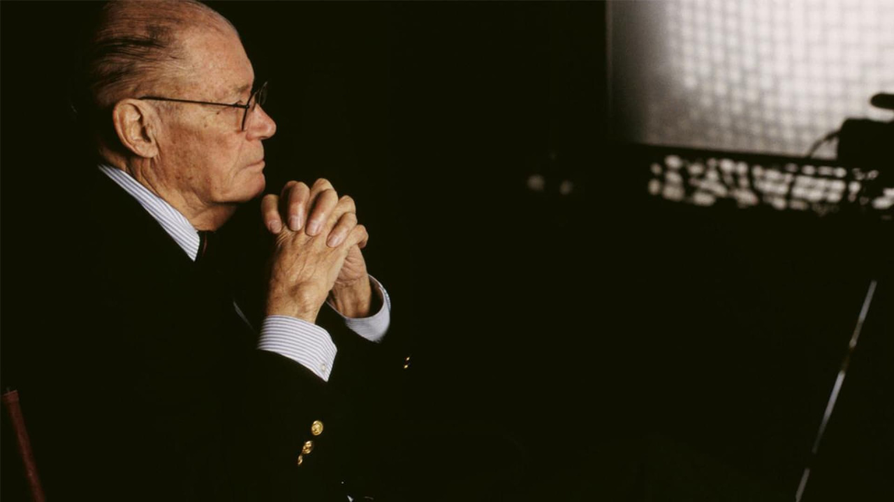
    <figcaption>
      Example of a chiaroscuro effect with a black backdrop in The Fog of War.
    </figcaption>
  </figure>

  <figure class="media-card">
    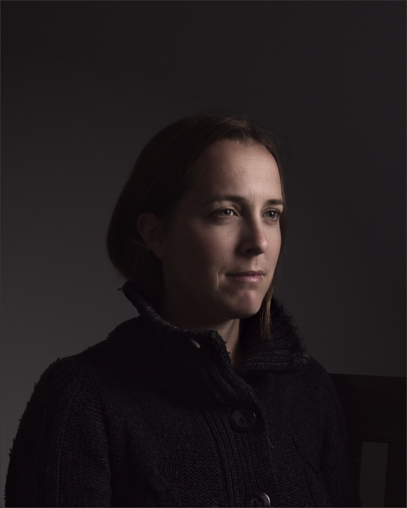
    <figcaption>
      Example of a chiaroscuro effect in photography on Mairi Troisième by Pat David.
    </figcaption>
  </figure>

</div>

<div class="video-wrapper">
  <iframe
    src="https://www.youtube.com/embed/ppy6S3nBl7w?si=__vTHJHWHWVtj5s8"
    title="How to set up a photography backdrop"
    allow="accelerometer; autoplay; clipboard-write; encrypted-media; gyroscope; picture-in-picture; web-share"
    allowfullscreen>
  </iframe>
</div>

## Working without a backdrop

- Choose a simple, uncluttered background
- Increase the distance between the subject and the background
- Decide how the background will support the composition: it may be entirely in shadow, partially shadowed, or intentionally illuminated
- Maintain a clear contrast between the subject and the background through differences in brightness, direction, or intensity of light
- Prevent the background lighting from competing with the subject
- Remove bright or reflective objects that create unwanted distractions

<div class="media-grid media-grid--two photography-examples--sixteen-nine">

  <figure class="media-card">
    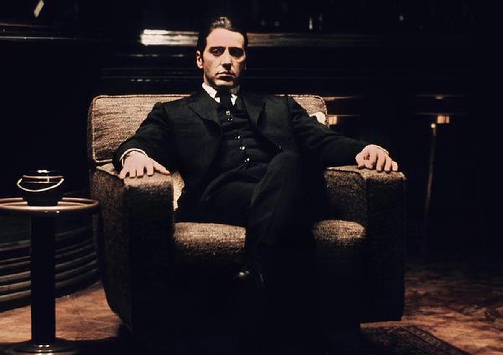
    <figcaption>
      Example of a clear chiaroscuro effect of Al Pacino as Michael Corleone in The Godfather: Part II.
    </figcaption>
  </figure>

  <figure class="media-card">
    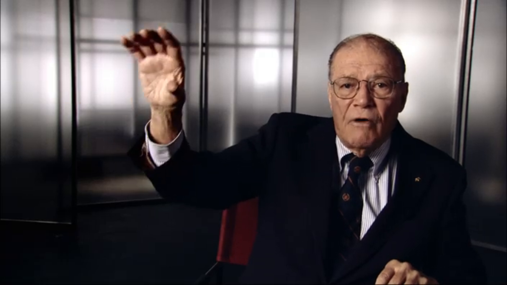
    <figcaption>
      Example of a subtle chiaroscuro effect in The Fog of War.
    </figcaption>
  </figure>

</div>

## Space preparation checklist

<fieldset class="equipment-checklist">
  <legend>Background and safety</legend>

  <label class="checklist-item">
    <input type="checkbox">
    <span>
      <strong>Select an uncluttered background.</strong>
      Remove objects that distract from the subject or reflect unwanted light.
    </span>
  </label>

  <label class="checklist-item">
    <input type="checkbox">
    <span>
      <strong>Position the subject away from the background.</strong>
      Leave approximately 1–1.5 metres when the room permits.
    </span>
  </label>

  <label class="checklist-item">
    <input type="checkbox">
    <span>
      <strong>Secure the backdrop and stands.</strong>
      Make sure stands are stable and do not obstruct doors, walkways, or accessibility routes.
    </span>
  </label>

  <label class="checklist-item">
    <input type="checkbox">
    <span>
      <strong>Organize all cables.</strong>
      Keep cables away from walking paths or secure them with appropriate floor tape.
    </span>
  </label>
</fieldset>

</div>
</details>

<!-- 
/////////////////
SECTION 2
/////////////////
-->

<details class="tutorial-section">
  <summary>
    <span class="section-title">2. Lighting</span>
    <span class="section-description">
      Position the key, fill, and back lights to shape the subject and control contrast.
    </span>
  </summary>

<div class="section-content" markdown="1">

## Three-point Lighting


A three-point lighting setup uses three lights with different functions:

- The key light provides the main illumination
- The fill light controls the depth of the shadows
- The back light separates the subject from the background

## Three-point lighting for chiaroscuro

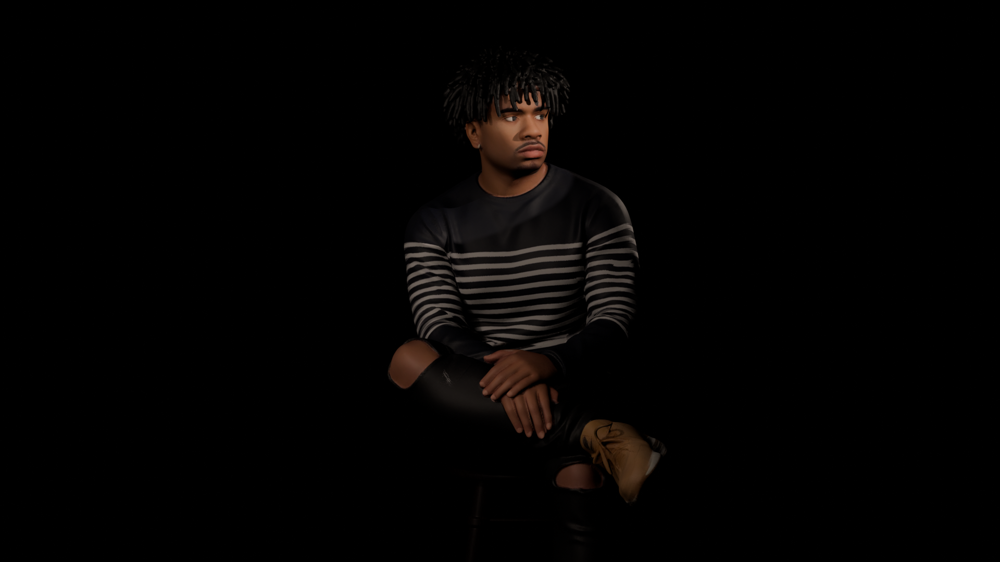

For this activity, you will **adapt this setup to create a chiaroscuro effect**. The key light should remain dominant, while the fill and back lights should be used at lower intensities. This preserves strong contrast between light and shadow while maintaining selected details and separation within the frame.

### Key light

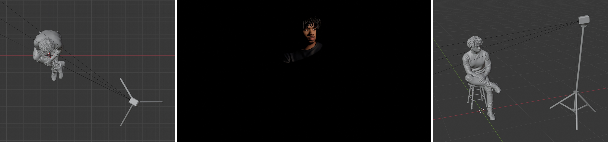

The **key light** is the primary light source.

- Place it close to the subject
- Position it slightly above eye level or
- A steeper side angle can produce stronger contrast across the face
- Place it approximately 45–90 degrees to one side
- Adjust the angle to create a clearly illuminated side and a shadowed side

### Back or rim light

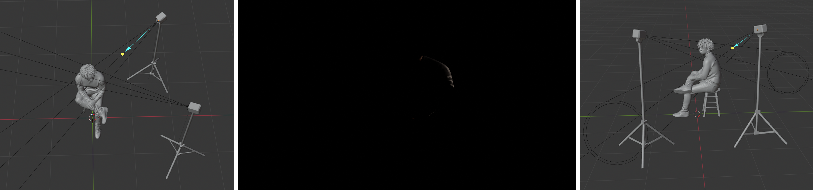

The **back light** separates the subject from the background.

- Position it behind and only to one side of the subject
- Aim it toward the edge of the hair, head, or shoulders
- Keep the intensity low
- Prevent the light from shining directly into the camera lens

### Fill light

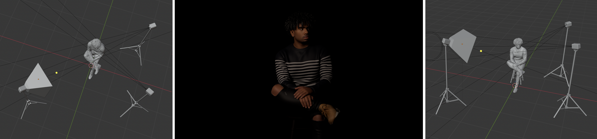

The **fill light** controls how much detail remains visible in the shadowed areas.

- Place it opposite the key light
- Use very low power (dimmer) to increase the effect of the chiaroscuro
- Adjust it only enough to reveal selected shadow details
- Use a a softbox to control spill

> A **softbox** surrounds the light with reflective material and places diffusion fabric in front of it. This softens and redirects the light.

## Set up the Fiilex P360 LED lights

<div class="video-wrapper">
  <iframe
    src="https://www.youtube.com/embed/cDljJxLn7pY?si=3-i8h0O1lKp7e-am"
    title="How to set up the Fiilex P360 LED light kit"
    allow="accelerometer; autoplay; clipboard-write; encrypted-media; gyroscope; picture-in-picture; web-share"
    allowfullscreen>
  </iframe>
</div>

## Review light placement

<div class="video-wrapper">
  <iframe
    src="https://www.youtube.com/embed/nqMQZG68Wkc?si=wkut27qgbl3T2Xdc"
    title="Introduction to studio light placement"
    allow="accelerometer; autoplay; clipboard-write; encrypted-media; gyroscope; picture-in-picture; web-share"
    allowfullscreen>
  </iframe>
</div>

## Other studio lighting arrangements

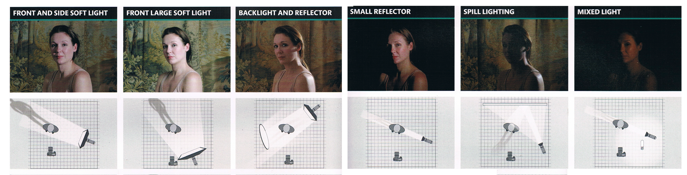

## Adjust intensity and colour temperature

Use the controls on the back of each light to adjust:

- **Intensity:** The brightness of the light
- **Colour temperature:** The warmth or coolness of the light


Keep the colour temperature consistent across all lights unless a deliberate colour contrast is part of the visual approach.

## Lighting setup checklist

<fieldset class="equipment-checklist">
  <legend>Lighting preparation</legend>

  <label class="checklist-item">
    <input type="checkbox">
    <span>
      <strong>Place the key light.</strong>
      Create a clear contrast between the illuminated and shadowed sides of the subject.
    </span>
  </label>

  <label class="checklist-item">
    <input type="checkbox">
    <span>
      <strong>Position the back light.</strong>
      Create a controlled rim of light around selected areas of the subject.
    </span>
  </label>

  <label class="checklist-item">
    <input type="checkbox">
    <span>
      <strong>Add minimal fill light.</strong>
      Keep the fill dim enough to preserve the shadowed areas.
    </span>
  </label>

  <label class="checklist-item">
    <input type="checkbox">
    <span>
      <strong>Control light spill.</strong>
      Prevent unnecessary light from reaching the background or camera lens.
    </span>
  </label>

  <label class="checklist-item">
    <input type="checkbox">
    <span>
      <strong>Match the colour temperature of the lights.</strong>
      Use consistent settings before creating the Custom White Balance.
    </span>
  </label>

  <label class="checklist-item">
    <input type="checkbox">
    <span>
      <strong>Check the brightest areas of the face.</strong>
      Reduce the key-light intensity if highlight detail is being lost.
    </span>
  </label>
</fieldset>

</div>
</details>

<!-- 
/////////////////
SECTION 3
/////////////////
-->

<details class="tutorial-section">
  <summary>
    <span class="section-title">3. Multi-Camera Recording: Cameras and Lenses</span>
    <span class="section-description">
      Multi-Camera Recording using different lenses and production roles.
    </span>
  </summary>

<div class="section-content" markdown="1">

For an interview setup, it is common to use multiple cameras with different lenses, positions, and production roles. The following camera arrangement is assigned for this week:  

| Camera | Lens | Support | Primary role |
|---|---|---|---|
| **Camera A** | Default kit lens | Tripod | Main frontal interview shot |
| **Camera B** | 50 mm lens | Tripod | Secondary angle |
| **Camera C** | 85 mm lens | Handheld | Details and additional coverage |

Attach and confirm the correct lens before completing the remaining camera settings.

> Camera C uses a longer lens. Small movements may appear more noticeable, so hold the camera carefully and maintain a stable position.

<div class="video-wrapper">
  <iframe
    src="https://www.youtube.com/embed/xS-sM2wvPHI?si=5zIiVux5CBlGrBEt"
    title="Introduction to camera lenses and focal length"
    allow="accelerometer; autoplay; clipboard-write; encrypted-media; gyroscope; picture-in-picture; web-share"
    allowfullscreen>
  </iframe>
</div>

## Camera and lens checklist

<fieldset class="equipment-checklist">
  <legend>Assign the equipment</legend>

  <label class="checklist-item">
    <input type="checkbox">
    <span>
      <strong>Prepare Camera A with the kit lens.</strong>
      Mount the camera securely on a tripod.
    </span>
  </label>

  <label class="checklist-item">
    <input type="checkbox">
    <span>
      <strong>Prepare Camera B with the 50 mm lens.</strong>
      Mount the camera securely on a second tripod.
    </span>
  </label>

  <label class="checklist-item">
    <input type="checkbox">
    <span>
      <strong>Prepare Camera C with the 85 mm lens.</strong>
      This camera will be used handheld for selected details.
    </span>
  </label>

  <label class="checklist-item">
    <input type="checkbox">
    <span>
      <strong>Confirm that every lens is locked into place.</strong>
      Turn off the camera before attaching or removing a lens.
    </span>
  </label>

  <label class="checklist-item">
    <input type="checkbox">
    <span>
      <strong>Set Image Stabilization for each camera.</strong>
      Turn stabilization off for tripod-mounted cameras. Turn it on for the handheld camera when the lens provides this option.
    </span>
  </label>
</fieldset>

</div>
</details>

<!-- 
/////////////////
SECTION 4
/////////////////
-->

<details class="tutorial-section">
  <summary>
    <span class="section-title">4. Multi-Camera Recording: Camera Positions</span>
    <span class="section-description">
      Assign a distinct angle and framing purpose to each camera, then set Manual Focus.
    </span>
  </summary>

<div class="section-content" markdown="1">

## Camera placement

When recording with multiple cameras, each camera should have a distinct purpose within the overall visual coverage. For this activity, you will follow a standard three-camera setup, using complementary angles and shot types rather than creating three nearly identical images.  

- **Camera A:** Position at eye level, directly facing the subject, on a tripod
- **Camera B:** Position approximately 30–45 degrees to the left or right of the subject, on a tripod
- **Camera C:** Use handheld for controlled details, alternative angles, and additional visual coverage

## Framing guidelines

### Camera A: Main shot

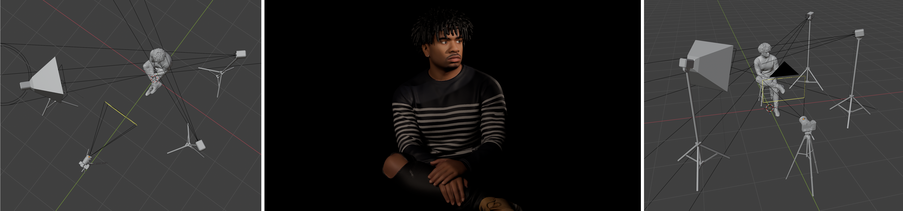

- Create the primary interview framing
- Keep the eyes near the upper horizontal grid line
- Leave appropriate headroom
- Keep the subject’s position stable throughout the interview
- Avoid placing the subject too close to the edge of the frame

### Camera B: Secondary angle

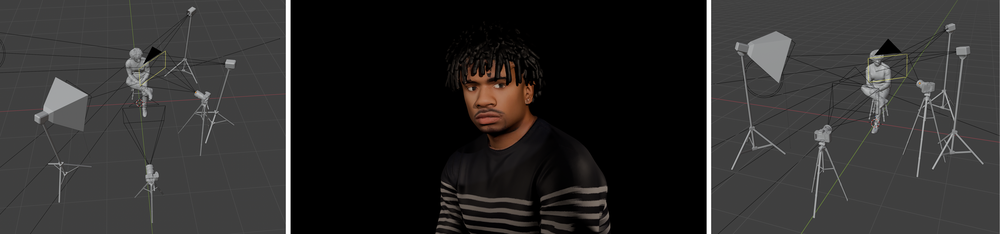

- Maintain a clear difference from Camera A
- Keep the camera at approximately the same eye level
- Check that equipment does not appear in the frame
- Maintain a consistent looking direction between the two static cameras

### Camera C: Detail camera

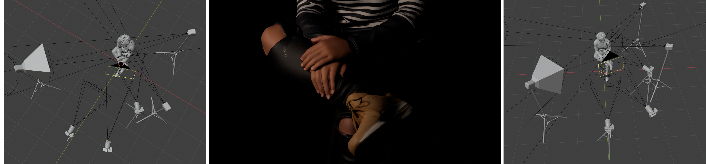

Use the handheld camera selectively for:

- Hands
- Facial details
- Clothing or personal objects
- Lighting details
- Environmental details
- Controlled changes in framing

Move slowly and avoid unnecessary camera movement.

## Set Manual Focus

Use **Manual Focus** for the interview.

1. Move the focus switch on the lens from `AF` to `MF`.
2. Magnify the image on the LCD screen using the Zoom buttons.
3. Focus carefully on the subject’s eyes.
4. Return to the full image.
5. Ask the subject to remain near the marked position.
6. Recheck focus after moving a camera or changing the focal length.

> A shallow depth of field leaves less room for movement. Recheck focus whenever the subject changes position.

## Camera placement checklist

<fieldset class="equipment-checklist">
  <legend>Framing and focus</legend>

  <label class="checklist-item">
    <input type="checkbox">
    <span>
      <strong>Position Camera A at eye level.</strong>
      Create the main frontal interview shot.
    </span>
  </label>

  <label class="checklist-item">
    <input type="checkbox">
    <span>
      <strong>Position Camera B at a 30–45-degree angle.</strong>
      Make the secondary view visually distinct from Camera A.
    </span>
  </label>

  <label class="checklist-item">
    <input type="checkbox">
    <span>
      <strong>Plan the role of Camera C.</strong>
      Identify the details and alternative framings needed before recording.
    </span>
  </label>

  <label class="checklist-item">
    <input type="checkbox">
    <span>
      <strong>Set every lens to Manual Focus.</strong>
      Magnify the image and focus on the subject’s eyes.
    </span>
  </label>

  <label class="checklist-item">
    <input type="checkbox">
    <span>
      <strong>Check headroom and visual balance.</strong>
      Use Grid 1 to compare the three compositions.
    </span>
  </label>

  <label class="checklist-item">
    <input type="checkbox">
    <span>
      <strong>Remove equipment from every frame.</strong>
      Check for lights, stands, cables, microphones, bags, and other cameras.
    </span>
  </label>
</fieldset>

</div>
</details>

<!-- 
/////////////////
SECTION 5
/////////////////
-->

<details class="tutorial-section">
  <summary>
    <span class="section-title">5. Video Recording in DSLR Cameras</span>
    <span class="section-description">
      Set resolution - aspect ratio, frame rate, and display grid.
    </span>
  </summary>

<div class="section-content" markdown="1">

## Set Resolution, Aspect Ratio & Frame Rate

- **Resolution** describes the image dimensions in pixels. A resolution of 1920 × 1080 uses a 16:9 aspect ratio.  
- An **aspect ratio** describes the proportional relationship between the width and height of the image.  
- **Frame rate** describes the number of individual images recorded each second. A frame rate of 30 fps records 30 frames per second.


### Steps

1. Set the camera to Video mode.
2. Press **Menu**.
3. Navigate to the second video menu tab.
4. Select **Movie recording size**.
5. Choose the option showing **1920 × 1080 at 30 fps**.  

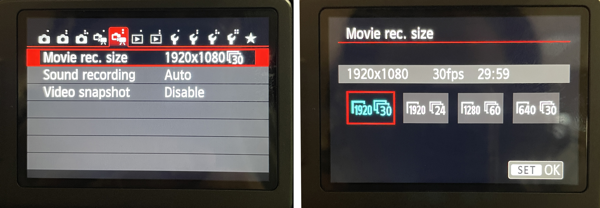

## Activate Display Grid

The grid helps maintain consistent framing, headroom, visual balance, and alignment.

1. Press **Menu**.
2. Navigate to the first video menu tab.
3. Select **Grid display**.
4. Choose **Grid 1**.

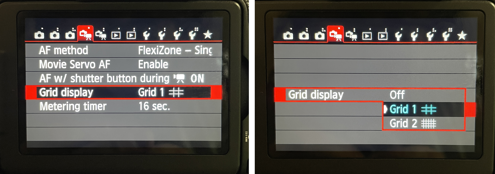

## Video settings checklist

<fieldset class="equipment-checklist">
  <legend>Complete on all three cameras</legend>

  <label class="checklist-item">
    <input type="checkbox">
    <span>
      <strong>Set the cameras to Video mode.</strong>
      Confirm that all cameras are prepared to record video rather than still photographs.
    </span>
  </label>

  <label class="checklist-item">
    <input type="checkbox">
    <span>
      <strong>Set the resolution to 1920 × 1080.</strong>
      Use the same resolution on Cameras A, B, and C.
    </span>
  </label>

  <label class="checklist-item">
    <input type="checkbox">
    <span>
      <strong>Set the frame rate to 30 fps.</strong>
      Do not combine footage recorded at different frame rates.
    </span>
  </label>

  <label class="checklist-item">
    <input type="checkbox">
    <span>
      <strong>Confirm the 16:9 aspect ratio.</strong>
      The selected 1920 × 1080 recording size uses a 16:9 frame in all cameras.
    </span>
  </label>

  <label class="checklist-item">
    <input type="checkbox">
    <span>
      <strong>Activate Grid 1.</strong>
      Use the grid to compare framing across the three cameras.
    </span>
  </label>
</fieldset>

</div>
</details>

<!-- 
/////////////////
SECTION 6
/////////////////
-->

<details class="tutorial-section">
  <summary>
    <span class="section-title">6. Exposure Camera Settings</span>
    <span class="section-description">
      Control aperture and ISO while maintaining consistency across all three cameras.
    </span>
  </summary>

<div class="section-content" markdown="1">

## Why use Manual mode?

Set all three cameras to **Manual mode (`M`)**.

Manual mode gives you direct control over:

- **Aperture:** Controls how much light enters the camera and the depth of field.
- **Shutter speed:** Controls how movement appears and how long each frame is exposed.
- **ISO:** Controls image brightness; higher values produce more digital noise.

Automatic settings may change while the subject moves or the framing changes. Manual settings help maintain consistent exposure throughout the interview and between cameras.

### Quick Aperture, Shutter Speed, and ISO reference


<div class="video-wrapper">
  <iframe
    src="https://www.youtube.com/embed/euA77VgM7kk?si=9673vNm8RtF2CmBF"
    title="How to use Manual mode on a Canon DSLR camera"
    allow="accelerometer; autoplay; clipboard-write; encrypted-media; gyroscope; picture-in-picture; web-share"
    allowfullscreen>
  </iframe>
</div>

## Shutter speed

Set the shutter speed to:

```text
1/60 second
```

A shutter speed of `1/60` is appropriate for recording at 30 fps and helps maintain natural-looking movement.

Avoid very slow shutter speeds that produce excessive motion blur.

> Keep the same shutter speed across all three cameras.

<div class="video-wrapper">
  <iframe
    src="https://player.vimeo.com/video/19603537?h=7533f831d5"
    title="Introduction to shutter speed"
    allow="accelerometer; autoplay; clipboard-write; encrypted-media; gyroscope; picture-in-picture; web-share"
    referrerpolicy="strict-origin-when-cross-origin"
    allowfullscreen>
  </iframe>
</div>

## Aperture

Begin with a relatively wide aperture, such as:

- `f/2.8`
- `f/4`
- `f/5.6`

A wider aperture:

- Allows more light into the camera
- Creates a shallower depth of field
- Helps separate the subject from the background
- Supports the dramatic visual effect of chiaroscuro

Each lens has a different available aperture range. Select the closest practical value when the same aperture is not available on every lens.

> Keep the aperture settings the same or as similar as possible on Cameras A and B. Camera C may require a different aperture when changing its framing, subject detail, or position within the lighting setup.

<div class="video-wrapper">
  <iframe
    src="https://player.vimeo.com/video/19603662?h=1270ae8baa"
    title="Introduction to aperture"
    allow="accelerometer; autoplay; clipboard-write; encrypted-media; gyroscope; picture-in-picture; web-share"
    referrerpolicy="strict-origin-when-cross-origin"
    allowfullscreen>
  </iframe>
</div>

## ISO

Begin at:

```text
ISO 400
```

When the image remains too dark:

1. Adjust the lights first.
2. Confirm that the aperture is sufficiently wide.
3. Increase ISO to `800`.
4. Increase ISO to `1600` only when necessary.

Higher ISO settings can brighten the image, but they also introduce more visible digital noise and reduce fine detail.

<div class="video-wrapper">
  <iframe
    src="https://player.vimeo.com/video/19603860?h=70853fa7d3"
    title="Introduction to ISO"
    allow="accelerometer; autoplay; clipboard-write; encrypted-media; gyroscope; picture-in-picture; web-share"
    referrerpolicy="strict-origin-when-cross-origin"
    allowfullscreen>
  </iframe>
</div>

## Manual exposure checklist

<fieldset class="equipment-checklist">
  <legend>Set and compare the exposure on all three cameras</legend>

  <label class="checklist-item">
    <input type="checkbox">
    <span>
      <strong>Set the shooting mode to <code>M</code>.</strong>
      Manual mode prevents the camera from changing exposure automatically during recording.
    </span>
  </label>

  <label class="checklist-item">
    <input type="checkbox">
    <span>
      <strong>Set the shutter speed to <code>1/60</code>.</strong>
      Keep the shutter speed consistent on Cameras A, B, and C to maintain similar motion across the footage.
    </span>
  </label>

  <label class="checklist-item">
    <input type="checkbox">
    <span>
      <strong>Set Cameras A and B to a similar aperture.</strong>
      Begin between approximately <code>f/2.8</code> and <code>f/5.6</code> to maintain consistent depth of field and exposure between the two static interview angles.
    </span>
  </label>

  <label class="checklist-item">
    <input type="checkbox">
    <span>
      <strong>Adjust the aperture on Camera C for each detail shot.</strong>
      The handheld camera may require a higher f-number for additional depth of field or a wider aperture when recording a darker area of the subject.
    </span>
  </label>

  <label class="checklist-item">
    <input type="checkbox">
    <span>
      <strong>Begin at <code>ISO 400</code> on Cameras A and B.</strong>
      Increase ISO only after adjusting the lighting and aperture.
    </span>
  </label>

  <label class="checklist-item">
    <input type="checkbox">
    <span>
      <strong>Adjust the ISO on Camera C when its position or framing changes.</strong>
      Different parts of the body may receive different amounts of light. Recheck the exposure and manually adjust the ISO before recording each new detail shot.
    </span>
  </label>

  <label class="checklist-item">
    <input type="checkbox">
    <span>
      <strong>Compare the exposure across all three cameras.</strong>
      Check the subject’s skin, highlights, shadows, and background. Camera C does not need identical settings, but its footage should remain visually compatible with Cameras A and B.
    </span>
  </label>
</fieldset>

</div>
</details>

<!-- 
/////////////////
SECTION 7
/////////////////
-->

<details class="tutorial-section">
  <summary>
    <span class="section-title">7. Custom White Balance</span>
    <span class="section-description">
      Use a neutral reference card to create consistent colour and skin tones across all cameras.
    </span>
  </summary>

<div class="section-content" markdown="1">

## What is white balance?

White balance adjusts how the camera records the colour of the light illuminating the scene.

Automatic White Balance may change between cameras or during recording. For this activity, use **Custom White Balance** so the three cameras record the lighting and skin tones consistently.

> A **3-in-1 balance card set (2 × 3 inches)** is available through the department rentals.

## Set Custom White Balance

Complete the following process separately on each camera after the lighting has been finalized:

1. Place the neutral grey or white reference card where the subject will sit. You can use a white piece of paper or a balance card set.  
2. Make sure the card/paper is illuminated by the same light that will illuminate the subject.
3. Fill most of the frame with the reference card.
4. Take a correctly exposed photograph of the card/paper.
5. Open the camera menu.
6. Select **Custom White Balance**.
7. Choose the reference photograph.
8. Set the camera’s White Balance mode to the **Custom White Balance** symbol.
9. Repeat the process on Cameras A, B, and C.

<div class="video-wrapper">
  <iframe
    src="https://www.youtube.com/embed/QwZGrSQ2IFI?si=hfWZiGNOUDEp6Zo_"
    title="How to set Custom White Balance on a Canon DSLR camera"
    allow="accelerometer; autoplay; clipboard-write; encrypted-media; gyroscope; picture-in-picture; web-share"
    allowfullscreen>
  </iframe>
</div>

> Create the Custom White Balance only after the lights and their colour temperatures are in their final positions.

## White-balance checklist

<fieldset class="equipment-checklist">
  <legend>Complete on all three cameras</legend>

  <label class="checklist-item">
    <input type="checkbox">
    <span>
      <strong>Finalize the lighting first.</strong>
      Do not change the light colour temperature after setting Custom White Balance.
    </span>
  </label>

  <label class="checklist-item">
    <input type="checkbox">
    <span>
      <strong>Place the reference card at the subject’s position.</strong>
      The card must receive the same light as the subject.
    </span>
  </label>

  <label class="checklist-item">
    <input type="checkbox">
    <span>
      <strong>Create a Custom White Balance on Camera A.</strong>
      Select the reference photograph and activate the Custom White Balance setting.
    </span>
  </label>

  <label class="checklist-item">
    <input type="checkbox">
    <span>
      <strong>Create a Custom White Balance on Camera B.</strong>
      Use the same reference card under the same lighting.
    </span>
  </label>

  <label class="checklist-item">
    <input type="checkbox">
    <span>
      <strong>Create a Custom White Balance on Camera C.</strong>
      Compare the colour of the subject across all three camera screens.
    </span>
  </label>
</fieldset>

</div>
</details>

<!-- 
/////////////////
SECTION 8
/////////////////
-->

<details class="tutorial-section">
  <summary>
    <span class="section-title">8. Record High-Quality Audio</span>
    <span class="section-description">
      Record the interview audio directly into Cameras A and B using shotgun and lapel microphones.
    </span>
  </summary>

<div class="section-content" markdown="1">

## Audio recording method

Record audio directly into two cameras:

- **Camera A:** RØDE VideoMic NTG shotgun microphone
- **Camera B:** RØDE Wireless GO II
- **Camera C:** Camera reference audio only

> Recording the main voice into two cameras provides an additional audio source if one microphone has a technical problem.

## Camera A: RØDE VideoMic NTG

Connect the RØDE VideoMic NTG to Camera A, then mount it on top of the camera using the microphone mount adapter.

> **Important:** Open the camera’s audio settings and confirm that it is recording from the external microphone input, not the camera’s built-in microphone.

<div class="video-wrapper">
  <iframe
    src="https://www.youtube.com/embed/v_iq4i9zmGA?si=r-7RjE0QbbsV_jgq"
    title="How to connect the RODE VideoMic NTG to a camera"
    allow="accelerometer; autoplay; clipboard-write; encrypted-media; gyroscope; picture-in-picture; web-share"
    allowfullscreen>
  </iframe>
</div>

## Camera B: Lapel microphone / RØDE Wireless GO II

Connect the RØDE Wireless GO II receiver to Camera B. Turn on one transmitter and attach the lapel microphone near the interviewee’s collar or upper chest.

The microphone may be hidden beneath clothing, but make sure the fabric does not rub against it or obstruct the sound.  

> **Important:** Open the camera’s audio settings and confirm that it is recording from the external microphone input, not the camera’s built-in microphone.

<div class="video-wrapper">
  <iframe
    src="https://www.youtube.com/embed/jp1e7pZZQ-0?si=zysMniDdCKgcV38K"
    title="How to connect the RODE Wireless GO II to a camera"
    allow="accelerometer; autoplay; clipboard-write; encrypted-media; gyroscope; picture-in-picture; web-share"
    allowfullscreen>
  </iframe>
</div>

## Monitor and test the audio

Connect headphones to Cameras A and B to monitor the audio in real time.

Ask the interviewee to speak at the volume they expect to use during the interview.  

Listen for:

- Clear speech
- Clothing noise
- Electrical interference
- Background noise
- Distortion
- Audio that is too quiet
- Audio recorded by the camera’s internal microphone instead of the external microphone

Aim for healthy levels that remain below clipping. Speech peaks around `-12 dB` provide useful headroom. The level must not reach `0 dB`.

## Audio fundamentals

<div class="video-wrapper">
  <iframe
    src="https://www.youtube.com/embed/gULyPx-F_Xs?si=wZaEcUW5hbBq9HVX"
    title="Introduction to recording audio for video"
    allow="accelerometer; autoplay; clipboard-write; encrypted-media; gyroscope; picture-in-picture; web-share"
    allowfullscreen>
  </iframe>
</div>

## Audio setup checklist

<fieldset class="equipment-checklist">
  <legend>Microphone preparation</legend>

  <label class="checklist-item">
    <input type="checkbox">
    <span>
      <strong>Connect the shotgun microphone to Camera A.</strong>
      Confirm that the cable is connected to the camera’s microphone input and microphone is mounted on top of the camera.  
    </span>
  </label>

  <label class="checklist-item">
    <input type="checkbox">
    <span>
      <strong>Connect one lapel system to Camera B.</strong>
      Confirm that the transmitter and receiver are paired and turned on. Keep the microphone close to the speaker and away from clothing or other noise sources.
    </span>
  </label>

  <label class="checklist-item">
    <input type="checkbox">
    <span>
      <strong>Ask the subject to speak at interview volume.</strong>
      Test using complete sentences rather than whispering or tapping the microphone.
    </span>
  </label>

  <label class="checklist-item">
    <input type="checkbox">
    <span>
      <strong>Check the audio meters.</strong>
      Maintain healthy levels without reaching <code>0 dB</code>.
    </span>
  </label>

  <label class="checklist-item">
    <input type="checkbox">
    <span>
      <strong>Listen to a test recording.</strong>
      Confirm that each camera recorded the intended external microphone.
    </span>
  </label>
</fieldset>

</div>
</details>

<!-- 
/////////////////
SECTION 9
/////////////////
-->


<details class="tutorial-section">
  <summary>
    <span class="section-title">9. Record and review a technical test</span>
    <span class="section-description">
      Test all three cameras and both microphones before beginning the full interview.
    </span>
  </summary>

<div class="section-content" markdown="1">

## Record the test

1. Ask the subject to sit or stand in the marked position.
2. Start recording on Cameras A, B, and C.
3. Record a visible and audible hand clap.
4. Ask the subject to speak for approximately 20–30 seconds.
5. Stop all three cameras.
6. Review the image and audio from each camera.

The hand clap creates a shared visual and audio reference that can help synchronize the recordings in post-production.

## Review the test

Check:

- Exposure
- Highlight detail
- Shadow detail
- Focus on the eyes
- Depth of field
- Skin tones
- Colour consistency
- Framing and headroom
- Camera stability
- Shotgun microphone sound
- Lapel microphone sound
- Background noise
- Equipment visible in the frame

Make corrections before beginning the complete interview.

## Final recording checklist

<fieldset class="equipment-checklist">
  <legend>Ready to record</legend>

  <label class="checklist-item">
    <input type="checkbox">
    <span>
      <strong>The background and subject positions are finalized.</strong>
      Mark the subject and tripod positions when necessary.
    </span>
  </label>

  <label class="checklist-item">
    <input type="checkbox">
    <span>
      <strong>The lighting creates the intended contrast.</strong>
      Check the key, fill, back light, and background separately.
    </span>
  </label>

  <label class="checklist-item">
    <input type="checkbox">
    <span>
      <strong>All cameras record at 1920 × 1080 and 30 fps.</strong>
      Confirm the settings again before recording.
    </span>
  </label>

  <label class="checklist-item">
    <input type="checkbox">
    <span>
      <strong>All cameras use Manual exposure.</strong>
      Check aperture, shutter speed, ISO, and Auto Exposure Bracketing.
    </span>
  </label>

  <label class="checklist-item">
    <input type="checkbox">
    <span>
      <strong>Custom White Balance is active on all cameras.</strong>
      Compare colour and skin tones across the three screens.
    </span>
  </label>

  <label class="checklist-item">
    <input type="checkbox">
    <span>
      <strong>Manual Focus has been checked on all cameras.</strong>
      Magnify the subject’s eyes to confirm sharpness.
    </span>
  </label>

  <label class="checklist-item">
    <input type="checkbox">
    <span>
      <strong>The microphones are connected and tested.</strong>
      Listen to a recorded test from Cameras A and B.
    </span>
  </label>

  <label class="checklist-item">
    <input type="checkbox">
    <span>
      <strong>The batteries and memory cards have sufficient capacity.</strong>
      Replace or recharge equipment before beginning when necessary.
    </span>
  </label>

  <label class="checklist-item">
    <input type="checkbox">
    <span>
      <strong>A synchronization clap will be recorded.</strong>
      Make the clap visible to all cameras and audible to both microphones.
    </span>
  </label>
</fieldset>

> Do not begin the full interview until the group has watched and listened to the technical test.

</div>
</details>


---

Credits: Jessica A. Rodríguez
