[MEDIAART 2B06](../README.md)

# W3 Technical Walkthrough

## Lenses, Aperture, and Depth of Field for Outdoor Recording

This technical walkthrough supports the **Static Outdoor Scene** assignment.  

You will work in pairs to prepare and record this scene using consistent manual exposure for outdoor recording. You will use camera distance, focal length, and aperture together to shape depth, while recording high-quality separate audio with a ZOOM H4n recorder.

Before beginning, review
- [available leses](../Cameras.md){:target="_blank"}
- [available lighting equipment](../Lighting.md){:target="_blank"}
- [available audio equipment](../Audio.md){:target="_blank"}

<!-- 
/////////////////
SECTION 1
/////////////////
-->

  

    1. Compare lens focal lengths
    
      Observe how lenses affect the field of view, framing, and representation of space.
    
  

## Focal length and field of view

Focal length affects how much of the scene appears within the frame:

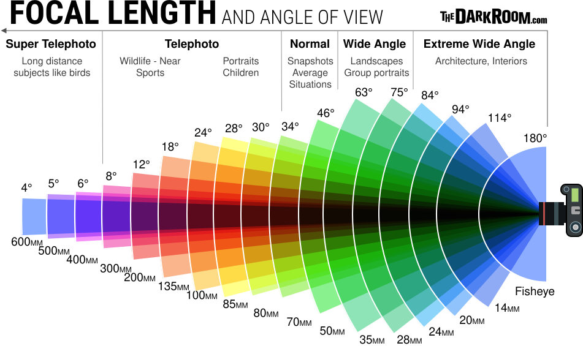

> **Important:** Perspective is primarily determined by the camera’s position. Changing the lens changes the field of view. When you move the camera to maintain similar framing with a different lens, the spatial relationships between foreground and background also change.

## Distance from the subject

Camera distance strongly affects how depth is represented:

- Moving closer can exaggerate the apparent distance between foreground and background.
- Moving farther away can make spatial relationships appear more compressed.
- Moving closer to the focus point generally produces a shallower depth of field.
- Moving farther from the focus point generally produces a deeper depth of field.

Wide-angle lenses make changes in camera distance especially noticeable.

  <figure class="media-card">
    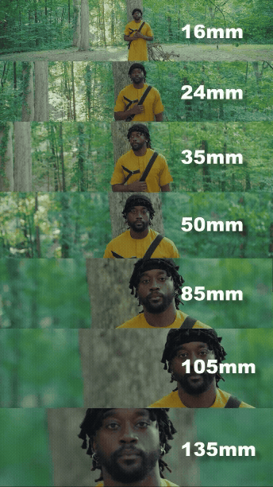
    <figcaption>Lens comparison 1</figcaption>
  </figure>

  <figure class="media-card">
    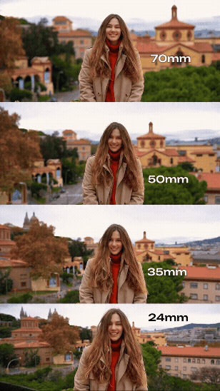
    <figcaption>Lens comparison 2</figcaption>
  </figure>

  <figure class="media-card">
    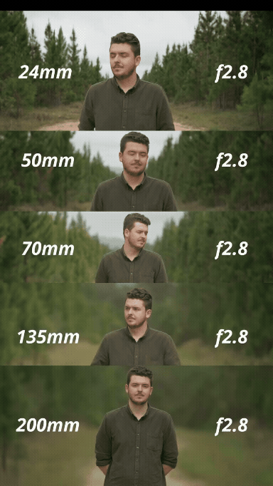
    <figcaption>Lens comparison 3</figcaption>
  </figure>

> The subjects and camera distance remain similar while the lens changes. Compare the field of view, depth of field, and representation of space.

  <figure class="media-card">
    
    <figcaption>Distance and lens comparison 1</figcaption>
  </figure>

  <figure class="media-card">
    
    <figcaption>Distance and lens comparison 2</figcaption>
  </figure>

  <figure class="media-card">
    
    <figcaption>Distance and lens comparison 3</figcaption>
  </figure>

> The subjects remain the same while the camera distance and lens change. Compare how each combination affects depth of field and the perceived relationship between foreground and background.

<!-- 
/////////////////
SECTION 2
/////////////////
-->

  

    2. Control depth of field
    
      Use aperture, camera distance, and focal length to determine how much of the scene appears sharp.
    
  

## What is depth of field?

**Depth of field** is the area in front of and behind the focus point that appears acceptably sharp.

- A **shallow depth of field** keeps a limited area in focus while other areas appear blurred.
- A **deep depth of field** keeps a larger area of the scene in focus.

## Factors that affect depth of field

> Explore this [Depth of Field Simulator](https://jherr.github.io/depth-of-field/){:target="_blank"} to see how focal length, aperture, camera distance, and subject distance affect depth of field.

### Aperture

- A wider aperture with a lower f-number, such as `f/2.8`, generally creates a shallower depth of field.
- A narrower aperture with a higher f-number, such as `f/11` or `f/16`, generally creates a deeper depth of field.

### Distance from the focus point

- Moving the camera closer to the focus point generally creates a shallower depth of field.
- Moving the camera farther from the focus point generally creates a deeper depth of field.

### Focal length

- Shorter focal lengths generally make it easier to maintain a deeper area of focus.
- Longer focal lengths generally make it easier to isolate a subject with a shallower area of focus.

> These factors work together. Do not evaluate aperture, distance, or focal length in isolation.

## Manual Focus

For static outdoor recordings, it is highly recommended to use **Manual Focus (`MF`)**. Autofocus may shift unexpectedly when people, vehicles, shadows, or other objects move through the frame.

For a static shot, establish the focus once and keep it locked:

1. Decide which part of the scene must remain sharp.
2. Magnify the image on the camera display, when available.
3. Adjust the focus ring carefully.
4. Return to the full view and confirm the composition.
5. Record a short test and review it at full size before filming the final scene.

> Recheck the focus whenever you move the camera, change the lens, adjust the focal length, or change the subject distance.

## A wide lens does not keep everything in focus

A wide-angle lens can still create a shallow depth of field when:

- The aperture is wide
- The focus point is close to the camera
- The background is significantly farther from the focus point

> Decide where the camera will be placed before finalizing the aperture and focus.

<!-- 
/////////////////
SECTION 3
/////////////////
-->

  

    3. Camera Configuration
    
      Prepare the lens, recording format, white balance, focus, metering, and manual exposure controls.
    
  

For Week 3, continue using the core recording settings introduced in the [W2 Technical Walkthrough](TW-W2.md){:target="_blank"}. This week, pay particular attention to how lens choice, depth of field, and exposure affect the recorded image.

<fieldset class="equipment-checklist">
  <legend>Camera setup</legend>

  <label class="checklist-item">
    <input type="checkbox">
    
      <strong>Select and install one lens.</strong>
      Choose an available lens that provides approximately <code>24 mm</code>, <code>35 mm</code>, or <code>50 mm</code>. This lense are perfect for landscape photography and videography. 
    
  </label>

  <label class="checklist-item">
    <input type="checkbox">
    
      <strong>Set the general recording format.</strong>
      <strong>Video mode</strong>, a <code>16:9</code> aspect ratio, a resolution of <code>1920 × 1080</code>, a frame rate of <code>30 fps</code>, and use the <strong>Grid 1</strong> for compositional guides.
    
  </label>

  <label class="checklist-item">
    <input type="checkbox">
    
      <strong>Set the camera to Manual mode.</strong>
      Use <code>M</code> so the camera does not change the exposure automatically during recording.
    
  </label>

  <label class="checklist-item">
    <input type="checkbox">
    
      <strong>Set the lens to Manual Focus.</strong>
      Select <code>MF</code> and focus on the intended part of the scene.
    
  </label>

  <label class="checklist-item">
    <input type="checkbox">
    
      <strong>Set a Custom White Balance.</strong>
      Use a balance card or a neutral white or grey surface under the actual outdoor lighting conditions.
    
  </label>

  <label class="checklist-item">
    <input type="checkbox">
    
      <strong>Display the histogram.</strong>
      Press the <strong>INFO</strong> button until the histogram appears.
    
  </label>
</fieldset>

> The goal is not to memorize isolated settings. Consider how every setting affects space, movement, light, and recorded image information.

<!-- 
/////////////////
SECTION 4
/////////////////
-->

  

    4. Evaluate exposure
    
      Use metering and the histogram to preserve important information in highlights, midtones, and shadows.
    
  

## What is exposure?

**Exposure** describes how light or dark the recorded image appears. It is shaped by the combined relationship between shutter speed, aperture, ISO, and the available light in the scene.

## Reading exposure with the histogram

The histogram shows how brightness values are distributed across the image:

- The **left side** represents shadows
- The **centre** represents midtones
- The **right side** represents highlights

Select each example to compare the image with its histogram.

  

    <input
      class="photo-reveal-card__toggle screen-reader-only"
      type="checkbox"
      id="underexposure-example"
    >

    <label
      class="photo-reveal-card__image"
      for="underexposure-example"
    >
      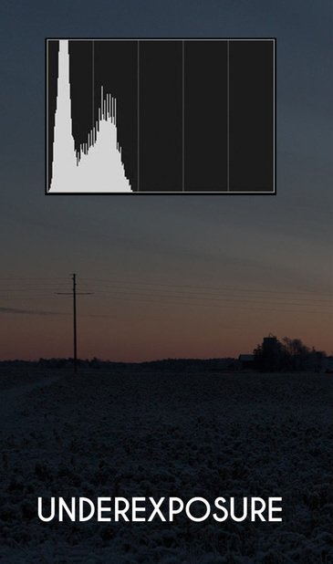

      
        Underexposure
      

      
        Select for details
      
    </label>

    

      <strong>Notice the histogram:</strong> Most brightness information is concentrated toward the left side. When the graph presses against the far-left edge, dark areas may be clipped and important shadow detail may be lost.

      Brightening severely underexposed footage during editing can reveal noise, compression artefacts, and limited colour information.
    

  

  

    <input
      class="photo-reveal-card__toggle screen-reader-only"
      type="checkbox"
      id="balanced-exposure-example"
    >

    <label
      class="photo-reveal-card__image"
      for="balanced-exposure-example"
    >
      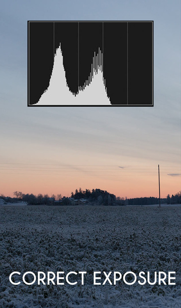

      
        Balanced exposure
      

      
        Select for details
      
    </label>

    

      <strong>Notice the histogram:</strong> Brightness information is distributed across the shadows, midtones, and highlights without a strong pile-up against either edge.

      A balanced histogram does not need to be centred or evenly shaped. Its form depends on the brightness of the scene. The goal is to preserve the important details required by the composition.
    

  

  

    <input
      class="photo-reveal-card__toggle screen-reader-only"
      type="checkbox"
      id="overexposure-example"
    >

    <label
      class="photo-reveal-card__image"
      for="overexposure-example"
    >
      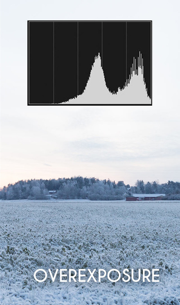

      
        Overexposure
      

      
        Select for details
      
    </label>

    

      <strong>Notice the histogram:</strong> Most brightness information is concentrated toward the right side. When the graph presses against the far-right edge, highlights may be clipped to pure white.

      Once important highlight information is clipped, it cannot be fully recovered during editing.
    

  

> A histogram does not identify one universally correct exposure. Read it together with the visible image and the intended brightness of the scene.

## Common exposure problems

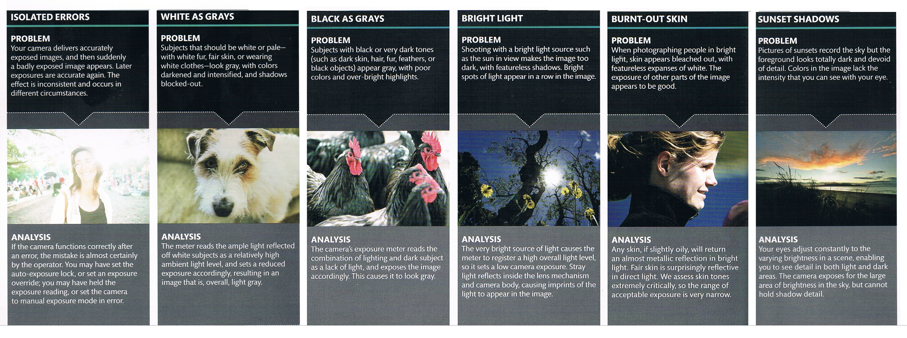

## Exposure controls

The three principal camera controls are:

- **Shutter speed:** Controls how long each video frame is exposed and affects motion rendering.
- **Aperture:** Controls the lens opening and affects both brightness and depth of field.
- **ISO:** Controls how strongly the captured signal is amplified; higher values generally produce more visible noise.

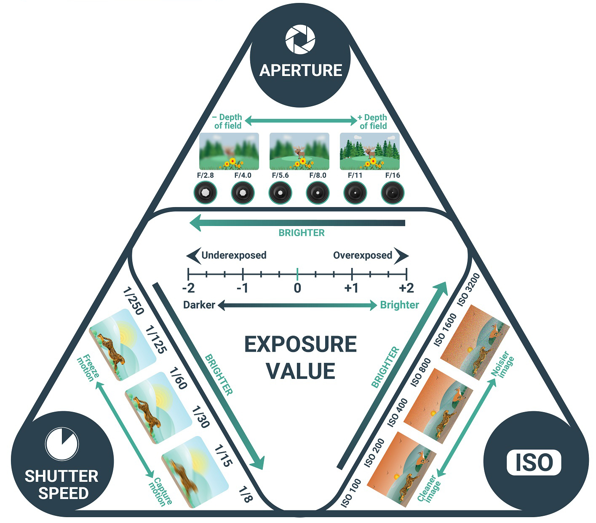

  <iframe
    src="https://www.youtube.com/embed/n2HSoOq-rfo?si=-Q3nZtOi50DPhnX8"
    title="Introduction to shutter speed, aperture, and ISO"
    loading="lazy"
    frameborder="0"
    allow="accelerometer; autoplay; clipboard-write; encrypted-media; gyroscope; picture-in-picture; web-share"
    allowfullscreen>
  </iframe>

## Metering

Metering is the camera system that measures the brightness of a scene and estimates an exposure.

For the Static Outdoor Scene:

- Use **Evaluative or Matrix Metering**.
- Use the meter as a starting point rather than an automatic answer.
- Set the exposure once the camera position and composition have been finalized.
- Recheck the exposure when the outdoor light changes.

Bright skies, pale concrete, reflective surfaces, and large areas of shadow can mislead the meter. Always compare the meter reading with the histogram and the visible image.

### Changing the metering mode

  <iframe
    src="https://www.youtube.com/embed/L4ljKZvf6BU?si=BctLEVZPZYCEhYI5&amp;start=136"
    title="How to change the camera metering mode"
    loading="lazy"
    frameborder="0"
    allow="accelerometer; autoplay; clipboard-write; encrypted-media; gyroscope; picture-in-picture; web-share"
    allowfullscreen>
  </iframe>

## Histogram

The histogram shows how brightness values are distributed across the image:

- **Left:** Shadows and darker values
- **Centre:** Midtones
- **Right:** Highlights and brighter values

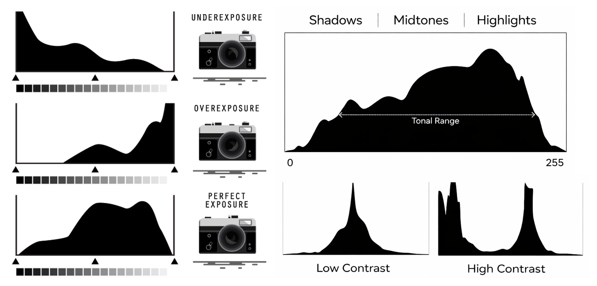

A histogram does not need to have one ideal shape. Its shape should reflect the intended scene. However:

- A strong pile-up against the far right may indicate clipped highlights.
- A strong pile-up against the far left may indicate crushed shadows.
- Information touching either edge requires careful review.

> Protect important highlights while preserving the shadow detail required by the composition. It is often safer to retain highlight information than to record large areas as pure white.

  <iframe
    src="https://www.youtube.com/embed/8Gmz1c6oq-4?si=Z2-yGKMsq8VTAHzn"
    title="How to read and use a camera histogram"
    loading="lazy"
    frameborder="0"
    allow="accelerometer; autoplay; clipboard-write; encrypted-media; gyroscope; picture-in-picture; web-share"
    allowfullscreen>
  </iframe>

<!-- 
/////////////////
SECTION 5
/////////////////
-->

  

    5. Shutter speed, aperture, and ISO
    
      Establish motion rendering first, choose the required depth of field, and use ISO only when additional brightness is necessary.
    
  

Set the controls in this order:

## 1. Shutter speed

For recording at `30 fps`, begin with a shutter speed of `1/60`.

- A slower shutter speed, such as `1/30`, allows more light but creates more motion blur.
- A faster shutter speed, such as `1/125`, allows less light and renders movement more sharply.

Keep the shutter speed fixed unless there is a clear visual reason to change how motion appears.

  <figure class="media-card">
    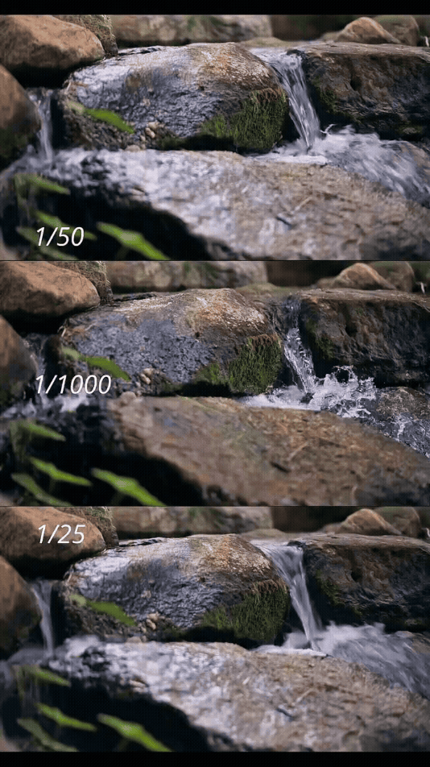
    <figcaption>Shutter-speed comparison 1</figcaption>
  </figure>

  <figure class="media-card">
    
    <figcaption>Shutter-speed comparison 2</figcaption>
  </figure>

  <figure class="media-card">
    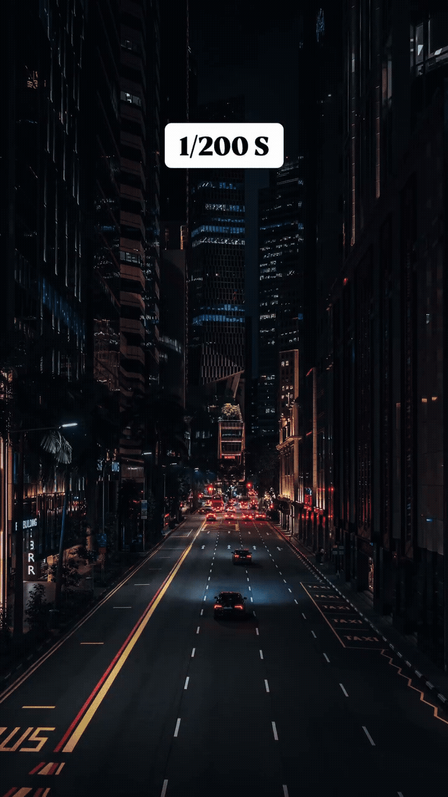
    <figcaption>Shutter-speed comparison 3</figcaption>
  </figure>

## 2. Aperture

After setting the shutter speed, select the aperture according to the required depth of field:

- A lower f-number, such as `f/2.8`, allows more light and generally creates a shallower depth of field.
- A higher f-number, such as `f/8`, allows less light and generally creates a deeper depth of field.

Each lens has a specific available aperture range. Use the closest practical value when your preferred aperture is not available.

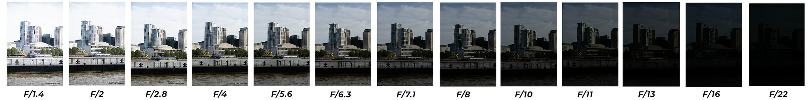

## 3. ISO

Adjust ISO only after setting the shutter speed and aperture.

- Begin between approximately `ISO 100` and `ISO 400`.
- Increase to `ISO 800` or `ISO 1600` only when necessary.
- Review darker areas carefully because higher ISO values make noise more visible.
- Do not use ISO to compensate for clipped highlights.
- Raising ISO cannot recreate image information that was not captured.

## Exposure checklist

<fieldset class="equipment-checklist">
  <legend>Set and verify the manual exposure</legend>

  <label class="checklist-item">
  <input type="checkbox">
  
    <strong>Select the shutter speed according to the intended visual approach.</strong>
    Begin with <code>1/60</code> as a standard setting for recording at <code>30 fps</code>. You may choose a slower shutter speed to emphasize motion blur or a faster shutter speed to render movement more sharply. Define the artistic purpose of this choice and keep the setting consistent throughout the shot.
  
</label>

  <label class="checklist-item">
    <input type="checkbox">
    
      <strong>Select the aperture for the intended depth of field.</strong>
      Consider the focus distance, focal length, and available aperture range of the lens.
    
  </label>

  <label class="checklist-item">
    <input type="checkbox">
    
      <strong>Begin with a low ISO.</strong>
      Start between approximately <code>ISO 100</code> and <code>ISO 400</code>, then increase it only when necessary.
    
  </label>

  <label class="checklist-item">
    <input type="checkbox">
    
      <strong>Check the meter, histogram, and camera display.</strong>
      Confirm that important highlights and shadows retain the detail required by the composition.
    
  </label>

  <label class="checklist-item">
    <input type="checkbox">
    
      <strong>Record and review a short test.</strong>
      Check focus, depth of field, exposure, motion, and image noise before recording the final scene.
    
  </label>
</fieldset>

<!-- 
/////////////////
SECTION 6
/////////////////
-->

  

    6. Record high quality Audio
    
      Configure the on-camera shotgun microphone and ZOOM H4n, monitor both recordings, and create a synchronization point for editing.
    
  

- A **RØDE VideoMic NTG** connected to the camera
- A separate [ZOOM H4n handheld recorder](https://jac307.github.io/MediaArtTutorials/MEDIAART2B06/Audio.html#zoom-h4n-handheld){:target="_blank"}

The ZOOM H4n should provide the primary audio recording. The on-camera shotgun microphone provides reference audio for synchronization and an additional backup.

## Camera microphone setup

<fieldset class="equipment-checklist">
  <legend>Prepare the RØDE VideoMic NTG</legend>

  <label class="checklist-item">
    <input type="checkbox">
    
      <strong>Mount the RØDE VideoMic NTG on the camera.</strong>
      Use the same on-camera shotgun microphone setup introduced during the Chiaroscuro Interview activity.
    
  </label>

  <label class="checklist-item">
    <input type="checkbox">
    
      <strong>Install a windscreen.</strong>
      Use a windscreen or furry windshield to reduce outdoor wind noise.
    
  </label>

  <label class="checklist-item">
    <input type="checkbox">
    
      <strong>Connect and turn on the microphone.</strong>
      Insert the audio cable into the camera’s external microphone input and confirm that the RØDE VideoMic NTG is powered on.
    
  </label>

  <label class="checklist-item">
    <input type="checkbox">
    
      <strong>Confirm the external audio input.</strong>
      Open the camera’s audio settings and verify that it is receiving sound from the external microphone rather than the built-in microphone.
    
  </label>

  <label class="checklist-item">
    <input type="checkbox">
    
      <strong>Connect headphones and monitor the sound.</strong>
      Listen for clear environmental sound, wind noise, electrical interference, handling noise, or distortion.
    
  </label>

  <label class="checklist-item">
    <input type="checkbox">
    
      <strong>Check and adjust the recording levels.</strong>
      Aim for the loudest sounds to peak at approximately <code>-12 dB</code>. The levels must remain below <code>0 dB</code> to prevent clipping.
    
  </label>

  <label class="checklist-item">
    <input type="checkbox">
    
      <strong>Record and review a short audio test.</strong>
      Confirm that the audio is clear, audible, free from clipping, and being recorded through the RØDE VideoMic NTG.
    
  </label>
</fieldset>

## ZOOM H4n setup

<fieldset class="equipment-checklist">
  <legend>Prepare the ZOOM H4n</legend>

  <label class="checklist-item">
    <input type="checkbox">
    
      <strong>Use the built-in stereo microphones.</strong>
      Position the recorder so the microphones face the intended sound source.
    
  </label>

  <label class="checklist-item">
    <input type="checkbox">
    
      <strong>Install a windscreen.</strong>
      Use a windscreen whenever one is available for outdoor recording.
    
  </label>

  <label class="checklist-item">
    <input type="checkbox">
    
      <strong>Set the recording format to <code>WAV 48 kHz / 24-bit</code>.</strong>
      This format is appropriate for video production and post-production.
    
  </label>

  <label class="checklist-item">
    <input type="checkbox">
    
      <strong>Select Stereo mode.</strong>
      Confirm that the built-in stereo microphones are active.
    
  </label>

  <label class="checklist-item">
    <input type="checkbox">
    
      <strong>Connect headphones.</strong>
      Monitor the sound throughout the recording.
    
  </label>

  <label class="checklist-item">
    <input type="checkbox">
    
      <strong>Set and test the recording level.</strong>
      Keep the audio below clipping and avoid red peak indicators.
    
  </label>
</fieldset>

## ZOOM H4n tutorial

  <iframe
    src="https://www.youtube.com/embed/xAFsAAVBoC0?si=UjnSlexSuCQnNhB0"
    title="How to configure the ZOOM H4n for field recording"
    loading="lazy"
    frameborder="0"
    allow="accelerometer; autoplay; clipboard-write; encrypted-media; gyroscope; picture-in-picture; web-share"
    allowfullscreen>
  </iframe>

---

Credits: Jessica A. Rodríguez
