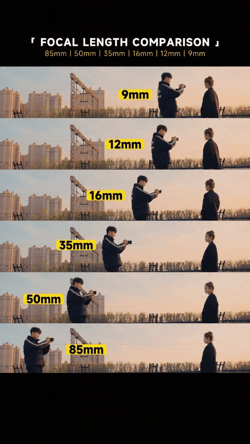
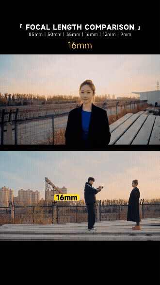
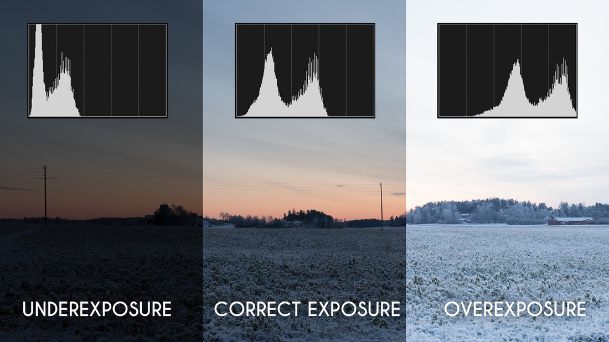
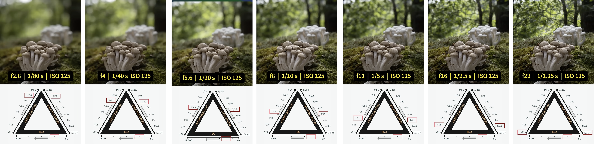
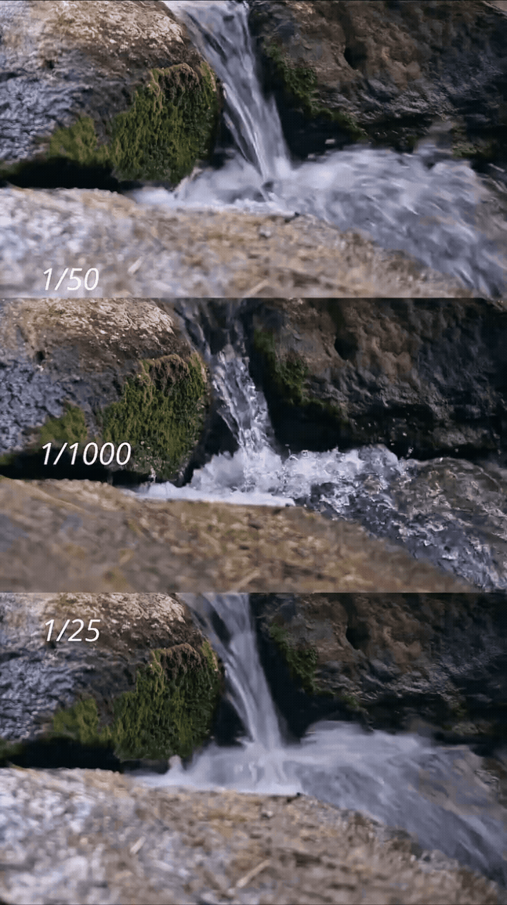

[MEDIAART 2B06](../README.md)

-------------------------------------------------------------------------------

<h1 style="color: darkred;">W3 — Tech Walkthrough</h1>
<h2 style="color: darkred;">Lenses, Aperture & Depth of Field (Static Outdoor Scene)</h2>

## Objective

This technical walkthrough supports the **Static Outdoor Scene (Individual)** assignment.  
The goal is to understand how **lens choice, camera distance, and aperture** shape **space, depth, and exposure**. 

### By the end of this session, students should be able to:

- Explain how **lens focal length (24mm, 35mm, and 50mm)** shapes perceived space, scale, and spatial relationships in a **static outdoor scene**
- Use **aperture intentionally** as both a **depth-of-field and exposure tool**, working within the physical limits of each lens
- Identify moments where **image information is irreversibly lost at the time of recording** due to overexposure or underexposure, and understand why this loss cannot be fully recovered in post-production

📌 *Week 3 focuses on a static camera setup to clearly observe how optical decisions affect the image.*  

---

<h2 style="color: darkred;"> Lenses (24mm - 35mm - 50mm) </h2>  

Check [Available Lenses](https://jac307.github.io/MediaArtTutorials/MEDIAART2B06/Cameras.html#zoom-lenses){:target="_blank"}   

### Lens Focal Length & Perceived Space

Lens focal length does **not** simply change how much you see — it changes how **space is perceived** in the image.

- **24mm**  
  - Wider field of view  
  - Expands space and exaggerates distance between foreground and background  
  - Emphasizes environment and spatial context  

- **35mm**  
  - Still wide, but more natural-looking  
  - Slightly compresses space compared to 24mm  
  - Balances subject and environment

- **50mm**  
  - Narrower field of view compared to 24mm and 35mm  
  - Produces a more “natural” perspective closer to human vision  
  - Compresses space more noticeably, reducing the sense of depth between foreground and background  
  - Isolates subjects more easily, even in outdoor environments  

  

---

### Distance to Subject (More Important Than You Think)

- Being closer to the subject exaggerates depth and separation
- Stepping back compresses space and increases depth of field
- Distance affects **how depth is perceived**, even at the same aperture

Wide lenses exaggerate these effects, especially when the camera is close to the subject.

<figure style="width: 80%; margin: auto; display: flex; justify-content: left; gap: 1em;">
  
  
  
</figure> 
<figcaption style="text-align: center; font-style: italic; margin-top: 0.5em;">
  Same subjects and distances, different lenses → different depth of fielf and different sense of space.
</figcaption>   

<figure style="width: 80%; margin: auto; display: flex; justify-content: left; gap: 1em;">
  
  
  
</figure>  
<figcaption style="text-align: center; font-style: italic; margin-top: 0.5em;">
  Same subjects, different distances and lenses → different depth of fielf and different sense of space.
</figcaption>   

---

### Depth of Field

  

**Depth of Field** is the area in front of and beyond the focal plane where objects still appear in focus.

Three main factors affect depth of field:

- **Aperture size**  
  Smaller apertures (e.g., f/11 or f/16) produce a **greater depth of field**, keeping more of the scene in focus.

- **Distance to subject**  
  The farther the camera is from the subject, the **greater the depth of field**.

- **Focal length of the lens**  
  Shorter focal lengths (wide-angle lenses) generally produce a **greater depth of field** than longer lenses.

📌 *Always use **Manual Focus (MF)** instead of Auto Focus to maintain precise control over depth of field.*

---

### Wide Lens ≠ Infinite Depth of Field

A common misconception is that wide lenses automatically keep everything in focus.

This is **not true**.

- Wide lenses **can** produce shallow depth of field
- Background blur becomes visible when:
  - The subject is close to the camera
  - The aperture is wide
- Depth is still shaped by **distance + focal length + aperture**

📌 *Before adjusting camera settings, always consider where the camera is placed.*

---

<h2 style="color: darkred;"> Camera Settings — What to Use for Week 3 </h2>  

For **Week 3**, we will continue using the same settings as Week 2, while expanding our attention to how **lens choice and exposure decisions** affect the image at the moment of recording.  

📌 *The goal is not to memorize settings, but to understand how each choice shapes space, light, and image information.*  

### Camera Settings

> Check [W2 — Tech Walkthrough](TW-W2.md){:target="_blank"} for reference.  

- Choose one of the available lenses (**24mm, 35mm, or 50mm**) and install it
- Set the camera to **Video Mode**
- Set **Aspect Ratio** to **16:9**
- Set the **Resolution** to **1920 × 1080**
- Set the **Frame Rate** to **30 fps**
- Activate the **Grid**
- Set the lens to **Manual Focus (MF)**
- Set up **Custom White Balance**
  > Tip: Use a **Balance Card Set** or a **white sheet of paper**

---

### Manual Mode + Exposure

For this assignment, use **Manual Mode (M)**.  

- Shooting in Manual Mode gives you **full control** over the camera’s exposure settings, including **aperture, shutter speed, ISO, and metering**.
- You will also use the **histogram** to **monitor exposure consistency** and identify potential loss of image information.

---

### Exposure

As reviewed in the [W1 — Tech Walkthrough](TW-W1.md){:target="_blank"}, **exposure** refers to how much light reaches the camera’s sensor at the moment an image is recorded.  

In Week 3, we extend this concept by focusing on **what happens when exposure goes beyond the sensor’s limits**.   

    

- **Normal Exposure**  
  Occurs when highlights, midtones, and shadows are balanced in a way that **preserves visible detail across the image**, allowing the scene to be represented clearly and consistently.

- **Overexposure**  
  Happens when too much light reaches the sensor. Bright areas become **washed out**, and detail in the **lighter zones (highlights)** is permanently lost.  
  📌 *Once highlight information is clipped, it cannot be recovered in post-production.*

- **Underexposure**  
  Happens when not enough light reaches the sensor. Dark areas become **muddy or flat**, and detail in the **darker zones (shadows)** is permanently lost.  
  📌 *Shadow detail lost to underexposure cannot be restored later without introducing noise or artifacts.*

---

### Exposure Triangle  

    

Exposure is controlled by the **combined relationship** between three camera settings: **aperture, shutter speed, and ISO**.  
These three elements work together — changing one always affects the others.

- **Aperture** controls how much light enters the camera and influences **depth of field**
  > Always set the apperture first.  
- **Shutter Speed** controls how long light reaches the sensor and affects **motion blur**
- **ISO** controls the sensor’s sensitivity to light and affects **image noise**

📌 *In Manual Mode, exposure is not automatic — it is the result of deliberate trade-offs between these three settings.*   

<iframe width="560" height="315" src="https://www.youtube.com/embed/n2HSoOq-rfo?si=-Q3nZtOi50DPhnX8" title="YouTube video player" frameborder="0" allow="accelerometer; autoplay; clipboard-write; encrypted-media; gyroscope; picture-in-picture; web-share" referrerpolicy="strict-origin-when-cross-origin" allowfullscreen></iframe>

   

---

### Metering

Metering is the system the camera uses to **measure the brightness of a scene** and estimate what it considers a “correct” exposure.

For **Week 3 (Static Outdoor Scene)**:
- Use **Evaluative / Matrix Metering**
- This mode analyzes light across the **entire frame**
- It provides a stable baseline when lighting conditions are relatively consistent

📌 Because the camera position is fixed, metering is used primarily to **set exposure once** and confirm that it remains stable.

⚠️ Metering can be misled by:
- bright skies
- snow or concrete
- large areas of shadow

For this reason, metering should always be checked against the **histogram**.

#### How to change the metering

<iframe width="560" height="315" src="https://www.youtube.com/embed/L4ljKZvf6BU?si=BctLEVZPZYCEhYI5&amp;start=136" title="YouTube video player" frameborder="0" allow="accelerometer; autoplay; clipboard-write; encrypted-media; gyroscope; picture-in-picture; web-share" referrerpolicy="strict-origin-when-cross-origin" allowfullscreen></iframe>

  

---

### Histogram

The **histogram** is a visual graph that shows how brightness values are distributed across an image.

- Left side → **Shadows**
- Middle → **Midtones**
- Right side → **Highlights**

> Normal exposure = not peaking either in shadows or highlights

 

For this assignment, use the histogram to:
- Identify clipped highlights (loss of information in bright areas)
- Identify crushed shadows (loss of information in dark areas)
- Confirm that exposure remains consistent across shots

📌 If the graph is pushed hard against the left or right edge, image information has likely been lost.
📌 Advise: Expose for Highlights and let the shadow areas fall where they  may (better to have less detail in black than blown out whites). 

<iframe width="560" height="315" src="https://www.youtube.com/embed/8Gmz1c6oq-4?si=Z2-yGKMsq8VTAHzn" title="YouTube video player" frameborder="0" allow="accelerometer; autoplay; clipboard-write; encrypted-media; gyroscope; picture-in-picture; web-share" referrerpolicy="strict-origin-when-cross-origin" allowfullscreen></iframe>

  

---

### Aperture as a Depth Tool (Range-Based)

Aperture controls **both light and depth of field**.

For this assignment:
- Lower f-number (e.g., f/2.8)  
  - More light  
  - Shallower depth of field  
- Higher f-number (e.g., f/8)  
  - Less light  
  - Deeper focus  

⚠️ Each lens has a **specific aperture range** determined by its physical design.

📌 *Do not think in equations for now — think in visible effects.*   

 

 

---

### Shutter Speed as a Motion & Exposure Tool

Shutter speed controls **how long light reaches the camera’s sensor** and affects both **exposure** and **motion rendering**.

For this assignment:
- **Slower shutter speeds** (e.g., 1/30s)  
  - Allow more light into the camera  
  - Can introduce motion blur if the subject or camera moves  

- **Faster shutter speeds** (e.g., 1/125s)  
  - Allow less light into the camera  
  - Freeze motion more effectively  

📌 Because the camera is **static (on a tripod)** and the scene is mostly still, shutter speed is used primarily to **fine-tune exposure**, not to create dramatic motion effects.

⚠️ Extremely slow shutter speeds can still cause blur due to wind, moving elements, or accidental camera movement.

📌 *Do not think in equations for now — think in visible effects.*
 
<figure style="width: 80%; margin: auto; display: flex; justify-content: left; gap: 1em;">
  
  
  
</figure>  

---

### ISO as a Sensitivity & Image Quality Tool

ISO controls the camera sensor’s **sensitivity to light**.  
Unlike aperture and shutter speed, ISO does **not** change how light enters the camera — it amplifies the signal (digitally) after light is captured.   

For this assignment:  
- **Start at a low ISO** (e.g., **ISO 100–400**)  
  - Produces the **cleanest image**
  - Preserves fine detail and smooth tonal transitions
  - Prioritize lens choice, aperture, and shutter speed before increasing ISO.

- **Increase ISO only if necessary** (e.g., **ISO 800–1600**)  
  - Use this **after** adjusting aperture and shutter speed
  - Higher ISO introduces **visible noise**, especially in shadow areas
  - ISO should always be treated as a **last resort**, not a primary exposure control.
  - ⚠️ Raising ISO cannot recover lost image information from overexposure or underexposure — it only amplifies what was already recorded.

________________________________________________________________________

Credits: Jessica A. Rodríguez

**AI Disclosure**:  
Microsoft CoPilot and ChatGPT was used for **editing and clarity only**, as well as to create some to the **image visualizations**. All ideas, instructional decisions, and assignment constraints are authored by the me, the instructor (Jessica A. Rodriguez). AI is not used to generate original course content.
