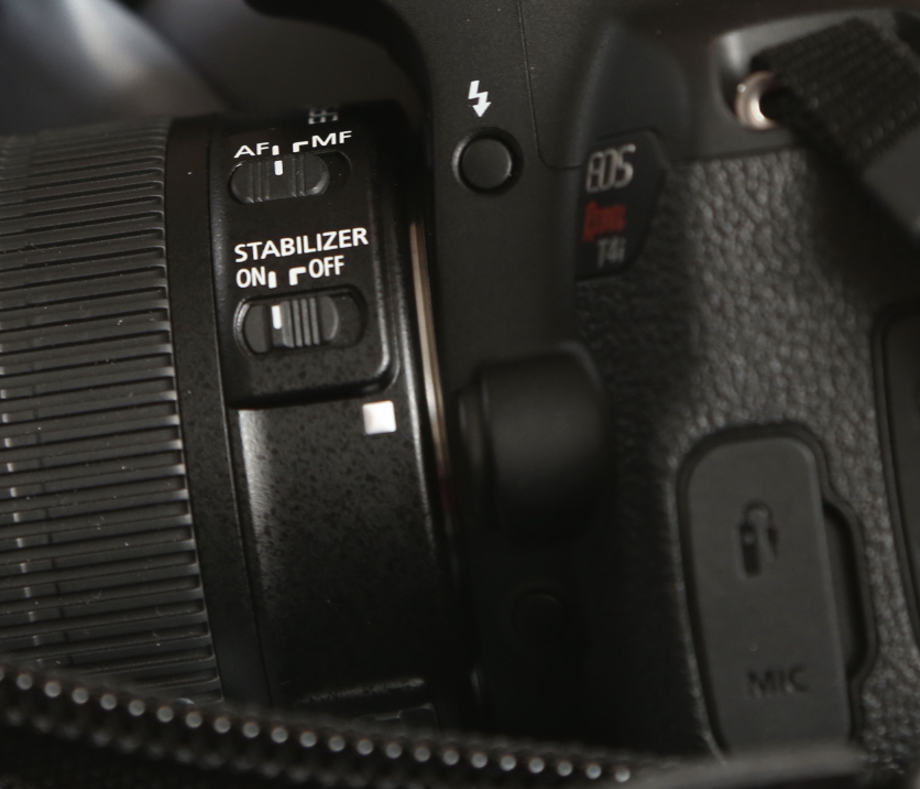
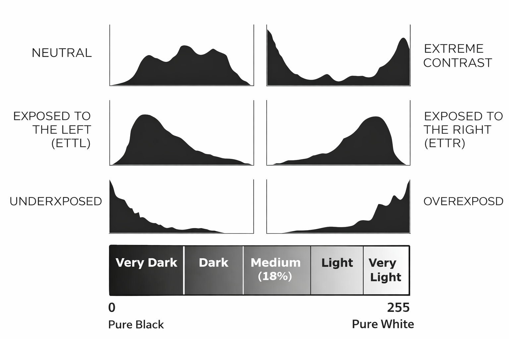

[MEDIAART 2B06](../README.md)

-------------------------------------------------------------------------------

<h1 style="color: darkred;">W4 — Tech Walkthrough</h1>
<h2 style="color: darkred;">Exposure Control While Moving</h2>

## Objective

This technical walkthrough supports the **Continuous Shot (Individual)** assignment. The goal is to help students **maintain visual consistency and preserve image information** while recording a single, uninterrupted shot across **changing lighting conditions**.  

Rather than introducing new camera settings, Week 4 focuses on **how exposure behaves over time** and how to **monitor and manage it while recording**.  

### By the end of this session, students should be able to:

- Monitor exposure **in real time** while recording a continuous shot  
- Recognize how changes in lighting affect exposure **mid-shot**  
- Use the **histogram** to identify potential loss of image information  
- Apply **exposure compensation and bracketing** as support tools when lighting conditions shift

📌 *Week 4 focuses on awareness and control — your goal is to protect image information while staying responsive to changing light.*   

---

<h2 style="color: darkred;"> Camera Settings — What to Use for Week 4 </h2>  

For **Week 4**, we will continue using the same camera settings as **Week 3**, while expanding our attention to **exposure changes over time** and how to **monitor and manage them during recording**.

---

### Camera Settings

> Check [W2 — Tech Walkthrough](TW-W2.md){:target="_blank"} and [W3 — Tech Walkthrough](TW-W3.md){:target="_blank"} for reference.  

- Set the camera to **Video Mode**
- Set the **Aspect Ratio** to **16:9**
- Set the **Resolution** to **1920 × 1080**
- Set the **Frame Rate** to **30 fps**
- Activate the **Grid**
- Set the lens to **Manual Focus (MF)**
- Continue working in **Manual Mode (M)**
  > Set Apertute, Shutter Speed, and ISO
- Set up **Custom White Balance**
  > Tip: Use a **Balance Card Set** or a **white sheet of paper**
- Use **Evaluative / Matrix Metering**.
  > This metering mode analyzes light across the **entire frame** and provides a stable reference when moving through **changing lighting conditions** (indoors → outdoors)

---

### Image Stabilization (Handheld)

- Turn **Image Stabilization ON**
- This setting is located on the **lens** (see image below)

📌 Image stabilization helps reduce unwanted shake when recording handheld, but it does **not** prevent motion blur caused by incorrect shutter speed.

  

---

### Exposure Compensation

As you move through different lighting environments, exposure can shift **rapidly and unpredictably**.  
To help manage these changes, you will work with **Exposure Compensation**, which allows you to intentionally bias exposure **brighter or darker** than what the camera’s meter suggests.

📌 *Exposure Compensation does not replace careful exposure decisions using aperture, shutter speed, and ISO.  
It is a support tool that helps you protect image information when lighting conditions change.*

Watch this short tutorial on how to **set and adjust Exposure Compensation**:

<iframe width="560" height="315" src="https://www.youtube.com/embed/2GgBW4iW60c?si=dThr-GmVbQarHAkM" title="YouTube video player" frameborder="0" allow="accelerometer; autoplay; clipboard-write; encrypted-media; gyroscope; picture-in-picture; web-share" referrerpolicy="strict-origin-when-cross-origin" allowfullscreen></iframe>

  

---

### Monitoring Exposure While Recording

- Use the **histogram** to **monitor exposure in real time**
- Watch for:
  - clipped highlights when moving into brighter areas
  - crushed shadows when moving into darker areas
- Remember: **exposure loss can happen mid-shot** and cannot be corrected later

---

<h2 style="color: darkred;"> Exposure Control & Monitoring (Advance) </h2>  

This section brings together the key concepts behind **exposure control and monitoring**, building on what you have already practiced in earlier weeks.     

The focus here is on understanding **how exposure decisions interact**, how small adjustments can have large effects, and how to **read and protect image information while recording**.      

---

### Exposure Triangle  

The **Exposure Triangle** describes the relationship between **aperture, shutter speed, and ISO**, which together determine how much light is recorded and how that light affects depth, motion, and image quality.   

     

### Watch this video for a deeper explanation of exposure:     

<iframe width="560" height="315" src="https://www.youtube.com/embed/r33iwr0nrjU?si=KSF-DVqOVioLv-s3" title="YouTube video player" frameborder="0" allow="accelerometer; autoplay; clipboard-write; encrypted-media; gyroscope; picture-in-picture; web-share" referrerpolicy="strict-origin-when-cross-origin" allowfullscreen></iframe>

   

---

### Aperture — Advanced Concept (Vocabulary & Logic)

   

> 📄 **Reference:** [Download the F-Stop Chart (PDF)](imgs/F-Stop-Chart.pdf){:target="_blank"}  

Aperture is organized in steps called **stops**.

- Each **full stop** change either:
  - **doubles** the amount of light entering the camera, or  
  - **cuts the amount of light in half**

Aperture values are written as **f-numbers**.  

### What “One Stop” Means (Conceptually)  

- **Lower f-number** → larger opening → **more light**
- **Higher f-number** → smaller opening → **less light**

Examples:
- Moving from **f/4 → f/2.8** lets in **twice as much light**
- Moving from **f/5.6 → f/8** lets in **half as much light**

Each step compounds:
- One stop wider → double the light  
- Two stops wider → four times the light  
- One stop narrower → half the light  

📌 *This is why small aperture changes can have a big impact on exposure.*   

#### Aperture and Depth of Field

Aperture also controls **depth of field**:

- Wider apertures (lower f-numbers) → **narrow / shallow depth of field**
- Narrower apertures (higher f-numbers) → **large / deep depth of field**

This means aperture decisions always involve a **trade-off** between **exposure, depth of field, and visual emphasis**.    

---

### Shutter Speed — Advanced Concept (Vocabulary & Logic)

   

> 📄 **Reference:** [Download the Shutter Speed Chart (PDF)](imgs/Shutter-Chart.pdf){:target="_blank"}  

Shutter speeds are organized in steps called **stops**.

- Each **full stop** change either:
  - **doubles** the amount of light, or  
  - **cuts the amount of light in half**

This means exposure changes **exponentially**, not gradually.  

#### What “One Stop” Means (Conceptually)

- Slower shutter speed → **more time** → **more light**
- Faster shutter speed → **less time** → **less light**

Examples:
- Moving from **1/60 → 1/30** lets in **twice as much light**
- Moving from **1/250 → 1/500** lets in **half as much light**

Each step compounds:
- One stop faster → **half as much light**
- Two stops faster → **one quarter as much light**
- Three stops faster → **one eighth as much light**

📌 *This is why exposure can change very quickly and why small adjustments matter.*  

---

### Reading the Histogram While Moving (Week 4)   

   

In **Week 4**, the histogram is no longer used only to check exposure before recording, it becomes a **live monitoring tool** as you move through changing lighting conditions.

#### The Histogram Is Dynamic

- The histogram updates **in real time** as the camera moves
- Bright or dark areas entering the frame will immediately affect its shape
- Spikes may appear or disappear as you move indoors, outdoors, or between light sources

📌 *This means exposure can change mid-shot, even if your camera settings stay the same.*

#### The Histogram Depends on the Scene

There is no single “correct” histogram shape.

- Bright scenes naturally push the histogram **to the right**
- Dark scenes naturally push the histogram **to the left**
- A histogram does **not** need to be centered to be correct

📌 *The goal is not a perfect shape — the goal is preserving image information.*

#### Highlight vs. Shadow Priority

Not all image information is lost in the same way.

- **Highlights** clip **abruptly** when overexposed
- **Shadows** lose detail more gradually, often introducing noise

For this assignment:
- Prioritize **protecting highlights**, especially when moving into brighter areas
- Use exposure adjustments to prevent the histogram from hitting the far right edge

#### Histogram as a Decision-Making Tool

Use the histogram to:
- Anticipate exposure problems before they become visible
- Decide when to adjust exposure compensation or bracketing
- Confirm that image information is still being preserved while recording

________________________________________________________________________

Credits: Jessica A. Rodríguez

**AI Disclosure**:  
AI tools (Microsoft CoPilot and ChatGPT) was used for **editing and clarity only**. AI is not used to generate original course content.
