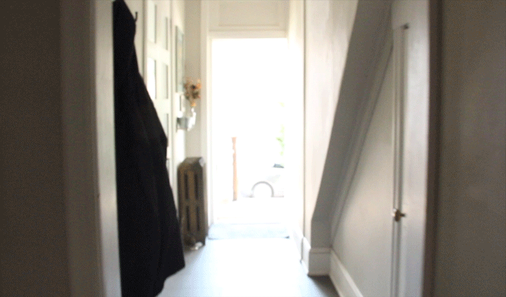
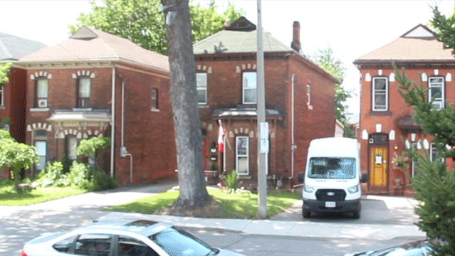
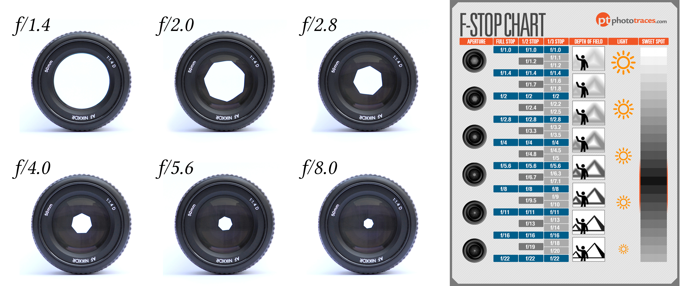
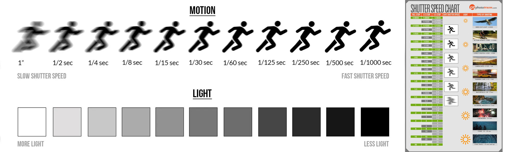

[MEDIAART 2B06](../README.md)

# W4 — Technical Walkthrough

## Exposure Control While Moving

## Goal

This technical walkthrough supports the **Continuous Shot (Individual)** project.

The central challenge for Week 4 is managing exposure while recording one continuous moving shot through **strongly contrasting lighting conditions**.

> The goal is to create a controlled and intentional transition while preserving important highlight and shadow information.

## Technical stages

Complete the following stages in order.

<!--
/////////////////
SECTION 1
/////////////////
-->

  

    1. Understand the Week 4 challenge
    
      Examine how exposure changes when a continuous shot moves between strongly contrasting lighting environments.
    
  

In Week 3, you established the exposure before recording and kept the camera settings locked throughout a static shot.

In Week 4, the camera will move through space. The amount, direction, colour, and intensity of the light may change during the recording.

The most important challenge is moving between two contrasting environments, such as:

- A darker interior and a bright exterior
- A bright exterior and a darker interior
- A shaded area and direct sunlight
- Direct sunlight and deep shade
- An interior corridor and a bright window or doorway

  <article class="media-card">
    <h2>Indoor to outdoor</h2>

    
    <ul>
      <li>The exterior may become severely overexposed.</li>
      <li>Windows and doorways may clip before you reach the exterior.</li>
      <li>The sky may lose detail.</li>
      <li>Pale walls, snow, concrete, or reflective surfaces may become completely white.</li>
      <li>Begin reducing the exposure before or while crossing the transition.</li>
    </ul>
  </article>

  <article class="media-card">
    <h2>Outdoor to indoor</h2>

    
    <ul>
      <li>The interior may become severely underexposed.</li>
      <li>The subject may become difficult to see.</li>
      <li>Shadow areas may contain limited image information.</li>
      <li>Increasing the exposure too quickly may create an abrupt and distracting change.</li>
      <li>Begin increasing the exposure as you approach or cross the entrance.</li>
    </ul>
  </article>

> Do not wait until the image is already severely overexposed or underexposed. Anticipate the lighting transition and begin adjusting before important visual information is lost.

## Exposure as part of the composition

The exposure transition is part of the visual and spatial structure of the shot.

Consider:

- When the exposure begins to change
- How quickly the adjustment occurs
- Whether the transition feels gradual or sudden
- Which part of the image should remain visible
- Whether the subject or the environment has priority
- How the lighting change supports the movement through space

<!--
/////////////////
SECTION 2
/////////////////
-->

  

    2. Advanced exposure theory
    
      Review how aperture, shutter speed, ISO, and full-stop changes interact before applying them to changing lighting conditions.
    
  

## Exposure Triangle

[Watch the Exposure Triangle tutorial](https://www.youtube.com/watch?v=r33iwr0nrjU){:target="_blank"}

## Understanding stops

A **stop** is a standard measurement used to describe changes in exposure.

A change of one full stop:

- Doubles the amount of recorded light, or
- Reduces the amount of recorded light by half

Stops allow you to compare changes in aperture, shutter speed, and ISO using the same exposure system.

For example, reducing the light by one stop with the aperture can be balanced by increasing the ISO by one stop.

> For Week 4, the shutter speed will remain fixed at <code>1/60</code>, the ISO will be set to Auto, and the aperture will be adjusted manually during the continuous shot.

## Aperture and stops

[Download the F-Stop Chart](imgs/F-Stop-Chart.pdf){:target="_blank"}

Aperture values are written as **f-numbers** and organized into stops.

- Lower f-number → larger opening → more light
- Higher f-number → smaller opening → less light

Examples:

- Moving from <code>f/4</code> to <code>f/2.8</code> allows approximately twice as much light.
- Moving from <code>f/5.6</code> to <code>f/8</code> allows approximately half as much light.

Each step compounds:

- One stop wider → twice as much light
- Two stops wider → four times as much light
- One stop narrower → half as much light
- Two stops narrower → one quarter as much light

### Aperture and depth of field

Aperture also affects how much of the scene appears acceptably sharp:

- Wider aperture and lower f-number → shallower depth of field
- Narrower aperture and higher f-number → deeper depth of field

During the Week 4 continuous shot:

- Open the aperture by moving toward a lower f-number when entering a darker environment.
- Close the aperture by moving toward a higher f-number when entering a brighter environment.

> Changing the aperture affects both exposure and depth of field. Monitor whether the subject remains in focus as the aperture changes.

## Shutter speed and stops

[Download the Shutter Speed Chart](imgs/Shutter-Chart.pdf){:target="_blank"}

Shutter speeds are also organized into stops.

- Slower shutter speed → longer exposure time → more light
- Faster shutter speed → shorter exposure time → less light

Examples:

- Moving from <code>1/60</code> to <code>1/30</code> allows approximately twice as much light.
- Moving from <code>1/250</code> to <code>1/500</code> allows approximately half as much light.

Each step compounds:

- One stop slower → twice as much light
- One stop faster → half as much light
- Two stops faster → one quarter as much light
- Three stops faster → one eighth as much light

Changing shutter speed also changes the appearance of movement and motion blur.

> Keep the shutter speed fixed at <code>1/60</code> throughout the Week 4 continuous shot. Do not use shutter speed to manage the changing exposure.

## ISO and stops

ISO values are also organized into stops.

- Higher ISO → brighter recorded image and more visible noise
- Lower ISO → darker recorded image and less visible noise

Examples:

- Moving from <code>ISO 100</code> to <code>ISO 200</code> increases the recorded brightness by one stop.
- Moving from <code>ISO 400</code> to <code>ISO 200</code> decreases the recorded brightness by one stop.

For Week 4, set the ISO to **Auto**. The camera will use ISO to respond to smaller changes in light while you manually control the aperture.

> Auto ISO supports the exposure transition, but you must still monitor the histogram and manually adjust the aperture between the darkest and brightest parts of the route.

<!--
/////////////////
SECTION 3
/////////////////
-->

  

    3. Configure the camera
    
      Prepare the camera for handheld recording and activate the tools required to monitor changing exposure.
    
  

Review the previous technical walkthroughs when necessary:

- [W1 Technical Walkthrough](TW-W1.html){:target="_blank"}
- [W2 Technical Walkthrough](TW-W2.html){:target="_blank"}
- [W3 Technical Walkthrough](TW-W3.html){:target="_blank"}

<fieldset class="equipment-checklist">
  <legend>Set the Week 4 camera controls</legend>

  <label class="checklist-item">
    <input type="checkbox">
    
      <strong>Set the camera to Video mode.</strong>
      Confirm that the camera is prepared to record video.
    
  </label>

  <label class="checklist-item">
    <input type="checkbox">
    
      <strong>Set the shooting mode to <code>M</code>.</strong>
      Manual mode allows you to control the shutter speed, aperture, and ISO while evaluating the changing light.
    
  </label>

  <label class="checklist-item">
    <input type="checkbox">
    
      <strong>Set the aspect ratio to <code>16:9</code>.</strong>
      Use the standard landscape video format.
    
  </label>

  <label class="checklist-item">
    <input type="checkbox">
    
      <strong>Set the resolution to <code>1920 × 1080</code>.</strong>
      Confirm the recording resolution before beginning.
    
  </label>

  <label class="checklist-item">
    <input type="checkbox">
    
      <strong>Set the frame rate to <code>30 fps</code>.</strong>
      Keep this setting consistent throughout the exercise.
    
  </label>

  <label class="checklist-item">
    <input type="checkbox">
    
      <strong>Activate Grid 1.</strong>
      Use the grid to support framing and horizon alignment while moving.
    
  </label>

  <label class="checklist-item">
  <input type="checkbox">
  
    <strong>Set a fixed White Balance.</strong>
    Select <strong>Daylight</strong>, <strong>Cloudy</strong>, or establish a <strong>Custom White Balance</strong> using a white or grey balance card or piece of paper. Test the selected setting in both the indoor and outdoor areas, then keep it unchanged throughout the continuous shot.
  
</label>

  <label class="checklist-item">
  <input type="checkbox">
  
    <strong>Set the lens to Auto Focus.</strong>
    Select <code>AF</code> because the distance between the camera, subject, and environment may change during the continuous shot. Set the active focus point near the centre of the frame and keep the main subject within this area while moving.
  
</label>

  <label class="checklist-item">
    <input type="checkbox">
    
      <strong>Turn Image Stabilization on.</strong>
      Activate the stabilization switch on the lens for handheld recording. Find the image stabilization switcher on the side of the lense. 
    
  </label>

  <label class="checklist-item">
    <input type="checkbox">
    
      <strong>Select Evaluative or Matrix Metering.</strong>
      Use the camera meter as a reference while moving through changing lighting conditions.
    
  </label>

  <label class="checklist-item">
    <input type="checkbox">
    
      <strong>Display the histogram.</strong>
      Press the <strong>INFO.</strong> button until the histogram appears on the camera display.
    
  </label>
</fieldset>

## Image Stabilization

Image Stabilization can reduce some unwanted handheld movement, but it does not:

- Replace controlled camera handling
- Correct unstable walking
- Prevent all camera shake
- Prevent motion blur caused by shutter speed
- Manage changing exposure

Maintain a stable posture, bend your knees slightly, keep your elbows close to your body, and move carefully.

<!--
/////////////////
SECTION 4
/////////////////
-->

  

    4. Rehearse and monitor the exposure transition
    
      Rehearse the complete route, monitor the histogram in real time, and refine the aperture adjustment before recording usable footage.
    
  

In Week 4, the histogram is not used only to check exposure before recording. It becomes a **live monitoring tool** while the camera moves through contrasting lighting conditions.

Complete at least **two full technical rehearsals** before recording usable footage. During each rehearsal, pay close attention to how the histogram changes as you move between the darkest and brightest parts of the route.

## The histogram is dynamic

The histogram updates when:

- The camera moves
- The composition changes
- A bright or dark object enters the frame
- The subject moves between different lighting conditions
- The camera crosses between indoor and outdoor environments
- The direction of the camera changes relative to the sun or another light source

Even when the shutter speed remains fixed and the ISO is set to Auto, the histogram will continue changing because the scene, available light, and aperture are changing.

## Rehearse the complete route

<fieldset class="equipment-checklist">
  <legend>Test and refine the exposure transition</legend>

  <label class="checklist-item">
    <input type="checkbox">
    
      <strong>Walk through the complete route without recording.</strong>
      Identify the darkest area, brightest area, and main point where the lighting conditions begin to change.
    
  </label>

  <label class="checklist-item">
    <input type="checkbox">
    
      <strong>Confirm the aperture for the darkest area.</strong>
      Determine the lower f-number required to allow more light into the camera.
    
  </label>

  <label class="checklist-item">
    <input type="checkbox">
    
      <strong>Confirm the aperture for the brightest area.</strong>
      Determine the higher f-number required to reduce the amount of light entering the camera.
    
  </label>

  <label class="checklist-item">
    <input type="checkbox">
    
      <strong>Begin the first recorded rehearsal.</strong>
      Follow the complete route while maintaining the planned composition and camera movement.
    
  </label>

  <label class="checklist-item">
    <input type="checkbox">
    
      <strong>Monitor the histogram continuously.</strong>
      Observe how it moves as the camera crosses between the contrasting environments.
    
  </label>

  <label class="checklist-item">
    <input type="checkbox">
    
      <strong>Identify when the exposure begins changing.</strong>
      Notice the point where the histogram starts moving toward the far-left or far-right edge.
    
  </label>

  <label class="checklist-item">
    <input type="checkbox">
    
      <strong>Practise adjusting the aperture.</strong>
      Move toward a higher f-number when entering brighter light and toward a lower f-number when entering darker light.
    
  </label>

  <label class="checklist-item">
    <input type="checkbox">
    
      <strong>Anticipate the adjustment.</strong>
      Begin changing the aperture before the image becomes severely overexposed or underexposed.
    
  </label>

  <label class="checklist-item">
    <input type="checkbox">
    
      <strong>Keep the aperture change controlled.</strong>
      Avoid repeatedly opening and closing the aperture in response to every small change in the frame.
    
  </label>

  <label class="checklist-item">
    <input type="checkbox">
    
      <strong>Review the footage at full size.</strong>
      Check the complete recording rather than relying only on the small camera display.
    
  </label>

  <label class="checklist-item">
    <input type="checkbox">
    
      <strong>Revise the timing of the aperture change.</strong>
      Determine whether the adjustment should begin earlier, later, more gradually, or more quickly.
    
  </label>

  <label class="checklist-item">
    <input type="checkbox">
    
      <strong>Complete a second rehearsal.</strong>
      Apply the revised aperture timing and monitor whether the histogram remains more controlled throughout the route.
    
  </label>
</fieldset>

## What to watch for in the histogram

<fieldset class="equipment-checklist">
  <legend>Evaluate the recorded image information</legend>

  <label class="checklist-item">
    <input type="checkbox">
    
      <strong>Watch the far-right edge.</strong>
      Information accumulating against the far-right edge may indicate clipped highlights.
    
  </label>

  <label class="checklist-item">
    <input type="checkbox">
    
      <strong>Watch the far-left edge.</strong>
      Information accumulating against the far-left edge may indicate severely underexposed shadows.
    
  </label>

  <label class="checklist-item">
    <input type="checkbox">
    
      <strong>Monitor the important parts of the frame.</strong>
      Consider whether the subject, sky, windows, shadows, or background information has visual priority.
    
  </label>

  <label class="checklist-item">
    <input type="checkbox">
    
      <strong>Observe the effect of Auto ISO.</strong>
      Notice how the camera responds automatically while you change the aperture. Confirm that the resulting brightness changes remain controlled.
    
  </label>

  <label class="checklist-item">
    <input type="checkbox">
    
      <strong>Check the depth of field.</strong>
      Changing the aperture also changes how much of the scene appears sharp. Confirm that the main subject remains appropriately focused.
    
  </label>

  <label class="checklist-item">
    <input type="checkbox">
    
      <strong>Check the stability of the camera movement.</strong>
      Confirm that operating the aperture control does not create sudden movement, framing changes, or unsafe walking.
    
  </label>
</fieldset>

> Severe highlight clipping cannot be fully recovered during editing. Strong underexposure may reveal noise, compression artefacts, and limited shadow information when brightened.

## The histogram depends on the scene

There is no single correct histogram shape.

- Bright scenes naturally distribute more information toward the right.
- Dark scenes naturally distribute more information toward the left.
- High-contrast scenes may contain information across the complete histogram.
- A histogram does not need to be centred or evenly distributed.

## Moving toward a bright exterior

- Watch the far-right edge of the histogram.
- Begin closing the aperture by moving toward a higher f-number before large areas become clipped.
- Pay attention to the sky, windows, pale walls, snow, and reflective surfaces.
- Avoid pointing the camera directly toward the sun.
- Make the aperture adjustment gradually enough that the exposure change remains controlled.

## Moving toward a dark interior

- Watch the far-left edge of the histogram.
- Begin opening the aperture by moving toward a lower f-number before the subject becomes difficult to see.
- Confirm that important shadow information remains visible.
- Open the aperture only as much as necessary.
- Make the adjustment gradually enough that the exposure change does not become distracting.

> The exposure transition should appear deliberate, controlled, and connected to the movement between the two environments.
 

---

Credits: Jessica A. Rodríguez