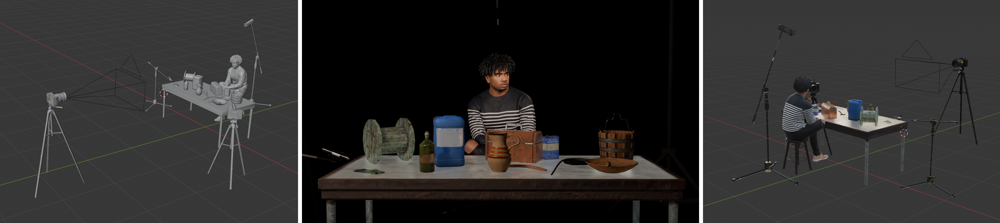
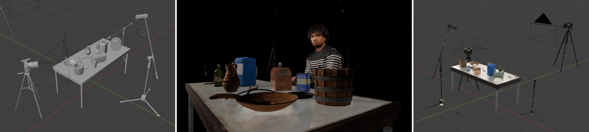
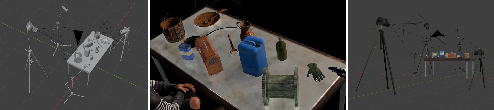
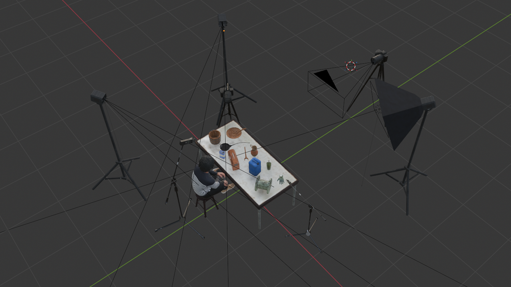
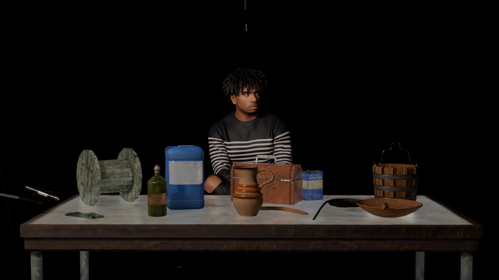
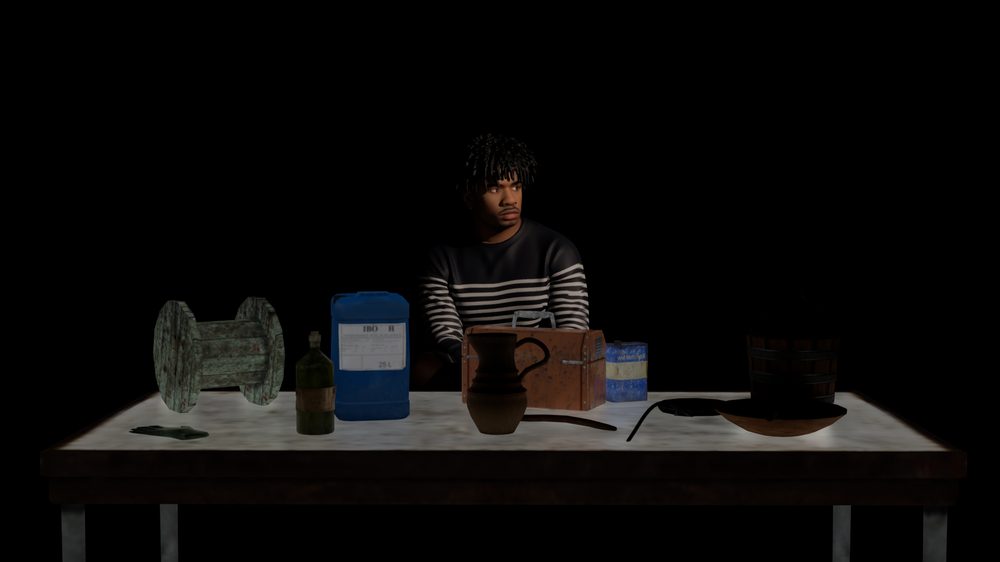
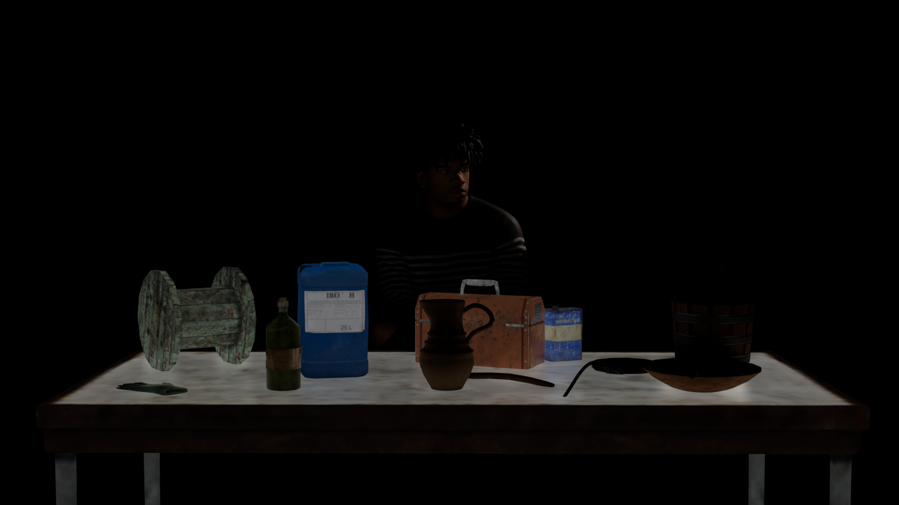

[MEDIAART 2B06](../README.md)

# W5 — Technical Walkthrough

## Live Foley · Multi-Device Recording Setup

This technical walkthrough focuses on setting up and coordinating multiple audio and video devices to record a **live Foley performance**.

> **Live Foley** is the creation of sound effects in real time by physically producing sounds that correspond with actions shown in a video.

<!--
/////////////////
SECTION 1
/////////////////
-->

  

    1. Understand the recording setup
    
      Review the equipment, recording goals, and in-class reference station before assembling the Foley setup.
    
  

For this project, your group will perform live Foley using different objects and materials to generate sound.

Possible materials and actions include:

- Fabric, paper, plastic, wood, glass, and metal
- Footsteps
- Scraping
- Tapping
- Rubbing
- Crumpling
- Subtle textures
- Louder percussive sounds

## Required equipment

The complete setup includes:

- **3 audio-recording devices**
- **3 cameras**
- **1–3 lights**
- **1 video monitor**
- **1 computer connected to the monitor**

## Video monitor

The monitor will display the video used as the live visual reference for the Foley performance.

Position the monitor:

- Outside all three camera frames
- Within clear view of every Foley performer
- At a height and angle that does not require performers to turn away from their objects
- Away from microphones when its speakers are active

Whenever possible, mute the monitor and listen to the reference video through headphones during preparation. The monitor audio should not be recorded during the final Foley performance.

## In-class reference station

During the second part of the lecture, the professor will assemble a complete Foley recording station using the required equipment.

Use this demonstration to prepare for Thursday’s production class.

<fieldset class="equipment-checklist">
  <legend>Document the reference setup</legend>

  <label class="checklist-item">
    <input type="checkbox">
    
      <strong>Observe the complete signal flow.</strong>
      Identify how each microphone, recorder, camera, monitor, and computer is connected.
    
  </label>

  <label class="checklist-item">
    <input type="checkbox">
    
      <strong>Photograph the setup.</strong>
      Take clear photographs from multiple angles so the arrangement can be recreated.
    
  </label>

  <label class="checklist-item">
    <input type="checkbox">
    
      <strong>Record the microphone positions.</strong>
      Note the direction, distance, height, and intended sound source for each microphone.
    
  </label>

  <label class="checklist-item">
    <input type="checkbox">
    
      <strong>Record the device settings.</strong>
      Note the recorder format, input selection, levels, camera settings, and White Balance.
    
  </label>

  <label class="checklist-item">
    <input type="checkbox">
    
      <strong>Observe the cable routing.</strong>
      Note how cables are organized to prevent disconnection, handling noise, and tripping hazards.
    
  </label>

  <label class="checklist-item">
    <input type="checkbox">
    
      <strong>Observe the camera and lighting positions.</strong>
      Note how the full Foley action remains visible from each camera angle.
    
  </label>

  <label class="checklist-item">
    <input type="checkbox">
    
      <strong>Ask technical questions.</strong>
      Clarify any connection, setting, or equipment choice that is not clear.
    
  </label>
</fieldset>

<!--
/////////////////
SECTION 2
/////////////////
-->

  

    2. Configure the audio-recording devices
    
      Set up the detail microphone, on-camera microphone, and ambient recorder for three complementary sound perspectives.
    
  

Review the [Audio Equipment Reference](../Audio.md){:target="_blank"} before assembling the audio system.

All audio devices must be:

- Powered on
- Correctly connected
- Set to the required recording format
- Monitored using headphones
- Tested before the final performance

The three devices serve different purposes and should capture complementary sound perspectives.

## Audio-device placement

The three recording perspectives should complement one another:

| Device | Main purpose | Recommended position |
|---|---|---|
| Sennheiser ME 80 + ZOOM H4n | Subtle and detailed sounds | Close to one specific Foley area |
| RØDE VideoMic NTG + Camera B | Directional sound synchronized with video | In front of or opposite the detail microphone |
| ZOOM H4n built-in microphones | Overall ambient soundscape | Above and centred (or on the side) over the Foley station |

> Avoid placing all three microphones in the same position. Each device should contribute a different and useful sound perspective.

## Audio Device 1 — Condenser Microphone

### Purpose

Use the **Sennheiser ME 80 condenser shotgun microphone** to capture subtle, low-volume, and detailed Foley sounds.

Examples include:

- Fabric movement
- Paper textures
- Quiet rubbing
- Small object movement
- Delicate scraping
- Subtle mechanical sounds

### Setup

1. Mount the **Sennheiser ME 80** on a microphone stand.
2. Connect it to a **ZOOM H4n** using an **XLR-to-XLR cable**.
3. Confirm whether the microphone requires phantom power.
4. Direct the microphone toward the object producing the subtle sound.
5. Position it close to the object without allowing the microphone to touch it.
6. Keep it away from louder Foley objects whenever possible.
7. Monitor the signal using headphones.
8. Begin with a low input level and adjust it after testing the loudest expected action.

> The Sennheiser ME 80 is the **detail microphone**. Its position should prioritize one specific area or group of subtle sounds rather than the entire Foley station.

## Audio Device 2 — Shutgun on Camera B

### Purpose

Use the **RØDE VideoMic NTG** to capture medium and loud Foley sounds while recording audio directly with the video from Camera B.

This recording will also provide an important synchronized reference during editing.

### Setup

1. Attach the **RØDE VideoMic NTG** to **Camera B**.
2. Connect the microphone directly to the camera’s microphone input.
3. Mount Camera B on a tripod.
4. Position Camera B on the opposite side of the Foley station from the Sennheiser ME 80.
5. Aim the microphone toward the general Foley action area.
6. Place the camera closer to the objects or actions that require stronger directional coverage.
7. Begin with a low or low-medium recording level.
8. Monitor the camera audio using headphones.
9. Confirm that the camera is receiving the external microphone signal.

> This microphone captures directional sound with an immediate visual reference. It will support synchronization and help identify individual Foley actions during editing.

## Audio Device 3 — Ambient recorder

### Purpose

Use a second **ZOOM H4n** to capture the overall soundscape of the Foley performance.

This recorder should document how the individual sounds blend within the complete performance area.

### Setup

- Mount the second ZOOM H4n on a compatible tripod or stand.
- Position it above the Foley station coming from the side or behind. 
- Use the built-in stereo microphones.
- Angle the built-in microphones downward.
- Centre it over the general action area.
- Begin with a low-medium input level.
- Monitor the signal using headphones.
- Confirm that the loudest combined Foley actions do not clip.

> The second ZOOM H4n functions as the **room or ambient recorder**. It should capture the complete Foley performance rather than one isolated object.

<!--
/////////////////
SECTION 3
/////////////////
-->

  

    3. Set the audio levels and test the recordings
    
      Configure the ZOOM H4n recorders, test the loudest Foley actions, and prevent clipping before the final take.
    
  

## Configure both ZOOM H4n recorders

For video production, use:

- **File format:** WAV
- **Sample rate:** 48 kHz
- **Bit depth:** 24-bit
- **Monitoring:** Headphones connected to each recorder

When setting the ZOOM H4n input levels:

- Begin within the approximate range of **10–50**.
- Adjust each recorder according to its microphone position and intended sound source.
- Test the complete range of Foley actions.
- Pay particular attention to the loudest action.
- Confirm that the signal does not peak or clip.
- Lower the input level when the red peak indicator appears.
- Listen for distortion, electrical interference, handling noise, and excessive room sound.

> Set the levels according to the loudest moment of the performance. Quiet sounds may be amplified during editing, but clipped audio cannot be repaired.

## Test each device separately

Before testing the complete performance:

1. Test the Sennheiser ME 80 with the subtle Foley sounds.
2. Test the RØDE VideoMic NTG with the medium and louder actions.
3. Test the ambient ZOOM H4n with all performers working together.
4. Listen to each test recording using headphones.
5. Reposition microphones or adjust levels when necessary.

## Test all sounds together

After testing each device separately:

- Perform the loudest Foley actions at the same time.
- Watch the level meters on both ZOOM recorders.
- Check the audio meters on Camera B.
- Confirm that none of the recordings clip.
- Record a short complete rehearsal.
- Play back the rehearsal from each device.
- Confirm that all intended actions are audible.

<fieldset class="equipment-checklist">
  <legend>Complete the audio test</legend>

  <label class="checklist-item">
    <input type="checkbox">
    
      <strong>Both ZOOM recorders are set to WAV 48 kHz / 24-bit.</strong>
    
  </label>

  <label class="checklist-item">
    <input type="checkbox">
    
      <strong>The correct inputs are activated.</strong>
      Confirm that the external Sennheiser microphone is selected on its recorder and the built-in microphones are selected on the ambient recorder.
    
  </label>

  <label class="checklist-item">
    <input type="checkbox">
    
      <strong>Phantom power is configured correctly.</strong>
      Activate it only when required by the connected microphone.
    
  </label>

  <label class="checklist-item">
    <input type="checkbox">
    
      <strong>Headphones are connected to both ZOOM recorders.</strong>
    
  </label>

  <label class="checklist-item">
    <input type="checkbox">
    
      <strong>The RØDE microphone is connected to Camera B.</strong>
      Confirm that the camera is receiving the external microphone signal.
    
  </label>

  <label class="checklist-item">
    <input type="checkbox">
    
      <strong>The loudest Foley actions remain below clipping.</strong>
    
  </label>

  <label class="checklist-item">
    <input type="checkbox">
    
      <strong>A test recording has been reviewed from every device.</strong>
    
  </label>
</fieldset>

## ZOOM H4n tutorial

### Set up the ZOOM H4n for film recording

  <iframe
    src="https://www.youtube.com/embed/xAFsAAVBoC0?si=Jjn7q2NYAAL8_9DA"
    title="How to set up the ZOOM H4n to record audio for film"
    frameborder="0"
    allow="accelerometer; autoplay; clipboard-write; encrypted-media; gyroscope; picture-in-picture; web-share"
    allowfullscreen
    style="position: absolute; top: 0; left: 0; width: 100%; height: 100%;">
  </iframe>

### Connect a line-level signal to the ZOOM H4n microphone input

  <iframe
    src="https://www.youtube.com/embed/6xbPfBcv-Ew?si=CqAW3IY1fbJJMNXH"
    title="How to connect a line input to the ZOOM H4n microphone input"
    frameborder="0"
    allow="accelerometer; autoplay; clipboard-write; encrypted-media; gyroscope; picture-in-picture; web-share"
    allowfullscreen
    style="position: absolute; top: 0; left: 0; width: 100%; height: 100%;">
  </iframe>

<!--
/////////////////
SECTION 4
/////////////////
-->

  

    4. Set-up cameras
    
      Position them to document the complete Foley performance.
    
  

You will use three cameras to document the live Foley performance.

The goal is to make every important object, gesture, and interaction visible.

Review the [Camera and Lens Equipment Reference](../Cameras.html){:target="_blank"} and previous [MEDIAART 2B06 technical walkthroughs](../README.html) when needed.

## General camera settings

Configure all three cameras using matching settings whenever possible.

<fieldset class="equipment-checklist">
  <legend>Configure each camera</legend>

  <label class="checklist-item">
    <input type="checkbox">
    
      <strong>Set the camera to Video Mode.</strong>
    
  </label>

  <label class="checklist-item">
    <input type="checkbox">
    
      <strong>Set the recording mode to Manual (<code>M</code>).</strong>
    
  </label>

  <label class="checklist-item">
    <input type="checkbox">
    
      <strong>Set the Aspect Ratio to <code>16:9</code>.</strong>
    
  </label>

  <label class="checklist-item">
    <input type="checkbox">
    
      <strong>Set the Resolution to <code>1920 × 1080</code>.</strong>
    
  </label>

  <label class="checklist-item">
    <input type="checkbox">
    
      <strong>Set the Frame Rate to <code>30 fps</code>.</strong>
    
  </label>

  <label class="checklist-item">
    <input type="checkbox">
    
      <strong>Set the Shutter Speed to <code>1/60</code>.</strong>
    
  </label>

  <label class="checklist-item">
    <input type="checkbox">
    
      <strong>Activate the Grid.</strong>
    
  </label>

  <label class="checklist-item">
    <input type="checkbox">
    
      <strong>Set the lens to Manual Focus (<code>MF</code>).</strong>
      Focus on the Foley action area and confirm that all required objects remain sharp.
    
  </label>

  <label class="checklist-item">
    <input type="checkbox">
    
      <strong>Turn Image Stabilization off.</strong>
      The cameras will remain fixed on tripods.
    
  </label>
</fieldset>

## Camera positions

### Camera A — Front wide shot

Camera A provides the primary documentation of the complete Foley setup.

Position and configure it as follows:

- Place the camera in front of the performers.
- Mount it securely on a tripod.
- Use the default zoom lens included with the camera.
- Select a wide framing that shows the complete working area.
- Keep all performers, objects, hand movements, and sound-producing actions visible.
- Record with the camera’s built-in microphone to provide reference audio for synchronization.

### Camera B — Side wide shot

Camera B provides a secondary perspective that reveals lateral movement and spatial relationships.

Position and configure it as follows:

- Connect the shotgun microphone directly to the camera.
- Place the camera on one side of the Foley station, opposite the condenser microphone.
- Mount it securely on a tripod.
- Use a shorter focal-length lens so the camera can remain closer to the Foley action while maintaining a wide field of view.
- Aim the camera and microphone toward the main sound-producing area.
- Keep all important objects, gestures, and sound-producing actions within the frame.

### Camera C — Back or overhead angle

Camera C documents how the Foley objects are arranged and physically manipulated.

Position and configure it as follows:

- Place the camera behind the Foley station.
- Mount it securely on a tripod.
- Raise it above the action when the available tripod permits.
- Angle the camera downward toward the working surface.
- Frame the objects, hand movements, gestures, and sound-producing actions clearly.
- Keep all important Foley actions within the frame.

> Camera C does not need to show every performer’s face. Its main purpose is to document the objects, gestures, and physical production of sound.

<!--
/////////////////
SECTION 5
/////////////////
-->

  

    Lighting setup — Three-point arrangement
    
      Position the fill, key, and back lights to illuminate the Foley station clearly, then set the aperture and ISO manually.
    
  

Begin by arranging the lights. After the lighting setup is complete, adjust the camera exposure manually.

## General lighting arrangement

  <figure class="media-card">
    
    <figcaption>
      General arrangement of the three-point lighting setup
    </figcaption>
  </figure>

  <figure class="media-card">
    
    <figcaption>
      Fill light
    </figcaption>
  </figure>

  <figure class="media-card">
    
    <figcaption>
      Key light
    </figcaption>
  </figure>

  <figure class="media-card">
    
    <figcaption>
      Back light
    </figcaption>
  </figure>

## Position the lights

<fieldset class="equipment-checklist">
  <legend>Set up the lighting</legend>

  <label class="checklist-item">
    <input type="checkbox">
    
      <strong>Position the fill light first.</strong>
      Use the soft box on the fill light and place it so it illuminates most of the Foley station. This light should provide the general base illumination for the scene.
    
  </label>

  <label class="checklist-item">
    <input type="checkbox">
    
      <strong>Position the key light.</strong>
      Aim the key light toward the performers so the people producing the Foley actions remain clearly visible.
    
  </label>

  <label class="checklist-item">
    <input type="checkbox">
    
      <strong>Position the back light.</strong>
      Add a small amount of light from behind to help separate the performers and objects from the dark background.
    
  </label>

  <label class="checklist-item">
    <input type="checkbox">
    
      <strong>Check visibility across the whole setup.</strong>
      Confirm that the objects, hands, and gestures remain visible on all cameras without harsh shadows blocking important actions.
    
  </label>
</fieldset>

## Set the camera exposure after the lights

After the lights are in place, set the camera exposure manually.

<fieldset class="equipment-checklist">
  <legend>Set the camera exposure</legend>

  <label class="checklist-item">
    <input type="checkbox">
    
      <strong>Set the shooting mode to <code>M</code>.</strong>
      Use Manual Mode so the camera does not change the exposure automatically during recording.
    
  </label>

  <label class="checklist-item">
    <input type="checkbox">
    
      <strong>Set the shutter speed first.</strong>
      Begin with <code>1/60</code> when recording at <code>30 fps</code>.
    
  </label>

  <label class="checklist-item">
    <input type="checkbox">
    
      <strong>Set the aperture manually.</strong>
      Adjust the aperture according to the amount of light and the depth of field needed to keep the Foley table and actions visible.
    
  </label>

  <label class="checklist-item">
    <input type="checkbox">
    
      <strong>Set the ISO manually.</strong>
      Do <strong>not</strong> use Auto ISO. Raise or lower the ISO only after the lights and aperture have been set.
    
  </label>

  <label class="checklist-item">
    <input type="checkbox">
    
      <strong>Record a short test and review it.</strong>
      Check the brightness, visibility of the hands and objects, and the balance between the lit table and the dark background.
    
  </label>
</fieldset>

> Keep the exposure stable after the final lighting setup. Re-adjust it only if you significantly change the light positions or intensity.

<!--
/////////////////
SECTION 6
/////////////////
-->

  

    Record and review a complete test run
    
      Record a full rehearsal using every camera and audio device, then review the framing, lighting, exposure, focus, and sound levels before the final take.
    
  

After positioning the cameras, microphones, lights, and monitor, record a **complete test run** of the Foley performance.

The test run should include the complete sequence rather than isolated technical tests. This allows the group to identify problems that may occur only when all performers, objects, cameras, microphones, and lights are working together.

## Prepare the devices

Before beginning the test run:

- Confirm that all three cameras are recording at `1920 × 1080`, `30 fps`.
- Confirm that each camera is set to Manual Mode (`M`).
- Keep the shutter speed fixed at `1/60`.
- Set the aperture and ISO manually after positioning the lights.
- Do not use Auto ISO.
- Confirm that all cameras use a fixed White Balance.
- Confirm that the three camera frames are focused.
- Confirm that both ZOOM H4n recorders are set to `WAV 48 kHz / 24-bit`.
- Connect headphones to both ZOOM recorders.
- Confirm that Camera B is receiving sound from the connected shotgun microphone.
- Confirm that Camera A is recording reference sound with its built-in microphone.
- Check that all SD cards have enough available recording space.
- Check that all devices have sufficient battery power.

## Record the test run

Start every camera and audio recorder before beginning the rehearsal.

1. Announce the group name and indicate that this is the test run.
2. Create one clear synchronization clap within view of all three cameras.
3. Start the reference video.
4. Perform the complete Foley sequence.
5. Use all objects and materials planned for the final recording.
6. Include both the quietest and loudest Foley actions.
7. Keep every device recording until the complete sequence has finished.
8. Wait several seconds before stopping the cameras and audio recorders.

> The test run should reproduce the conditions of the final recording as closely as possible.

## Check the audio recordings

Listen to the test recordings using headphones.

Check that:

- The Sennheiser ME 80 clearly captures the subtle Foley sounds.
- The shotgun microphone connected to Camera B captures the intended sound-producing area.
- The overhead ZOOM H4n captures the overall Foley performance.
- Camera A’s built-in microphone records a clear synchronization reference.
- The quiet sounds remain audible.
- The loudest sounds do not peak or clip.
- There is no distortion.
- There is no excessive handling noise.
- Cables are not creating tapping, rubbing, or movement noise.
- The monitor or computer sound is not audible in the recordings.
- The synchronization clap is clearly recorded by every device.

Adjust the microphone position or input level when necessary, then record another test.

> Set the input levels according to the loudest moment in the performance. Clipped sound cannot be repaired during editing.

## Check the camera recordings

Review the complete test from all three cameras.

Check that:

- Camera A shows the complete Foley station.
- Camera B provides a clear side perspective.
- Camera C clearly shows the objects and hand movements from behind or above.
- All important sound-producing actions remain within the frame.
- Performers do not block important objects.
- Cameras, microphones, stands, lights, and the monitor do not appear unintentionally in the frame.
- The image remains in focus throughout the performance.
- The exposure remains consistent.
- The aperture and ISO settings provide sufficient visibility without excessive image noise.
- The cameras have similar exposure and White Balance settings.

Do not use Auto ISO to correct exposure differences. Adjust the lighting, aperture, or manual ISO setting before recording another test.

## Check the lighting

Review how the lighting appears from all three camera positions.

Check that:

- The fill light illuminates most of the Foley station.
- The soft box creates broad and controlled illumination.
- The key light keeps the performers clearly visible.
- The back light creates subtle separation from the dark background.
- Hands, objects, and working surfaces remain visible.
- Important actions are not hidden by heavy shadows.
- Bright objects are not overexposed.
- Reflective objects do not create distracting glare.
- The lighting remains consistent throughout the performance.
- Light stands and cables remain outside the camera frames and active walkways.

Adjust the position or intensity of the lights before changing the camera exposure.

After changing the lighting:

1. Recheck the aperture.
2. Recheck the manual ISO.
3. Confirm the focus.
4. Record another complete test run.

## Check the performance and monitor

Confirm that:

- Every performer can see the reference monitor.
- Performers do not need to turn away from the Foley objects.
- The monitor remains outside all three camera frames.
- The performers can complete each action at the required moment.
- Objects are positioned within comfortable reach.
- Movements do not create accidental collisions or unwanted noise.
- The complete sequence can be performed without interruption.

> Record as many complete test runs as necessary. Begin the final recording only after the framing, focus, exposure, lighting, sound levels, synchronization, and performance timing have been reviewed and corrected.

---

Credits: Jessica A. Rodríguez