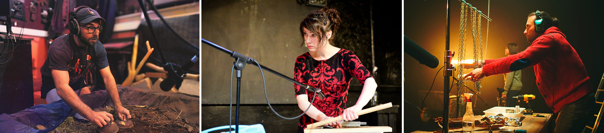
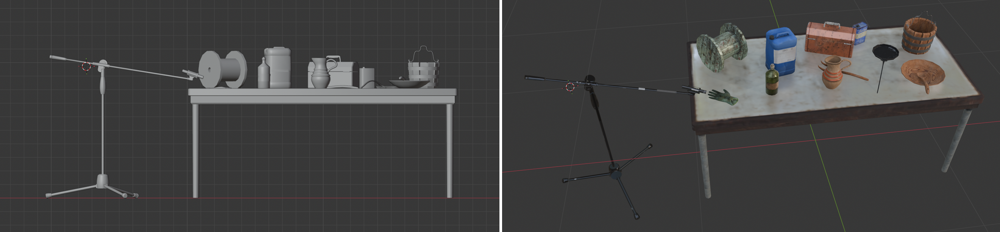
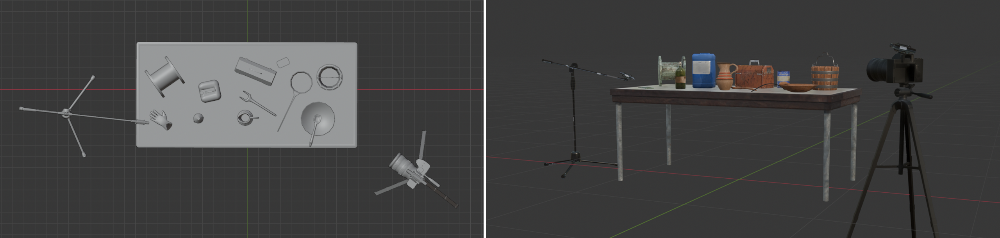
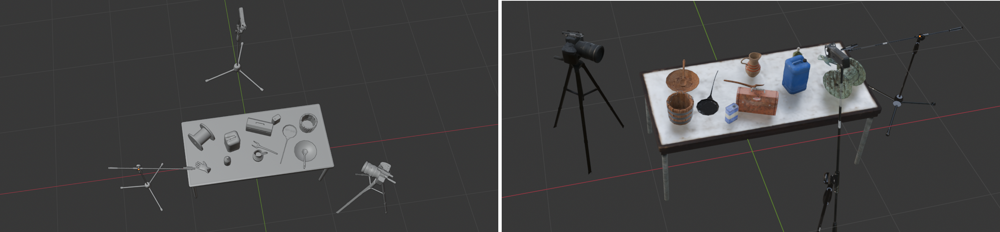
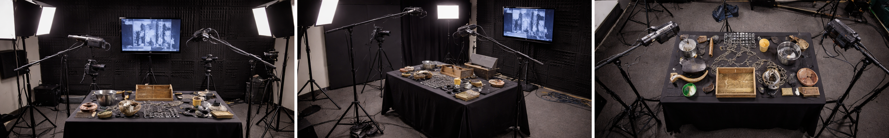

[MEDIAART 2B06](../README.md)

# W5 — Technical Walkthrough

## Live Foley · Multi-Device Recording Setup

This technical walkthrough focuses on setting up and coordinating multiple audio and video devices to record a **live Foley performance**.

> **Live Foley** is the creation of sound effects in real time by physically producing sounds that correspond with actions shown in a video.

<!--
/////////////////
SECTION 1
/////////////////
-->

  

    1. Understand the recording setup
    
      Review the equipment, recording goals, and in-class reference station before assembling the Foley setup.
    
  

For this project, your group will perform live Foley using different objects and materials to generate sound.

Possible materials and actions include:

- Fabric, paper, plastic, wood, glass, and metal
- Footsteps
- Scraping
- Tapping
- Rubbing
- Crumpling
- Subtle textures
- Louder percussive sounds

## Required equipment

The complete setup includes:

- **3 audio-recording devices**
- **3 cameras**
- **1–3 lights**
- **1 video monitor**
- **1 computer connected to the monitor**

## Video monitor

The monitor will display the video used as the live visual reference for the Foley performance.

Position the monitor:

- Outside all three camera frames
- Within clear view of every Foley performer
- At a height and angle that does not require performers to turn away from their objects
- Away from microphones when its speakers are active

Whenever possible, mute the monitor and listen to the reference video through headphones during preparation. The monitor audio should not be recorded during the final Foley performance.

## In-class reference station

During the second part of the lecture, the professor will assemble a complete Foley recording station using the required equipment.

Use this demonstration to prepare for Thursday’s production class.

<fieldset class="equipment-checklist">
  <legend>Document the reference setup</legend>

  <label class="checklist-item">
    <input type="checkbox">
    
      <strong>Observe the complete signal flow.</strong>
      Identify how each microphone, recorder, camera, monitor, and computer is connected.
    
  </label>

  <label class="checklist-item">
    <input type="checkbox">
    
      <strong>Photograph the setup.</strong>
      Take clear photographs from multiple angles so the arrangement can be recreated.
    
  </label>

  <label class="checklist-item">
    <input type="checkbox">
    
      <strong>Record the microphone positions.</strong>
      Note the direction, distance, height, and intended sound source for each microphone.
    
  </label>

  <label class="checklist-item">
    <input type="checkbox">
    
      <strong>Record the device settings.</strong>
      Note the recorder format, input selection, levels, camera settings, and White Balance.
    
  </label>

  <label class="checklist-item">
    <input type="checkbox">
    
      <strong>Observe the cable routing.</strong>
      Note how cables are organized to prevent disconnection, handling noise, and tripping hazards.
    
  </label>

  <label class="checklist-item">
    <input type="checkbox">
    
      <strong>Observe the camera and lighting positions.</strong>
      Note how the full Foley action remains visible from each camera angle.
    
  </label>

  <label class="checklist-item">
    <input type="checkbox">
    
      <strong>Ask technical questions.</strong>
      Clarify any connection, setting, or equipment choice that is not clear.
    
  </label>
</fieldset>

<!--
/////////////////
SECTION 2
/////////////////
-->

  

    2. Configure the audio-recording devices
    
      Set up the detail microphone, on-camera microphone, and ambient recorder for three complementary sound perspectives.
    
  

Review the [Audio Equipment Reference](../Audio.md){:target="_blank"} before assembling the audio system.

All audio devices must be:

- Powered on
- Correctly connected
- Set to the required recording format
- Monitored using headphones
- Tested before the final performance

The three devices serve different purposes and should capture complementary sound perspectives.

## Audio Device 1 — Condenser Microphone

### Purpose

Use the **Sennheiser ME 80 condenser shotgun microphone** to capture subtle, low-volume, and detailed Foley sounds.

Examples include:

- Fabric movement
- Paper textures
- Quiet rubbing
- Small object movement
- Delicate scraping
- Subtle mechanical sounds

### Setup

1. Mount the **Sennheiser ME 80** on a microphone stand.
2. Connect it to a **ZOOM H4n** using an **XLR-to-XLR cable**.
3. Confirm whether the microphone requires phantom power.
4. Direct the microphone toward the object producing the subtle sound.
5. Position it close to the object without allowing the microphone to touch it.
6. Keep it away from louder Foley objects whenever possible.
7. Monitor the signal using headphones.
8. Begin with a low input level and adjust it after testing the loudest expected action.

> The Sennheiser ME 80 is the **detail microphone**. Its position should prioritize one specific area or group of subtle sounds rather than the entire Foley station.

## Audio Device 2 — Shutgun on Camera B

### Purpose

Use the **RØDE VideoMic NTG** to capture medium and loud Foley sounds while recording audio directly with the video from Camera B.

This recording will also provide an important synchronized reference during editing.

### Setup

1. Attach the **RØDE VideoMic NTG** to **Camera B**.
2. Connect the microphone directly to the camera’s microphone input.
3. Mount Camera B on a tripod.
4. Position Camera B on the opposite side of the Foley station from the Sennheiser ME 80.
5. Aim the microphone toward the general Foley action area.
6. Place the camera closer to the objects or actions that require stronger directional coverage.
7. Begin with a low or low-medium recording level.
8. Monitor the camera audio using headphones.
9. Confirm that the camera is receiving the external microphone signal.

> This microphone captures directional sound with an immediate visual reference. It will support synchronization and help identify individual Foley actions during editing.

## Audio Device 3 — Ambient recorder

### Purpose

Use a second **ZOOM H4n** to capture the overall soundscape of the Foley performance.

This recorder should document how the individual sounds blend within the complete performance area.

### Setup

- Mount the second ZOOM H4n on a compatible tripod or stand.
- Position it above the Foley station coming from the side or behind. 
- Use the built-in stereo microphones.
- Angle the built-in microphones downward.
- Centre it over the general action area.
- Begin with a low-medium input level.
- Monitor the signal using headphones.
- Confirm that the loudest combined Foley actions do not clip.

> The second ZOOM H4n functions as the **room or ambient recorder**. It should capture the complete Foley performance rather than one isolated object.

## Audio-device placement

The three recording perspectives should complement one another:

| Device | Main purpose | Recommended position |
|---|---|---|
| Sennheiser ME 80 + ZOOM H4n | Subtle and detailed sounds | Close to one specific Foley area |
| RØDE VideoMic NTG + Camera A | Directional sound synchronized with video | In front of or opposite the detail microphone |
| ZOOM H4n built-in microphones | Overall ambient soundscape | Above and centred over the Foley station |

> Avoid placing all three microphones in the same position. Each device should contribute a different and useful sound perspective.

<!--
/////////////////
SECTION 3
/////////////////
-->

  

    3. Set the audio levels and test the recordings
    
      Configure the ZOOM H4n recorders, test the loudest Foley actions, and prevent clipping before the final take.
    
  

## Configure both ZOOM H4n recorders

For video production, use:

- **File format:** WAV
- **Sample rate:** 48 kHz
- **Bit depth:** 24-bit
- **Monitoring:** Headphones connected to each recorder

When setting the ZOOM H4n input levels:

- Begin within the approximate range of **10–50**.
- Adjust each recorder according to its microphone position and intended sound source.
- Test the complete range of Foley actions.
- Pay particular attention to the loudest action.
- Confirm that the signal does not peak or clip.
- Lower the input level when the red peak indicator appears.
- Listen for distortion, electrical interference, handling noise, and excessive room sound.

> Set the levels according to the loudest moment of the performance. Quiet sounds may be amplified during editing, but clipped audio cannot be repaired.

## Test each device separately

Before testing the complete performance:

1. Test the Sennheiser ME 80 with the subtle Foley sounds.
2. Test the RØDE VideoMic NTG with the medium and louder actions.
3. Test the ambient ZOOM H4n with all performers working together.
4. Listen to each test recording using headphones.
5. Reposition microphones or adjust levels when necessary.

## Test all sounds together

After testing each device separately:

- Perform the loudest Foley actions at the same time.
- Watch the level meters on both ZOOM recorders.
- Check the audio meters on Camera A.
- Confirm that none of the recordings clip.
- Record a short complete rehearsal.
- Play back the rehearsal from each device.
- Confirm that all intended actions are audible.

<fieldset class="equipment-checklist">
  <legend>Complete the audio test</legend>

  <label class="checklist-item">
    <input type="checkbox">
    
      <strong>Both ZOOM recorders are set to WAV 48 kHz / 24-bit.</strong>
    
  </label>

  <label class="checklist-item">
    <input type="checkbox">
    
      <strong>The correct inputs are activated.</strong>
      Confirm that the external Sennheiser microphone is selected on its recorder and the built-in microphones are selected on the ambient recorder.
    
  </label>

  <label class="checklist-item">
    <input type="checkbox">
    
      <strong>Phantom power is configured correctly.</strong>
      Activate it only when required by the connected microphone.
    
  </label>

  <label class="checklist-item">
    <input type="checkbox">
    
      <strong>Headphones are connected to both ZOOM recorders.</strong>
    
  </label>

  <label class="checklist-item">
    <input type="checkbox">
    
      <strong>The RØDE microphone is connected to Camera A.</strong>
      Confirm that the camera is receiving the external microphone signal.
    
  </label>

  <label class="checklist-item">
    <input type="checkbox">
    
      <strong>The loudest Foley actions remain below clipping.</strong>
    
  </label>

  <label class="checklist-item">
    <input type="checkbox">
    
      <strong>A test recording has been reviewed from every device.</strong>
    
  </label>
</fieldset>

## ZOOM H4n tutorial

### Set up the ZOOM H4n for film recording

  <iframe
    src="https://www.youtube.com/embed/xAFsAAVBoC0?si=Jjn7q2NYAAL8_9DA"
    title="How to set up the ZOOM H4n to record audio for film"
    frameborder="0"
    allow="accelerometer; autoplay; clipboard-write; encrypted-media; gyroscope; picture-in-picture; web-share"
    allowfullscreen
    style="position: absolute; top: 0; left: 0; width: 100%; height: 100%;">
  </iframe>

### Connect a line-level signal to the ZOOM H4n microphone input

  <iframe
    src="https://www.youtube.com/embed/6xbPfBcv-Ew?si=CqAW3IY1fbJJMNXH"
    title="How to connect a line input to the ZOOM H4n microphone input"
    frameborder="0"
    allow="accelerometer; autoplay; clipboard-write; encrypted-media; gyroscope; picture-in-picture; web-share"
    allowfullscreen
    style="position: absolute; top: 0; left: 0; width: 100%; height: 100%;">
  </iframe>

<!--
/////////////////
SECTION 4
/////////////////
-->

  

    4. Configure the cameras
    
      Match the settings across all three cameras and position them to document the complete Foley performance.
    
  

You will use three cameras to document the live Foley performance.

The goal is to make every important object, gesture, and interaction visible.

Use the lenses assigned to your production station.

Review the [Camera and Lens Equipment Reference](../Cameras.md){:target="_blank"} and previous [MEDIAART 2B06 technical walkthroughs](../README.md) when needed.

## General camera settings

Configure all three cameras using matching settings whenever possible.

<fieldset class="equipment-checklist">
  <legend>Configure each camera</legend>

  <label class="checklist-item">
    <input type="checkbox">
    
      <strong>Mount the camera on a tripod.</strong>
    
  </label>

  <label class="checklist-item">
    <input type="checkbox">
    
      <strong>Set the camera to Video Mode.</strong>
    
  </label>

  <label class="checklist-item">
    <input type="checkbox">
    
      <strong>Set the recording mode to Manual (<code>M</code>).</strong>
    
  </label>

  <label class="checklist-item">
    <input type="checkbox">
    
      <strong>Set the Aspect Ratio to <code>16:9</code>.</strong>
    
  </label>

  <label class="checklist-item">
    <input type="checkbox">
    
      <strong>Set the Resolution to <code>1920 × 1080</code>.</strong>
    
  </label>

  <label class="checklist-item">
    <input type="checkbox">
    
      <strong>Set the Frame Rate to <code>30 fps</code>.</strong>
    
  </label>

  <label class="checklist-item">
    <input type="checkbox">
    
      <strong>Set the Shutter Speed to <code>1/60</code>.</strong>
    
  </label>

  <label class="checklist-item">
    <input type="checkbox">
    
      <strong>Set the Aperture and ISO manually.</strong>
      Match the exposure across all three cameras as closely as possible.
    
  </label>

  <label class="checklist-item">
    <input type="checkbox">
    
      <strong>Activate the Grid.</strong>
    
  </label>

  <label class="checklist-item">
    <input type="checkbox">
    
      <strong>Set the lens to Manual Focus (<code>MF</code>).</strong>
      Focus on the Foley action area and confirm that all required objects remain sharp.
    
  </label>

  <label class="checklist-item">
    <input type="checkbox">
    
      <strong>Set a fixed White Balance.</strong>
      Use a balance card or white sheet of paper to establish a Custom White Balance.
    
  </label>

  <label class="checklist-item">
    <input type="checkbox">
    
      <strong>Select Evaluative or Matrix Metering.</strong>
    
  </label>

  <label class="checklist-item">
    <input type="checkbox">
    
      <strong>Turn Image Stabilization off.</strong>
      The cameras will remain fixed on tripods.
    
  </label>
</fieldset>

## Camera positions

### Camera A — Front wide shot

Camera A provides the primary documentation of the complete Foley setup.

Position it:

- In front of the performers
- On a tripod
- At an angle that shows the complete working area
- On the opposite side of the Sennheiser detail microphone
- Close enough for the RØDE VideoMic NTG to capture useful directional sound

The frame should show:

- Performers
- Objects
- Hands
- Gestures
- Sound-producing actions
- The spatial relationship between participants

### Camera B — Side wide shot

Camera B provides a secondary perspective that reveals lateral movement and spatial relationships.

Position it:

- On one side of the Foley station
- On a tripod
- At an angle that differs clearly from Camera A
- Outside the frame of the other cameras

The framing may explore perspective, but all important sound-producing actions must remain visible.

### Camera C — Back or overhead angle

Camera C documents how the objects are arranged and physically manipulated.

Position it:

- Behind the Foley station
- Above the action when the available tripod permits
- Angled downward
- Outside the frames of Cameras A and B

The frame should show:

- Object placement
- Hand movement
- Surface interaction
- The spatial organization of the Foley station
- How each sound is physically produced

> Camera C does not need to show every performer’s face. Its main purpose is to document the objects, gestures, and physical production of sound.

## Compare the three frames

Before recording:

- View each camera frame.
- Confirm that the cameras do not appear in one another’s compositions.
- Confirm that microphones, stands, cables, lights, and the monitor remain outside the frames.
- Check that no important Foley action is hidden.
- Confirm that the focus and exposure remain consistent.
- Record and review a short test from all three cameras.

<!--
/////////////////
SECTION 5
/////////////////
-->

  

    5. Configure the lighting and monitor
    
      Illuminate the complete Foley station and position the reference monitor without obstructing performers or cameras.
    
  

Use the **Fiilex P360 LED three-light kit**.

The lighting should make all performers, objects, surfaces, and gestures clearly visible from the three camera positions.

Review the [W2 Technical Walkthrough](TW-W2.html#2-lighting-setup-three-point-logic){:target="_blank"} for additional information about lighting placement.

## Lighting guidelines

You may use one, two, or all three lights.

Position the lights to:

- Illuminate the complete working surface
- Keep hands and objects visible
- Avoid heavy shadows that conceal Foley actions
- Reduce reflections on glossy objects
- Maintain consistent colour temperature
- Avoid shining directly into the performers’ eyes
- Keep light stands outside the camera frames
- Keep cables outside active walkways

The lights may be positioned:

- In front of the performers
- To either side
- Behind the performers for separation
- Above the working area when the stand and fixture can be positioned safely

> Lighting choices should prioritize the visibility of the objects and gestures producing sound.

## Position the video monitor

Connect the monitor to the computer containing the reference video.

Position it so that:

- Every performer has a clear view
- Performers can watch without turning away from their Foley objects
- It remains outside all three camera frames
- It does not obstruct a microphone or light
- The screen does not create distracting reflections
- Its cables do not cross active walkways

## Check the complete visual setup

<fieldset class="equipment-checklist">
  <legend>Confirm the lighting and monitor placement</legend>

  <label class="checklist-item">
    <input type="checkbox">
    
      <strong>All Foley actions are visible from every required camera angle.</strong>
    
  </label>

  <label class="checklist-item">
    <input type="checkbox">
    
      <strong>No important object is hidden by a performer, microphone, stand, or cable.</strong>
    
  </label>

  <label class="checklist-item">
    <input type="checkbox">
    
      <strong>The monitor is visible to every performer.</strong>
    
  </label>

  <label class="checklist-item">
    <input type="checkbox">
    
      <strong>The monitor remains outside all camera frames.</strong>
    
  </label>

  <label class="checklist-item">
    <input type="checkbox">
    
      <strong>Light stands and cables do not block walkways or accessibility routes.</strong>
    
  </label>

  <label class="checklist-item">
    <input type="checkbox">
    
      <strong>The White Balance and exposure remain consistent across all three cameras.</strong>
    
  </label>
</fieldset>

<!--
/////////////////
SECTION 6
/////////////////
-->

  

    6. Synchronize and record the Foley performance
    
      Start all devices, create a synchronization point, record the complete performance, and verify the files before dismantling the setup.
    
  

Because the performance is being captured by multiple independent cameras and audio recorders, you must create a clear synchronization point at the beginning of every take.

## Assign production roles

Before recording, identify who will:

- Operate each camera
- Monitor each ZOOM recorder
- Monitor Camera A’s audio
- Start the reference video
- Perform the Foley actions
- Announce the take
- Create the synchronization clap
- Watch for technical problems

## Start the devices

Begin recording in this order:

1. Start the Sennheiser ME 80 ZOOM recorder.
2. Start the ambient ZOOM recorder.
3. Start Camera A.
4. Start Camera B.
5. Start Camera C.
6. Confirm verbally that every device is recording.
7. Start the reference video only after all devices are ready.

## Create a synchronization point

At the beginning of each take:

- Announce the project or group name.
- Announce the take number.
- Perform one clear hand clap within view of all three cameras.
- Make the clap loud enough to be recorded by all three audio devices.
- Pause briefly after the clap.
- Begin the reference video and Foley performance.

The visible hand movement and sharp sound will create a shared synchronization point during editing.

## Record the performance

During the take:

- Keep all devices recording continuously.
- Do not adjust cameras unless a technical failure occurs.
- Monitor the ZOOM recorders using headphones.
- Watch for clipped audio.
- Watch for performers or equipment leaving the camera frames.
- Keep the monitor visible to all performers.
- Continue until the complete Foley sequence has finished.
- Wait several seconds before stopping the devices.

## Review the files

Before dismantling the setup:

<fieldset class="equipment-checklist">
  <legend>Verify the complete recording</legend>

  <label class="checklist-item">
    <input type="checkbox">
    
      <strong>Camera A recorded the complete take and external microphone audio.</strong>
    
  </label>

  <label class="checklist-item">
    <input type="checkbox">
    
      <strong>Camera B recorded the complete take.</strong>
    
  </label>

  <label class="checklist-item">
    <input type="checkbox">
    
      <strong>Camera C recorded the complete take.</strong>
    
  </label>

  <label class="checklist-item">
    <input type="checkbox">
    
      <strong>The Sennheiser detail recording is present and audible.</strong>
    
  </label>

  <label class="checklist-item">
    <input type="checkbox">
    
      <strong>The ambient ZOOM recording is present and audible.</strong>
    
  </label>

  <label class="checklist-item">
    <input type="checkbox">
    
      <strong>The synchronization clap is visible and audible on every recording.</strong>
    
  </label>

  <label class="checklist-item">
    <input type="checkbox">
    
      <strong>No audio recording is clipped or distorted.</strong>
    
  </label>

  <label class="checklist-item">
    <input type="checkbox">
    
      <strong>All required objects and Foley actions remain visible.</strong>
    
  </label>

  <label class="checklist-item">
    <input type="checkbox">
    
      <strong>All files have been copied and backed up before formatting any card.</strong>
    
  </label>
</fieldset>

> Do not dismantle the setup until the recordings from all three cameras and all three audio devices have been checked.

---

Credits: Jessica A. Rodríguez