[MEDIAART 2B06](../README.md)

# W7 — Pre-Production Framework

## From Concept to Production Plan

This technical walkthrough supports the [W7 — Pre-Production Package](../WeekIns/WI-W7.md){:target="_blank"} activity and submission.

<!-- 
/////////////////
SECTION 1
/////////////////
-->

<details class="tutorial-section">
  <summary>
    <span class="section-title">1. Logline</span>
    <span class="section-description">
      Summarize the central action and emotional shift of the one-minute film in a single sentence.
    </span>
  </summary>

<div class="section-content" markdown="1">

## Write a one-sentence logline

A **logline** is a single-sentence summary that communicates the central dramatic action and emotional shift of a film.

For a one-minute short, the logline should describe an event that can be shown through visible behaviour, objects, and environment. Avoid explaining a detailed backstory or introducing more events than can be filmed clearly within one minute.

## Logline structures for a one-minute short

### Character + simple action + emotional shift

**Formula:** A `[character]` performs `[a clear physical action]` in `[a specific location]`, leading to `[an emotional change]`.

> **Feature-film example:** *Rear Window*, directed by Alfred Hitchcock  
> A photographer recovering from a broken leg watches his neighbours and begins to suspect that one of them committed a murder.
>
> **Compressed to a one-minute scale:** A photographer confined to an apartment watches the neighbours through a window and slowly becomes convinced that something is wrong.

### Moment-based progression

**Formula:** As `[a character performs an ongoing action]`, `[an emotional shift occurs]`.

> **Feature-film example:** *Groundhog Day*, directed by Harold Ramis  
> A self-centred weather reporter becomes trapped in a time loop and repeatedly experiences the same day.
>
> **Compressed to a one-minute scale:** As a man repeats the same morning routine, his frustration slowly turns into desperation.

### Situation + small change

**Formula:** In `[a specific situation]`, a `[character]` experiences `[a shift]` while `[performing a visible action]`.

> **Feature-film example:** *Before Sunrise*, directed by Richard Linklater  
> Two strangers meet on a train and spend one evening together in Vienna, knowing that it may be their only night together.
>
> **Compressed to a one-minute scale:** In a train compartment, two strangers sit in silence and gradually become aware of one another through small gestures.

### Object-focused

**Formula:** A `[character]` interacts with `[an object]` in `[a location]`, revealing `[an emotional shift]`.

> **Feature-film example:** *WALL·E*, directed by Andrew Stanton  
> A waste-collecting robot meets another robot and begins a journey that changes the future of humanity.
>
> **Compressed to a one-minute scale:** A lonely robot sorting discarded objects pauses over one item, revealing an unexpected sense of attachment.

[Review additional movie logline examples on IMDb](https://www.imdb.com/list/ls533728711/){:target="_blank"}.

## Logline checklist

<fieldset class="equipment-checklist">
  <legend>Confirm the logline</legend>

  <label class="checklist-item">
    <input type="checkbox">
    <span>
      <strong>Use one complete sentence.</strong>
      Keep the description concise and focused on one central event.
    </span>
  </label>

  <label class="checklist-item">
    <input type="checkbox">
    <span>
      <strong>Identify a character, action, and location.</strong>
      Describe what the audience will be able to see rather than explaining an internal idea.
    </span>
  </label>

  <label class="checklist-item">
    <input type="checkbox">
    <span>
      <strong>Include an emotional or situational shift.</strong>
      Show how the character or situation changes during the film.
    </span>
  </label>

  <label class="checklist-item">
    <input type="checkbox">
    <span>
      <strong>Keep the scope realistic for one minute.</strong>
      Remove additional locations, characters, and events that cannot be communicated clearly.
    </span>
  </label>
</fieldset>

</div>
</details>

<!-- 
/////////////////
SECTION 2
/////////////////
-->

<details class="tutorial-section">
  <summary>
    <span class="section-title">2. Script</span>
    <span class="section-description">
      Translate the logline into clear, shootable action using scene headings, visual description, and minimal transitions.
    </span>
  </summary>

<div class="section-content" markdown="1">

## Develop a visual script

A script is a **production document** that translates the logline into clear, shootable action.

For this project, the script must communicate a complete one-minute event through behaviour and environment. Do not use dialogue. The script should contain:

1. **Sluglines or scene headings**
2. **Visual action**
3. **Transitions**, when required

<figure class="media-card">
  
  <figcaption>
    The first three scenes from the <em>WALL·E</em> screenplay, written by Andrew Stanton and Pete Docter.
  </figcaption>
</figure>

## Write sluglines or scene headings

A **slugline** identifies where and when a scene takes place. Add a new slugline whenever the location, time, or interior/exterior status changes.

**Formula:** `INT./EXT. + SPECIFIC LOCATION + TIME OF DAY`

```text
INT. CLASSROOM – NIGHT
EXT. BUS STOP – LATE AFTERNOON
INT. DORM ROOM – EARLY MORNING
```

Create a new scene only when there is:

- A change in location or space
- A change in time, such as morning to night or a later moment
- A shift from an interior to an exterior location, or the reverse

Continuous movement within the same space does **not** require a new scene.

## Describe visual action

The visual script describes what the audience can see. Include:

- Physical behaviour
- Movement
- Interaction with objects
- Spatial relationships
- Environmental details that affect the action

**Formula:** A `[character]` performs `[a specific physical action]` in `[a location]`, revealing emotion through behaviour.

> A student repeatedly taps a pencil and avoids looking at the unfinished page.

### Example: *WALL·E*

The screenplay communicates the world through short visual descriptions:

- A vast landscape of trash
- A small robot methodically stacking cubes
- Silence, dust, and mechanical movement

[Read the complete *WALL·E* screenplay on IMSDb](https://imsdb.com/scripts/Wall-E.html){:target="_blank"}.

## Use transitions selectively

A transition indicates a change between shots or scenes. Most edits do not need to be written as transitions. Use transition labels only when the type of change is important to the planned rhythm or meaning.

> In a one-minute film, transitions should remain minimal.

<div class="media-grid media-grid--three photography-examples--sixteen-nine">

  <figure class="media-card">
    
    <figcaption>
      <strong>Fade In / Fade Out:</strong> The image gradually appears from black or disappears to black.
    </figcaption>
  </figure>

  <figure class="media-card">
    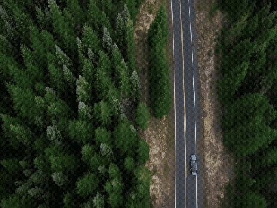
    <figcaption>
      <strong>Cut To:</strong> An immediate and neutral change from one shot or scene to another.
    </figcaption>
  </figure>

  <figure class="media-card">
    
    <figcaption>
      <strong>Dissolve:</strong> One image gradually blends into another, often suggesting elapsed time or a soft emotional change.
    </figcaption>
  </figure>

  <figure class="media-card">
    
    <figcaption>
      <strong>Hard Cut:</strong> An abrupt change that can create tension, surprise, or emphasis.
    </figcaption>
  </figure>

  <figure class="media-card">
    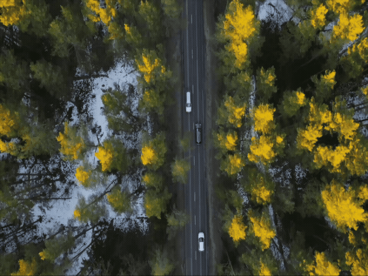
    <figcaption>
      <strong>Jump Cut:</strong> A visible jump within the same shot that compresses time or creates unease.
    </figcaption>
  </figure>

  <figure class="media-card">
    
    <figcaption>
      <strong>Match Cut:</strong> A cut connecting two shots through similar composition, movement, shape, or action.
    </figcaption>
  </figure>

</div>

## Script checklist

<fieldset class="equipment-checklist">
  <legend>Prepare the one-minute script</legend>

  <label class="checklist-item">
    <input type="checkbox">
    <span>
      <strong>Begin every scene with a complete slugline.</strong>
      Identify the interior or exterior location, the specific space, and the time of day.
    </span>
  </label>

  <label class="checklist-item">
    <input type="checkbox">
    <span>
      <strong>Describe only visible and recordable action.</strong>
      Replace explanations of thoughts or feelings with behaviour, gesture, objects, and environment.
    </span>
  </label>

  <label class="checklist-item">
    <input type="checkbox">
    <span>
      <strong>Remove dialogue.</strong>
      The story must be communicated through image, action, and sound.
    </span>
  </label>

  <label class="checklist-item">
    <input type="checkbox">
    <span>
      <strong>Keep the event achievable within one minute.</strong>
      Read the script aloud or estimate the duration of each action.
    </span>
  </label>

  <label class="checklist-item">
    <input type="checkbox">
    <span>
      <strong>Use transitions only when they affect meaning.</strong>
      Do not label every standard cut.
    </span>
  </label>
</fieldset>

</div>
</details>

<!-- 
/////////////////
SECTION 3
/////////////////
-->

<details class="tutorial-section">
  <summary>
    <span class="section-title">3. Annotated Storyboard</span>
    <span class="section-description">
      Divide the script into shots and plan the framing, angle, movement, lighting, sound, duration, and equipment for each one.
    </span>
  </summary>

<div class="section-content" markdown="1">

## Translate the script into shots

An annotated storyboard translates the script into a **visual production plan**.

A new shot begins when you change:

- The framing or shot size
- The camera angle
- The camera position
- The camera movement or visual point of view

## Include the required information

For every storyboard panel, provide:

1. **Shot number**
2. **Estimated duration**
3. **Shot type**
4. **Camera angle**
5. **Camera movement**
6. **One-sentence action description**
7. **Lighting plan**
8. **Sound plan**
9. **Equipment needed**

<figure class="media-card">
  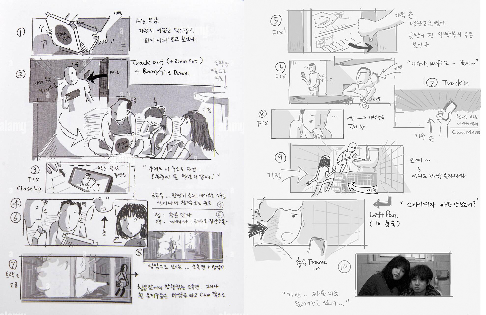
  <figcaption>
    Storyboard example from <em>Parasite</em>, directed by Bong Joon-ho.
  </figcaption>
</figure>

[Review storyboard examples from film, animation, and games](https://www.studiobinder.com/blog/storyboard-examples-film/){:target="_blank"}.

## Select shot types

Shot type describes the camera’s distance from the subject. It determines how much of the environment is visible and how close the audience feels to the action.

<div class="media-grid media-grid--three photography-examples--sixteen-nine">

  <figure class="media-card">
    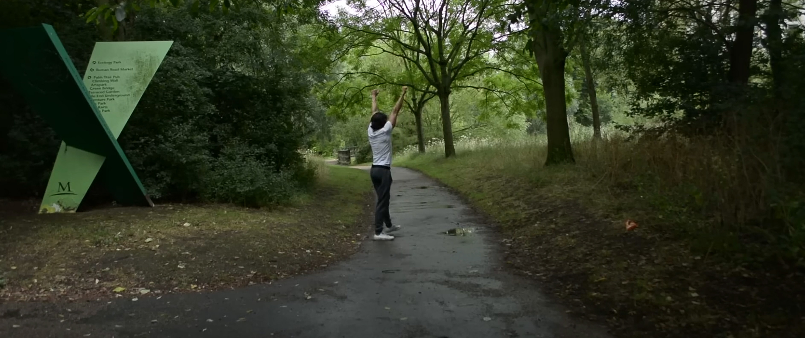
    <figcaption>
      <strong>WLS — Wide/Long Shot:</strong> Shows the subject from a significant distance and emphasizes the environment. Example: <em>The Jump</em> by Adrian León.
    </figcaption>
  </figure>

  <figure class="media-card">
    
    <figcaption>
      <strong>FS — Full Shot:</strong> Frames the complete body of the subject. Example: <em>Alone</em> by Shane P. Liao.
    </figcaption>
  </figure>

  <figure class="media-card">
    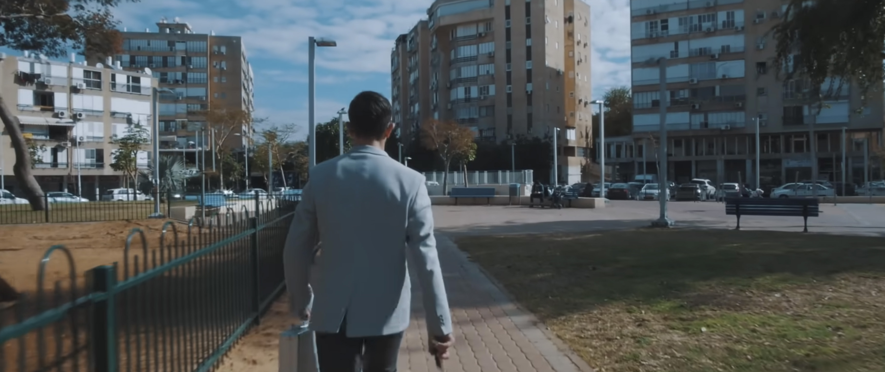
    <figcaption>
      <strong>MWS — Medium Wide Shot:</strong> Frames the subject approximately from the knees upward. Example: <em>suitcase</em> by Visuall kris.
    </figcaption>
  </figure>

  <figure class="media-card">
    
    <figcaption>
      <strong>MS — Medium Shot:</strong> Frames the subject approximately from the waist upward. Example: <em>For Milo</em> by Matthew D Gilpin.
    </figcaption>
  </figure>

  <figure class="media-card">
    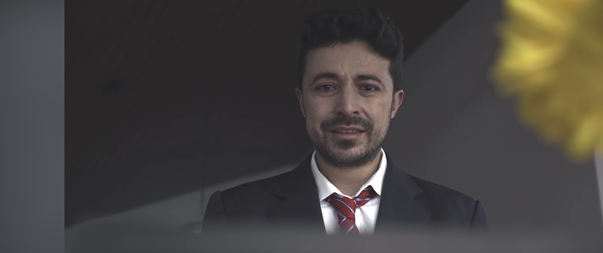
    <figcaption>
      <strong>MCU — Medium Close-Up:</strong> Frames the subject from the chest or shoulders upward. Example: <em>PAREIDOLIA</em> by Carlos Andrés Reyes.
    </figcaption>
  </figure>

  <figure class="media-card">
    
    <figcaption>
      <strong>CU — Close-Up:</strong> Allows a face, gesture, or object to fill most of the frame. Example: <em>Alone</em> by Shane P. Liao.
    </figcaption>
  </figure>

  <figure class="media-card">
    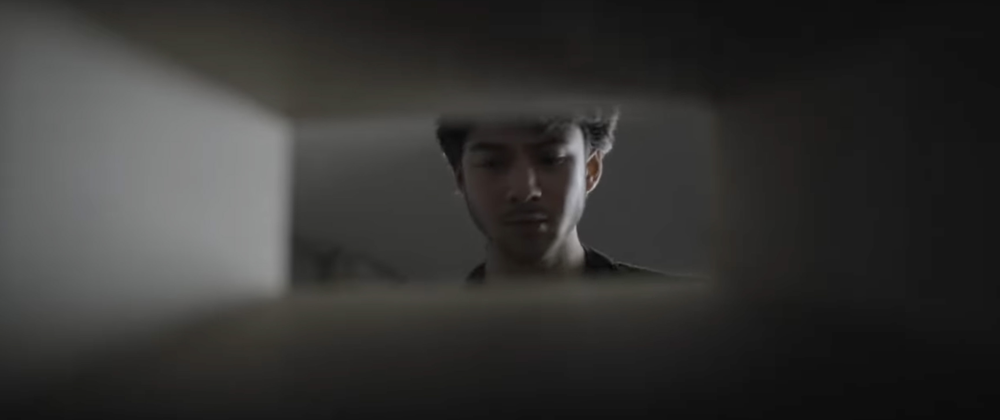
    <figcaption>
      <strong>Frame within a Frame:</strong> Uses doors, windows, mirrors, or other environmental elements to enclose the subject. Example: <em>Anonymous Gift</em> by Michael Kitka.
    </figcaption>
  </figure>

</div>

## Select camera angles

Camera angle describes the camera’s vertical and relational position to the subject. It can affect how the viewer perceives power, vulnerability, stability, and psychological tension.

<div class="media-grid media-grid--three photography-examples--sixteen-nine">

  <figure class="media-card">
    
    <figcaption>
      <strong>Eye Level:</strong> Positions the camera at the subject’s eye height and produces a familiar perspective. Example: <em>For Milo</em> by Matthew D Gilpin.
    </figcaption>
  </figure>

  <figure class="media-card">
    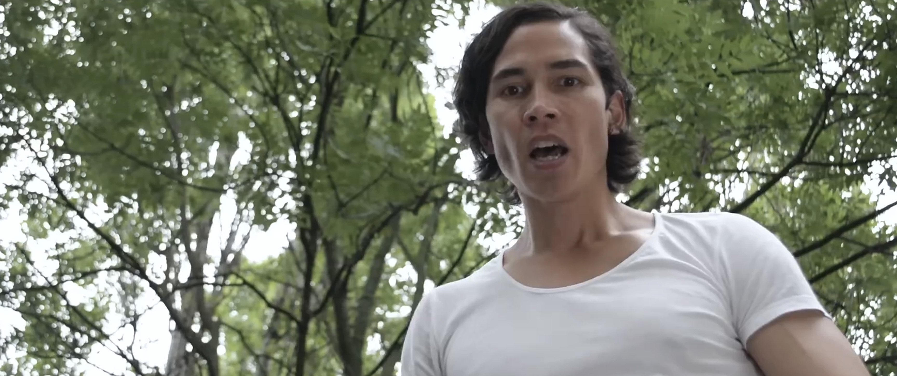
    <figcaption>
      <strong>Low Angle:</strong> Looks upward at the subject and can suggest dominance, authority, or psychological weight. Example: <em>Jump</em> by Adrian León.
    </figcaption>
  </figure>

  <figure class="media-card">
    
    <figcaption>
      <strong>Overhead / Bird’s-Eye View:</strong> Looks directly downward and can create distance, abstraction, or observation. Example: <em>Alone</em> by Shane P. Liao.
    </figcaption>
  </figure>

  <figure class="media-card">
    
    <figcaption>
      <strong>OTS — Over-the-Shoulder:</strong> Positions the camera behind a character to create a relational perspective. Example: <em>Unknown</em> by Akil Joefield.
    </figcaption>
  </figure>

  <figure class="media-card">
    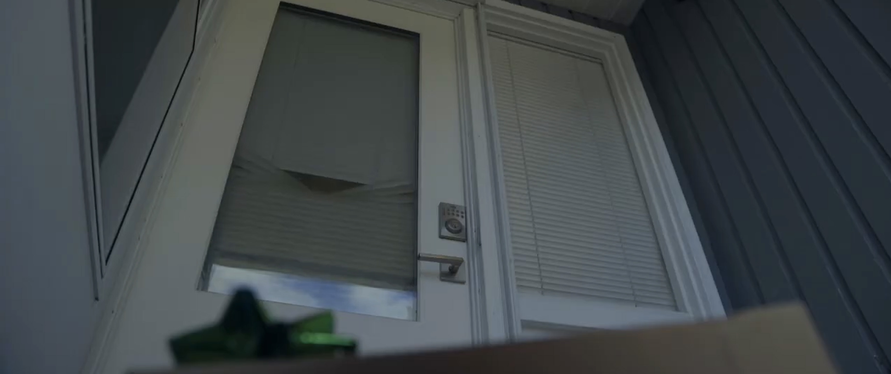
    <figcaption>
      <strong>Dutch Angle:</strong> Tilts the horizon to create instability, tension, or psychological imbalance. Example: <em>Anonymous Gift</em> by Michael Kitka.
    </figcaption>
  </figure>

  <figure class="media-card">
    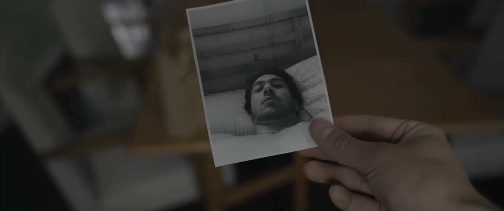
    <figcaption>
      <strong>POV — Point of View:</strong> Shows the scene from a character’s visual perspective. Example: <em>Anonymous Gift</em> by Michael Kitka.
    </figcaption>
  </figure>

</div>

## Plan camera movement

Camera movement describes whether and how the camera moves during a shot. Choose movements that are realistic for the available equipment and that support the action.

<div class="media-grid media-grid--three photography-examples--sixteen-nine">

  <figure class="media-card">
    
    <figcaption>
      <strong>Static:</strong> The camera remains still. This is the most controllable option. Example: <em>Milo</em> by Matthew D Gilpin.
    </figcaption>
  </figure>

  <figure class="media-card">
    
    <figcaption>
      <strong>Pan:</strong> The camera rotates left or right on a fixed base. Use a tripod for control. Example: <em>Kick Me</em> by Jefferies Brothers.
    </figcaption>
  </figure>

  <figure class="media-card">
    
    <figcaption>
      <strong>Tilt:</strong> The camera rotates upward or downward on a fixed base. Use a tripod for control. Example: <em>Kick Me</em> by Jefferies Brothers.
    </figcaption>
  </figure>

  <figure class="media-card">
    
    <figcaption>
      <strong>Dolly:</strong> The camera physically moves toward or away from the subject. Only three dollies are available to book. Example: <em>2 AM COFFEE</em> by Forrain.
    </figcaption>
  </figure>

  <figure class="media-card">
    
    <figcaption>
      <strong>Zoom:</strong> The lens changes focal length while the camera remains stationary. Use this movement sparingly. Example: <em>Anonymous Gift</em> by Michael Kitka.
    </figcaption>
  </figure>

  <figure class="media-card">
    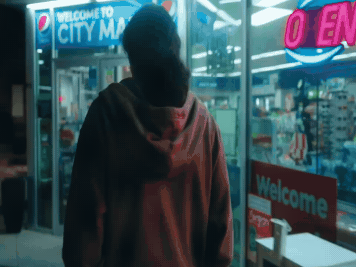
    <figcaption>
      <strong>Handheld:</strong> The camera is held by the operator, creating natural instability. Movement must remain deliberate and controlled. Example: <em>2 AM COFFEE</em> by Forrain.
    </figcaption>
  </figure>

</div>

## Write a one-sentence action description

Describe what happens in each shot using one concise, visual sentence.

**Formula:** `[Subject] + [physical action] + [relevant object or environment]`

> She repeatedly taps her pencil and avoids looking at the unfinished page.

## Develop a lighting plan

The lighting plan should identify:

- The available or planned light sources
- The direction of each source
- The relative intensity of each source
- How the light affects the subject and environment
- Any equipment required to create or control the light

> Keep the lighting plan realistic for the available equipment, location, and production schedule.

### Light sources

<div class="media-grid media-grid--three photography-examples--sixteen-nine">

  <figure class="media-card">
    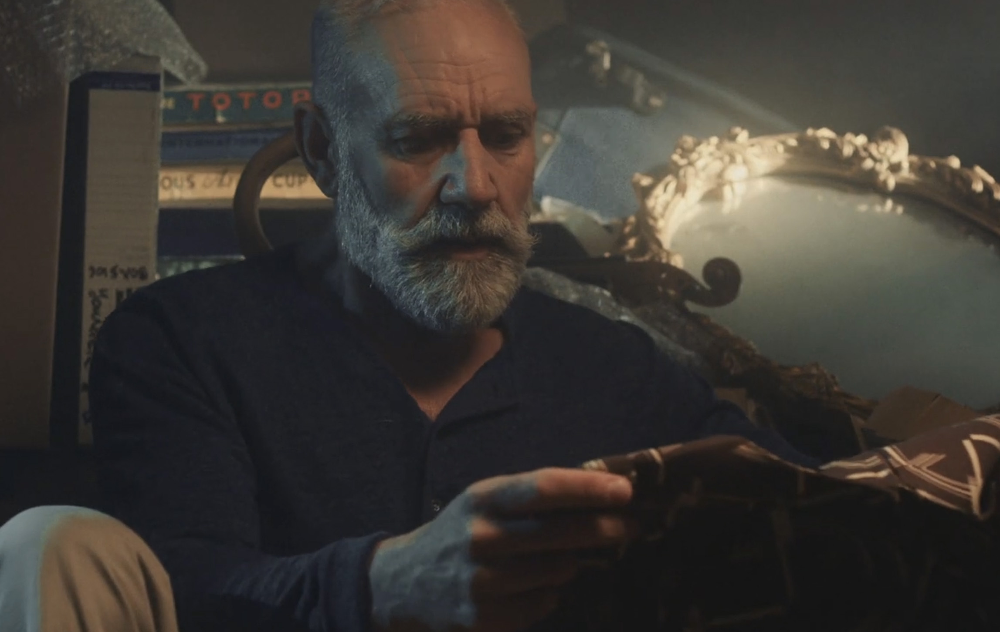
    <figcaption>
      <strong>Artificial Lighting:</strong> Light created by equipment such as LED, tungsten, or fluorescent fixtures. Example: <em>Breathe</em> by View35 Films.
    </figcaption>
  </figure>

  <figure class="media-card">
    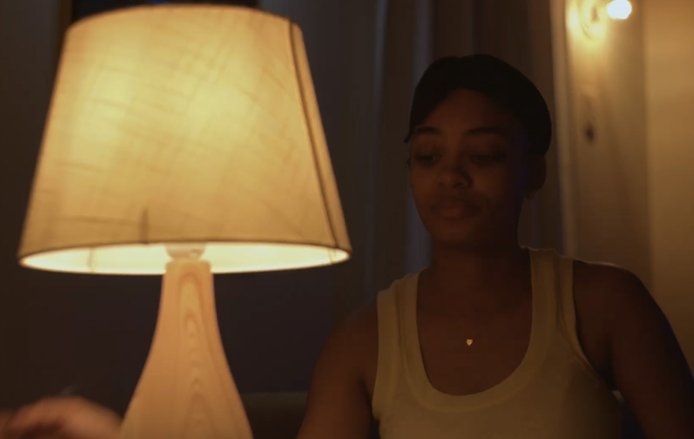
    <figcaption>
      <strong>Practical Lighting:</strong> A visible source within the frame, such as a lamp, candle, television, or streetlight, that also illuminates the scene. Example: <em>Unknown</em> by Akil Joefield.
    </figcaption>
  </figure>

  <figure class="media-card">
    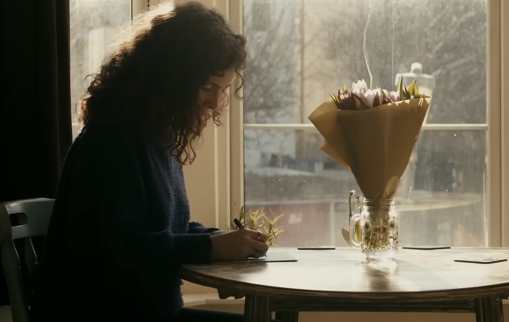
    <figcaption>
      <strong>Natural Lighting:</strong> Light from the sun, moon, or existing ambient conditions. Example: <em>For Milo</em> by Matthew D Gilpin.
    </figcaption>
  </figure>

  <figure class="media-card">
    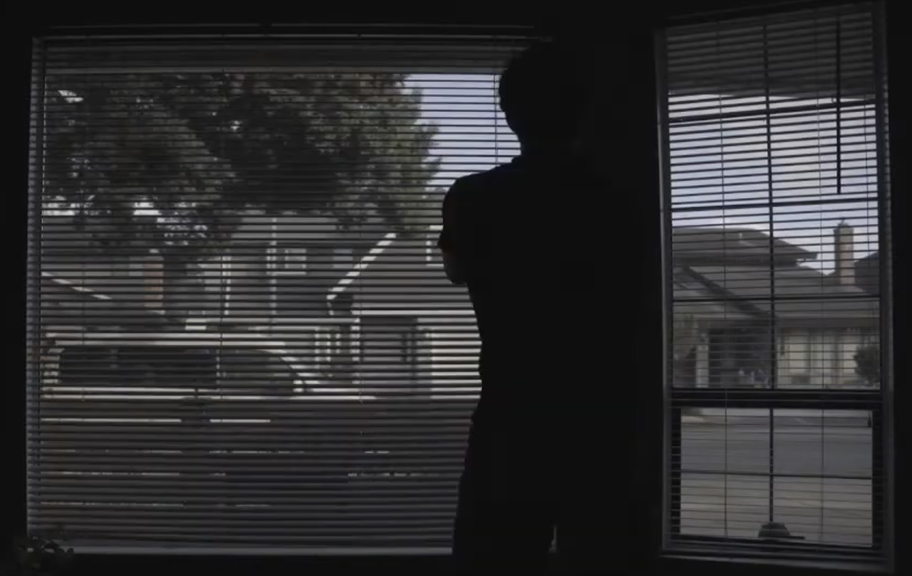
    <figcaption>
      A second natural-light example from <em>Anonymous Gift</em> by Michael Kitka.
    </figcaption>
  </figure>

</div>

### Character portrait lighting setups

[Review 24 portrait and character-lighting setups](https://medium.com/@sukeshgtambi/24-portrait-character-lighting-setups-photography-cinematography-bdd7a967407c){:target="_blank"}.

<figure class="media-card">
  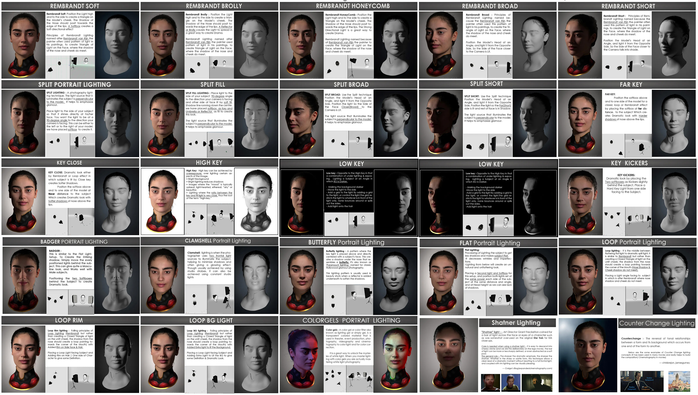
  <figcaption>
    Reference chart for planning the direction and placement of character lighting.
  </figcaption>
</figure>

## Develop a sound plan

The sound plan should identify:

- The type of sound
- Whether the source is on-screen or off-screen
- When the sound begins, changes, or ends
- How the sound relates to the visual action
- Whether the sound will be recorded during production or created during editing

<div class="media-grid media-grid--two photography-examples--sixteen-nine">

  <figure class="media-card">
    <video controls preload="metadata">
      <source src="imgs/Sound-NonDieg.mp4" type="video/mp4">
      Your browser does not support embedded video.
    </video>
    <figcaption>
      <strong>Non-diegetic Sound:</strong> Audio outside the world of the scene, including music, voiceover, and added sound design. Example: a subtle instrumental underscore gradually increases the tension in <em>suitcase</em> by Visuall kris.
    </figcaption>
  </figure>

  <figure class="media-card">
    <video controls preload="metadata">
      <source src="imgs/Sound-Dieg.mp4" type="video/mp4">
      Your browser does not support embedded video.
    </video>
    <figcaption>
      <strong>Diegetic Sound:</strong> Audio that exists within the world of the scene. It may be on-screen or off-screen. Example: rain strikes the visible window while thunder sounds from outside the frame in <em>Unknown</em> by Akil Joefield.
    </figcaption>
  </figure>

  <figure class="media-card">
    <video controls preload="metadata">
      <source src="imgs/Sound-Amb.mp4" type="video/mp4">
      Your browser does not support embedded video.
    </video>
    <figcaption>
      <strong>Ambience:</strong> Continuous background sound establishing a location, such as wind, birds, traffic, machinery, or room tone. Example: park ambience in <em>Jump</em> by Adrian León.
    </figcaption>
  </figure>

  <figure class="media-card">
    <video controls preload="metadata">
      <source src="imgs/Sound-Cue.mp4" type="video/mp4">
      Your browser does not support embedded video.
    </video>
    <figcaption>
      <strong>Specific Sound Cue:</strong> A distinct sound connected to a precise visual action or moment. Example: an on-screen cellphone vibrates and rings, interrupting the established ambience in <em>Jump</em> by Adrian León.
    </figcaption>
  </figure>

</div>

## Storyboard checklist

<fieldset class="equipment-checklist">
  <legend>Complete every storyboard panel</legend>

  <label class="checklist-item">
    <input type="checkbox">
    <span>
      <strong>Number every shot and estimate its duration.</strong>
      Confirm that the combined timing remains close to one minute.
    </span>
  </label>

  <label class="checklist-item">
    <input type="checkbox">
    <span>
      <strong>Identify the shot type, angle, and movement.</strong>
      Use specific production terms rather than general descriptions.
    </span>
  </label>

  <label class="checklist-item">
    <input type="checkbox">
    <span>
      <strong>Write one visible action sentence.</strong>
      Describe what the subject does and what appears in the frame.
    </span>
  </label>

  <label class="checklist-item">
    <input type="checkbox">
    <span>
      <strong>Provide a practical lighting plan.</strong>
      Identify the source, direction, intensity, and required equipment.
    </span>
  </label>

  <label class="checklist-item">
    <input type="checkbox">
    <span>
      <strong>Provide a precise sound plan.</strong>
      Identify diegetic, non-diegetic, ambient, and specific sounds when relevant.
    </span>
  </label>

  <label class="checklist-item">
    <input type="checkbox">
    <span>
      <strong>List the equipment required for each shot.</strong>
      Include the camera, lens, support, lighting, and sound equipment.
    </span>
  </label>
</fieldset>

</div>
</details>

<!-- 
/////////////////
SECTION 4
/////////////////
-->

<details class="tutorial-section">
  <summary>
    <span class="section-title">4. Location Scouting</span>
    <span class="section-description">
      Evaluate whether the proposed filming space is visually appropriate, accessible, controllable, and practical for production.
    </span>
  </summary>

<div class="section-content" markdown="1">

## Evaluate the production location

**Location scouting** is the process of selecting and evaluating the physical space where the film will be recorded.

It is not simply choosing a place. You must determine whether the location is:

- Visually appropriate for the story
- Available and accessible during the production period
- Realistic for the lighting plan
- Suitable for recording sound
- Large enough for the subject, camera, and equipment
- Manageable within the production schedule

Location scouting connects the **storyboard plan** to the **conditions of production**.

## Complete the location-scouting document

### 1. Location identification

Identify the exact filming location. Include:

- Interior or exterior
- Building or site name
- Room, floor, area, or precise outdoor section
- Proposed production date and time

The location must be real and accessible rather than hypothetical.

### 2. General photographs of the location

Include clear photographs showing:

- The overall layout
- The depth and dimensions of the space
- Possible camera positions
- Possible subject positions
- Windows, doors, power outlets, and existing light sources
- Obstacles, reflective surfaces, and areas that should remain outside the frame

### 3. Lighting conditions

Describe the existing lighting and whether it supports the intended visual approach. Identify:

- Natural-light sources, direction, and intensity
- Planned time of day
- Existing practical lights
- General colour temperature: daylight, tungsten, mixed, or unknown
- Access to power
- Limitations such as low light, mixed sources, or changing sunlight

### 4. Sound environment

Evaluate whether clean production sound is possible. Identify:

- General noise level
- Foot traffic and public activity
- Heating, ventilation, air conditioning, appliances, or machinery
- Street noise, construction, wind, or weather
- Echo, reverberation, and other acoustic conditions
- Times when the location is quieter or noisier

### 5. Accessibility and control

Confirm whether the production can be completed safely and legally. Identify:

- Whether permission is required or has been obtained
- When the space is available
- Whether doors, windows, lights, and sound sources can be controlled
- Whether pathways and accessibility routes will remain clear
- Whether the production can avoid disrupting classes, offices, or public activity

## Location-scouting checklist

<fieldset class="equipment-checklist">
  <legend>Confirm the location</legend>

  <label class="checklist-item">
    <input type="checkbox">
    <span>
      <strong>Identify the exact place and production time.</strong>
      Avoid general descriptions such as “a classroom” or “outside.”
    </span>
  </label>

  <label class="checklist-item">
    <input type="checkbox">
    <span>
      <strong>Photograph the complete space.</strong>
      Show enough information to plan the subject, camera, lights, sound equipment, and crew positions.
    </span>
  </label>

  <label class="checklist-item">
    <input type="checkbox">
    <span>
      <strong>Test the lighting conditions.</strong>
      Visit at the planned production time whenever possible.
    </span>
  </label>

  <label class="checklist-item">
    <input type="checkbox">
    <span>
      <strong>Listen to and document the sound environment.</strong>
      Identify continuous noise and unpredictable interruptions.
    </span>
  </label>

  <label class="checklist-item">
    <input type="checkbox">
    <span>
      <strong>Confirm access and permission.</strong>
      Make sure the group can use the space for the required amount of time.
    </span>
  </label>

  <label class="checklist-item">
    <input type="checkbox">
    <span>
      <strong>Confirm that the storyboard is achievable in the location.</strong>
      Revise planned shots that cannot be completed safely or practically.
    </span>
  </label>
</fieldset>

</div>
</details>

---

Credits: Jessica A. Rodríguez