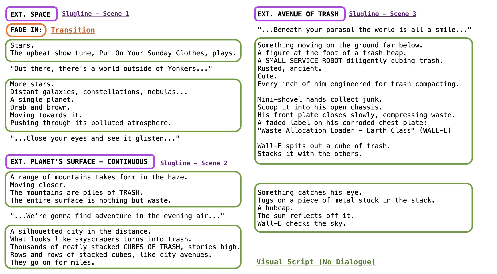
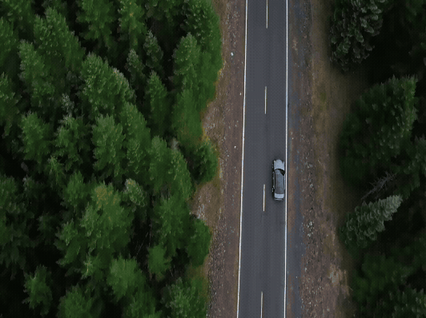
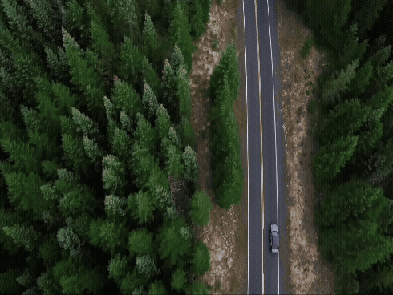
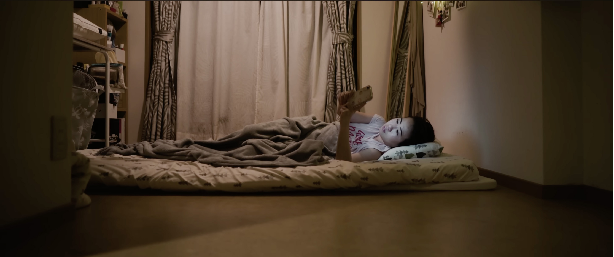
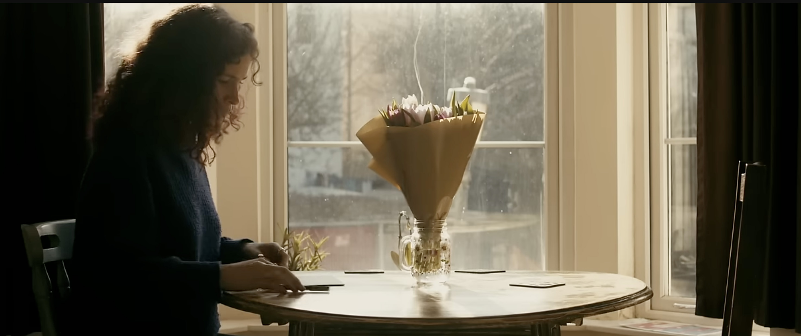
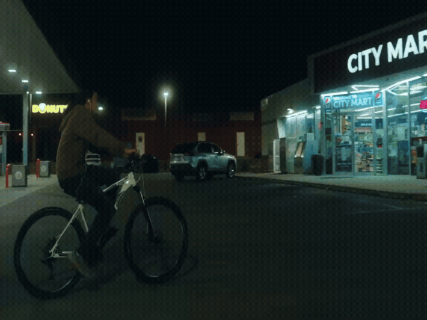
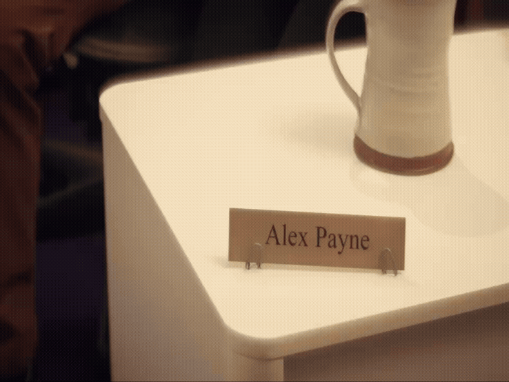
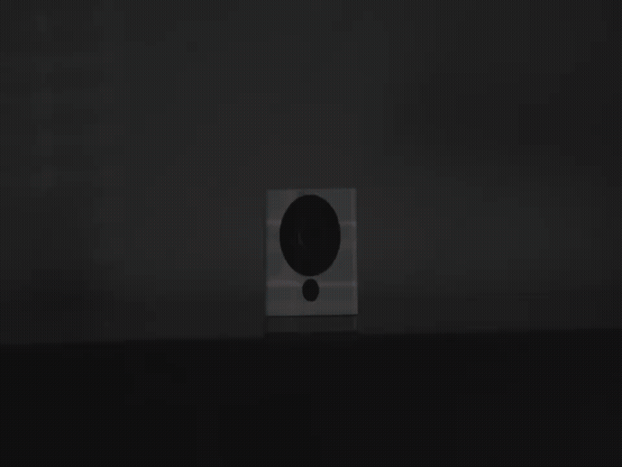

[MEDIAART 2B06](../README.md)

-------------------------------------------------------------------------------

<h1 style="color: darkred;">W7 — Pre-Production Framework</h1>
<h2 style="color: darkred;">From Concept to Production Plan</h2>

This document guides you from concept to executable production plan supporting the [W7 - Pre-Production Package](../WeekIns/WI-W7.md){:target="_blank"}  Activities & Submission.    

## Sections

<ul>
  <li><a href="#logline">Logline</a></li>
  <li><a href="#script">Script</a></li>
  <li><a href="#storyboard">Annotated Storyboard</a></li>
  <li><a href="#location-scouting">Location Scouting</a></li>
</ul>  

---

<h2 id="logline" style="color: darkred;"> Logline </h2>  

A **logline** is a single-sentence summary that **captures the core dramatic action and emotional shift** of the film in the most concise way possible.  

### Logline Formulas for a 1-Minute Short

**Character + Simple Action + Emotional Shift**   
- A [character] [performs a clear physical action] in [specific location], leading to [emotional change].
  
  > e.g. [*Rear Window*, Director: Alfred Hitchcock]
  > *A bored photographer recovering from a broken leg passes the time by watching his neighbors and begins to suspect one of them of murder*.  
  > **Compressed to 1-minute scale:** A photographer confined to his apartment watches his neighbors through a window and slowly becomes convinced something is wrong.  

**Moment-Based Progression**  
- As [character performs ongoing action], [emotional shift occurs].  
  
  > e.g. [*Groundhog Day*, Director:  Harold Ramis]
  > *A narcissistic, self-centered and frustrated weatherman finds himself caught in a time warp loop on Groundhog Day, where he wakes up every morning having to face the same day again and again*.  
  > **Compressed to 1-minute scale:** As a man relives the same morning routine again, his frustration slowly turns into desperation.  

**Situation + Small Change**  
- In [specific situation], a [character] experiences [shift] while [visible action].  
  
  > e.g. [*Before Sunrise*, Director:  Richard Linklater]
  > *A young man and woman meet on a train in Europe, and wind up spending one evening together in Vienna. Unfortunately, both know that this will probably be their only night together*.  
  > **Compressed to 1-minute scale:** In a train compartment, two strangers sit in silence, gradually becoming aware of one another through small gestures.  

**Object-Focused**  
- A [character] interacts with [object] in [location], revealing [emotional shift].  
  
  > e.g. [*WALL·E*, Director:  Andrew Stanton]
  > *A robot who is responsible for cleaning a waste-covered Earth meets another robot and falls in love with her. Together, they set out on a journey that will alter the fate of mankind*.  
  > **Compressed to 1-minute scale:** A lonely robot sorting through discarded objects pauses over one item, revealing an unexpected sense of attachment.    

🔗 [Movie Logline Examples for Screenwriters (IMDb)](https://www.imdb.com/list/ls533728711/){:target="_blank"}     

---

<h2 id="script" style="color: darkred;"> Script </h2>   

A script is a **production document** that translates your logline into clear, shootable action.   

For this project, your script must communicate a complete one-minute visual event using only behavior and environment with the followin structure:  
1. **Slugline** or **Scene Heading**
2. **Visual Script**
3. **Transitions**

>      
> e.g. *WALL·E*, Script written by Andrew Stanton & Pete Docter (first three scenes) 

---

### **Slugline** or Scene Heading  

Each change in space is marked with a new slugline.  

Slugline Formula:  
**INT./EXT. + Specific Location + Time of Day**  
> INT. CLASSROOM – NIGHT
> EXT. BUS STOP – LATE AFTERNOON  
> INT. DORM ROOM – EARLY MORNING  

A new scene is required only if there is:  
- A change in location/space    
- A change in time (morning → night, “later”)    
- A shift from INT. to EXT.  
  
Continuous movement within the same space **does not** create a new scene.  

---

### **Transitions**  

A transition indicates movement between scenes or the ending of a sequence.  
> In a one-minute film, transitions should be minimal.

#### Common Transitions:   

  <!-- LEFT COLUMN -->
  

    <h4>Fade In / Fade Out</h4>
    
The image gradually appears from black (FADE IN) or disappears to black (FADE OUT). Often used at the beginning or end of a film, or to signal closure

    

    <h4>Cut To</h4>
    
An immediate change from one shot or scene to another. This is the most common and neutral transition.

    

    <h4>Dissolve (Cross-Dissolve)</h4>
    
One image gradually blends into another. Often used to suggest the passage of time or a soft emotional shift.

    

  

  <!-- RIGHT COLUMN -->
  

    <h4>Hard Cut</h4>
    
An abrupt, sharp cut with no visual or sound smoothing. Can create tension, surprise, or emphasis

    

    <h4>Jump Cut</h4>
    
A cut within the same shot that creates a visible “jump” in time. Often used to compress time or create unease.

    

    <h4>Match Cut</h4>
    
A cut that connects two shots through similar composition, movement, or action. Creates visual continuity or symbolic connection between moments.

    

  

   

---

### **Visual Script (Action Only)**  

This is the body of your screenplay, describing:
- Physical behavior  
- Movement  
- Interaction with objects  
- Spatial relationships  
- Environmental details that affect action  

Visual Script Formula:  
**Character + Clear Physical Action + Environmental Context**
> A [character] performs [specific physical action] in [location], revealing emotion through behavior.  

#### Example: *WALL·E* - Script written by Andrew Stanton & Pete Docter

The early script describes action like this:  
- *A vast landscape of trash.*  
- *A small robot methodically stacking cubes.*  
- *Silence, dust, mechanical movement.*  
🔗 [WALL·E – Full Script (IMSDB)](https://imsdb.com/scripts/Wall-E.html){:target="_blank"}    

---

<h2 id="storyboard" style="color: darkred;"> Annotated Storyboard </h2>   

An annotated storyboard translates your script into a **visual production plan**.   
  
A storyboard is divided into shots. A new shot occurs when:  
- You change framing  
- You change camera angle  
- You change camera position

### Structure

1. **Shot #**
2. **Estimated Duration**
3. **Shot Type**
4. **Camera Angle**
5. **Camera Movement**
6. **One-Sentence Action Description**
7. **Lighting Plan**
8. **Sound Plan**
9. **Equipment Needed**

### Example: *Parasite* - Directed by Bong Joon-ho

>     

🔗 [46 Storyboard Examples from Movies, Animation, and Games](https://www.studiobinder.com/blog/storyboard-examples-film/){:target="_blank"}  

---  

#### Shot Types   

Shot types indicate the **camera’s distance** from the subject, shaping how much of the environment is visible and **how emotionally close the viewer feels** to the action.

  <!-- LEFT COLUMN -->
  

    <h4>WLS - Wide/Long Shot</h4>
    
<strong>Captures a subject from a significant distance</strong>
     e.g. <em>The Jump</em> by Adrian León

    
    
    <h4>FS - Full Shot</h4>
    
<strong>Subject fully framed</strong>
     e.g. <em>Alone</em> by Shane P. Liao

    

    <h4>MWS - Medium Wide Shot</h4>
    
<strong>Knees up</strong>
     e.g. <em>suitcase</em> by Visuall kris

    

    <h4>Frame within a frame</h4>
    
<strong>Use environmental elements (doorways, windows, etc.) to enclose a subject within the main camera frame</strong>
     e.g. <em>Anonymous Gift</em> by Michael Kitka

     <em>Frame withing a frame: CU through a narrow opening to create surveillance tension and restricted perspective.</em>

    

  

  <!-- RIGHT COLUMN -->
  

    <h4>MS - Medium Shot</h4>
    
<strong>Waist up</strong>
     e.g. <em>For Milo</em> by Matthew D Gilpin

    
    
    <h4>MCU - Medium Close-Up</h4>
    
<strong>Chest/shoulders up</strong>
     e.g. <em>PAREIDOLIA</em> by Carlos Andrés Reyes

    
    
    <h4>CU - Close Up</h4>
    
<strong>Face or object fills frame</strong>
     e.g. <em>Alone</em> by Shane P. Liao

    

  

  

---  

#### Camera Angles   

Camera angles indicate the **camera’s vertical relationship** to the subject, shaping **how the viewer perceives power, vulnerability, balance, and psychological tension** within the frame.

  <!-- LEFT COLUMN -->
  

    <h4>Eye-Level</h4>
    
<strong>The camera is positioned at the subject’s eye height - realistic perspective that mimics human vision.</strong>
     e.g. <em>For Milo</em> by Matthew D Gilpin
 
    

    <h4>Low Angle</h4>
    
<strong>The camera looks up at the subject - suggest dominance, power, authority, or psychological weight.</strong>
     e.g. <em>Jump</em> by Adrian León
 
    

    <h4>Overhead / Bird’s-Eye View</h4>
    
<strong>The camera looks directly down from above - creates distance, abstraction, or a sense of observation.</strong>
     e.g. <em>Alone</em> by Shane P. Liao
 
    

  

  <!-- RIGHT COLUMN -->
  

    <h4>OTS - Over-the-Shoulder</h4>
    
<strong>Shot from behind one character toward another character/object</strong>
     e.g. <em>Unknown</em> by Akil Joefield
 
      
    
    <h4>Dutch Angle (Tilted Frame)</h4>
    
<strong>Camera is tilted, causing the horizon line to be slanted rather than parallel to the frame's bottom</strong>
     e.g. <em>Anonymous Gift</em> by Michael Kitka
 
    

    <h4>POV - Point of View</h4>
    
<strong>Shows exactly what a character is looking at, directly from their perspective</strong>
     e.g. <em>Anonymous Gift</em> by Michael Kitka
 
     

  

  

---  

#### Camera Movements

Camera movements indicate **if and how the camera moves during the shot**. You must:  
- indicate movement visually using arrows or directional lines.
- indicate movement in writing using proper terminology.

Movement must be realistic for your equipment. Options:   

  <!-- LEFT COLUMN -->
  

    <h4>Static</h4>
    
<em>Camera remains still.
     Most realistic and most controllable. Strongly recommended.</em>

    

    <h4>Pan</h4>
    
<em>Camera rotates left or right on a fixed base.
     Realistic if on a tripod. Simple and effective.</em>

    

    <h4>Tilt</h4>
    
<em>Camera moves up or down vertically on a fixed base.
     Realistic if on a tripod. Keep it slow and intentional.</em>

    

  

  <!-- RIGHT COLUMN -->
  

    <h4>Handheld</h4>
    
<em>Camera is held by hand, creating natural instability.
     Realistic, but must be controlled. Should be motivated, not accidental.</em>

    

    <h4>Zoom</h4>
    
<em>Lens changes focal length without moving the camera.
     Technically easy if using kit lenses, but often looks amateur if overused. Use sparingly.</em>

    

    <h4>Dolly</h4>
    
<em>Camera moves forward or backward toward/away from subject.
     ⚠️ There are only three dollies available in the department, and they must be booked in advance. Plan accordingly.</em>

    

  

  

---  

#### One-Sentence Action Description

One clear sentence describing what happens in the shot. It should be concise and visual.    

Action Formula:   
**Subject + Physical Action + Relevant Object/Environment**  
> e.g. *She taps her pencil repeatedly and avoids eye contact with the paper.*   

---  

#### Lighting Plan  

Lighting should match your script’s mood.   
> e.g. *Single desk lamp creating isolated pool of light.*

Be realistic with available equipment. Options:  

  <!-- LEFT COLUMN -->
  

    <h4>Three-Point Lighting</h4>
    
<em>Key Light + Fill Light + Backlight
     Best for interior narrative scenes, interviews, and lean, neutral compositions.</em>

    

    <h4>Two-Point Lighting</h4>
    
<em>Key Light + Fill or Key Light + Backlight
     Best for dramatic scenes.</em>

    

    <h4>Single-Key Lighting</h4>
    
<em>One dominant light source.
     Best for intimate scenes, focused emotional moments, minimalist aesthetic</em>

    

    <h4>High-Key Lighting</h4>
    
<em>Even illumination, low contrast.
     Best for neutral tone and calm mood</em>

    

  

  <!-- RIGHT COLUMN -->
  

    <h4>Low-Key Lighting</h4>
    
<em>Strong key light with minimal fill
     Best for tension, isolation, and dramatic mood</em>

    

    <h4>Motivated Lighting</h4>
    
<em>Light appears to come from a visible source (lamp, window, screen)
     Best for narrative scenes, emotional subtlety, and interior environments</em>

    

    <h4>Window Lighting (Natural + Fill)</h4>
    
<em>Daylight as key + reflector or LED for fill
     Best for daytime interiors</em>

    

    <h4>Silhouette Lighting</h4>
    
<em>Strong backlight + minimal/no front light
     Best for symbolic moments, isolation, and visual abstraction</em>

    

  

  

---  

#### Sound Plan  

Indicate:  
- Diegetic sound (within the world)
- Non-diegetic sound (music, sound design)
- Ambient tone
- Specific sound cues / foley

Example:
> * Ambient room tone + distant hallway footsteps.*

Sound should reinforce the emotional arc.   

---

<h2 id="location-scouting" style="color: darkred;"> Location Scouting </h2>   

**Location scouting** is the process of selecting and evaluating the physical space where your film will be shot.  

It is not simply “choosing a place.” It involves assessing whether a location is:  
- Visually appropriate for your story  
- Practically accessible  
- Realistic for lighting  
- Suitable for recording sound  
- Logistically manageable within your schedule  

Location scouting bridges your **storyboard** and your **production reality**.   

---

## Location Scouting Structure  

The following sections reflect what you are required to complete in the **Location Scouting Template**. These categories are also aligned with how location documents function in professional productions.

### 1. Location Identification  

This section clearly defines the space and confirms it is realistically available.

You must identify:

- Indoor or Outdoor  
- Building name  
- Specific space (room / area / floor)  

This ensures the location is precise and shootable.

> In professional productions, this section also includes full addresses, access instructions, contact information, permits, and logistical notes (loading access, parking, security, etc.).

---

### 2. General Photo of Location  

You must include one wide photo of the space you plan to use.

The photo should:
- Show the full layout  
- Indicate depth and usable framing space  
- Reveal existing light sources  

This image functions as a production reference.

> In professional location scouting documents, photos also identify potential camera positions, lighting placement areas, sound setup zones, ceiling height, and spatial limitations.

---

### 3. Lighting Conditions  

This section evaluates whether the space supports your intended visual outcome.

You must assess:

- Natural light source (direction / intensity)  
- Planned time of day  
- Existing practical lights (lamps / overhead / fluorescent)  
- Color temperature (daylight / tungsten / mixed / unknown)  
- Limitations (low light, mixed lighting, no outlets, etc.)  

Your lighting assessment should directly connect to your storyboard lighting plan.

---

### 4. Sound Environment  

This section evaluates whether clean production sound is realistically achievable.

You must assess:

- General sound level (quiet / moderate / loud)  
- Foot traffic / public activity  
- Mechanical noise (appliances, HVAC, electronics)  
- External noise (street, wind, campus activity)  

If sound conditions are difficult, you must adjust your plan accordingly.

---

### 5. Accessibility & Control  

This confirms whether you can realistically execute your production in the space.

You must indicate:

- Do you have permission to film here?  
- Can you control lighting?  
- Can you control sound?  

> In professional productions, this section may also include safety concerns, scheduling restrictions, insurance requirements, and backup options.

________________________________________________________________________

Credits: Jessica A. Rodríguez

**AI Disclosure**:  
AI tools (ChatGPT) was used for **editing and clarity only**. AI is not used to generate original course content.
