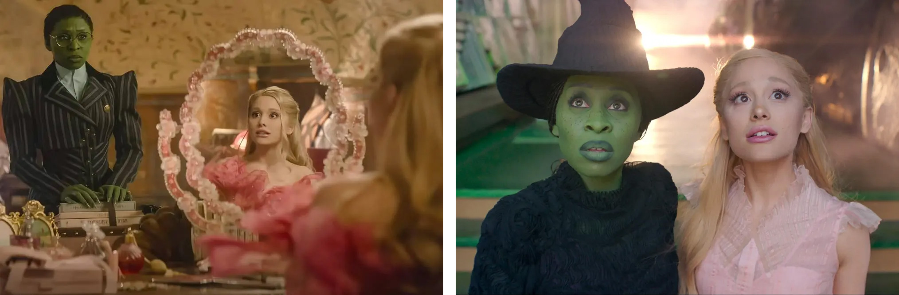
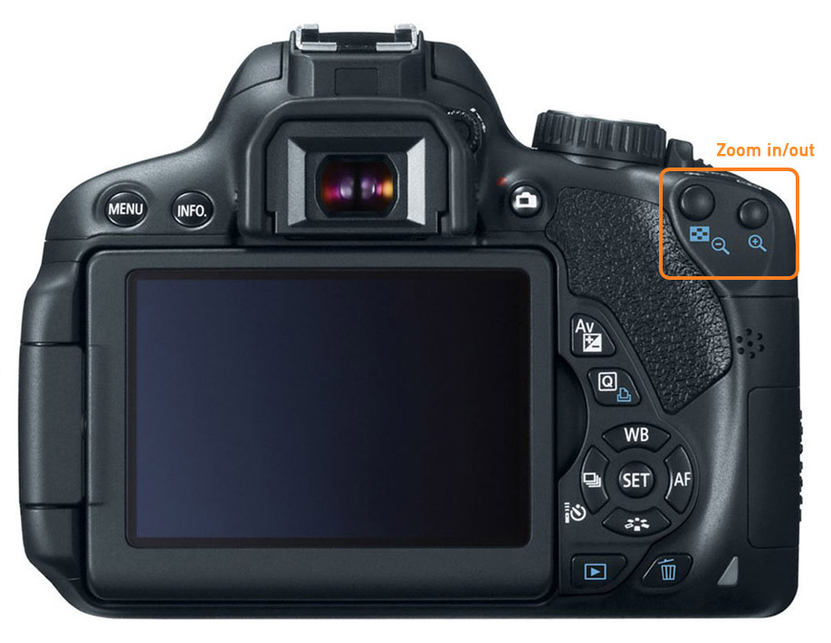

[MEDIAART 2B06](../README.md)

-------------------------------------------------------------------------------

<h1 style="color: darkred;">W8 — Production Framework</h1>
<h2 style="color: darkred;">From Pre-Production Plan to On-Set Execution</h2>

This document supports the [W8 - Production Week](../WeekIns/WI-W8.md){:target="_blank"} by outlining technical requirements, on-set best practices, and shot execution tips.    

## Sections

<ul>
  <li><a href="#setup-lighting">Before Shooting: Lighting</a></li>
  <li><a href="#setup-camera">Before Shooting: Camera</a></li>
  <li><a href="#setup-sound">Before Shooting: Sound</a></li>
  <li><a href="#framing">Framing, Focus & Movement</a></li>
  <li><a href="#shooting">Space & Shooting Strategy</a></li>
</ul>  

---

<h2 id="setup-lighting" style="color: darkred;">Before Shooting: Lighting</h2>    

Set up your lighting **before adjusting camera exposure settings**.  

**Remember:** lighting will look different through the lens of the camera than it does to your eyes.  
You must balance the **intensity of your lighting equipment** with your **camera exposure settings** (aperture, shutter speed, ISO).  

Do not adjust camera settings to compensate for poorly positioned lighting.  
First shape and position the light, then fine-tune exposure.   

For guidance, review:  
[W2 — Tech Walkthrough: Lighting Setup (Three-Point Logic)](https://jac307.github.io/MediaArtTutorials/MEDIAART2B06/TechWalks/TW-W2.html#2-lighting-setup-three-point-logic){:target="_blank"}   
[W7 — Pre-Production Framework: Character Portrait Lighting Setups](https://jac307.github.io/MediaArtTutorials/MEDIAART2B06/TechWalks/TW-W7.html#character-portrait-lighting-setups){:target="_blank"}   

---

### Aim for a Cinematic Look

Your lighting approach should aim for a **cinematic look**:

- Intentional direction of light (not flat overhead lighting)
- Visible depth through light and shadow
- Controlled contrast
- Consistent color temperature
- Separation between subject and background    

  

**Cinematic Lool Example**

> **Sinners (2025)** – Dir. Ryan Coogler  
> Cinematographer: **Autumn Durald Arkapaw**  
> Strong shadow control; clear subject separation through contrast; motivated directional light sources (windows, practical lamps); defined depth between foreground and background.  

  

**High-Key / Low-Contrast (Not Cinematic Look) Example**

> **Wicked (2024)** – Dir. Jon M. Chu  
> Cinematographer: **Alice Brooks**  
> Even facial illumination; minimal shadow depth; soft, diffused lighting; pastel tonal range; reduced contrast between subject and background.   

---

### Consistency

**Lighting must remain consistent between takes.**

Be aware of:
- Changing daylight (cloud movement, sunset)
- Practical lights being turned on/off
- Shadows shifting across faces
- Reflections in the background

If lighting changes significantly, adjust your setup and re-check exposure.  

❗ **Lighting must be controlled on set. Do not rely on fixing exposure or color in post-production.**

---

<h2 id="setup-camera" style="color: darkred;">Before Shooting: Camera</h2>  

### Resolution & Aspect Ratio

- You must record in **1920 × 1080 (Full HD)** at **24 fps**.  
- You must activate the **grid overlay** to support composition and framing.  
- All footage must be recorded in **16:9 aspect ratio**, regardless of your intended final crop.

📌 How to set this up:  
Follow the instructions in the [W2 — Tech Walkthrough: Camera on Video](https://jac307.github.io/MediaArtTutorials/MEDIAART2B06/TechWalks/TW-W2.html#1-camera-on-video){:target="_blank"}  

   

> 16:9 = **16 units wide for every 9 units tall.**   
> 4:3 = **4 units wide for every 3 units tall.**   
> 1.85:1 = **1.85 units wide for every 1 unit tall.**   
> 2.35:1 = **2.35 units wide for every 1 unit tall.**   

**You will always capture the full 16:9 frame in-camera.**  
If you change the aspect ratio in editing, you will be **cropping** the image.

This means you must compose your shots carefully during recording, anticipating how your final aspect ratio will affect what remains visible in the frame.  

---  

### White Balance

Set **Custom White Balance**.  
You may use a white sheet of paper to calibrate it.

📌 How to set this up:  
Follow the instructions in the  
[W2 — Tech Walkthrough: White Balance](https://jac307.github.io/MediaArtTutorials/MEDIAART2B06/TechWalks/TW-W2.html#4-white-balance){:target="_blank"}   

---

### Manual Mode (Aperture / Shutter / ISO). 

Set your camera to **Manual Mode**, add the **lenses** you will use, and **setup exposure**.      

#### Exposure Setup

Once white balance is set, adjust:

- **Aperture**
- **Shutter Speed**
- **ISO**

Your settings should respond to your **lighting conditions**.  
Use the **histogram** to monitor exposure rather than relying only on what you see on the screen.

For guidance, review:  
[W4 — Tech Walkthrough: Exposure Compensation & Exposure Control & Monitoring (Advanced)](https://jac307.github.io/MediaArtTutorials/MEDIAART2B06/TechWalks/TW-W4.html#exposure-compensation){:target="_blank"}  

---

#### Shutter Speed

First, use your **Stabilization ON (handheld)** or **OFF (on tripod/monopod)** depending on your setup.   

Start with a shutter speed that is approximately **double your frame rate**.

If you are recording at **24 fps**, begin with **1/48 or 1/50**.  
This follows the standard 180-degree shutter rule and produces natural-looking motion blur.  

You may increase the shutter speed if:  
- The scene includes fast movement
- You want sharper motion
- You need to reduce light without changing ISO or aperture

You may decrease the shutter speed slightly if:
- You want visible motion blur
- Moving elements in the background (e.g., cars) should appear softer
- The subject remains relatively still while movement happens around them

Lower shutter speeds will create motion blur or “drag.”  
Higher shutter speeds will create sharper movement.

For examples, review:  
[W2 — Tech Walkthrough: Shutter Speed](https://jac307.github.io/MediaArtTutorials/MEDIAART2B06/TechWalks/TW-W2.html#shutter-speed){:target="_blank"}  
[W3 — Tech Walkthrough: Shutter Speed as a Motion & Exposure Tool](https://jac307.github.io/MediaArtTutorials/MEDIAART2B06/TechWalks/TW-W3.html#shutter-speed-as-a-motion--exposure-tool){:target="_blank"}    

   

> **Chungking Express (1994)** – Dir. Wong Kar-wai 
> Cinematographer: Christopher Doyle 
> Motion blur conveys emotional isolation and the feeling of time moving too fast around the character.   

---

#### ISO Considerations

The general recommendation is to use the **lowest ISO possible** while maintaining proper exposure.

**However**, ISO decisions are not always straightforward.

- Higher ISO increases brightness.
- Higher ISO also increases **digital grain (noise)**.
- Grain is not inherently bad — it can be an artistic choice.
- If you choose a higher ISO for aesthetic reasons, keep it **consistent** across your shots.

In some cases, visible grain can simulate the look of **35mm, Super 8, 65mm, and other film formats**.  

   

> **Black Swan (2010)** – Dir. Darren Aronofsky  
> Shot on Super 16mm film.  
> The visible grain in darker areas creates an organic texture that supports the psychological tone of the film.  

   

> **The Batman (2022)** – Dir. Matt Reeves  
> Shot digitally (ARRI Alexa LF).  
> Heavy shadow areas contain visible texture and noise, contributing to the film’s dark, atmospheric aesthetic.  

---

### Manual Focus

Set your camera to **Manual Focus**.

Your subject and focal point must always remain sharp. **Do not rely on autofocus, as it will shift during recording**.

Before each take:
- Confirm that your subject is in focus.
- Re-check focus if the subject moves or changes distance.  

Always double-check focus — especially in shallow depth-of-field shots.   

Use your camera’s **zoom-in keys** (focus assist) to verify sharpness before pressing record.  

     

---

<h2 id="setup-sound" style="color: darkred;">Before Shooting: Sound</h2>

For a non-dialogue one-minute film, the **primary on-scene sounds** you should record are:

- Environmental sounds (ambient tone, subtle background activity).  
  → Use a **shotgun microphone connected directly to your camera**.  

- Sounds created by your main character interacting with the environment (object handling, footsteps, fabric movement, door sounds, etc.).  
  → Use a **condenser microphone connected to your Zoom recorder**.   

For guidance, review:  
[W2 — Tech Walkthrough: Audio Recording Method](https://jac307.github.io/MediaArtTutorials/MEDIAART2B06/TechWalks/TW-W2.html#6-audio-recording-method){:target="_blank"}    
[W5 — Tech Walkthrough: Audio Setup — Microphones & Recorders](https://jac307.github.io/MediaArtTutorials/MEDIAART2B06/TechWalks/TW-W5.html#audio-setup-%E2%80%94-microphones-recorders){:target="_blank"}    

Do not rely entirely on foley or music added later. Your final film must demonstrate a **complex, multi-layered sound design** using:

- On-scene recordings  
- Sound effects  
- Foley  
- Environmental sounds  
- Music (optional)

You will develop the full sound design in later weeks.  
For now, focus on capturing **clean, usable on-scene sound**.  

---

### Room Tone (Mandatory)

You must record **20–30 seconds of room tone per location**.  

Room tone is the **natural ambient sound of a space** when no one is speaking or moving. Room tone allows you to:  

- Smooth edits between cuts  
- Fill gaps in dialogue-free moments  
- Maintain sonic continuity  
- Avoid abrupt audio drop-offs  

In some cases, room tone will function as your “silence.”  

### How to Record Room Tone

Record room tone using your **Zoom recorder (built-in microphones)**.

1. Place the Zoom recorder in the same position where your main sound was captured.
2. Ask everyone to remain completely still and silent.
3. Stop all intentional movement (no footsteps, no fabric movement).
4. Begin recording.
5. Capture **20–30 seconds** of uninterrupted ambient sound.
6. Label the file clearly (e.g., `ProjectName_Ambience_Location_T01.wav`).

❗ **Do not skip this step.** Room tone is essential for professional sound editing and for maintaining continuity between cuts.  

---

<h2 id="framing" style="color: darkred;">Framing, Focus & Movement</h2>   

This section combines **composition, focus, and stability** — the elements that visually make or break a one-minute film.

### Watch Your Background

Your background is as important as your subject.

Every frame contains:

- **Foreground** – The area closest to the camera.
- **Midground** – Where your main subject usually sits.
- **Background** – The space behind the subject.

All three layers should be intentional.  

Avoid:

- Distracting objects behind your subject (exit signs, poles, clutter, bright windows).
- Background elements that appear to “grow” from the subject’s head.
- Unbalanced empty space unless it is intentional.
- Cluttered or dirty backgrounds unless they serve the story — and even then, the messiness must be intentional and controlled.  

---

### Framing, Focal Point & Focus

Activate the **camera grid** to help with alignment and balance.

- Position your subject or focal point intentionally.
- Use rule-of-thirds alignment when appropriate.
- Keep horizons straight.
- Avoid accidental tilting unless stylistically motivated.

On a large screen, poor framing becomes immediately obvious.  

For guidance, review:     
[W7 — Pre-Production Framework: Shot Types & Camera Angles](https://jac307.github.io/MediaArtTutorials/MEDIAART2B06/TechWalks/TW-W7.html#shot-types){:target="_blank"}      

A **focal point** is the area of the frame that draws the viewer’s attention first.  
It is usually your main subject or the most important visual element.

Your focal point must be sharp.

- Always double-check focus before recording.
- Use camera zoom-in preview to confirm sharpness.
- If unsure, re-focus and check again.

---  

### Focus in Motion

When the subject moves:

- Anticipate subject distance changes.
- Adjust the focus ring gradually as they move.
- Practice the movement before recording.
- Rehearse once without recording if needed.

If you cannot maintain focus during movement, simplify the shot.  

  <iframe 
    src="https://www.youtube.com/embed/r1adyTSCLEs?si=aNb8hQPwhlZ32rAw"
    title="YouTube video player"
    frameborder="0"
    allow="accelerometer; autoplay; clipboard-write; encrypted-media; gyroscope; picture-in-picture; web-share"
    allowfullscreen
    style="position: absolute; top: 0; left: 0; width: 100%; height: 100%;">
  </iframe>

 

  <iframe 
    src="https://www.youtube.com/embed/PQBGonFO9ZY?si=okjAPz6fV_N3R11K"
    title="YouTube video player"
    frameborder="0"
    allow="accelerometer; autoplay; clipboard-write; encrypted-media; gyroscope; picture-in-picture; web-share"
    allowfullscreen
    style="position: absolute; top: 0; left: 0; width: 100%; height: 100%;">
  </iframe>

 

---

### Stabilization & Camera Movement

Avoid unnecessary camera movement.  
Movement must have purpose.  

---

#### When to Use a Tripod. 

Use a tripod when:
- The shot is static.
- The scene relies on performance.
- You need precise framing.
- You want a controlled, cinematic feel.

**Controlled Tripod Movements:**  
- **Tilt** – Vertical movement (up / down).
- **Pan** – Horizontal movement (left / right).
- **Locked-off (Static)** – No movement at all.
- **Motivated Reframe** – Slight repositioning to follow a small subject shift.
- **Zoom (Use Sparingly)** – Changing focal length during recording.  

  <iframe 
    src="https://www.youtube.com/embed/pAvn034VcCg?si=Ddo6c3ntyD3oeF3L"
    title="YouTube video player"
    frameborder="0"
    allow="accelerometer; autoplay; clipboard-write; encrypted-media; gyroscope; picture-in-picture; web-share"
    allowfullscreen
    style="position: absolute; top: 0; left: 0; width: 100%; height: 100%;">
  </iframe>

 

---

### When to Use Handheld 

Handheld is appropriate when:
- Following a subject.
- Creating intimacy.
- Adding subtle realism.
- Capturing controlled movement.  

**Controlled Handheld Movements:**
- **Tracking** – Following the subject forward or backward.
- **Side Tracking** – Moving parallel to the subject.
- **Push-in / Pull-back** – Slow movement toward or away from subject.

If shooting handheld:
- Turn stabilization ON.
- Keep elbows close to your body.
- Control your breathing.
- Move slowly and deliberately.
- Avoid quick jerks or unnecessary pans.  

  <iframe 
    src="https://www.youtube.com/embed/r2FERO4j9WI?si=1HtjF0pNDnLcDMIH"
    title="YouTube video player"
    frameborder="0"
    allow="accelerometer; autoplay; clipboard-write; encrypted-media; gyroscope; picture-in-picture; web-share"
    allowfullscreen
    style="position: absolute; top: 0; left: 0; width: 100%; height: 100%;">
  </iframe>

 

---

<h2 id="shooting" style="color: darkred;">Space & Shooting Strategy</h2>   

This is where you address efficiency and discipline.

Shooting Strategy

Shoot 2–3 perspectives per scene

Let camera roll 3–5 seconds before and after action

Record full actions (don’t cut early)

Do not rely on shooting chronologically

Complete one scene fully before switching locations

Continuity

Maintain object placement

Maintain body position

Check eyelines

Maintain lighting consistency

Efficiency for a One-Minute Film

Keep setups simple

Avoid overcomplicated blocking

Prioritize clarity over ambition

________________________________________________________________________

Credits: Jessica A. Rodríguez

**AI Disclosure**:  
AI tools (ChatGPT) was used for **editing and clarity only**. AI is not used to generate original course content.

