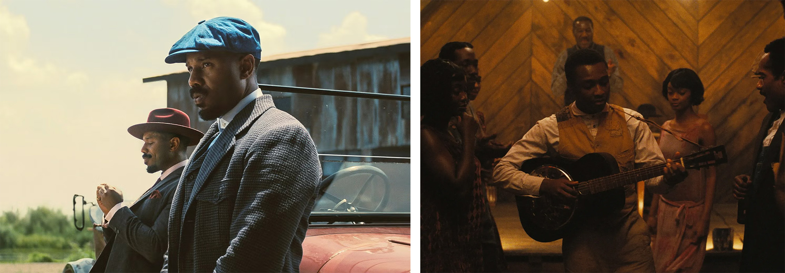
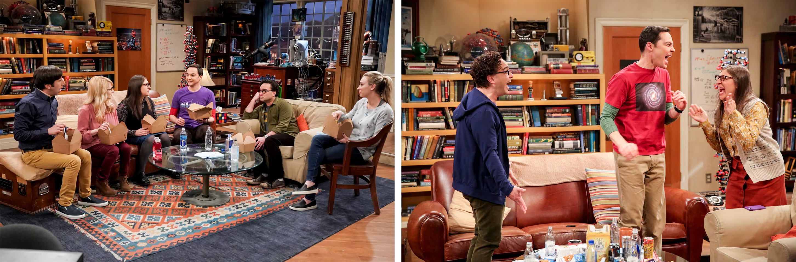
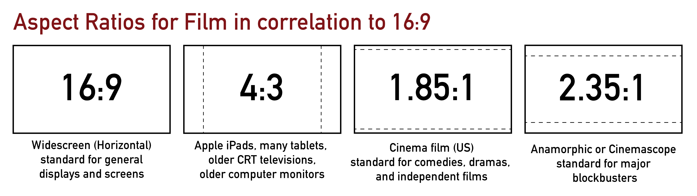
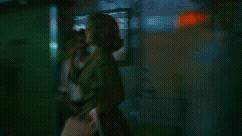
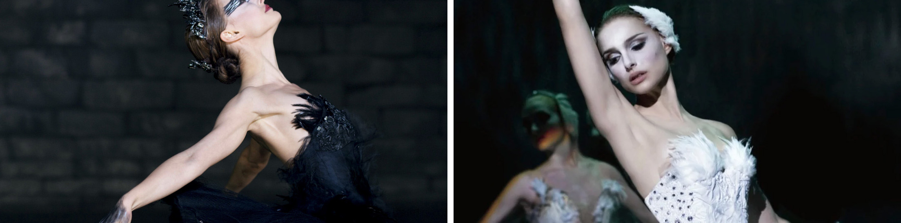
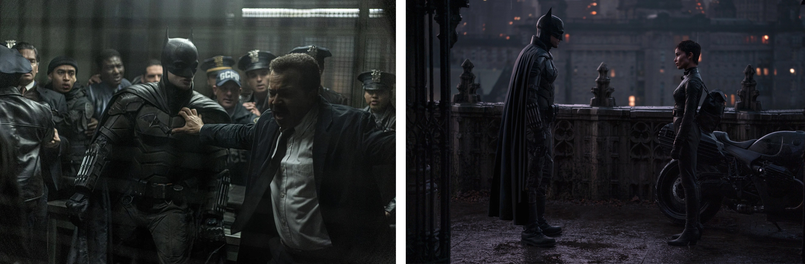

[MEDIAART 2B06](../README.md)

# W8 — Production Week Framework

## From Pre-Production Plan to On-Set Execution

This technical walkthrough supports the [W8 — Production Week](../WeekIns/WI-W8.md){:target="_blank"} activity.

<!-- 
/////////////////
SECTION 1
/////////////////
-->

<details class="tutorial-section">
  <summary>
    <span class="section-title">1. Lighting Setup</span>
    <span class="section-description">
      Shape and control the light before adjusting camera exposure settings.
    </span>
  </summary>

<div class="section-content" markdown="1">

## Set the lighting before adjusting exposure

Set up the lighting **before** changing aperture, shutter speed, or ISO.

Lighting may appear different through the camera lens than it does to your eyes. Begin by shaping and positioning the light. After the lighting arrangement is stable, use the camera settings to fine-tune the exposure.

Do not use exposure settings to compensate for poorly positioned or uncontrolled lighting.

Review:

- [W2 — Three-point lighting](https://jac307.github.io/MediaArtTutorials/MEDIAART2B06/TechWalks/TW-W2.html#three-point-lighting){:target="_blank"}
- [W7 — Character portrait lighting setups](https://jac307.github.io/MediaArtTutorials/MEDIAART2B06/TechWalks/TW-W7.html#character-portrait-lighting-setups){:target="_blank"}

## Create an intentional visual approach

A cinematic image is not defined by one fixed lighting style. High contrast, low contrast, high-key, and low-key lighting can all be used intentionally.

For this project, the lighting should demonstrate:

- A clear direction of light rather than uncontrolled overhead illumination
- Visible depth across the subject and environment
- Deliberate contrast between illuminated and shadowed areas
- Consistent colour temperature
- Separation between the subject and background
- A lighting approach that supports the emotional tone of the scene

<div class="media-grid media-grid--three photography-examples--sixteen-nine">

  <figure class="media-card">
    
    <figcaption>
      <strong>Directional and contrast-based lighting:</strong> <em>Sinners</em> (2025), directed by Ryan Coogler and photographed by Autumn Durald Arkapaw. Directional sources, controlled shadows, and separation between visual planes create depth.
    </figcaption>
  </figure>

  <figure class="media-card">
    
    <figcaption>
      <strong>High-key and low-contrast lighting:</strong> <em>Wicked</em> (2024), directed by Jon M. Chu and photographed by Alice Brooks. Soft illumination and a bright tonal range create a different visual effect with reduced shadow depth.
    </figcaption>
  </figure>

  <figure class="media-card">
    
    <figcaption>
      <strong>Flat multi-camera television lighting:</strong> <em>The Big Bang Theory</em> (2007–2019). The setup prioritizes consistent exposure and performer visibility across several camera positions rather than dramatic light and shadow.
    </figcaption>
  </figure>

</div>

## Maintain lighting continuity

Lighting must remain consistent between takes. Monitor:

- Changes in daylight caused by clouds or sunset
- Practical lights being turned on or off
- Shadows shifting across the subject or background
- Reflections appearing in windows, mirrors, screens, or other surfaces
- Lights or stands being moved between takes

When the lighting changes significantly, restore the planned arrangement and recheck exposure before continuing.

> Lighting must be controlled during production. Do not assume that major exposure or colour inconsistencies can be repaired in post-production.

</div>
</details>

<!-- 
/////////////////
SECTION 2
/////////////////
-->

<details class="tutorial-section">
  <summary>
    <span class="section-title">2. Camera Setup</span>
    <span class="section-description">
      Confirm recording format, white balance, manual exposure, stabilization, and focus before each take.
    </span>
  </summary>

<div class="section-content" markdown="1">

## Set the recording format

Record all footage using:

- **Resolution:** 1920 × 1080 pixels (Full HD)
- **Frame rate:** 24 fps
- **Capture aspect ratio:** 16:9
- **Grid display:** On

Review [W2 — Set Resolution, Aspect Ratio & Frame Rate](https://jac307.github.io/MediaArtTutorials/MEDIAART2B06/TechWalks/TW-W2.html#set-resolution-aspect-ratio--frame-rate){:target="_blank"}.

<figure class="media-card">
  
  <figcaption>
    Comparison of common aspect ratios. All project footage must be captured in the camera's full 16:9 frame.
  </figcaption>
</figure>

Aspect ratios describe the proportional relationship between image width and height:

- **16:9:** 16 units wide for every 9 units tall
- **4:3:** 4 units wide for every 3 units tall
- **1.85:1:** 1.85 units wide for every 1 unit tall
- **2.35:1:** 2.35 units wide for every 1 unit tall

If the final film uses a different aspect ratio, the 16:9 recording will be cropped during editing. Compose each shot with the intended crop in mind so important actions and visual information remain visible.

## Set Custom White Balance

Set a **Custom White Balance** after the lighting arrangement is complete. A clean white sheet of paper may be used as the neutral reference.

Repeat the process when:

- The location changes
- The dominant light source changes
- The time of day changes significantly
- A practical light is added or removed

Review [W2 — Set Custom White Balance](https://jac307.github.io/MediaArtTutorials/MEDIAART2B06/TechWalks/TW-W2.html#set-custom-white-balance){:target="_blank"}.

## Use Manual exposure

Set the camera to **Manual mode (`M`)** and attach the lens planned for the shot before finalizing exposure.

Adjust:

- **Aperture:** Controls incoming light and depth of field
- **Shutter speed:** Controls motion blur and exposure time
- **ISO:** Controls image brightness and digital noise

Use the histogram to evaluate exposure rather than relying only on the brightness of the LCD screen.

Review [W4 — Advanced Exposure Theory & Monitor Exposure](https://jac307.github.io/MediaArtTutorials/MEDIAART2B06/TechWalks/TW-W4.html#exposure-compensation){:target="_blank"}.

## Select shutter speed

At 24 fps, begin with a shutter speed of approximately **1/48 or 1/50 second**. This follows the standard 180-degree shutter approach and produces natural-looking motion blur.

Increase shutter speed when:

- The scene includes fast movement
- Sharper motion is part of the visual approach
- Less light is needed without changing aperture or ISO

Decrease shutter speed carefully when:

- Visible motion blur is intentional
- Moving background elements should appear softer
- The subject remains relatively still while movement occurs around them

Lower shutter speeds create more motion blur or drag. Higher shutter speeds create sharper, more fragmented movement.

Review:

- [W2 — Shutter speed](https://jac307.github.io/MediaArtTutorials/MEDIAART2B06/TechWalks/TW-W2.html#shutter-speed){:target="_blank"}
- [W3 — Shutter Speed as a Motion and Exposure Tool](https://jac307.github.io/MediaArtTutorials/MEDIAART2B06/TechWalks/TW-W3.html#1.-Shutter-speed){:target="_blank"}

<figure class="media-card">
  
  <figcaption>
    <em>Chungking Express</em> (1994), directed by Wong Kar-wai and photographed by Christopher Doyle. Motion blur communicates emotional isolation and the sensation of time moving rapidly around the character.
  </figcaption>
</figure>

## Select ISO

Use the **lowest ISO that allows proper exposure with the planned aperture, shutter speed, and lighting**.

Higher ISO:

- Increases image brightness
- Increases digital noise
- May reduce fine detail and colour accuracy
- Can be used deliberately when a textured image supports the visual concept

When a higher ISO is selected for aesthetic reasons, keep the choice consistent across connected shots.

<div class="media-grid media-grid--two">

  <figure class="media-card">
    
    <figcaption>
      <em>Black Swan</em> (2010), directed by Darren Aronofsky. The Super 16 mm format produces visible grain that supports the film's psychological tone.
    </figcaption>
  </figure>

  <figure class="media-card">
    
    <figcaption>
      <em>The Batman</em> (2022), directed by Matt Reeves. The digitally captured image retains visible texture in dark areas as part of its atmospheric visual design.
    </figcaption>
  </figure>

</div>

## Set stabilization for the camera support

Set lens or camera stabilization according to the support method:

- **Tripod or monopod:** Stabilization off
- **Handheld:** Stabilization on, when available

Confirm this setting whenever the camera moves between a tripod and handheld setup.

## Set Manual Focus

Set the lens to **Manual Focus (`MF`)**. Do not rely on autofocus during recording because it may shift between the subject and background.

Before each take:

1. Place the subject at the planned position.
2. Use the camera's zoom-in buttons or focus-assist view.
3. Adjust focus on the intended focal point.
4. Return to the complete frame.
5. Recheck focus after the subject, camera, or focal length changes.

## Camera setup checklist

<fieldset class="equipment-checklist">
  <legend>Complete before each setup</legend>

  <label class="checklist-item">
    <input type="checkbox">
    <span>
      <strong>Set 1920 × 1080 at 24 fps.</strong>
      Confirm that the camera is recording video in the required format.
    </span>
  </label>

  <label class="checklist-item">
    <input type="checkbox">
    <span>
      <strong>Activate the grid display.</strong>
      Use it to check alignment, headroom, horizons, and the planned crop.
    </span>
  </label>

  <label class="checklist-item">
    <input type="checkbox">
    <span>
      <strong>Set Custom White Balance.</strong>
      Calibrate after the lighting arrangement is complete.
    </span>
  </label>

  <label class="checklist-item">
    <input type="checkbox">
    <span>
      <strong>Set Manual exposure.</strong>
      Confirm aperture, shutter speed, and ISO using the histogram.
    </span>
  </label>

  <label class="checklist-item">
    <input type="checkbox">
    <span>
      <strong>Match stabilization to the camera support.</strong>
      Turn it off on a tripod or monopod and on for handheld recording when available.
    </span>
  </label>

  <label class="checklist-item">
    <input type="checkbox">
    <span>
      <strong>Set and verify Manual Focus.</strong>
      Magnify the focal point and recheck whenever distance or framing changes.
    </span>
  </label>
</fieldset>

</div>
</details>

<!-- 
/////////////////
SECTION 3
/////////////////
-->

<details class="tutorial-section">
  <summary>
    <span class="section-title">3. Sound Recording</span>
    <span class="section-description">
      Capture clean environmental sound, character actions, and mandatory room tone at every location.
    </span>
  </summary>

<div class="section-content" markdown="1">

## Record usable on-location sound

For the non-dialogue one-minute film, capture two primary types of sound during production:

### Environmental sound

Record ambience and subtle background activity using a **shotgun microphone connected directly to the camera**.

Examples include:

- Wind or rain
- Distant traffic
- Room ambience
- Appliances or machinery that belong to the location
- Background activity that establishes the space

### Character and object sound

Record detailed actions using a **condenser microphone connected to the Zoom recorder**.

Examples include:

- Footsteps
- Fabric movement
- Doors, drawers, or containers
- Object handling
- Writing, tapping, dragging, or other physical actions

Review:

- [W2 — Audio recording method](https://jac307.github.io/MediaArtTutorials/MEDIAART2B06/TechWalks/TW-W2.html#audio-recording-method){:target="_blank"}
- [W5 — Audio Setup: Microphones and Recorders](https://jac307.github.io/MediaArtTutorials/MEDIAART2B06/TechWalks/TW-W5.html#audio-setup-%E2%80%94-microphones-recorders){:target="_blank"}

Do not rely entirely on music or Foley added later. The final sound design will combine several layers, which may include:

- On-location recordings
- Environmental sound
- Sound effects
- Foley
- Music, when appropriate

The complete sound design will be developed in later weeks. During production, prioritize clean and usable source recordings.

## Record room tone at every location

Record **20–30 seconds of room tone for each filming location**.

Room tone is the natural ambient sound of a space when no one is speaking or intentionally moving. It can be used to:

- Smooth edits between cuts
- Fill gaps between recorded sounds
- Maintain sonic continuity
- Prevent abrupt drops to digital silence

In a dialogue-free film, room tone may function as the sound of apparent silence.

## How to record room tone

Use the Zoom recorder's built-in microphones.

1. Place the recorder in the same position used for the main sound recording.
2. Ask everyone to remain still and silent.
3. Stop all intentional movement, including footsteps and fabric movement.
4. Begin recording.
5. Capture 20–30 seconds of uninterrupted ambient sound.
6. Label the file clearly.

```text
ProjectName_Ambience_Location_T01.wav
```

> Do not skip room tone. It is necessary for maintaining continuity during sound editing.

## Sound recording checklist

<fieldset class="equipment-checklist">
  <legend>Complete at every location</legend>

  <label class="checklist-item">
    <input type="checkbox">
    <span>
      <strong>Connect and test each microphone.</strong>
      Confirm that the camera and Zoom recorder are receiving a clean signal.
    </span>
  </label>

  <label class="checklist-item">
    <input type="checkbox">
    <span>
      <strong>Record environmental sound.</strong>
      Capture enough ambience to establish and maintain the location.
    </span>
  </label>

  <label class="checklist-item">
    <input type="checkbox">
    <span>
      <strong>Record important character and object actions.</strong>
      Position the microphone close enough to capture clear detail without entering the frame.
    </span>
  </label>

  <label class="checklist-item">
    <input type="checkbox">
    <span>
      <strong>Monitor for unwanted noise.</strong>
      Listen for handling noise, wind, clipping, clothing contact, appliances, and interruptions.
    </span>
  </label>

  <label class="checklist-item">
    <input type="checkbox">
    <span>
      <strong>Record 20–30 seconds of room tone.</strong>
      Complete a separate room-tone recording for every location.
    </span>
  </label>

  <label class="checklist-item">
    <input type="checkbox">
    <span>
      <strong>Label the files clearly.</strong>
      Include the project, sound type, location, and take number.
    </span>
  </label>
</fieldset>

</div>
</details>

<!-- 
/////////////////
SECTION 4
/////////////////
-->

<details class="tutorial-section">
  <summary>
    <span class="section-title">4. Composition and Camera Control</span>
    <span class="section-description">
      Control the background, focal point, focus changes, stability, and purpose of every camera movement.
    </span>
  </summary>

<div class="section-content" markdown="1">

## Control the complete frame

The background is as important as the main subject. Evaluate the complete spatial arrangement:

- **Foreground:** The area closest to the camera
- **Midground:** The area where the primary subject is often positioned
- **Background:** The space behind the subject

All three layers should contribute intentionally to the shot.

Avoid:

- Exit signs, poles, clutter, or bright windows that distract from the action
- Objects that appear to grow from the subject's head or body
- Unbalanced empty space unless it is deliberate
- Cluttered or dirty environments that do not support the story
- Equipment, bags, cables, lights, or crew members entering the frame

<div class="video-wrapper">
  <iframe
    src="https://www.youtube.com/embed/YNlBHyZwcXI?si=FWU3s6HRw1uhk1S3&amp;start=82"
    title="Video lesson on controlling the background and visual composition"
    allow="accelerometer; autoplay; clipboard-write; encrypted-media; gyroscope; picture-in-picture; web-share"
    allowfullscreen>
  </iframe>
</div>

## Establish the framing and focal point

Activate the camera grid and use it to evaluate alignment and balance.

- Position the subject or focal point intentionally
- Use rule-of-thirds alignment when appropriate
- Keep horizons straight
- Maintain deliberate headroom and looking room
- Avoid accidental tilting unless the angle is part of the visual plan
- Anticipate any crop that will be added during editing

Review [W7 — Select shot types](https://jac307.github.io/MediaArtTutorials/MEDIAART2B06/TechWalks/TW-W7.html#select-shot-types){:target="_blank"} and [W7 — Select camera angles](https://jac307.github.io/MediaArtTutorials/MEDIAART2B06/TechWalks/TW-W7.html#select-camera-angles){:target="_blank"}.

A **focal point** is the area that draws the viewer's attention first. It is usually the main subject or the most important visual detail. The intended focal point must remain sharp.

## Maintain focus during movement

When the subject changes distance from the camera:

1. Identify the closest and farthest positions.
2. Practise the action before recording.
3. Mark the focus-ring positions when useful.
4. Adjust the focus ring gradually during the movement.
5. Review the take at a magnified size.

When consistent focus cannot be maintained, simplify the action, increase the depth of field, or redesign the camera position.

<div class="video-wrapper">
  <iframe
    src="https://www.youtube.com/embed/r1adyTSCLEs?si=aNb8hQPwhlZ32rAw"
    title="Demonstration of manually adjusting focus while a subject moves"
    allow="accelerometer; autoplay; clipboard-write; encrypted-media; gyroscope; picture-in-picture; web-share"
    allowfullscreen>
  </iframe>
</div>

<div class="video-wrapper">
  <iframe
    src="https://www.youtube.com/embed/PQBGonFO9ZY?si=okjAPz6fV_N3R11K"
    title="Demonstration of focus pulling and maintaining a moving focal point"
    allow="accelerometer; autoplay; clipboard-write; encrypted-media; gyroscope; picture-in-picture; web-share"
    allowfullscreen>
  </iframe>
</div>

## Use camera movement with purpose

Avoid unnecessary movement. Every pan, tilt, tracking movement, push-in, pull-back, or handheld adjustment should support the action or emotional change.

Review [W7 — Plan camera movement](https://jac307.github.io/MediaArtTutorials/MEDIAART2B06/TechWalks/TW-W7.html#plan-camera-movement){:target="_blank"}.

### Use a tripod when control is the priority

A tripod is appropriate when:

- The shot is static
- The scene relies on performance within a stable frame
- Precise composition is required
- The camera must repeat the same position across takes
- A controlled pan or tilt is planned

Controlled tripod options include:

- **Locked-off or static:** The camera does not move
- **Pan:** The camera rotates horizontally
- **Tilt:** The camera rotates vertically
- **Motivated reframe:** A small adjustment follows a limited subject movement
- **Zoom:** The focal length changes without moving the camera; use sparingly

<div class="video-wrapper">
  <iframe
    src="https://www.youtube.com/embed/pAvn034VcCg?si=Ddo6c3ntyD3oeF3L"
    title="Demonstration of controlled camera movement using a tripod"
    allow="accelerometer; autoplay; clipboard-write; encrypted-media; gyroscope; picture-in-picture; web-share"
    allowfullscreen>
  </iframe>
</div>

### Use handheld recording when movement is necessary

Handheld recording may be appropriate when:

- Following a subject
- Creating visual intimacy
- Adding subtle realism or instability
- Moving through a space that cannot accommodate a tripod

Controlled handheld options include:

- **Tracking:** Following the subject forward or backward
- **Side tracking:** Moving parallel to the subject
- **Push-in:** Moving slowly toward the subject
- **Pull-back:** Moving slowly away from the subject

When recording handheld:

- Turn stabilization on when available
- Keep elbows close to the body
- Control breathing
- Use a stable stance
- Move slowly and deliberately
- Avoid quick jerks and unnecessary pans

<div class="video-wrapper">
  <iframe
    src="https://www.youtube.com/embed/r2FERO4j9WI?si=1HtjF0pNDnLcDMIH"
    title="Demonstration of controlled handheld camera movement"
    allow="accelerometer; autoplay; clipboard-write; encrypted-media; gyroscope; picture-in-picture; web-share"
    allowfullscreen>
  </iframe>
</div>

## Composition and camera-control checklist

<fieldset class="equipment-checklist">
  <legend>Confirm before recording each shot</legend>

  <label class="checklist-item">
    <input type="checkbox">
    <span>
      <strong>Inspect the complete frame.</strong>
      Check the foreground, midground, background, frame edges, and reflections.
    </span>
  </label>

  <label class="checklist-item">
    <input type="checkbox">
    <span>
      <strong>Confirm the intended focal point.</strong>
      Make sure the most important subject or detail is visually clear and sharp.
    </span>
  </label>

  <label class="checklist-item">
    <input type="checkbox">
    <span>
      <strong>Check alignment and visual balance.</strong>
      Use the grid to evaluate horizons, headroom, looking room, and the planned crop.
    </span>
  </label>

  <label class="checklist-item">
    <input type="checkbox">
    <span>
      <strong>Rehearse focus changes.</strong>
      Practise moving-subject shots before recording the take.
    </span>
  </label>

  <label class="checklist-item">
    <input type="checkbox">
    <span>
      <strong>Select the appropriate camera support.</strong>
      Use a tripod for precision and handheld recording only when movement supports the shot.
    </span>
  </label>

  <label class="checklist-item">
    <input type="checkbox">
    <span>
      <strong>Remove unnecessary camera movement.</strong>
      Simplify movements that cannot be completed smoothly and repeatedly.
    </span>
  </label>
</fieldset>

</div>
</details>

<!-- 
/////////////////
SECTION 5
/////////////////
-->

<details class="tutorial-section">
  <summary>
    <span class="section-title">5. Shooting Strategy and Continuity</span>
    <span class="section-description">
      Record complete and editable coverage while maintaining visual consistency between takes.
    </span>
  </summary>

<div class="section-content" markdown="1">

## Keep the production achievable

Production depends on efficiency, discipline, and control.

- Keep setups simple
- Avoid unnecessary technical complications
- Prioritize clarity over ambition
- Complete fewer shots carefully rather than recording many unusable shots
- Finish the required coverage before attempting optional material

## Record multiple perspectives

Record each scene from **two or three distinct angles or framings** whenever possible. Additional coverage provides options for editing, rhythm, and pacing.

The perspectives should serve different functions rather than repeating the same composition. For example:

- A wide shot establishes the environment and complete action
- A medium shot emphasizes performance or body movement
- A close-up isolates an important gesture, object, or reaction

Avoid relying entirely on one master shot.

## Leave editing handles

For every take:

- Begin recording **3–5 seconds before** the planned action starts
- Continue recording **3–5 seconds after** the action ends

These handles provide space for clean cuts, transitions, and sound editing.

## Record complete actions

Do not stop recording before the physical action is complete.

Examples:

- When a character sits, continue until the character is fully seated and still
- When a character walks, continue until the character reaches the final position and stops
- When a character opens an object, continue until the action reaches its planned conclusion
- When a character enters or exits the frame, leave additional time before cutting

Incomplete actions create unnecessary editing problems.

## Organize the production by location and setup

The film does not need to be recorded in story order.

When the project uses several spaces or time periods:

1. Complete all planned shots in one location.
2. Complete shots that use the same lighting and camera setup together.
3. Confirm the required coverage before changing the setup.
4. Move to the next location only after the current scene is complete.

Avoid repeatedly rebuilding the same setup or moving unnecessarily between locations.

## Maintain continuity

**Continuity** is visual consistency across shots and takes.

Check:

- **Object placement:** Position of objects, furniture, doors, and props
- **Body position:** Hand placement, posture, seated position, and direction of movement
- **Eyelines:** Where the character is looking
- **Screen direction:** Whether movement continues consistently from one shot to another
- **Lighting:** Direction, intensity, colour temperature, and shadow placement
- **Wardrobe and appearance:** Hair, sleeves, accessories, and other visible details
- **Environment:** Background activity, practical lights, windows, and reflective surfaces

Use reference photographs when a setup must be recreated.

<div class="video-wrapper">
  <iframe
    src="https://www.youtube.com/embed/Ff4_LqI9Oa4?si=4WHP8mmWlDD9JfOK"
    title="Video lesson demonstrating continuity errors between film shots"
    allow="accelerometer; autoplay; clipboard-write; encrypted-media; gyroscope; picture-in-picture; web-share"
    allowfullscreen>
  </iframe>
</div>

## Production checklist

<fieldset class="equipment-checklist">
  <legend>Complete for every scene</legend>

  <label class="checklist-item">
    <input type="checkbox">
    <span>
      <strong>Confirm the required shots.</strong>
      Compare the setup with the annotated storyboard before recording.
    </span>
  </label>

  <label class="checklist-item">
    <input type="checkbox">
    <span>
      <strong>Record two or three useful perspectives.</strong>
      Capture complementary wide, medium, and detail coverage when appropriate.
    </span>
  </label>

  <label class="checklist-item">
    <input type="checkbox">
    <span>
      <strong>Leave 3–5-second handles.</strong>
      Begin early and continue recording after the complete action.
    </span>
  </label>

  <label class="checklist-item">
    <input type="checkbox">
    <span>
      <strong>Record the full action.</strong>
      Do not stop the camera during the middle of a movement.
    </span>
  </label>

  <label class="checklist-item">
    <input type="checkbox">
    <span>
      <strong>Check continuity before every take.</strong>
      Compare body position, objects, eyelines, wardrobe, lighting, and screen direction.
    </span>
  </label>

  <label class="checklist-item">
    <input type="checkbox">
    <span>
      <strong>Complete the scene before changing locations.</strong>
      Confirm that all required visual and sound material has been captured.
    </span>
  </label>
</fieldset>

</div>
</details>

---

Credits: Jessica A. Rodríguez