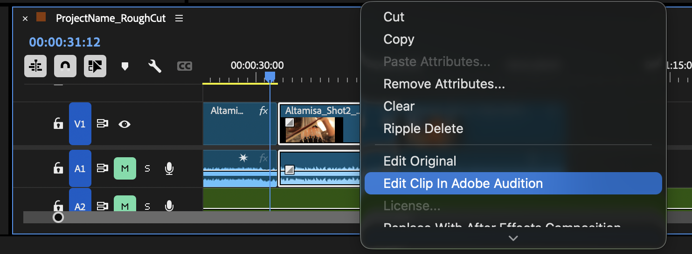

[MEDIAART 2B06](../README.md)

-------------------------------------------------------------------------------

<h1 style="color: darkred;">W9 — Rough Cut Framework</h1>
<h2 style="color: darkred;">From Raw Footage to a Coherent Sequence</h2>

This document supports the [W9 - Rough Cut](../WeekIns/WI-W9.md){:target="_blank"} by outlining editorial principles and best practices when assembling your first edit.  

## Sections

<ul>
  <li><a href="#review-footage">Reviewing Footage</a></li>
  <li><a href="#assembly">Building the Rough Assembly</a></li>
  <li><a href="#export-sequence">Exporting Temporary Sequences</a></li>
  <li><a href="#rhythm">Pacing & Rhythm</a></li>
  <li><a href="#color">Visual Consistency (Basic Colour Correction)</a></li>
  <li><a href="#sound">Basic Sound Integration</a></li>
  <li><a href="#export">Final Rough Cut Export</a></li>
</ul>  

---

<h2 id="review-footage" style="color: darkred;">Reviewing Footage</h2>  

Before assembling your sequence, take time to **review all your footage carefully**.  
Professional editors rarely begin editing immediately — they first **watch, evaluate, and select usable material**.  
  
Do **not delete any footage**. Simply identify what you will use and what you will avoid.

---

### How to Select Footage in Premiere Pro

There are several ways to mark usable sections of your footage in Premiere Pro.  

**Watch the following tutorial.**   

You will also find a written summary of the key steps below.

<iframe src="https://www.iorad.com/player/2692283/Premiere-Pro-2--Reviewing--Marking---Organizing-Media?iframeHash=mobilequick-1&src=iframe&oembed=1" width="100%" height="500px" style="width: 80%; height: 500px; border-bottom: 1px solid #ccc;" referrerpolicy="strict-origin-when-cross-origin" frameborder="0" webkitallowfullscreen="webkitallowfullscreen" mozallowfullscreen="mozallowfullscreen" allowfullscreen="allowfullscreen" allow="camera; microphone; clipboard-write;" sandbox="allow-scripts allow-forms allow-same-origin allow-presentation allow-downloads allow-modals allow-popups allow-popups-to-escape-sandbox allow-top-navigation allow-top-navigation-by-user-activation"></iframe>

---

#### Method 1 — In/Out Points (Recommended)

Open the clip in the **Source Monitor**.

1. Play the clip.
2. Press **I** to mark the **In point** (where the usable part begins).
3. Press **O** to mark the **Out point** (where it ends).
4. Insert this section into your timeline.

This allows you to use **only the usable portion of the clip**.

---

#### Method 2 — Clip Markers

You can place **markers** on good moments in the footage.

1. Play the clip.
2. Press **M** to place a marker.
3. Use markers to indicate:
   - Good takes
   - Strong performances
   - Clean technical moments

Markers help you **navigate quickly between good sections** of a clip.

---

#### Method 3 — Label Colors (Optional)

Editors often use **color labels** to organize material.

For example:

- Green → good takes  
- Yellow → possible alternatives  
- Red → unusable footage

This makes it easier to visually identify material in the project panel.

---

### How Editors Choose Between Similar Shots

Often you will have **multiple takes of the same shot**.

Choosing between them involves both **technical and storytelling decisions**.

Editors usually evaluate:

**Technical quality**

- Is the shot in focus?
- Is the exposure correct?
- Is the camera stable?
- Is the framing clean?

**Performance and timing**

- Does the action feel natural?
- Does the movement start and end clearly?
- Does the shot connect well with the next shot?

Sometimes a technically imperfect shot is chosen if it **supports the rhythm or emotion of the sequence better**.

---

<h2 id="assembly" style="color: darkred;">Building the Draft Assembly</h2>    

The **assembly edit** is the first stage of editing where selected shots are placed in sequence to create the **basic structure of the film**.

The goal is simply to **see the material together as a continuous sequence** for the first time.  

The assembly edit is often **longer than the final film**.  
Extra seconds before and after actions are normal at this stage.  

---

### Creating the Sequence in Premiere Pro

<iframe src="https://www.iorad.com/player/2692292/Premiere-Pro-3--Creating-a-Sequence---Starting-the-Draft-Assembly?iframeHash=mobilequick-1&src=iframe&oembed=1" width="100%" height="500px" style="width: 80%; height: 500px; border-bottom: 1px solid #ccc;" referrerpolicy="strict-origin-when-cross-origin" frameborder="0" webkitallowfullscreen="webkitallowfullscreen" mozallowfullscreen="mozallowfullscreen" allowfullscreen="allowfullscreen" allow="camera; microphone; clipboard-write;" sandbox="allow-scripts allow-forms allow-same-origin allow-presentation allow-downloads allow-modals allow-popups allow-popups-to-escape-sandbox allow-top-navigation allow-top-navigation-by-user-activation"></iframe>   

---

### Assembly Rules

For this first sequence, follow these rules:

- **Do not trim shots yet.**
- Place **one shot after the other** in the timeline.
- Do **not add transitions**.
- Do **not adjust timing for rhythm yet**.
- Do **not add music or sound effects**.

Your goal is simply to **construct the first continuous version of the film**.

Think of this step as **building the skeleton of the sequence**.  

The assembly should help you verify:  

- The **order of the shots**
- The **clarity of the action**
- The **overall structure of the scene**

In the next stage, you will begin refining **rhythm, pacing, and shot duration**.  

---

<h2 id="export-sequence" style="color: darkred;">Exporting Temporary Sequences</h2>

Exporting allows you to watch the film **outside the editing timeline**, which makes pacing issues, sound problems, and visual inconsistencies easier to notice.  

### Premiere Pro → Media Encoder Workflow

This workflow allows you to **continue editing in Premiere while your file exports in the background**, which is especially useful when working with multiple revisions or temporary renders.  

Media Encoder also manages export jobs in a queue, making it easier to **export several versions of a sequence without interrupting your editing workflow**.  

<iframe src="https://www.iorad.com/player/2692296/Premiere-Pro-4--Exporting-a-Temporary-Sequence?iframeHash=mobilequick-1&src=iframe&oembed=1" width="100%" height="500px" style="width: 100%; height: 500px; border-bottom: 1px solid #ccc;" referrerpolicy="strict-origin-when-cross-origin" frameborder="0" webkitallowfullscreen="webkitallowfullscreen" mozallowfullscreen="mozallowfullscreen" allowfullscreen="allowfullscreen" allow="camera; microphone; clipboard-write;" sandbox="allow-scripts allow-forms allow-same-origin allow-presentation allow-downloads allow-modals allow-popups allow-popups-to-escape-sandbox allow-top-navigation allow-top-navigation-by-user-activation"></iframe>  

1. Select your **sequence** in Premiere Pro
2. Go to **File → Export → Media**
3. Format: **H.264**
4. Confirm that your **resolution and frame rate match your sequence settings**
5. Click **Queue** instead of Export

Premiere will send the sequence to **Media Encoder**, where the export will process.  

---

<h2 id="rhythm" style="color: darkred;">Pacing & Rhythm</h2>     

Once your assembly sequence is built, the next step is refining **pacing and rhythm**.

Pacing refers to **how long shots remain on screen**.  
Rhythm refers to **how the duration of shots changes across the sequence**.

Together, they determine how the viewer **experiences time and movement** in the film.

At this stage you will begin:

- **Trimming shots**
- **Removing unnecessary moments**
- **Refining shot order**
- **Adjusting transitions between shots**

The goal is to create a sequence that feels **clear, intentional, and readable**.

---

### Trimming Shots

Trimming is the primary tool editors use to control pacing.

When trimming shots:

- Cut **after the important information is understood**.
- Remove unnecessary pauses before or after actions.
- Avoid leaving shots longer than needed.

<iframe src="https://www.iorad.com/player/2693409/Premiere-Pro-5--Timeline-Editing---Trim--Cut--and-Adjust-Clips?iframeHash=mobilequick-1&src=iframe&oembed=1" width="100%" height="500px" style="width: 100%; height: 500px; border-bottom: 1px solid #ccc;" referrerpolicy="strict-origin-when-cross-origin" frameborder="0" webkitallowfullscreen="webkitallowfullscreen" mozallowfullscreen="mozallowfullscreen" allowfullscreen="allowfullscreen" allow="camera; microphone; clipboard-write;" sandbox="allow-scripts allow-forms allow-same-origin allow-presentation allow-downloads allow-modals allow-popups allow-popups-to-escape-sandbox allow-top-navigation allow-top-navigation-by-user-activation"></iframe>  

---

### Types of Pacing

Different stories require different pacing styles.

#### Slow Pacing

Shots remain on screen for a longer duration before the next cut.  
This gives the viewer more time to observe the scene and absorb the atmosphere.

Slow pacing is often used to create:

- tension  
- contemplation  
- emotional weight  
- atmospheric immersion  

In editing, slow pacing usually means:

- fewer cuts  
- longer shot durations  
- subtle character movement or minimal action  
- ambient sound or slow music that supports the mood  

> **Example:** In the short film *2 AM Coffee* by Forrain, the pacing remains slow throughout the sequence. The film follows a person going out for coffee late at night. Many shots are held longer than usual, allowing the viewer to sit with the quiet atmosphere of the empty streets and the city mart. Even when the character discovers that their bike has been stolen, the reaction unfolds slowly rather than through rapid cuts. This pacing reinforces the feeling of isolation and late-night stillness.  

  <iframe 
    src="https://www.youtube.com/embed/SR__amDl1c8?si=_9z4od4Q9dEOXY45"
    title="YouTube video player"
    frameborder="0"
    allow="accelerometer; autoplay; clipboard-write; encrypted-media; gyroscope; picture-in-picture; web-share"
    allowfullscreen
    style="position: absolute; top: 0; left: 0; width: 100%; height: 100%;">
  </iframe>

---

#### Fast Pacing
Shots change quickly.

Often used to create:
- urgency  
- action  
- intensity  
- energetic movement  

In editing, fast pacing often includes:

- short shot durations  
- frequent cuts  
- strong camera movement  
- rapid shifts in perspective or location  
- music or sound with a strong rhythm

> **Example:** In the short film *Kick Me* by the Jefferies Brothers, the pacing is noticeably fast. The film follows a character being bullied through a series of escalating situations. Within one minute, the sequence moves through multiple locations in an office environment using quick cuts, dynamic camera movements, and changing perspectives. These visual shifts are reinforced by fast-paced circus-style music, which intensifies the chaotic and comedic tone of the sequence.  

  <iframe 
    src="https://www.youtube.com/embed/4DKSduhMls0?si=O-vGSM0_oJshR0it"
    title="YouTube video player"
    frameborder="0"
    allow="accelerometer; autoplay; clipboard-write; encrypted-media; gyroscope; picture-in-picture; web-share"
    allowfullscreen
    style="position: absolute; top: 0; left: 0; width: 100%; height: 100%;">
  </iframe>

---

#### Variable Rhythm

Most films combine **longer and shorter shots** to create rhythm.

For example:
Long shot → medium shot → quick cut → longer pause. 

This variation creates **visual rhythm**, similar to rhythm in music.

Avoid sequences where **all shots have the same duration**, as this often feels mechanical.  

> **Example:** In the short film *The Wait* by Morphine starts with a low pace matching the storytelling following the life of a person during the covid-19 pandemic and not being able to leave their apartment. It also matches the mundane and boring activity of waiting for the microwave to sound and not having anything to do. This is pair with long shots, long zoom ins, static shots that they shift into a more dynamic environment when the main character starts drumming to be transported into a drumming set, pair with multiple shots, fast cuts, a lot of energy coming from the drum sound to later soon we hear the microwave and the ending comes sharp into the slow environment of his reality.  

  <iframe 
    src="https://www.youtube.com/embed/C7OQHIpDlvA?si=8Ixarx_68x1Kk8lq"
    title="YouTube video player"
    frameborder="0"
    allow="accelerometer; autoplay; clipboard-write; encrypted-media; gyroscope; picture-in-picture; web-share"
    allowfullscreen
    style="position: absolute; top: 0; left: 0; width: 100%; height: 100%;">
  </iframe>

 

---

### Evaluating Your Rhythm

When reviewing your sequence, ask yourself:

- Does any shot stay on screen **too long**?
- Do any cuts feel **too abrupt**?
- Does the action **flow clearly** from one shot to the next?
- Are there **repetitive or unnecessary shots**?

Small timing adjustments — even **a few frames** — can significantly improve rhythm.

Editing is often about **subtle timing decisions** rather than large structural changes.

---

<h2 id="colour" style="color: darkred;">Visual Consistency (Basic Colour Correction)</h2>

During production, shots are often recorded under slightly different lighting conditions, camera angles, or exposure settings. As a result, two shots that occur in the same scene may appear visually different.

Basic colour correction helps reduce these differences so the sequence feels visually coherent.  

It is important to distinguish between two different processes:  

**Colour Correction**
- technical adjustments  
- fixes white balance and exposure  
- creates consistency between shots  

**Colour Grading**
- creative styling  
- adds a cinematic look or visual mood  
- usually done near the final stage of editing  

At the Rough Cut stage, the goal is **not creative colour grading**, but **visual consistency between shots**.  

---

### Key Colour Correction Principles

When colour correcting your sequence, focus on these basic ideas:

**Neutral whites**  
White or neutral areas in the image should appear natural rather than tinted toward blue, orange, green, or magenta.

**Balanced exposure**  
Shots should not appear dramatically brighter or darker than neighboring shots unless intentionally motivated by the scene.

**Consistent contrast**  
The balance between shadows, midtones, and highlights should feel similar across clips.

**Creating Depth**
A common approach in basic correction is to slightly deepen shadows and brighten highlights. This increases contrast and can help create a sense of visual depth.

Avoid extreme adjustments. Subtle corrections usually produce the most natural results.

---

### Recommended Tools

For this stage of editing, focus on the following tools in the **Lumetri Color panel** from Premiere Pro:

- **Basic Correction** (Temperature, Exposure, Saturation)  
- **Curves** (for contrast and tonal balance)  
- **Color Wheels & Match** (for balancing shadows, midtones, and highlights)

These tools provide enough control to correct most visual inconsistencies in your sequence.  

<iframe src="https://www.iorad.com/player/2694257/Premiere-Pro-6--Basic-Colour-Correction-with-Lumetri-Color?iframeHash=mobilequick-1&src=iframe&oembed=1" width="100%" height="500px" style="width: 100%; height: 500px; border-bottom: 1px solid #ccc;" referrerpolicy="strict-origin-when-cross-origin" frameborder="0" webkitallowfullscreen="webkitallowfullscreen" mozallowfullscreen="mozallowfullscreen" allowfullscreen="allowfullscreen" allow="camera; microphone; clipboard-write;" sandbox="allow-scripts allow-forms allow-same-origin allow-presentation allow-downloads allow-modals allow-popups allow-popups-to-escape-sandbox allow-top-navigation allow-top-navigation-by-user-activation"></iframe>

---

<h2 id="sound" style="color: darkred;">Basic Sound Integration</h2>    

Once the visual rhythm of your sequence is established, you should integrate **basic production sound**.

At this stage, the goal is **not full sound design**, but creating a **clean and readable audio foundation**.

You will work with:

- **Room tone**
- **On-scene sounds you recorded during production**

Do **not add music, sound effects, or foley yet**.  
Those elements will be developed later.

---

### Why Use Premiere → Audition Workflow?

While Premiere Pro allows basic audio editing, **Audition provides more precise tools** for:

- cleaning audio
- adjusting levels
- reducing noise
- balancing multiple sound layers

Editors often send audio to Audition when they need **greater control over sound editing**.

The workflow allows you to edit audio **without damaging the original files** and automatically updates your sequence in Premiere.

---

### Sending Audio (Sequence) to Audition

1. Select the sequence
2. Main Menu → **Edit** → **Edit in Adobe Audition**
3. In the Pop-Op Window, Select the correct folder to save new documents and enable **Open in Adobe Audition**.
4. Click **OK**

#### Premiere Pro → Adobe Audition Workflow: Basic Audio Editing

  <iframe 
    src="https://www.youtube.com/embed/GZdLxdtrBT8?si=4l2MlbvjiHeUA6nR"
    title="YouTube video player"
    frameborder="0"
    allow="accelerometer; autoplay; clipboard-write; encrypted-media; gyroscope; picture-in-picture; web-share"
    allowfullscreen
    style="position: absolute; top: 0; left: 0; width: 100%; height: 100%;">
  </iframe>

 

If you need to continue editing your audio later, you can reopen the **Audition session file** that was created during the Premiere → Audition workflow.

Locate the **session file (.sesx)** inside the folder: 📁 `Adobe Audition Interchange`

This folder is automatically created inside the same directory where your **Premiere project** is saved.

Open the `.sesx` file in **Adobe Audition**, make any additional changes, and then **export again to Premiere Pro** following the same **Export to Adobe Premiere Pro** workflow.  

---

### Sending Audio (Clip) to Audition

1. Select the audio clip(s) in your Premiere timeline.
2. Right-click the clip.
3. Choose **Edit Clip in Adobe Audition**.  

  

Premiere will create a linked audio file and open it in **Audition**.

Any changes saved in Audition will automatically update inside **Premiere**.  

  <iframe 
    src="https://www.youtube.com/embed/Q_Cg21CiHhE?si=9-ZPgJyBcvVxxMxo"
    title="YouTube video player"
    frameborder="0"
    allow="accelerometer; autoplay; clipboard-write; encrypted-media; gyroscope; picture-in-picture; web-share"
    allowfullscreen
    style="position: absolute; top: 0; left: 0; width: 100%; height: 100%;">
  </iframe>

   

---

<h2 id="export" style="color: darkred;">Final Rough Cut Export</h2>

<iframe src="https://www.iorad.com/player/2694333/Premiere-Pro-7--Exporting-a-Submission-Sequence?iframeHash=mobilequick-1&src=iframe&oembed=1" width="100%" height="500px" style="width: 100%; height: 500px; border-bottom: 1px solid #ccc;" referrerpolicy="strict-origin-when-cross-origin" frameborder="0" webkitallowfullscreen="webkitallowfullscreen" mozallowfullscreen="mozallowfullscreen" allowfullscreen="allowfullscreen" allow="camera; microphone; clipboard-write;" sandbox="allow-scripts allow-forms allow-same-origin allow-presentation allow-downloads allow-modals allow-popups allow-popups-to-escape-sandbox allow-top-navigation allow-top-navigation-by-user-activation"></iframe>

With your **sequence** open in the timeline:   
1. Go to **Export**
2. Save on: **03_Renders** inside project's folder.
3. Preset: **Match Source – Adaptive High Bitrate**
4. Format: **H.264**
5. Dissable Effects
5. Click **Export**  

________________________________________________________________________

Credits: Jessica A. Rodríguez

**AI Disclosure**:  
AI tools (ChatGPT) was used for **editing and clarity only**. AI is not used to generate original course content.
