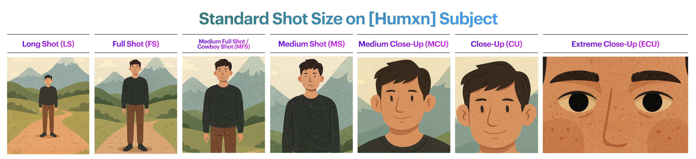
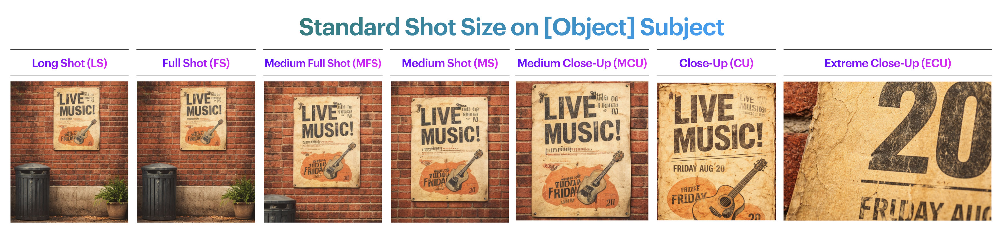
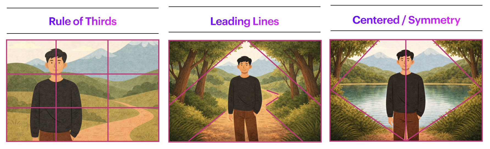

[MEDIAART 2B06](../README.md)

-------------------------------------------------------------------------------

<h1 style="color: darkred;">Photo Film (Individual)</h1>

## Goal

Create a **30-second black-and-white photo film** composed entirely of **still photographs**, organized into a **linear observational micro-narrative**.

This assignment introduces:
- photographic sequencing and rhythm  
- framing, composition, and depth of field  
- basic sound–image relationships  
- a complete workflow from idea → execution → post-production  

You will work **in pairs during class time** for support and feedback, but **each student must produce and submit an individual work**.

---

## Project Overview

- **Format:** 30-second photo film (still images only)
- **Images:** Approximately **10–18 photographs**
- **Narrative type:** Observational / micro-narrative
- **Location:** Any McMaster campus location, during class time only
- **Collaboration:** Work in pairs, submit individually
- **Dialogue:** Not allowed
- **Video footage:** Not allowed (stills only)

📌 *Meaning should emerge through sequencing, pacing, and visual relationships between images.*

## Examples

Año Uña (2010), by Jonás Cuarón
→ A photo-based film where rhythm and narrative emerge through uneven timing of still images, everyday observation, and post-hoc narrative construction.  
▶️ [Movie Trailer](https://www.youtube.com/watch?v=FV799cwkhCY){:target="_blank"}  
▶️ [Año Uña Clip - Diego's Toenail](https://www.youtube.com/watch?v=zf3c1gJj-PY){:target="_blank"}    
▶️ [Año Uña Clip - Molly & Diego On The Beach](https://www.youtube.com/watch?v=PO7PTDHuFqs){:target="_blank"}  
  
La Jetée (1962), by Chris Marker  
→ A canonical still-image film that constructs a powerful narrative entirely through sequencing, pacing, and voice-over, with almost no motion.  
▶️ [Full Movie](https://www.youtube.com/watch?v=Pf4AY_DI9BE){:target="_blank"}  

---

## Visual & Technical Constraints

### Photography
- Photographs must be taken **during class time**
- Images must be **static** (no video or motion capture)
- Use at least:
  - **3 different shot sizes** (excluding *Extreme Long Shot*)  
  - **1–2 compositional frameworks**
- Manual focus, tripod-based shooting
- Photos are captured **in colour** and converted to **black and white** in post-production

  

  

  

### Image Editing
Use *Adobe Photoshop* to:  
- Convert images to **black and white**
- Adjust **exposure and contrast only**
- Maintain **visual consistency** across the sequence
- No cropping, filters, effects, or retouching

---

## Sound

- **Music is required**, or **silence may be used if conceptually justified**
- Instrumental or ambient sound only (no lyrics)
- No sound effects
- Maximum **2 audio tracks**
- Sound should support pacing and rhythm, not dominate the sequence
- **Only royalty-free audio. Options:**
  - <a href="https://freesound.org" target="_blank" rel="noopener noreferrer">Freesound.org</a> — Ambient sounds, drones, textures, and minimal audio
  - <a href="https://freemusicarchive.org" target="_blank" rel="noopener noreferrer">Free Music Archive (FMA)</a> — Instrumental and experimental music (check licenses)
  - <a href="https://pixabay.com/music/" target="_blank" rel="noopener noreferrer">Pixabay Music</a> — Royalty-free instrumental tracks
  - <a href="https://mixkit.co/free-stock-music/" target="_blank" rel="noopener noreferrer">Mixkit</a> — Short, clean instrumental music
  - <a href="https://www.youtube.com/audiolibrary" target="_blank" rel="noopener noreferrer">YouTube Audio Library</a> — Free instrumental music and ambient tracks

📌 *This assignment introduces sound-image relationships in a minimal and intentional way.*

---

## In-Class Workflow (4 Hours)

**First 15 minutes:**  
Instructor overview of the assignment and expectations.

### 1. Brainstorming & Sketching
- Develop a simple observational idea that can be completed on campus
- Create **3–5 visual frame-moods** (rough sketches or notes)
- Sketches are a **starting point**, not a fixed script
- Be open to discovery during shooting

### 2. Shooting
- Photograph your sequence on campus
- Work with your partner for support and feedback
- You may appear in your partner’s images
- Bodies and faces are allowed (not from strangers)
- Faces of strangers should be avoided

📌 *Be mindful of shared spaces and respect others while photographing on campus.*

### 3. Group Image Analysis (20–30 min)
- Select **one photograph** from your shoot
- Convert it to black and white
- Adjust exposure/contrast if needed
- Group discussion will focus on **composition only**

### 4. Post-Production (Begin in Class)
You must begin post-production during class time.

---

## Post-Production Workflow

### Step 1 — Edit Photographs (Photoshop recommended)
- Convert selected images to black and white
- Adjust exposure and contrast for consistency
- Save edited images for sequencing

*(Lightroom may be used if preferred, but edits must remain minimal and consistent.)*

### Step 2 — Assemble in Adobe Premiere Pro
- Import still images
- Sequence images to create rhythm and pacing
- Total duration: **30 seconds**
- Add:
  - Music or silence
  - Simple title and credits
- Allowed transitions:
  - Jump cuts
  - Fade in / fade out only

🚫 No colour correction, effects, filters, or motion animation.

---

## Deliverables

### 1. Final Photo Film
- Format: **MP4**
- Codec: **H.264**
- Resolution: **1920 × 1080**
- Filename: `Name-Lastname-PhotoFilm.mp4`

### 2. Photo Selection PDF
A single PDF containing:
- Original photographs used in the sequence (straight from camera)
- Layout: **2 columns × 4 images per horizontal page**
- Filename: `Name-Lastname-Photos.pdf`

### 3. Project PDF
A one-page PDF including:
- Title
- Year
- Author
- **One-paragraph artistic description**
- **One representative still image**

---

## Assessment Notes

- This is a **learning-focused assignment**
- Roughness or minor technical imperfections are acceptable if decisions are intentional
- For an **A+**, work should demonstrate:
  - Proficiency in framing and composition
  - Consistent exposure and tonal control
  - Thoughtful sequencing and pacing

📌 *Consistency and application of theory are more important than ambition.*

---

## Important Notes

- You may support your partner during shooting, but **each student must independently make framing and sequencing decisions**.
- Partial submissions will result in a lower grade.
- You are responsible for saving and backing up your files.

