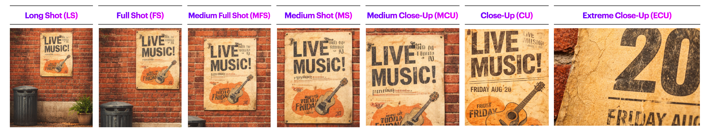
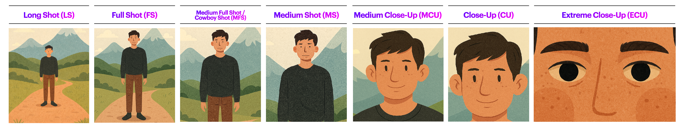

[MEDIAART 2B06](../README.md)

-------------------------------------------------------------------------------

<h1 style="color: darkred;">Photo Film (Individual)</h1>  

  

## Goal

Create a **30-second black-and-white photo film** composed entirely of **still photographs**, organized into a **observational micro-narrative**.

You will work **in pairs during class time** for support and feedback, but **each student must produce and submit an individual work**.  

> ❗ **Attendance and engagement are part of the rubric.**  
You are expected to work actively during class time and participate in all in-class activities.

---

## Project Overview

- **Camera Mode:** - Aperture Priority (Av)  
- **Format:** 30-second photo film (still images only)
- **Images:** Approximately **10–18 photographs**
- **Narrative type:** Observational / micro-narrative
- **Location:** Any McMaster campus location, during class time only
- **Collaboration:** Work in pairs, submit individually
- **Dialogue:** Not allowed
- **Video footage:** Not allowed (stills only)  

## Examples

**La Jetée** (1962), by Chris Marker   
→ A canonical still-image film that constructs a powerful narrative entirely through sequencing, pacing, and voice-over, with almost no motion.  
▶️ [Full Movie](https://www.youtube.com/watch?v=Pf4AY_DI9BE){:target="_blank"}    

**Año Uña** (2010), by Jonás Cuarón  
→ A photo-based film where rhythm and narrative emerge through uneven timing of still images, everyday observation, and post-hoc narrative construction.  
▶️ [Movie Trailer](https://www.youtube.com/watch?v=FV799cwkhCY){:target="_blank"}  
▶️ [Año Uña Clip - Diego's Toenail](https://www.youtube.com/watch?v=zf3c1gJj-PY){:target="_blank"}    
▶️ [Año Uña Clip - Molly & Diego On The Beach](https://www.youtube.com/watch?v=PO7PTDHuFqs){:target="_blank"}  

**Olga Karlovac** (Dubrovnik, Croatia)   
→ Olga uses her camera to capture fleeting moments and emotions. Working exclusively in black and white, predominantly after dark and in rainy conditions, her abstracted images blur the lines between figuration and visual poetry.   
🌐 [Artist's Website](https://olga-karlovac-photography.com/site/){:target="_blank"}    
🌐 [Google Images](https://www.google.com/search?q=olga+karlovac&sca_esv=727911a362dc4a92&sxsrf=ANbL-n6ZS_7GT0ENijSgTJu9qfuo0JTwDg%3A1767888054707&source=hp&ei=ttRfaZnZKM_XptQPpLKE4AY&iflsig=AFdpzrgAAAAAaV_ixnDeBQRlsOCtfMrSLTNoxo6CFbnp&udm=2&oq=olga+k&gs_lp=Egdnd3Mtd2l6IgZvbGdhIGsqAggAMg0QIxjwBRiABBgnGIoFMg4QLhiABBjHARjLARivATIIEC4YgAQYywEyCBAuGIAEGMsBMggQLhiABBjLATIIEC4YgAQYywEyCBAuGIAEGMsBMggQLhiABBjLATIIEAAYgAQYywEyCBAuGIAEGMsBSPUQUABYvQlwAHgAkAEAmAGOAqABxAeqAQUwLjUuMbgBA8gBAPgBAZgCBqAC5AfCAgQQIxgnwgIKECMY8AUYJxjJAsICChAuGIAEGEMYigXCAgUQABiABMICBRAuGIAEwgIKEAAYgAQYQxiKBcICCxAuGIAEGNEDGMcBwgILEC4YgAQYxwEYrwGYAwCSBwUwLjUuMaAHo3CyBwUwLjUuMbgH5AfCBwcwLjMuMi4xyAcWgAgA&sclient=gws-wiz){:target="_blank"}  

---

## Activities  
**Complete the following in order. Ask the professor or TAs for support or feedback.**  

<ul>
  <li><a href="#brainstorming">1. Brainstorming & Sketching</a></li>
  <li><a href="#shooting">2. Photographing</a></li>
  <li><a href="#photo-editing">3. Post-Production: Edit Photographs in Photoshop</a></li>
  <li><a href="#premiere">4. Post-Production: Assemble in Premiere Pro</a></li>
</ul>

---

<h3 id="brainstorming" style="color: darkred;">1. Brainstorming & Sketching [20 min]</h3>

Use the PDF worksheet below to:

- Develop a simple **observational micro-narrative or idea** that can be completed on campus
  > An **Observational micro-narrative** does not require a traditional beginning–middle–end storyline. Instead, you may focus on mood, atmosphere, or the gradual revealing of a character’s presence or situation through the sequence of photographs.
- Create **3–5 visual frame-moods** (rough sketches or notes)
- Treat sketches as a **starting point**, not a fixed script. **Remain open to discovery during shooting**

<a href="imgs/Photofilm_Brainstorming_Worksheet.pdf" target="_blank" rel="noopener noreferrer">
📄 Download / View Brainstorming & Sketching Worksheet (PDF)
</a>  
> If you use the physical version of this Worksheet, you must scan or take an image of each page and combine them into a PDF file.  
> You can use a simple Word document for this process.  
> Optional: <a href="https://www.ilovepdf.com/" target="_blank" rel="noopener noreferrer">https://www.ilovepdf.com/</a> - Choose: **JPG to PDF**.  

### Submission

- ➡️ **Export as PDF**
- 📄 **Filename:** `Name-Lastname-Brainstorming.pdf`

---

<h3 id="shooting" style="color: darkred;">2. Photographing [60 min]</h3>

During this phase, you will photograph your sequence on campus, applying the technical and conceptual tools introduced in Week 1.  

Check: [W1 - Tech Walkthrough](../TechWalks/TW-W1.md){:target="_blank"} - Intro to DSLR Photography for Photo Film Activity.     

**Notes to keep in mind:**  
- Set your aperture first. Start with ISO 100. If the camera selects a shutter speed that is too slow for a stable image, gradually increase the ISO (maximum ISO 800).
- In Aperture Priority (Av) mode, the camera automatically sets the shutter speed based on your aperture choice and the lighting conditions.
- A wider aperture (lower f-number) results in a faster shutter speed, while darker lighting conditions result in a slower shutter speed.  

### Photographing Requirements

- **Camera Mode:** - Aperture Priority (Av)
  > Photographs are captured **in colour** and converted to **black and white** in post-production 
- All photographs must be completed **during class time**
- Images must be **static stills** (no video or motion capture)
- Shoot in landscape  
- Use at least:
  - **3 different standard shot sizes** (excluding *Extreme Long Shot*)
  - **1–2 compositional frameworks**
  - Work with **depth of field**
- **Tripod-based** recommended

### Working in Pairs

- Work with your partner for **support and feedback**
- You may appear in your partner’s images
- Bodies and faces are allowed
- Faces of **strangers should be avoided**
  > *Be mindful of shared spaces and respect others while photographing on campus.*

---

  
  
  

---

### Create Your Photo Grid (For Submission)

After shooting (and before the next step), prepare a contact-sheet style PDF of your selected images.  

- Select **your final sequence of images** (10–18 photographs)
- **Paper size:** Letter (11 × 8.5 in)
- **Orientation:** Landscape
- Arrange images in a **2 × 4 grid per page**
- Use: PowerPoint, Word, Canva, Pages, or Keynote
- Export as **PDF**
- 📄 **Filename:** `Name-Lastname-Photos.pdf`

  

---  

<h3 id="photo-editing" style="color: darkred;">3. Post-Production: Edit Photographs in Photoshop [60 min]</h3>

**Check: [W1 - Tutorials](../Tutorials/index.html?file=T-W1.json){:target="_blank"} - Photoshop Fundamentals**   

Follow the tutorials to:  

- Convert selected images to **black and white**
- Adjust **exposure and contrast**
- Maintain **visual consistency** across the sequence
- Save edited images as **PNG** or **TIFF** for Premiere Pro sequencing

🚫 Do **not** crop, retouch, apply filters, or add effects at this stage.

---

### Group Image Analysis [4:00 PM – 4:25 PM]

#### **Before 4:00 PM (Preparation Required)**

- Select **one photograph** from your shoot  
- Convert it to **black and white**  
- Make **basic exposure and contrast adjustments**  
- Upload it to your assigned group link:
  - [Group 1 Link](https://www.dropbox.com/request/iGYWsf2A7x7LwSlwvLrk){:target="_blank"}
  - [Group 2 Link](https://www.dropbox.com/request/Lx5xCt6vkPROg0hrrJsd){:target="_blank"}
  - [Group 3 Link](https://www.dropbox.com/request/LtFQ086TcWNboxvisj4y){:target="_blank"}

#### **Group Assignments & Location**

- A printed list with groups and room assignments will be placed **at the Computer Lab entrance**
- Each group will work with an **assigned TA or the instructor** in a designated classroom

❗ **You must arrive at your assigned room at least 5 minutes before 4:00 PM**  
All students should be **ready to begin at 4:00 PM sharp**  

#### **During the Analysis Session**

- The TA/instructor will **randomly select images** from the uploaded submissions
- Images will be discussed collectively, focusing on:
  - **Framing**
  - **Composition**
  - **Shot size**
  - **Visual balance and structure**
- Students are expected to **actively contribute** to the discussion

❗ **Attendance and engagement during this activity are part of the rubric.**

---

<h3 id="premiere" style="color: darkred;">4. Post-Production: Assemble in Premiere Pro [Begin in Class]</h3>

**Check: [W1 - Tutorials](../Tutorials/index.html?file=T-W1.json){:target="_blank"} - Premiere Pro Fundamentals**   

Using your selected **10–18 photographs**, follow the tutorials to assemble your Photo Film.

- **Resolution:** 1920 × 1080
- Import still images and sequence images considering **rhythm and pacing**
- **Total duration:** 30 seconds
- Add:
  - Music or silence (see sound restrictions below)
  - A **simple title and credits**
- **Allowed transitions:**
  - Jump cuts
  - Fade in / fade out
  - **Cross overs** (simple/subtle temporal overlap between still images)

🚫 **Do not** use colour correction, filters, visual effects, motion animation, or stylized transitions.

➡️ **Export as MP4**   
Codec: **H.264**   
📄 **Filename:** `Name-Lastname-PhotoFilm.mp4`  

### Sound

- **Music is required**, or **silence may be used if conceptually justified**
- Instrumental or ambient sound only (no lyrics)
- No sound effects
- Sound should support **pacing and rhythm**, not dominate the sequence
- **Only royalty-free audio. Options:**
  - <a href="https://freesound.org" target="_blank" rel="noopener noreferrer">Freesound.org</a> — Ambient sounds, drones, textures, and minimal audio
  - <a href="https://freemusicarchive.org" target="_blank" rel="noopener noreferrer">Free Music Archive (FMA)</a> — Instrumental and experimental music (check licenses)
  - <a href="https://pixabay.com/music/" target="_blank" rel="noopener noreferrer">Pixabay Music</a> — Royalty-free instrumental tracks
  - <a href="https://mixkit.co/free-stock-music/" target="_blank" rel="noopener noreferrer">Mixkit</a> — Short, clean instrumental music
  - <a href="https://www.youtube.com/audiolibrary" target="_blank" rel="noopener noreferrer">YouTube Audio Library</a> — Free instrumental music and ambient tracks

---

### Project Info PDF

Create a **one-page document** including:

- **One representative still image**
- Title
- Year
- Author
- **3/4-line artistic description**

➡️ **Export as PDF**  
📄 **Filename:** `Name-Lastname-PhotoFilm.pdf`

---

<h3 style="color: darkred;">📤 Submission</h3>

| Item                    | Required Filename                 |
|-------------------------|-----------------------------------|
| Brainstorming PDF       | `Name-Lastname-Brainstorming.pdf` |
| Photo Contact Sheet PDF | `Name-Lastname-Photos.pdf`        |
| Final Photo Film MP4    | `Name-Lastname-PhotoFilm.mp4`     |
| Project Description PDF | `Name-Lastname-PhotoFilm.pdf`     |

> ⚠️ **Follow the submission protocols carefully. Incorrect submissions may result in lost points.**

________________________________________________________________________

Credits: Jessica A. Rodríguez

**AI Disclosure**:  
Microsoft CoPilot and ChatGPT was used for **editing and clarity only**, as well as to create some to the **image visualizations**. AI is not used to generate original course content.
