[MEDIAART 2B06](../README.md)

# Photo Film

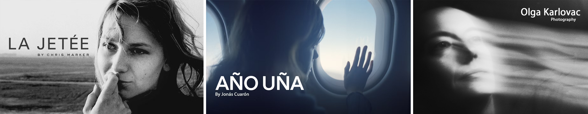

## Project goal

Create a **30-second black-and-white photo film** composed entirely of still photographs. Arrange the photographs into an **observational micro-narrative** using framing, sequencing, rhythm, and pacing.

You will work in pairs during class for technical support and feedback. However, each student must photograph, edit, assemble, and submit an individual project.

> Attendance, participation, and active engagement during class activities are part of the project rubric.

## Project overview

- **Format:** 30-second photo film
- **Number of photographs:** Approximately 8-12
- **Narrative approach:** Observational micro-narrative
- **Location:** A McMaster University campus location
- **Production time:** During class
- **Collaboration:** Work in pairs and submit individually
- **Image orientation:** Landscape
- **Final colour:** Black and white
- **Dialogue:** Not permitted
- **Video footage:** Not permitted

## Required camera settings

- **Shooting mode:** Aperture Priority (`Av`)
- **Image quality:** RAW + JPEG
- **White balance:** Daylight
- **Focus:** Manual Focus
- **Image Stabilization:** On when handheld; off when using a tripod
- **Flash:** Off
- **Auto Exposure Bracketing:** Off

## Project stages

Complete the following stages in order:

<!-- 
/////////////////
SECTION 1
/////////////////
-->

  

    1. Review the examples
    
      Examine how artists use still photography, sequencing, duration, and observation.
    
  

## La Jetée

**La Jetée** (1962), directed by Chris Marker, constructs a narrative almost entirely through still photographs. Meaning develops through sequencing, pacing, sound, narration, and the duration of each image.

[Watch La Jetée](https://vimeo.com/658254211){:target="_blank"}

## Año Uña

**Año Uña** (2007), directed by Jonás Cuarón, uses family photographs to create a fictional narrative. Rhythm and character emerge through image selection, uneven timing, repetition, and post-production.

- [Watch the trailer](https://www.youtube.com/watch?v=FV799cwkhCY){:target="_blank"}
- [Watch “Diego’s Toenail”](https://www.youtube.com/watch?v=zf3c1gJj-PY){:target="_blank"}
- [Watch “Molly and Diego on the Beach”](https://www.youtube.com/watch?v=PO7PTDHuFqs){:target="_blank"}

## Olga Karlovac

Olga Karlovac photographs fleeting moments, movement, and atmosphere. Her black-and-white street photography often uses blur, contrast, darkness, and abstraction to move between documentation and visual poetry.

- [Visit Olga Karlovac’s website](https://olga-karlovac-photography.com/site/){:target="_blank"}
- [View image examples](https://www.google.com/search?q=olga+karlovac&udm=2){:target="_blank"}

## Student Works

Through carefully curated sequences of black and white images, the students of MEDIAART 2B06 (Winter 2026) developed a series of concise 30-second photo-films.

[Online Gallery](https://media-studio-art.github.io/come-as-you-art/time-based/index.html){:target="_blank"}

<!-- 
/////////////////
SECTION 2
/////////////////
-->

  

    2. Photographic Composition
    
      Explore shot sizes and compositional frameworks before photographing your sequence.
    
  

## Types of shots

Shot size determines how much of the subject and surrounding space appears within the frame.

Each row shows one shot size using a human subject and an object.

**Select each photograph to read its description.**

  <!-- Long shot -->
  <section class="photography-example-row">
    <h3>Long Shot</h3>

    

      

        <input
          class="photo-reveal-card__toggle screen-reader-only"
          type="checkbox"
          id="long-shot-human"
        >

        <label
          class="photo-reveal-card__image"
          for="long-shot-human"
        >
          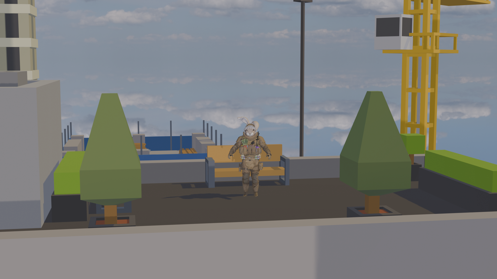
          
            Click to learn more
          
        </label>

        

           A long shot shows the complete person from a distance while giving significant visual importance to the surrounding environment.
        

      

      

        <input
          class="photo-reveal-card__toggle screen-reader-only"
          type="checkbox"
          id="long-shot-object"
        >

        <label
          class="photo-reveal-card__image"
          for="long-shot-object"
        >
          
          
            Click to learn more
          
        </label>

        

          A long shot presents the object from a distance so its relationship to the surrounding location remains important.
        

      

    

  </section>

  <!-- Full Shot -->
<section class="photography-example-row">
  <h3>Full Shot</h3>

  

    

      <input
        class="photo-reveal-card__toggle screen-reader-only"
        type="checkbox"
        id="full-shot-human"
      >

      <label
        class="photo-reveal-card__image"
        for="full-shot-human"
      >
        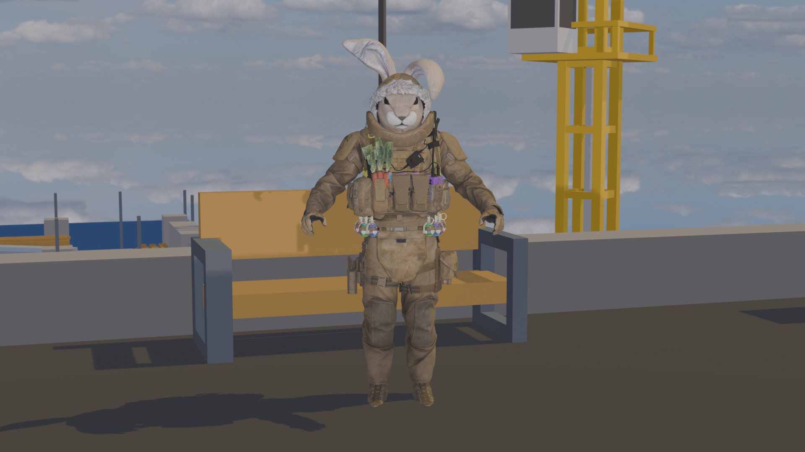
        
          Click to learn more
        
      </label>

      

        A full shot frames the entire person from head to toe while keeping the body as the main focus of the photograph.
      

    

    

      <input
        class="photo-reveal-card__toggle screen-reader-only"
        type="checkbox"
        id="full-shot-object"
      >

      <label
        class="photo-reveal-card__image"
        for="full-shot-object"
      >
        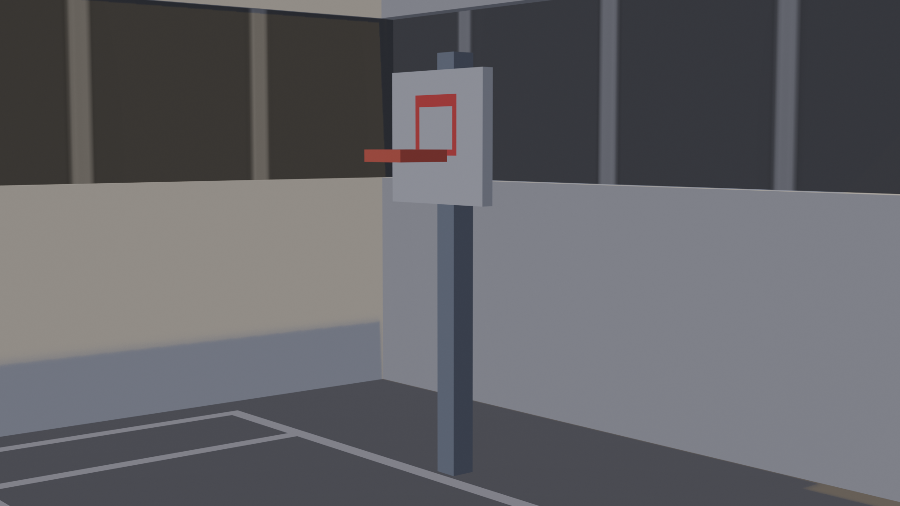
        
          Click to learn more
        
      </label>

      

        A full shot shows the complete object while reducing the amount of surrounding space visible in the frame.
      

    

  

</section>

<!-- Medium Full Shot / Cowboy Shot -->
<section class="photography-example-row">
  <h3>Medium Full Shot / Cowboy Shot</h3>

  

    

      <input
        class="photo-reveal-card__toggle screen-reader-only"
        type="checkbox"
        id="medium-full-shot-human"
      >

      <label
        class="photo-reveal-card__image"
        for="medium-full-shot-human"
      >
        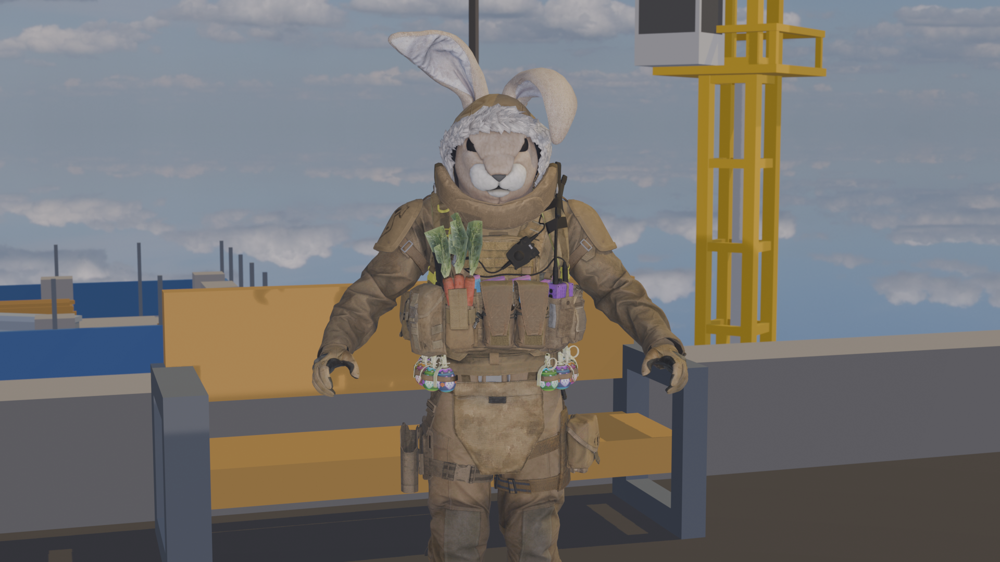
        
          Click to learn more
        
      </label>

      

        A medium full shot frames a person from approximately the head to the knees or mid-thigh, showing gesture and body language.
      

    

    

      <input
        class="photo-reveal-card__toggle screen-reader-only"
        type="checkbox"
        id="medium-full-shot-object"
      >

      <label
        class="photo-reveal-card__image"
        for="medium-full-shot-object"
      >
        
        
          Click to learn more
        
      </label>

      

        A medium full shot frames most of the object while retaining enough surrounding space to provide context.
      

    

  

</section>

  <!-- Medium shot -->
  <section class="photography-example-row">
    <h3>Medium Shot</h3>

    

      

        <input
          class="photo-reveal-card__toggle screen-reader-only"
          type="checkbox"
          id="medium-shot-human"
        >

        <label
          class="photo-reveal-card__image"
          for="medium-shot-human"
        >
          
          
            Click to learn more
          
        </label>

        

          A medium shot usually frames a person from approximately the waist up while retaining some surrounding context.
        

      

      

        <input
          class="photo-reveal-card__toggle screen-reader-only"
          type="checkbox"
          id="medium-shot-object"
        >

        <label
          class="photo-reveal-card__image"
          for="medium-shot-object"
        >
          
          
            Click to learn more
          
        </label>

        

          A medium shot gives the object greater visual importance while still showing part of its surroundings.
        

      

    

  </section>

  <!-- Medium Close-Up -->
<section class="photography-example-row">
  <h3>Medium Close-Up</h3>

  

    

      <input
        class="photo-reveal-card__toggle screen-reader-only"
        type="checkbox"
        id="medium-close-up-human"
      >

      <label
        class="photo-reveal-card__image"
        for="medium-close-up-human"
      >
        
        
          Click to learn more
        
      </label>

      

        A medium close-up usually frames a person from the chest or shoulders upward, emphasizing facial expression while retaining some body language.
      

    

    

      <input
        class="photo-reveal-card__toggle screen-reader-only"
        type="checkbox"
        id="medium-close-up-object"
      >

      <label
        class="photo-reveal-card__image"
        for="medium-close-up-object"
      >
        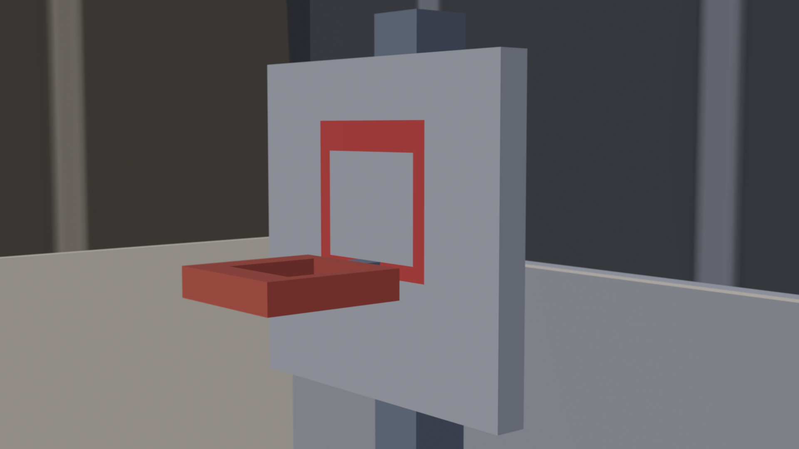
        
          Click to learn more
        
      </label>

      

        A medium close-up presents a large portion of the object while keeping a small amount of surrounding context visible.
      

    

  

</section>

  <!-- Close-up -->
  <section class="photography-example-row">
    <h3>Close-Up</h3>

    

      

        <input
          class="photo-reveal-card__toggle screen-reader-only"
          type="checkbox"
          id="close-up-human"
        >

        <label
          class="photo-reveal-card__image"
          for="close-up-human"
        >
          
          
            Click to learn more
          
        </label>

        

          A close-up emphasizes the face, expression, or gesture while reducing the surrounding visual information.
        

      

      

        <input
          class="photo-reveal-card__toggle screen-reader-only"
          type="checkbox"
          id="close-up-object"
        >

        <label
          class="photo-reveal-card__image"
          for="close-up-object"
        >
          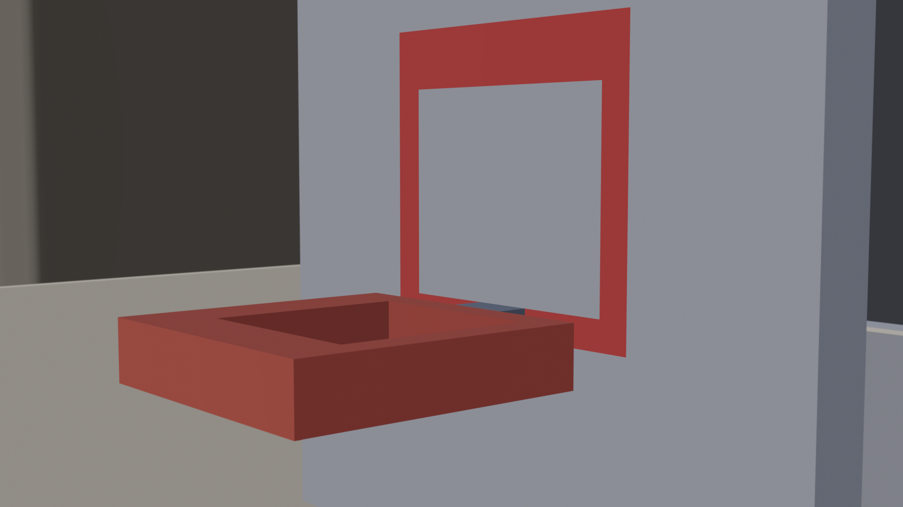
          
            Click to learn more
          
        </label>

        

          A close-up directs attention toward the object’s form, surface, function, or important details.
        

      

    

  </section>

  <!-- Extreme close-up -->
  <section class="photography-example-row">
    <h3>Extreme Close-Up</h3>

    

      

        <input
          class="photo-reveal-card__toggle screen-reader-only"
          type="checkbox"
          id="extreme-close-up-human"
        >

        <label
          class="photo-reveal-card__image"
          for="extreme-close-up-human"
        >
          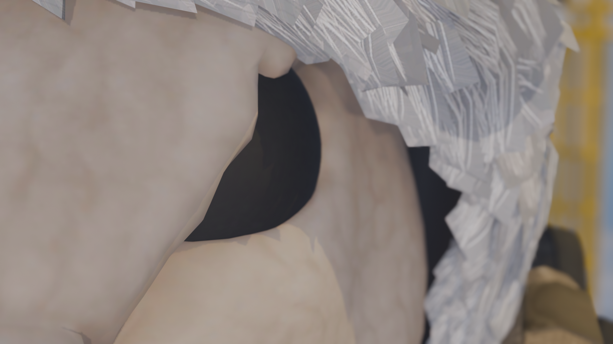
          
            Click to learn more
          
        </label>

        

          An extreme close-up isolates a small bodily detail, such as an eye, hand, or section of the face.
        

      

      

        <input
          class="photo-reveal-card__toggle screen-reader-only"
          type="checkbox"
          id="extreme-close-up-object"
        >

        <label
          class="photo-reveal-card__image"
          for="extreme-close-up-object"
        >
          
          
            Click to learn more
          
        </label>

        

          An extreme close-up isolates a small detail and emphasizes texture, material, pattern, or shape.
        

      

    

  </section>

## Compositional frameworks

Composition describes how subjects, objects, lines, and empty spaces are organized within the photographic frame.

**Select each photograph to learn how the composition is structured.**

  <!-- First row -->
  <section class="photography-example-row">

    

      

        <input
          class="photo-reveal-card__toggle screen-reader-only"
          type="checkbox"
          id="composition-rule-of-thirds"
        >

        <label
          class="photo-reveal-card__image"
          for="composition-rule-of-thirds"
        >
          

          
            Rule of Thirds
          

          
            Click to learn more
          
        </label>

        

          The subject is positioned along an imaginary grid line or intersection instead of directly in the centre.
        

      

      

        <input
          class="photo-reveal-card__toggle screen-reader-only"
          type="checkbox"
          id="composition-golden-ratio"
        >

        <label
          class="photo-reveal-card__image"
          for="composition-golden-ratio"
        >
          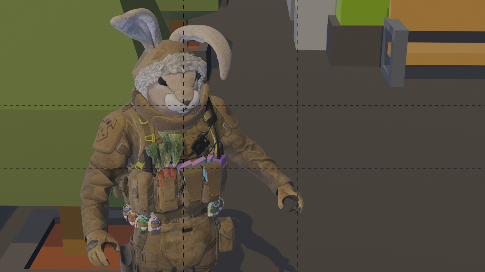

          
            Golden Ratio
          

          
            Click to learn more
          
        </label>

        

          The visual elements follow a proportional or spiral arrangement that guides the viewer’s eye through the frame.
        

      

    

  </section>

  <!-- Second row -->
  <section class="photography-example-row">

    

      

        <input
          class="photo-reveal-card__toggle screen-reader-only"
          type="checkbox"
          id="composition-leading-lines"
        >

        <label
          class="photo-reveal-card__image"
          for="composition-leading-lines"
        >
          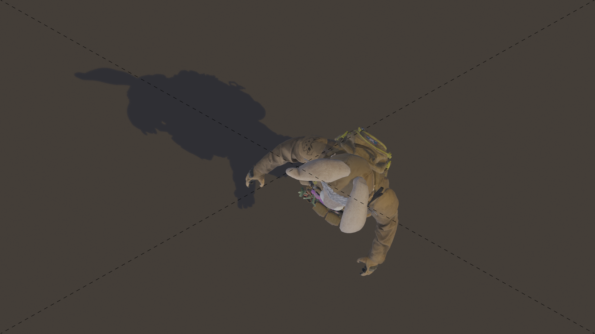

          
            Leading Lines
          

          
            Click to learn more
          
        </label>

        

          Visible lines guide the viewer’s eye through the frame or toward the main subject.
        

      

      

        <input
          class="photo-reveal-card__toggle screen-reader-only"
          type="checkbox"
          id="composition-centred-symmetrical"
        >

        <label
          class="photo-reveal-card__image"
          for="composition-centred-symmetrical"
        >
          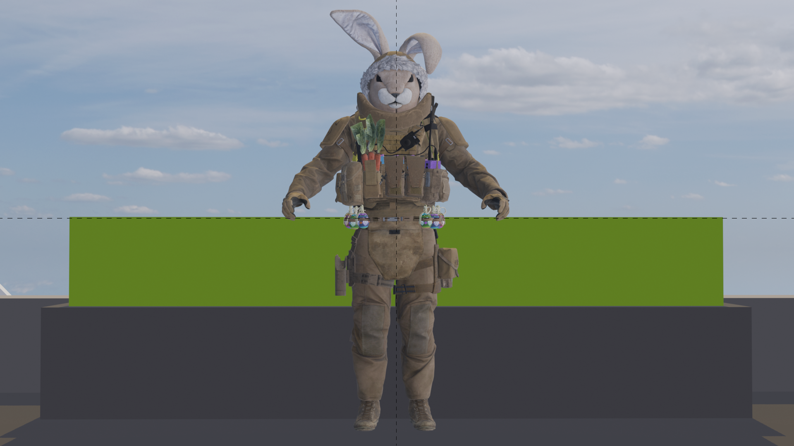

          
            Centred and Symmetrical
          

          
            Click to learn more
          
        </label>

        

          The subject is placed near the centre while visual elements are balanced across both sides of the frame.
        

      

    

  </section>

> These frameworks are starting points rather than strict rules. Choose the approach that best supports the subject, space, and mood of your photograph.

## Depth of Field

Depth of field describes how much of the image appears sharp.

**Click each image to learn more.**

  

    <input
      class="photo-reveal-card__toggle screen-reader-only"
      type="checkbox"
      id="depth-of-field-1"
    >

    <label
      class="photo-reveal-card__image"
      for="depth-of-field-1"
    >
      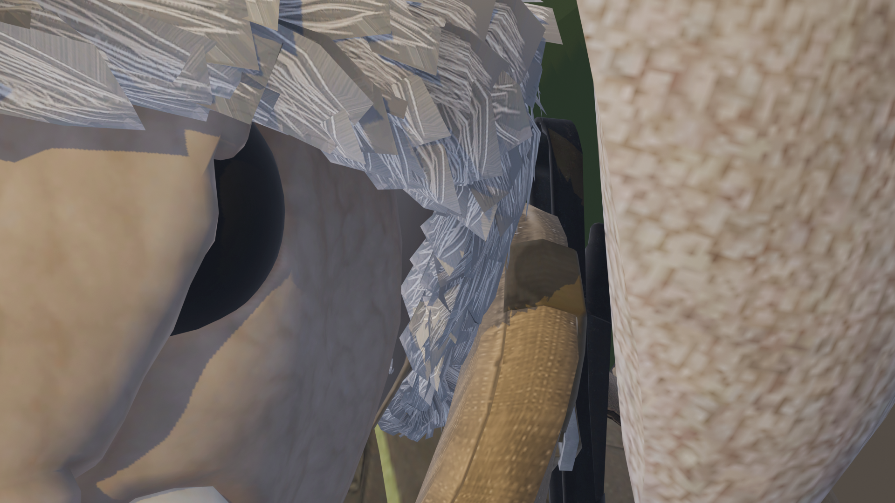
      
        Deep Depth of Field
      
      
        Click to learn more
      
    </label>

    

      Most areas of the image appear sharp, so attention is shared across the scene.
    

  

  

    <input
      class="photo-reveal-card__toggle screen-reader-only"
      type="checkbox"
      id="depth-of-field-2"
    >

    <label
      class="photo-reveal-card__image"
      for="depth-of-field-2"
    >
      
      
        Shallow Depth of Field
      
      
        Click to learn more
      
    </label>

    

      Only one part of the image is in focus, while the rest becomes blurred.
    

  

  

    <input
      class="photo-reveal-card__toggle screen-reader-only"
      type="checkbox"
      id="depth-of-field-3"
    >

    <label
      class="photo-reveal-card__image"
      for="depth-of-field-3"
    >
      
      
        Shifted Focus
      
      
        Click to learn more
      
    </label>

    

      The focus has moved to a different area, changing which part of the image stands out.
    

  

> A shallow depth of field helps direct attention to a specific part of the image, while a deep depth of field keeps more of the scene visible and sharp.

<!-- 
/////////////////
SECTION 3
/////////////////
-->

  

    3. Brainstorm and sketch
    
      Develop an observational idea and prepare several possible frames before photographing.
    
  

## Observational micro-narrative

An **observational micro-narrative** does not require a traditional beginning, middle, and end.

Your sequence may instead focus on:

- A person moving through a location
- A repeated gesture or action
- A change in light, distance, or perspective
- A gradual reveal of a subject
- A relationship between a person and a space
- An overlooked event or detail
- A particular mood or atmosphere

The narrative should emerge through the selection and arrangement of photographs rather than through dialogue or explanatory text.

## Brainstorming activity

Use this [Brainstorming and Sketching Worksheet](imgs/Photofilm_Brainstorming_Worksheet.pdf){:target="_blank"} to:

- Develop a simple observational idea that can be **completed on campus**
- Consider what may change across the sequence
- Create 3–5 visual frame-moods using sketches or written notes
- Consider possible shot sizes and compositions
- Plan a starting point without creating a fixed script

> Your sketches are a starting point. Remain open to unexpected actions, details, and visual relationships while photographing.

**Notes:** 
- When using the physical worksheet, scan or photograph every completed page and combine the pages into one PDF.
- You may use Word, PowerPoint, Pages, or another document application to create the PDF.

### Brainstorming submission

- **Format:** PDF
- **Filename:** `Name-Lastname-Brainstorming.pdf`

<!-- 
/////////////////
SECTION 4
/////////////////
-->

  

    4. Prepare the camera
    
      Confirm the required camera settings before beginning the photo sequence.
    
  

Review the [Week 1 DSLR Photography Technical Walkthrough](../TechWalks/TW-W1.md){:target="_blank"} before beginning.

<fieldset class="equipment-checklist">
  <legend>Photo Film camera setup</legend>

  <label class="checklist-item">
    <input type="checkbox">
    
      <strong>Set the shooting mode to <code>Av</code>.</strong>
      In Aperture Priority mode, you select the aperture and the camera selects the shutter speed.
    
  </label>

  <label class="checklist-item">
    <input type="checkbox">
    
      <strong>Set the image quality to RAW + JPEG.</strong>
      Keep both versions of every photograph. Use the RAW files for editing and the JPEG files for quick review.
    
  </label>

  <label class="checklist-item">
    <input type="checkbox">
    
      <strong>Set White Balance to Daylight.</strong>
      A fixed white-balance setting keeps the colour consistent across the sequence.
    
  </label>

  <label class="checklist-item">
    <input type="checkbox">
    
      <strong>Set the lens to Manual Focus.</strong>
      Move the focus switch on the lens from <code>AF</code> to <code>MF</code>.
    
  </label>

  <label class="checklist-item">
    <input type="checkbox">
    
      <strong>Set Image Stabilization for the way you are shooting.</strong>
      Keep stabilization on when holding the camera. Turn it off when the camera is secured to a tripod.
    
  </label>

  <label class="checklist-item">
    <input type="checkbox">
    
      <strong>Confirm that the flash is off.</strong>
      Do not use the built-in flash for this activity.
    
  </label>

  <label class="checklist-item">
    <input type="checkbox">
    
      <strong>Confirm that Auto Exposure Bracketing is off.</strong>
      The exposure scale should display a single marker at <code>0</code>, not three separate markers.
    
  </label>

  <label class="checklist-item">
    <input type="checkbox">
    
      <strong>Choose an aperture.</strong>
      Consider whether you want a shallow depth of field or more of the scene to remain sharp.
    
  </label>

  <label class="checklist-item">
    <input type="checkbox">
    
      <strong>Begin at <code>ISO 100</code>.</strong>
      Increase the ISO gradually only when the camera selects a shutter speed that is too slow for a stable image.
    
  </label>
</fieldset>

**Notes:**
- In `Av` mode, the camera changes the shutter speed in response to your aperture, ISO, and available light.
- A wider aperture uses a lower f-number and allows more light into the camera. A darker environment or narrower aperture may produce a slower shutter speed.

<!-- 
/////////////////
SECTION 5
/////////////////
-->

  

    5. Photograph the sequence
    
      Create an observational sequence using shot size, composition, focus, and depth of field.
    
  

You have approximately **60 minutes** to photograph your sequence on campus.

## Photographing requirements

Your photographs must:

- Be completed during class time
- Be captured in colour
- Use **landscape orientation**
- Be created specifically for this project
- **Include at least three different shot sizes**
- **Use one or two compositional frameworks**
- Explore depth of field

> A tripod is recommended when working with precise framing or slower shutter speeds.

## Working in pairs

Work with a partner for:

- Technical support
- Feedback on framing and focus
- Assistance with the tripod
- Participation as a subject in a photograph
- Help maintaining continuity between shots

Each student must still create a separate photographic sequence.

Bodies and faces are permitted, but avoid photographing identifiable strangers without their permission.

> Be mindful of shared spaces. Do not block hallways, entrances, classrooms, or accessibility routes.

## Photographing checklist

<fieldset class="equipment-checklist">
  <legend>Sequence production checklist</legend>

  <label class="checklist-item">
    <input type="checkbox">
    
      <strong>Confirm the location and observational idea.</strong>
      Make sure the sequence can be completed safely during the available class time.
    
  </label>

  <label class="checklist-item">
    <input type="checkbox">
    
      <strong>Check the aperture, ISO, and focus.</strong>
      Review the settings before taking the first photograph.
    
  </label>

  <label class="checklist-item">
    <input type="checkbox">
    
      <strong>Photograph more images than you expect to use.</strong>
      Your final sequence will contain approximately 8-12 photographs. It is highly recommended you take the tripple of this amount.
    
  </label>

  <label class="checklist-item">
    <input type="checkbox">
    
      <strong>Use at least three shot sizes.</strong>
      Create visual variation while maintaining continuity across the sequence.
    
  </label>

  <label class="checklist-item">
    <input type="checkbox">
    
      <strong>Use one or two compositional frameworks.</strong>
      Apply them intentionally rather than changing the composition randomly.
    
  </label>

  <label class="checklist-item">
    <input type="checkbox">
    
      <strong>Experiment with depth of field.</strong>
      Consider which subjects or areas should appear sharp.
    
  </label>

  <label class="checklist-item">
    <input type="checkbox">
    
      <strong>Review focus and exposure regularly.</strong>
      Magnify important photographs on the camera screen to check sharpness.
    
  </label>

  <label class="checklist-item">
    <input type="checkbox">
    
      <strong>Keep the visual approach consistent.</strong>
      Consider framing, camera height, contrast, direction, and subject placement.
    
  </label>
</fieldset>

<!-- 
/////////////////
SECTION 6
/////////////////
-->

  

    6. Transfer and back up the photographs
    
      Copy the RAW and JPEG files to a computer and create a second copy.
    
  

<fieldset class="equipment-checklist">
  <legend>File transfer and backup checklist</legend>

  <label class="checklist-item">
    <input type="checkbox">
    
      <strong>Turn off the camera.</strong>
      Set the power switch to <code>OFF</code> before removing the SD card.
    
  </label>

  <label class="checklist-item">
    <input type="checkbox">
    
      <strong>Remove the SD card and insert it into a card reader.</strong>
      Wait for the card to appear on the computer.
    
  </label>

  <label class="checklist-item">
    <input type="checkbox">
    
      <strong>Open the <code>DCIM</code> folder.</strong>
      Locate the RAW and JPEG files created during the shoot.
    
  </label>

  <label class="checklist-item">
    <input type="checkbox">
    
      <strong>Create a clearly named project folder.</strong>
      Use a name such as <code>Lastname_PhotoFilm_Date</code>.
    
  </label>

  <label class="checklist-item">
    <input type="checkbox">
    
      <strong>Copy all RAW and JPEG files to the project folder.</strong>
      Wait until the transfer is complete before removing the card.
    
  </label>

  <label class="checklist-item">
    <input type="checkbox">
    
      <strong>Open several files to confirm the transfer.</strong>
      Check that the photographs display correctly.
    
  </label>

  <label class="checklist-item">
    <input type="checkbox">
    
      <strong>Create a second copy of the project folder.</strong>
      Save it to an external drive or cloud-storage service.
    
  </label>

  <label class="checklist-item">
    <input type="checkbox">
    
      <strong>Eject the SD card safely.</strong>
      Use the computer’s eject function before removing the card.
    
  </label>
</fieldset>

> Do not edit files directly from the SD card. Do not format or erase the card until the files have been confirmed in at least two locations.

Keep the original photographs unchanged. Create separate folders for original and edited files.

<!-- 
/////////////////
SECTION 7
/////////////////
-->

  

    7. Create the photo contact sheet
    
      Select the final sequence and arrange the photographs in a contact-sheet PDF.
    
  

Select approximately **8-12 photographs** that could form your final sequence.

Arrange the selected photographs in a contact-sheet document using PowerPoint, Word, Canva, Pages, Keynote, or another layout application.

## Contact-sheet requirements

- **Page size:** Letter, 11 × 8.5 inches
- **Orientation:** Landscape
- **Layout:** 2 × 4 image grid per page
- **Image size:** All photographs must appear at the same size
- **Alignment:** Photographs must be evenly spaced and perfectly aligned within the grid
- **Colour:** Photographs must remain in colour; do not convert them to black and white at this stage
- **File format:** PDF

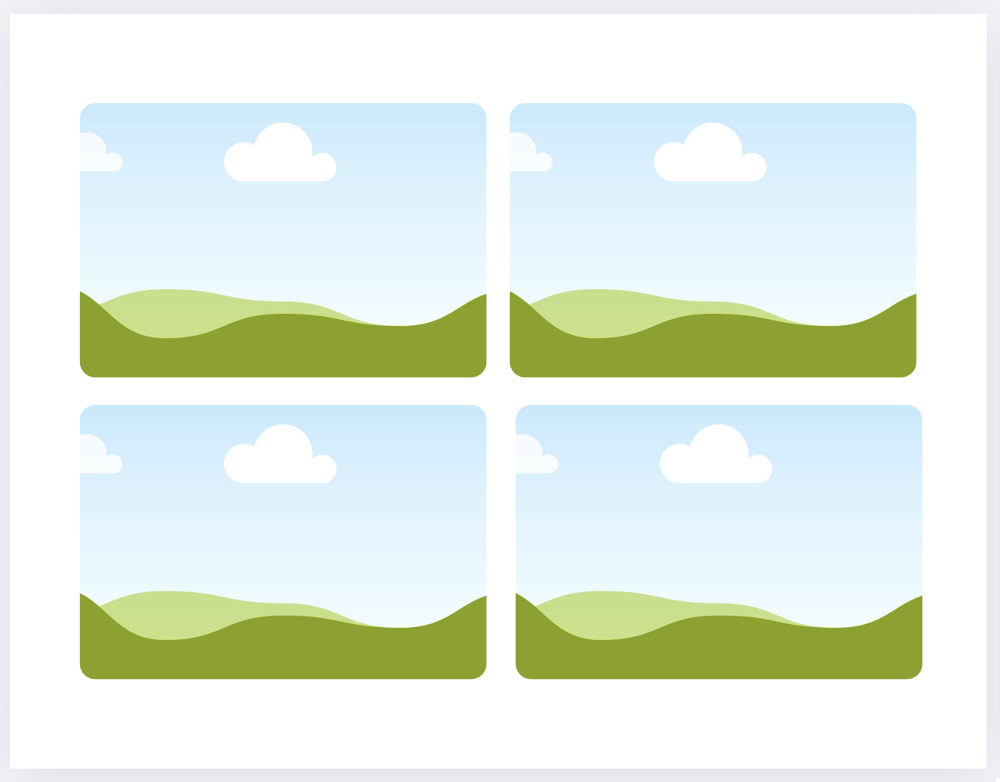

Review the sequence before exporting:

- Does each photograph contribute something new?
- Is the main subject or action understandable?
- Are there useful changes in shot size and perspective?
- Does the sequence contain unnecessary repetition?
- Does the image order create rhythm or progression?

### Contact-sheet submission

- **Format:** PDF
- **Filename:** `Name-Lastname-Photos.pdf`

<!-- 
/////////////////
SECTION 8
/////////////////
-->

  

    8. Edit the photographs in Photoshop
    
      Convert the selected photographs to black and white and create visual consistency.
    
  

You have approximately **60 minutes** for this stage.

Review the [Week 1 Photoshop Fundamentals tutorials](../Tutorials/index.html?file=T-W1.json){:target="_blank"}.

Use the RAW files whenever possible.

## Required adjustments

- Convert every selected photograph to black and white
- Adjust exposure
- Adjust contrast
- Preserve detail in important highlights and shadows
- Maintain visual consistency across the sequence
- Export the edited photographs as PNG or TIFF files

## Restrictions

Do not:

- Crop the photographs
- Retouch or remove elements
- Apply filters
- Add textures
- Add visual effects
- Use stylized colour treatments
- Introduce generated imagery

Create a separate folder for the edited files. Do not overwrite the original RAW or JPEG photographs.

<!-- 
/////////////////
SECTION 9
/////////////////
-->

  

    9. Participate in the group image analysis
    
      Prepare one photograph and contribute to a guided discussion about visual structure.
    
  

## Before 4:00 p.m.

Complete the following before the analysis session:

<fieldset class="equipment-checklist">
  <legend>Image analysis preparation</legend>

  <label class="checklist-item">
    <input type="checkbox">
    
      <strong>Select one photograph from your shoot.</strong>
      Choose an image that would benefit from discussion and feedback.
    
  </label>

  <label class="checklist-item">
    <input type="checkbox">
    
      <strong>Convert the photograph to black and white.</strong>
      Complete the conversion in Photoshop.
    
  </label>

  <label class="checklist-item">
    <input type="checkbox">
    
      <strong>Make basic exposure and contrast adjustments.</strong>
      Do not add effects or filters.
    
  </label>

  <label class="checklist-item">
    <input type="checkbox">
    
      <strong>Upload the photograph to your assigned group link.</strong>
      Complete the upload before arriving at the assigned room.
    
  </label>
</fieldset>

- [Group 1 upload](https://www.dropbox.com/request/iGYWsf2A7x7LwSlwvLrk){:target="_blank"}
- [Group 2 upload](https://www.dropbox.com/request/Lx5xCt6vkPROg0hrrJsd){:target="_blank"}
- [Group 3 upload](https://www.dropbox.com/request/LtFQ086TcWNboxvisj4y){:target="_blank"}

## Group assignments and location

A printed list of group and room assignments will be placed at the entrance to the Computer Lab.

Arrive at the assigned room at least five minutes before 4:00 p.m. The analysis begins at 4:00 p.m.

## During the analysis

The instructor or TA will select images from the group submissions for collective discussion.

The discussion will focus on:

- Framing
- Composition
- Shot size
- Visual balance
- Subject placement
- Depth of field
- Relationships between visual elements

Students are expected to observe closely and contribute actively.

> Attendance and engagement during the group image analysis are part of the project rubric.

<!-- 
/////////////////
SECTION 10
/////////////////
-->

  

    10. Assemble the photo film in Premiere Pro
    
      Sequence the edited photographs and use duration, rhythm, sound, and transitions to shape the work.
    
  

Review the [Week 1 Premiere Pro Fundamentals tutorials](../Tutorials/index.html?file=T-W1.json){:target="_blank"}.

## Sequence requirements

- **Resolution:** 1920 × 1080
- **Duration:** Exactly 30 seconds
- **Number of photographs:** Approximately 10–18
- **Image orientation:** Landscape
- **Image colour:** Black and white
- **Video footage:** Not permitted
- **Motion animation:** Not permitted

Arrange the photographs by considering:

- Image order
- Duration
- Repetition
- Rhythm
- Pacing
- Contrast
- Continuity
- Visual transitions between frames

Different photographs may remain on screen for different lengths of time.

## Titles and credits

Include:

- A simple project title
- Your name
- A brief final credit

Keep the typography readable and visually consistent with the work.

## Permitted transitions

You may use:

- Straight cuts
- Fade in
- Fade out
- Simple cross-dissolves

Do not use:

- Stylized transitions
- Motion presets
- Filters
- Visual effects
- Animated photographs
- Colour effects
- Additional colour correction in Premiere Pro

## Sound

Use either:

- Instrumental or ambient music, or
- Silence when conceptually justified

Do not use:

- Lyrics
- Dialogue
- Sound effects
- Copyrighted commercial music without permission

Sound should support the rhythm and pacing of the photographs without dominating the work.

Royalty-free sources include:

- [Freesound](https://freesound.org){:target="_blank"}
- [Free Music Archive](https://freemusicarchive.org){:target="_blank"}
- [Pixabay Music](https://pixabay.com/music/){:target="_blank"}
- [Mixkit](https://mixkit.co/free-stock-music/){:target="_blank"}
- [YouTube Audio Library](https://www.youtube.com/audiolibrary){:target="_blank"}

Check the licence and attribution requirements before using any audio.

## Export settings

- **Format:** H.264
- **File type:** MP4
- **Filename:** `Name-Lastname-PhotoFilm.mp4`

Watch the complete exported file before submitting it. Confirm that the duration, image quality, sound, titles, and credits are correct.

<!-- 
/////////////////
SECTION 11
/////////////////
-->

  

    11. Create the project information PDF
    
      Present the basic project information and a short artistic description.
    
  

Create a one-page document containing:

- One representative still image
- Project title
- Year
- Your name
- A three- or four-line artistic description

The description should briefly identify:

- What the sequence observes
- The location, situation, or subject
- The visual or narrative approach
- The atmosphere or idea explored through the work

### Project information submission

- **Format:** PDF
- **Filename:** `Name-Lastname-PhotoFilm.pdf`

<!-- 
/////////////////
SECTION 12
/////////////////
-->

  

    12. Submit the project
    
      Confirm the filenames and submit all four required components.
    
  

<fieldset class="equipment-checklist">
  <legend>Final submission checklist</legend>

  <label class="checklist-item">
    <input type="checkbox">
    
      <strong>Brainstorming PDF</strong>
      <code>Name-Lastname-Brainstorming.pdf</code>
    
  </label>

  <label class="checklist-item">
    <input type="checkbox">
    
      <strong>Photo contact-sheet PDF</strong>
      <code>Name-Lastname-Photos.pdf</code>
    
  </label>

  <label class="checklist-item">
    <input type="checkbox">
    
      <strong>Final Photo Film</strong>
      <code>Name-Lastname-PhotoFilm.mp4</code>
    
  </label>

  <label class="checklist-item">
    <input type="checkbox">
    
      <strong>Project information PDF</strong>
      <code>Name-Lastname-PhotoFilm.pdf</code>
    
  </label>

  <label class="checklist-item">
    <input type="checkbox">
    
      <strong>Open every file before submitting.</strong>
      Confirm that each file displays or plays correctly.
    
  </label>

  <label class="checklist-item">
    <input type="checkbox">
    
      <strong>Check every filename.</strong>
      Make sure your name and the required project title are included.
    
  </label>

  <label class="checklist-item">
    <input type="checkbox">
    
      <strong>Confirm that the video is exactly 30 seconds.</strong>
      Check the exported MP4 rather than relying only on the Premiere Pro timeline.
    
  </label>
</fieldset>

> Follow the submission protocol carefully. Missing files, incorrect formats, or incorrect filenames may affect the project grade.

<!-- 
/////////////////
SECTION 13
/////////////////
-->

  

    13. Recharge and return the camera
    
      Protect the equipment, recharge the battery, and return the complete kit.
    
  

<fieldset class="equipment-checklist">
  <legend>Camera return checklist</legend>

  <label class="checklist-item">
    <input type="checkbox">
    
      <strong>Confirm that the files have been transferred and backed up.</strong>
      Make sure the photographs exist in at least two locations.
    
  </label>

  <label class="checklist-item">
    <input type="checkbox">
    
      <strong>Turn off the camera.</strong>
      Move the power switch to <code>OFF</code>.
    
  </label>

  <label class="checklist-item">
    <input type="checkbox">
    
      <strong>Replace the lens cap.</strong>
      Secure the cap before placing the camera in its case.
    
  </label>

  <label class="checklist-item">
    <input type="checkbox">
    
      <strong>Recharge the battery.</strong>
      Charge the battery fully before returning the equipment.
    
  </label>

  <label class="checklist-item">
    <input type="checkbox">
    
      <strong>Gather all borrowed equipment.</strong>
      Include the camera, lens, battery, charger, strap, SD card, tripod, and any additional accessories.
    
  </label>

  <label class="checklist-item">
    <input type="checkbox">
    
      <strong>Return the complete equipment kit.</strong>
      Place every item in its correct case or compartment.
    
  </label>
</fieldset>

> Report missing, damaged, or malfunctioning equipment when returning the kit.

---

Credits: Jessica A. Rodríguez