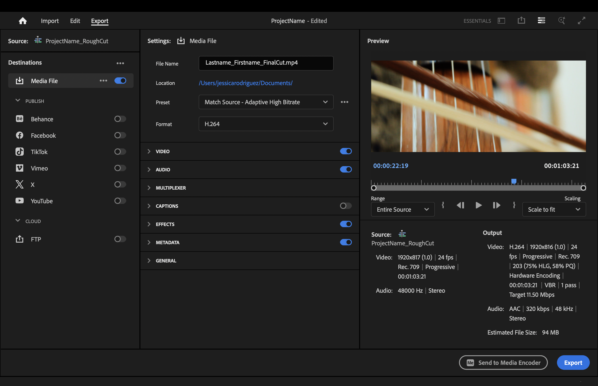

[MEDIAART 2B06](../README.md)

-------------------------------------------------------------------------------

<h1 style="color: darkred;">W12 & W13 - Final Cut & Class Screening</h1>  

Refine and finalize picture, sound, and colour for your one-minute short, and prepare professional documentation for final submission and public screening.

> ❗ **Attendance and engagement are part of the rubric.**  
You are expected to work actively during class time and participate in all in-class activities.

---

## Activities  
**Complete the following in order. Ask the professor or TAs for support or feedback.**  

<ul>
  <li><a href="#final-assembly-">Activity 1: Final Assembly [1h]</a></li>
  <li><a href="#final-sound">Activity 2: Final Sound Design in Audition [2h]</a></li>
  <li><a href="#final-color">Activity 3: Final Colour Correction in Premiere [1h]</a></li>
  <li><a href="#portfolio">Final Package Assemblage [30m]</a></li>
  <li><a href="#submission">📤 Submission</a></li>
</ul>  

---

<h2 id="logline" style="color: darkred;">Activity 1: Final Assembly [30m]</h2>

Before anything else, finalize your sequence and confirm **picture lock**.  
> Picture lock means: **no more changes to timing, shot order, or duration**.

---

### Step 1 — Review Your Rough Cut

Watch your latest sequence from beginning to end.

Focus on:

- clarity of the sequence  
- pacing and rhythm  
- shot necessity (remove anything redundant)  
- transitions (keep them minimal and intentional)  

### Step 2 — Apply Final Adjustments

Make final corrections:

- trim or extend shots slightly  
- remove unnecessary shots  
- refine transitions (prefer cuts or simple crossfades)  
- confirm total duration is **1 minute (without titles)**  

### Step 3 — Add Titles

Add **opening and closing titles** to your sequence.

Guidelines:

- Titles include: film title, author name, and credits  
- Titles must be **clear, readable, and simple**  
- Avoid excessive animation or distracting effects  

> ⚠️ Titles can extend the total duration of your project by **up to 10 seconds maximum**.  
> (Final runtime: **1:00 + up to 10s for titles**)
> Do **NOT** include the name of this class in your titles.

### Step 4 — Confirm Picture Lock

Once complete:

- Do **NOT** change shot timing after this point  
- Lock your sequence visually (excluding titles if minor adjustments are needed)

> ⚠️ All sound design and colour grading must now adapt to this locked sequence.

### Step 5 — Export Temporary Version

Export a temporary version of your sequence **for identifying corrections**.  
- Save it as `ProjectName_PictureLock.mp4` inside folder: 📁 `03_Renders`.  

> ⚠️ Temporary versions will be checked for grading at the end of the class.  

- Review the export and make any final corrections before moving into **Activity 2**.

---

<h2 id="final-sound" style="color: darkred;">Activity 2: Final Sound Design & Mix in Audition [2h]</h2>

In this activity, you will build your **full sound design**, combining all layers:

- ambience  
- Foley  
- sound effects (SFX)  
- music (optional)

➡️ Review: 
- [**W10 Tutorials — Sound Design Production Framework**](https://jac307.github.io/MediaArtTutorials/MEDIAART2B06/TechWalks/TW-W10.html){:target="_blank"} for **sound design guidelines and examples**.  
- [**W10 Tutorials — Cleaning and Preparing Audio in Adobe Audition**](https://jac307.github.io/MediaArtTutorials/MEDIAART2B06/Tutorials/index.html?file=T-W10.json){:target="_blank"} for **step-by-step guidance on cleaning, adjusting, and exporting your audio files**.  

➡️ Check the <a href="https://jac307.github.io/MediaArtTutorials/MEDIAART2B06/Tutorials/index.html?file=T-W12.json" target="_blank" rel="noopener noreferrer"><strong>W12 Tutorials — Sound Design for Film & Sound Production in Adobe Audition</strong></a> for guidance and tips.

---

### Step 1 — Send Sequence to Audition

Follow the workflow:

**Premiere Pro → Adobe Audition**

  <iframe 
    src="https://www.youtube.com/embed/Q_Cg21CiHhE?si=6nRIxTR0pRp8_ZF0&amp;start=172"
    title="YouTube video player"
    frameborder="0"
    allow="accelerometer; autoplay; clipboard-write; encrypted-media; gyroscope; picture-in-picture; web-share"
    allowfullscreen
    style="position: absolute; top: 0; left: 0; width: 100%; height: 100%;">
  </iframe>

  

### Step 2 — Build Sound Layers

Add and organize:

- **Ambience / room tone** → continuous base  
- **Foley** → actions (footsteps, objects, movement)  
- **SFX** → accents and enhancements  
- **Music** → emotional support (if used)

> ⚠️ Music should **support**, not dominate.

### Step 3 — Synchronization & Balance

Ensure:

- sounds match actions precisely  
- no noticeable delays or mismatches  
- layers do not compete with each other  

### Step 4 — Clean & Mix

Apply:

- noise reduction (subtle)  
- EQ (if needed)  
- compression (light)  
- Match Clip Loudness  

Balance levels so:

- no clipping  
- no sound overpowering others  
- dialogue-free clarity is maintained  

### Step 5 — Export Back to Premiere

Return your final sound mix to Premiere. 

### Step 6 — Export Temporary Version

In Premiere, **export a temporary version** of your sequence for analysis and identifying corrections.  
- Save it as `ProjectName_AudioCheck.mp4` inside folder: 📁 `03_Renders`.  
> ⚠️ Temporary versions will be checked for grading at the end of the class.

- Review the export and make any final corrections before moving into **Activity 3**.

---

<h2 id="storyboard" style="color: darkred;">Activity 3: Final Colour Correction in Premiere [1h]</h2>

In this activity, you will move from **colour correction to colour grading**.  

**Colour grading** is the process of **shaping the visual tone and mood** of a film after technical corrections are complete.  

➡️ Check the <a href="https://jac307.github.io/MediaArtTutorials/MEDIAART2B06/Tutorials/index.html?file=T-W12.json" target="_blank" rel="noopener noreferrer"><strong>W12 Tutorials — Colour in Film & Colour Grading (Premiere Pro)</strong></a> for guidance and tips. 

---

### Step 1 — Check Base Corrections

Before grading, confirm:

- exposure is consistent  
- white balance is corrected  
- no major brightness shifts  

### Step 2 — Apply Colour Grading

Now refine the visual tone:

- adjust contrast using **curves**  
- refine highlights and shadows  
- unify colour palette across shots  
- apply subtle stylistic choices (if appropriate)

Check:

- consistency between shots  
- visual continuity  
- balance between brightness and contrast  

> ⚠️ Avoid over-grading. Keep it controlled and intentional.

### Step 6 — Export Temporary Version

**Export a temporary version** of your sequence for analysis and identifying corrections.  
- Save it as `EchoColourCheck.mp4` inside folder: 📁 `03_Renders`.  
> ⚠️ Temporary versions will be checked for grading at the end of the class.

- Review the export and make any final corrections before moving into **Final Package Assemblage**.

---

<!-- <h2 id="storyboard" style="color: darkred;">Final Package & Portfolio Preparation Workshop [1h40m]</h2> -->

<h2 id="storyboard" style="color: darkred;">Final Package Assemblage [30m]</h2>

### Step 1 — Final Export

Go to the **Export tab** and use the following **settings**:

- File name: `Lastname_Firstname_FinalCut.mp4`
- Preset: **Match Source - Adaptative High Bitrate**
- Format: H.264  
- Audio Format: **ACC**
- **Enable Effects**
- Range: **Entire Source**
- Export (either directly or through Media Encoder)

  

---

### Step 2 — Final Check

Before submitting, confirm:

- no black frames  
- audio is balanced (both speakers)  
- no missing sound layers  
- no abrupt cuts or errors  

**Re-export if need it.**  

---

### Step 3 — Export Three Representative Stills

Select **2–3 strong frames** from your final sequence that clearly represent your film.

These stills will be used for **documentation and presentation purposes**.

Choose frames that:

- clearly show the **main subject or action**  
- represent the **visual style** of your project  
- have **good composition and lighting**  
- reflect key moments in your sequence (beginning, middle, or end)

Avoid:

- blurry frames  
- transitional frames (mid-motion unless intentional)  
- frames that are too dark or overexposed  

#### How to Export Stills in Premiere Pro

- Format: **PNG** or **TIFF**
- File name:  
   - `Lastname_Firstname_Still_01.png`  
   - `Lastname_Firstname_Still_02.png`  
   - `Lastname_Firstname_Still_03.png`  

  <iframe 
    src="https://www.youtube.com/embed/K_t5ueWaDT4?si=KnTqtnHhXjz--EcU"
    title="YouTube video player"
    frameborder="0"
    allow="accelerometer; autoplay; clipboard-write; encrypted-media; gyroscope; picture-in-picture; web-share"
    allowfullscreen
    style="position: absolute; top: 0; left: 0; width: 100%; height: 100%;">
  </iframe>

  

---

### Step 4 — Prepare Documentation

Complete your **Final Information Sheet (PDF)**:

- One Representative Still
- Film Information (Title, Director, Year of Completion, Runtime)  
- Logline  
- Short Synopsis (100–150 words)   
- Credits  

---

<h2 id="submission" style="color: darkred;">📤 Submission</h2>

| Item                               | Required Filename                   |
|------------------------------------|-------------------------------------|
| Final Cut Export (MP4)             | `Lastname_Firstname_FinalCut.mp4`   |
| Final Information Sheet (PDF)      | `Lastname_Firstname_InfoSheet.pdf`  |
| Organization                       | *In-Person Grading*                 |

> ⚠️ **Follow the submission protocols carefully.**  
> ⚠️⚠️⚠️ **Incorrect submissions will result in exclusion from the screening, which will affect your grade importantly**❗❗❗

---

### Deliverables — 📦 Final Cut Package (ZIP Submission)  

**File name:**  
`Lastname_Firstname_FinalPackage.zip`  

### 1. Final Cut Export (MP4)

- Full sequence assembled  
- Final sound mix integrated  
- Final colour correction applied  
- Titles and credits included  

**Export settings:**  
MP4 (H.264); 1920x1080; 24 fps  

**File name:**  
`Lastname_Firstname_FinalCut.mp4`  

### 2. Final Information Sheet (PDF)

- Film Information (Title, Director, Year of Completion, Runtime)  
- Logline (1–2 sentences)  
- Short Synopsis (100–150 words)   
- Credits  

**File name:**  
`Lastname_Firstname_InfoSheet.pdf`  

### 3. 2–3 High Resolution Stills

Representative still frames from the final film.

**File names:**  
`Lastname_Firstname_Still_01.png`  
`Lastname_Firstname_Still_02.png`  
`Lastname_Firstname_Still_03.png`  

---

## In-Person Grading  

> Thursday Production - End-Of-The-Day Check-In  

Students must have their project folder and be ready to show the following:

<h4>📁 <code style="color: navy;">00_ProjectFiles</code></h4>

- Premiere Pro: `ProjectName.prproj`  
- Adobe Audition: `ProjectName.sesx`  
- Autosaves  

<h4>📁 <code style="color: navy;">03_Renders</code></h4>

- Temporary render naming protocol: `ProjectName_RenderType`  

Examples:  
`Echo_PictureLock.mp4`  
`Echo_AudioCheck.mp4`  
`EchoColourCheck.mp4`

<h4>📁 <code style="color: navy;">04_Exports</code></h4>

- Later to be included:  
  `Lastname_Firstname_FinalCut.mp4`

________________________________________________________________________

Credits: Jessica A. Rodríguez

**AI Disclosure**:  
AI Disclosure: ChatGPT was used for editing and clarity only. No original course content was generated using AI.

