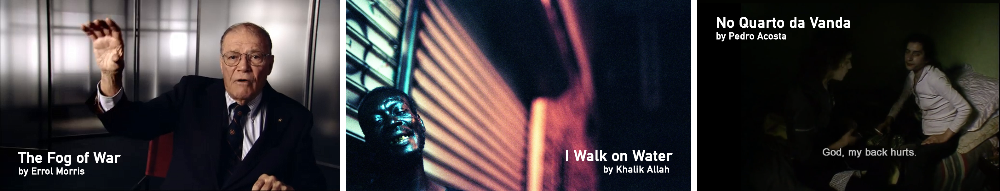
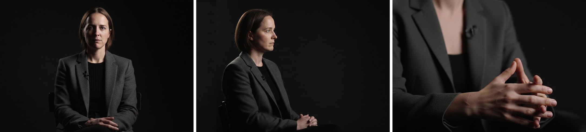

[MEDIAART 2B06](../README.md)

-------------------------------------------------------------------------------

<h1 style="color: darkred;">Chiaroscuro Interview (Pairs)</h1>  

  

## Goal

In this assignment, you will create a **30-second interview video** that uses **chiaroscuro lighting** as a compositional and conceptual constraint.

The focus of this exercise is **light, framing, camera coordination, and audio clarity**, not complex narrative development.  

> ❗ **Attendance and engagement are part of the rubric.**  
You are expected to work actively during class time and participate in all in-class activities.

---

## Project Overview

- **Format:** 30-second interview video
- **Lighting:** Chiaroscuro using a **3-point lighting setup**
- **Cameras:** Manual (M) Mode / Video + **Three-camera setup**
- **Aspect Ratio & Frame Rate:** 16:9, 1920 × 1080 px, 30 FPS 
- **Audio:** Record using **both shotgun and lapel microphones**. No music is allowed.  
- **Location:** Assigned workstations in **Togo Salmon Hall / McMaster U**
- **Collaboration:**  
  - Work in **groups of 10 students** for technical setup and support  
  - **Submit in pairs** (each pair submits their own project)

📌 *Although you will collaborate as a larger group for setup, each pair is responsible for producing and submitting their own work.*

## Examples

**The Fog of War** (2003), by Errol Morris 
→ A canonical example of **controlled, interview-based chiaroscuro**, where low-key lighting isolates the subject against darkened backgrounds. Subtle shadow shapes facial features and reinforces themes of ambiguity, reflection, and moral uncertainty, demonstrating how chiaroscuro can operate within professional documentary conventions. 
▶️ [Trailer](https://www.youtube.com/watch?v=VgA98V1Ubk8){:target="_blank"}  
▶️ [Full Documentary](https://watchdocumentaries.com/the-fog-of-war/){:target="_blank"} 

**(IWOW) I Walk on Water** (2020), by Khalik Allah   
→ This film exemplifies **extreme chiaroscuro in a documentary context**, using a single, directional light source to sculpt faces emerging from darkness. Light functions as an act of encounter, emphasizing presence and vulnerability.
▶️ [Official Trailer](https://www.youtube.com/watch?v=BgDVdFBu8FE){:target="_blank"}    
▶️ [Long Trailer / Excerps](https://vimeo.com/390915129){:target="_blank"}   
> ⚠️ **Content Warning:** This work contains the use of the “N” word in several moments, spoken within the social and narrative context of the film. It also depics drug use and mental health issues.  

**No Quarto da Vanda** (2000), by Pedro Acosta  
→ An influential example of **low-light, interior documentary filmmaking**, where chiaroscuro emerges from minimal available light rather than staged setups. Faces and bodies appear partially illuminated against deep shadow, demonstrating how darkness, duration, and stillness can convey intimacy and marginalization.
▶️ [Trailer](https://www.youtube.com/watch?v=OMtsdwWSjyk){:target="_blank"}  
▶️ [In Vanda's Room (2000) - Opening](https://www.youtube.com/watch?v=Rp4QXi1a-yQ){:target="_blank"}    
> ⚠️ **Content Warning:** This film depicts drug use, addiction, and precarious living conditions.  

---

## Activities  
**Complete the following in order. Ask the professor or TAs for support or feedback.**  

<ul>
  <li><a href="#setup">1.Group Organization & Setup</a></li>
  <li><a href="#idea">2. Interview Prompt - Idea Phase</a></li>
  <li><a href="#recording">3. Recording</a></li>
  <li><a href="#wrap-up">4. Equipment Wrap-Up</a></li>
  <li><a href="#premiere">5. Post-Production: Assemble in Premiere Pro</a></li>
</ul>

---

<h3 id="setup" style="color: darkred;">1. Group Organization & Setup [40m]</h3>

You will be assigned to a **station group (10 students)**.

Each group is responsible for:
- Setting up cameras, lights, and audio **together**
- Following the **Week 2 Tech Walkthrough**  
  👉 [W2 - Tech Walkthrough](../TechWalks/TW-W2.md){:target="_blank"}

Station locations and group assignments will be:
- Posted on **Avenue to Learn**
- Printed and posted in the space
- Shown on slides in class

---

## Space Configurations

As a group, you will:

- Set up the **backdrop** (if available)
- Position the **subject** (chair and seating placement)
- Set up the **three-point lighting** arrangement
- Establish clear **light–shadow contrast**
- Position all **three cameras** (see below)
- Connect and test **shotgun and lavalier microphones**

⚠️ *Handle all equipment with care, especially lighting gear.  
Divide tasks evenly and support one another during setup.*

---

## Camera Configuration

 

### Camera A — Frontal View / Eye Level (Tripod)
- Primary interview shot
- Visual anchor for the sequence  
- Lens: **Default kit lens**
- Focus: **Manual**
- Microphone: **RODE VideoMic NTG (on-camera shotgun)**

### Camera B — Side View (Tripod)
- Positioned approximately **30–45°** from the subject
- Emphasizes depth, facial structure, and chiaroscuro  
- Lens: **50mm** or **85mm**
- Focus: **Manual**
- Microphone: **RØDE Wireless GO II** *or* **Audio-Technica AT899 Lavalier**

### Camera C — Detail Camera (Handheld)
- Close-up details: hands, gestures, partial facial features
- Allows subtle movement and visual variation
- Lens: **50mm**
- Focus: **Manual**

📌 *All cameras must follow the settings outlined in the **Week 2 Tech Walkthrough**.*  
📌 *Always adjust lighting first before compensating with camera settings.*   
📌 *Lighting and white balance must be finalized **before** recording begins.*

---

<h3 id="idea" style="color: darkred;">2. Interview Prompt - Idea Phase [20 min]</h3>

This phase is intentionally **short and focused**.

📌 **You are not graded on *what* is being said.**  
Do not spend excessive time developing content or scripting responses.

---

### Speaking Length

- Aim for **45–60 seconds** of recorded interview content  
  > *Extra content allows you to cut between cameras and shape pacing.*
- Your final edited video must be **30 seconds**
- You do **not** need to use all recorded material

---

### Choose ONE Interview Prompt

Each pair must select **one** of the following prompts:

1. **Observation**
   > “Describe a place you pass through often but rarely pay attention to.”

2. **Routine**
   > “Talk through a routine you do almost automatically.”

3. **Light & Space**
   > “Describe how light changes a space you know well.”

4. **Presence**
   > “What helps you feel grounded when you are overwhelmed?”

5. **Time**
   > “Describe a moment when time felt slow.”

The interview prompt is a **tool** to support your work with **light, framing, camera coordination, and sound**, not a writing or performance exercise.

> Respond in your own words.  
> No acting, no character work, no memorization.  
> The interview should feel natural and unforced.

---

### What to Focus On Instead of Content

Use the PDF worksheet below to help you decide:

- **Framing and composition** for each camera
- How strong the **contrast** should be
- Where **shadows** fall on the face and body
- Whether you want a more **intimate tone** (warmer light) or a more **neutral tone** (cooler or balanced light)

<a href="imgs/Chiaroscuro_Brainstorming_Worksheet.pdf" target="_blank" rel="noopener noreferrer">
📄 Download / View Brainstorming & Sketching Worksheet (PDF)
</a>

### Submission

- ➡️ **Export as PDF**
- 📄 **Filename:** `Grouo-#-Brainstorming.pdf`

---  

<h3 id="recording" style="color: darkred;">3. Recording [1h40m]</h3>

Each pair records **two full takes**
- Organize a clear recording order within your **group of 10**
- Time per pair: **10 minutes**. 

During recording, each pair **may adjust**:
- 🟢 **Framing of the Main Camera (Camera A)**
- 🟢 **Position and framing of the Side Camera (Camera B)**
- 🟢 **Framing and movement of the Handheld Camera (Camera C)**
- 🟢 **Lighting intensity** and **color temperature** (warmth)

During recording, each pair **must NOT change**:
- 🚫 **White Balance**
- 🚫 **ISO**
- 🚫 **Aperture**
- 🚫 **Position of the lights**

📌 *Exposure and color consistency must be established before recording begins.*

### Recording & Syncing Footage

- When ready:
  - Press **record on all cameras**
  - Stand in front of the **subject** and perform a **single hand clap**
  - Wait **2–3 seconds**, then the subject may begin speaking

- **Do not stop recording** on any camera until the end of the take
- Record the full interview as **one continuous clip** in all cameras

- Repeat the same process for the **second take**

📌 *The hand clap creates a clear visual and audio sync point, making it easier to synchronize footage from all cameras during editing.*

---  

<h3 id="wrap-up" style="color: darkred;">4. Equipment Wrap-Up [20m]</h3>

When all groups have finished:
- Power off all equipment
- Store cameras, lenses, lights, and audio gear **properly in their bags**
- Leave equipment at the station for the instructor to collect

⚠️ *Handle all equipment with care, especially lighting gear.  
Divide tasks evenly and support one another during wrap-up.*

---

<h3 id="premiere" style="color: darkred;">5. Post-Production: Assemble in Premiere Pro [Begin in Class]</h3>

**Check: [W1 - Tutorials](../Tutorials/index.html?file=T-W1.json){:target="_blank"} - Premiere Pro Fundamentals & [W2 - Tutorials](../Tutorials/index.html?file=T-W2.json){:target="_blank"} - Importing Camera Footage & Multi-Camera Editing in Premiere Pro**   

Edit your interview following the **same principles as Week 1**, with the addition of multi-camera footage.  

- **Resolution:** 1920 × 1080  
- Import footage from **all three cameras**
- **Synchronize the audio and image from all three cameras**  
  *(Do this before trimming or sequencing clips)*
- Use cuts to create visual rhythm
- **Total duration:** 30 seconds
- **Allowed transitions:**
  - Jump cuts
  - Fade in / fade out
  - **Cross overs** (simple/subtle temporal overlap between still images)
- Add:
  - Title
  - Credits
 
#### Restrictions
- 🚫 No Music
- 🚫 No colour correction in Premiere Pro  
- 🚫 No visual effects or filters  
- 🚫 No animated motion effects  
- All lighting, white balance, and contrast decisions must happen **during recording**

Export video:
- Format: 1920×1080, H.264, MP4
- Filename: `Name-Lastname-ChiaroscuroInterview.mp4`

---

### Project Info PDF

Create a **one-page document** including:

- **One representative still image**
- Title
- Year
- Authors
- **3/4-line artistic description**

➡️ **Export as PDF**  
📄 **Filename:** `Group-1-ChiaroscuroInterview.pdf`

---

<h3 style="color: darkred;">📤 Submission (in pairs) </h3>

| Item                               | Required Filename                      |
|------------------------------------|----------------------------------------|
| Brainstorming PDF                  | `Group-1-Brainstorming.pdf`            |
| Final Chiaroscuro Interview MP4    | `Group-1-ChiaroscuroInterview.mp4`     |
| Project Description PDF            | `Group-1-ChiaroscuroInterview.pdf`     |

> ⚠️ **Follow the submission protocols carefully. Incorrect submissions may result in lost points.**

---

## Assessment Notes

- This is a **learning-focused assignment**
- Minor technical imperfections are acceptable **if decisions are intentional and clearly applied**
- Risk-taking and experimentation are encouraged within the assignment constraints

For an **A+**, the work should demonstrate:

- **Strong and intentional composition**, framing, and camera placement across all shots  
- **Effective use of chiaroscuro lighting**, showing control over contrast, shadow, and light direction  
- **Clear visual and conceptual coherence**, with lighting choices supporting the interview’s tone or presence  
- **High-quality audio**, with clean sound and successful synchronization across cameras  
- **Thoughtful editing**, including pacing, shot selection, and transitions that enhance clarity and rhythm  
- **Originality and artistry**

> ❗ **Attendance and engagement are part of the rubric.**  
You are expected to work actively during class time and participate in all in-class activities.

________________________________________________________________________

Credits: Jessica A. Rodríguez

**AI Disclosure**:  
Microsoft CoPilot and ChatGPT was used for **editing and clarity only**, as well as to create some to the **image visualizations**. All ideas, instructional decisions, and assignment constraints are authored by the me, the instructor (Jessica A. Rodriguez). AI is not used to generate original course content.
