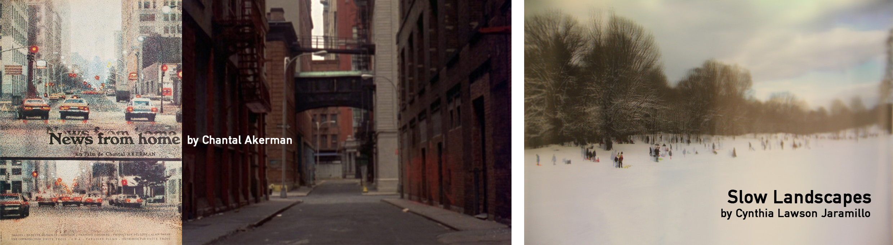

[MEDIAART 2B06](../README.md)

# Static Outdoor Scene

## Group project: three students

## Goal

Create a **30-second static outdoor video** that explores **time, stillness, spatial depth, and environmental sound** from a fixed camera position.

The focus of this activity is **intentional framing, lens choice, depth of field, exposure consistency, and immersive outdoor sound**, rather than narrative action.

> Attendance, participation, and active engagement during class activities are part of the project rubric.

## Project overview

- **Format:** 30-second static outdoor video
- **Camera support:** Tripod
- **Camera movement:** None during recording
- **Lens:** `24 mm`, `35 mm`, or `50 mm`
- **Focus:** Manual Focus (`MF`)
- **Audio:** RØDE VideoMic NTG and ZOOM H4n
- **Location:** McMaster University campus and immediate surroundings
- **Production time:** During class
- **Collaboration:** In Pairs
- **Image orientation:** Landscape

## Required camera settings

- **Camera mode:** Video
- **Shooting mode:** Manual (`M`)
- **Aspect ratio:** 16:9
- **Resolution:** 1920 × 1080 pixels
- **Frame rate:** 30 fps
- **Grid display:** Grid 1
- **White balance:** Custom White Balance or another fixed setting approved during the technical setup
- **Focus:** Manual Focus (`MF`)
- **Image Stabilization:** Off while the camera is mounted on a tripod

## Project stages

Complete the following stages in order.

<!--
/////////////////
SECTION 1
/////////////////
-->

  

    1. Review the examples
    
      Examine how fixed framing, duration, environmental movement, and sound can shape an observational video.
    
  

## *News from Home* (1977), directed by Chantal Akerman

A foundational example of fixed-frame observation. Duration and stillness allow space, sound, traffic, people, and movement within the frame to unfold gradually.

- [Watch a film excerpt](https://www.youtube.com/watch?v=XUoYPF2EPiQ){:target="_blank"}
- [Watch the film through Kanopy](https://www.kanopy.com/en/mcmaster/video/11032756){:target="_blank"}

## *Slow Landscapes*, by Cynthia Lawson Jaramillo

These works emphasize subtle environmental change, duration, spatial observation, and the accumulation of visual and sonic detail.

- [Visit the project website](https://www.cynthialawson.com/site/?p=525){:target="_blank"}
- [Watch *Sisga, Colombia*](https://vimeo.com/94722817?fl=pl&fe=vl){:target="_blank"}

While reviewing the examples, consider:

- What enters and leaves the frame?
- How is depth created through foreground, midground, and background?
- What changes when the camera remains still?
- How does environmental sound affect your perception of the space?
- How long does it take before you begin noticing small details?

<!-- 
/////////////////
SECTION 2
/////////////////
-->

  

    2. Required equipment
    
      Coordinate with your station group and book the required equipment before the recording session.
    
  

## Equipment booking

Pairs will be posted on Avenue to Learn before the recording session. Each pair is responsible for booking the equipment listed below.

## Equipment checklist

<fieldset class="equipment-checklist">
  <legend>Book and confirm the equipment for your station</legend>

  <label class="checklist-item">
    <input type="checkbox">
    
      <strong>Two camera (Canon EOS Rebel T4i, Canon EOS Rebel T5i, or Canon EOS Rebel T7i)</strong>
      Use one camera to record and the second as a backup in case a battery runs out. <strong>Important:</strong> The Canon EOS Rebel T7i uses a different battery type. When using a T7i, book two T7i cameras so that a compatible backup is available.
    
  </label>

  <label class="checklist-item">
    <input type="checkbox">
    
      <strong>Lense</strong>
      Choose and book one of the following lenses: `24 mm`, `35 mm`, or `50 mm`
    
  </label>

  <label class="checklist-item">
    <input type="checkbox">
    
      <strong>One tripod (Manfrotto - Large for DSLR Camera: 190XDB, Element MII, or 190D)</strong>
      Only for one camera.
    
  </label>

  <label class="checklist-item">
    <input type="checkbox">
    
      <strong>One Shutgun Microphone</strong>
      Book one of these: RODE VideoMic NTG On-Camera Shotgun Microphone, RODE Shotgun (VIDEOMIC GO), RODE VideoMicro Compact On-Camera Microphone, Sennheiser Shotgun (MKE 400), or Sony Shotgun Cam Mount (ECM-MS908C).
    
  </label>

  <label class="checklist-item">
    <input type="checkbox">
    
      <strong>ZOOM H4N Handheld</strong>
      If not available, book ZOOM H4N Handheld PRO. 
    
  </label>

  <label class="checklist-item">
    <input type="checkbox">
    
      <strong>Two pairs of headphones</strong>
      For monitoring audio from the camera and the ZOOM H4n. If not available, bring your own cable headphones.
    
  </label>

  <label class="checklist-item">
    <input type="checkbox">
    
      <strong>One white balance card</strong>
      For setting a consistent Custom White Balance across all three cameras. If not available, bring a white piece of paper. 
    
  </label>

<!--
/////////////////
SECTION 3
/////////////////
-->

  

    3. Plan the scene
    
      Choose a location and define how framing, focal length, depth, duration, and environmental change will shape the recording.
    
  

Before leaving the classroom, your group must define the type of outdoor space you intend to record.

Do not automatically choose the first location you see or the location closest to the classroom. Select a space that offers possibilities for sustained observation.

## Location requirements

Look for a location with:

- Visible spatial depth
- Foreground, midground, and background layers
- Subtle changes over time
- Environmental movement, such as people, traffic, shadows, water, vegetation, weather, or reflected light
- Distinct general and specific sounds
- A safe position for the camera, tripod, and audio equipment
- No obstruction of doors, walkways, roads, or accessibility routes

## Assigned lens

Each group will be assigned one available focal length:

- Approximately `24 mm`
- Approximately `35 mm`
- Approximately `50 mm`

Review the [available cameras and lenses](https://jac307.github.io/MediaArtTutorials/MEDIAART2B06/Cameras.html#zoom-lenses){:target="_blank"}.

Consider how the assigned lens will affect:

- The field of view
- The amount of environment included in the frame
- The camera’s distance from the main point of interest
- The relationship between foreground and background
- The available depth of field

## Define the visual approach

Before recording, agree on:

- The camera position and height
- The main point of interest
- The intended spatial layers
- The required depth of field
- The type of movement expected within the frame
- Whether the shutter speed will render movement naturally, emphasize motion blur, or make movement appear sharper
- The general environmental sound and specific sounds you want to record

> The camera will remain still. All visual change must come from movement, light, weather, and activity within the frame.

## Plan the duration

You may:

- Record more than 30 seconds and trim only the beginning or end
- Record up to approximately one minute and adjust the speed slightly
- Record a minimum of 15 seconds and slow the footage to reach 30 seconds

The final visual sequence must remain continuous.

> Do not cut out material from the middle of the shot. Any change in duration must preserve the continuity of time.

<!--
/////////////////
SECTION 4
/////////////////
-->

  

    4. Prepare the location and equipment
    
      Confirm the equipment, evaluate the location, secure the tripod, and assign production responsibilities.
    
  

Follow the [W3 Technical Walkthrough](../TechWalks/TW-W3.md){:target="_blank"} while preparing the camera and audio equipment.

<fieldset class="equipment-checklist">
  <legend>Location and equipment check</legend>

  <label class="checklist-item">
    <input type="checkbox">
    
      <strong>Confirm all booked equipment.</strong>
      Check the equipment numbers and verify that all cameras, lenses, batteries, SD cards, supports, microphones, cables, windscreens, and accessories are present.
    
  </label>

  <label class="checklist-item">
    <input type="checkbox">
    
      <strong>Evaluate the recording location.</strong>
      Confirm that the camera can remain in a safe position without blocking a walkway, entrance, road, or accessibility route.
    
  </label>

  <label class="checklist-item">
    <input type="checkbox">
    
      <strong>Secure the tripod.</strong>
      Extend the legs safely, level the camera, tighten all controls, and keep the centre column as low as practical.
    
  </label>

  <label class="checklist-item">
    <input type="checkbox">
    
      <strong>Protect the equipment from weather.</strong>
      Do not expose cameras, lenses, microphones, or recorders to rain, snow, moisture, or unsafe temperatures.
    
  </label>

  <label class="checklist-item">
    <input type="checkbox">
    
      <strong>Assign production roles.</strong>
      Assign one student to camera and exposure, one to ZOOM H4n recording, and one to observe the frame, surroundings, time, and equipment safety.
    
  </label>
</fieldset>

## Confirm the composition

Before adjusting exposure:

1. Position the tripod.
2. Install the assigned lens.
3. Establish the camera height and angle.
4. Identify the foreground, midground, and background.
5. Check the edges of the frame for distractions.
6. Confirm that people can pass naturally without colliding with the equipment.
7. Lock the tripod head and do not move it during the take.

## Important: Use Manual Focus

Set the lens to **Manual Focus (`MF`)**. Autofocus may shift when people, vehicles, shadows, or other objects move through the frame.

For a static shot, establish the focus once and keep it locked:

1. Decide which part of the scene must remain sharp.
2. Magnify the image on the camera display, when available.
3. Adjust the focus ring carefully.
4. Return to the full view and confirm the composition.
5. Record a short test and review it at full size.

> Recheck the focus whenever you move the camera, change the lens, adjust the focal length, or change the distance to the focus point.

<!--
/////////////////
SECTION 5
/////////////////
-->

  

    5. Configure the camera and exposure
    
      Set the recording format, establish a fixed white balance, define the motion approach, and lock the manual exposure.
    
  

## Camera configuration

<fieldset class="equipment-checklist">
  <legend>Prepare the camera</legend>

  <label class="checklist-item">
    <input type="checkbox">
    
      <strong>Set the general recording format.</strong>
      Select <strong>Video mode</strong>, a <code>16:9</code> aspect ratio, a resolution of <code>1920 × 1080</code>, a frame rate of <code>30 fps</code>, and <strong>Grid 1</strong>.
    
  </label>

  <label class="checklist-item">
    <input type="checkbox">
    
      <strong>Set the shooting mode to <code>M</code>.</strong>
      Manual mode prevents the camera from changing the exposure automatically during the take.
    
  </label>

  <label class="checklist-item">
    <input type="checkbox">
    
      <strong>Set the lens to Manual Focus.</strong>
      Select <code>MF</code> and confirm that the intended plane of focus is sharp.
    
  </label>

  <label class="checklist-item">
    <input type="checkbox">
    
      <strong>Turn Image Stabilization off.</strong>
      Disable lens stabilization while the camera is secured on the tripod.
    
  </label>

  <label class="checklist-item">
    <input type="checkbox">
    
      <strong>Set a fixed white balance.</strong>
      Use Custom White Balance whenever possible. Set it with a neutral white or grey card under the same light as the scene.
    
  </label>

  <label class="checklist-item">
    <input type="checkbox">
    
      <strong>Select Evaluative or Matrix Metering.</strong>
      Use the meter as a starting point, then compare it with the visible image and histogram.
    
  </label>

  <label class="checklist-item">
    <input type="checkbox">
    
      <strong>Display the histogram.</strong>
      Press the <strong>INFO.</strong> button until the histogram appears.
    
  </label>
</fieldset>

> Keep the white balance fixed for the complete take. Recalibrate it only when the lighting conditions change significantly before a new take.

## Set the exposure in order

Set the controls in this order:

1. **Shutter speed**
2. **Aperture**
3. **ISO**

<fieldset class="equipment-checklist">
  <legend>Set and verify the manual exposure</legend>

  <label class="checklist-item">
    <input type="checkbox">
    
      <strong>Select the shutter speed according to the intended visual approach.</strong>
      Begin with <code>1/60</code> as a standard setting for recording at <code>30 fps</code>. You may choose a slower shutter speed to emphasize motion blur or a faster shutter speed to render movement more sharply. Define the artistic purpose of the choice and keep the setting consistent throughout the shot.
    
  </label>

  <label class="checklist-item">
    <input type="checkbox">
    
      <strong>Select the aperture for the intended depth of field.</strong>
      Consider the focal length, camera distance, focus distance, and available aperture range of the assigned lens.
    
  </label>

  <label class="checklist-item">
    <input type="checkbox">
    
      <strong>Set the ISO after the shutter speed and aperture.</strong>
      Begin between approximately <code>ISO 100</code> and <code>ISO 400</code>. Increase it only when necessary, because higher values produce more visible noise.
    
  </label>

  <label class="checklist-item">
    <input type="checkbox">
    
      <strong>Check the meter, histogram, and visible image.</strong>
      Confirm that important highlights are not clipped and that the shadow detail required by the composition remains visible.
    
  </label>

  <label class="checklist-item">
    <input type="checkbox">
    
      <strong>Record the technical settings.</strong>
      Write down the lens, focal length, shutter speed, aperture, ISO, and white balance for the project information PDF.
    
  </label>

  <label class="checklist-item">
    <input type="checkbox">
    
      <strong>Record and review a short technical test.</strong>
      Check framing, focus, depth of field, exposure, movement, noise, and the stability of the tripod.
    
  </label>
</fieldset>

> Lock the exposure before recording. Do not adjust the shutter speed, aperture, ISO, white balance, focus, focal length, or framing during a take.

<!--
/////////////////
SECTION 6
/////////////////
-->

  

    6. Configure and record outdoor audio
    
      Record a continuous environmental base layer and collect specific sounds for a multilayered outdoor soundscape.
    
  

Record audio using both devices:

| Audio device | Recording role | How it will be used |
|---|---|---|
| **RØDE VideoMic NTG connected to the camera** | Continuous base layer | Captures the general environmental sound throughout the complete visual take and provides audio for synchronization. |
| **[ZOOM H4n handheld recorder](https://jac307.github.io/MediaArtTutorials/MEDIAART2B06/Audio.html#zoom-h4n-handheld){:target="_blank"}** | Specific sound layers | Records selected sounds from different positions and distances, such as footsteps, leaves, water, traffic, voices, mechanical sounds, or other details connected to the location. |

> Immersive outdoor sound is created by combining a continuous layer of general environmental sound with recordings of specific sounds. Keep the RØDE VideoMic NTG recording for the complete visual take, and use the ZOOM H4n to collect additional sound layers.

## Prepare the RØDE VideoMic NTG

<fieldset class="equipment-checklist">
  <legend>Set up the camera microphone</legend>

  <label class="checklist-item">
    <input type="checkbox">
    
      <strong>Mount the RØDE VideoMic NTG on the camera.</strong>
      Use the same on-camera shotgun microphone setup introduced during the Chiaroscuro Interview activity.
    
  </label>

  <label class="checklist-item">
    <input type="checkbox">
    
      <strong>Install outdoor wind protection.</strong>
      Attach a windscreen or furry windshield before recording outside.
    
  </label>

  <label class="checklist-item">
    <input type="checkbox">
    
      <strong>Connect and turn on the microphone.</strong>
      Insert the audio cable into the camera’s external microphone input and confirm that the microphone is powered on.
    
  </label>

  <label class="checklist-item">
    <input type="checkbox">
    
      <strong>Confirm the external audio input.</strong>
      Open the camera’s audio settings and verify that it is receiving sound from the external microphone rather than the built-in microphone.
    
  </label>

  <label class="checklist-item">
    <input type="checkbox">
    
      <strong>Check and adjust the camera recording levels.</strong>
      Aim for strong environmental sounds to peak at approximately <code>-12 dB</code>. The levels must remain below <code>0 dB</code>.
    
  </label>

  <label class="checklist-item">
    <input type="checkbox">
    
      <strong>Record and review a short audio test.</strong>
      Confirm that the sound is clear, audible, free from clipping, and being recorded through the RØDE VideoMic NTG.
    
  </label>
</fieldset>

## Prepare the ZOOM H4n

<fieldset class="equipment-checklist">
  <legend>Set up the separate recorder</legend>

  <label class="checklist-item">
    <input type="checkbox">
    
      <strong>Use the built-in stereo microphones.</strong>
      Position the recorder so the microphones face the intended sound source.
    
  </label>

  <label class="checklist-item">
    <input type="checkbox">
    
      <strong>Install outdoor wind protection.</strong>
      Attach a windscreen or furry windshield before recording.
    
  </label>

  <label class="checklist-item">
    <input type="checkbox">
    
      <strong>Set the recording format to <code>WAV 48 kHz / 24-bit</code>.</strong>
      This format is appropriate for video production and post-production.
    
  </label>

  <label class="checklist-item">
    <input type="checkbox">
    
      <strong>Select Stereo mode.</strong>
      Confirm that the built-in stereo microphones are active.
    
  </label>

  <label class="checklist-item">
    <input type="checkbox">
    
      <strong>Connect headphones.</strong>
      Monitor the sound before and during each recording.
    
  </label>

  <label class="checklist-item">
    <input type="checkbox">
    
      <strong>Set and test the recording level.</strong>
      Keep the loudest sounds below clipping and avoid red peak indicators.
    
  </label>
</fieldset>

## Record the sound layers

- Record the ZOOM H4n during the visual take to create a synchronized recording.
- Keep the recorder outside the camera frame.
- Hold it steadily and keep fingers away from the microphones.
- Do not tap, touch, or adjust it while recording usable sound.
- After the visual takes, record several additional sounds from different positions and distances.
- Capture each specific sound as a separate recording when possible.
- Record several seconds before and after each sound to create editing flexibility.
- Ask group members to remain still and quiet when they are not creating an intentional sound.

## Synchronize the recordings

1. Press **Record** on the camera.
2. Press **Record** on the ZOOM H4n.
3. Stand where the camera can see you.
4. Perform one clear, loud hand clap.
5. Confirm that the clap was captured by both devices.
6. Wait approximately three seconds.
7. Begin the visual take.
8. Continue recording without stopping either device.

The clap creates a visible and audible reference for synchronizing the video, shotgun-microphone recording, and ZOOM H4n recording in Premiere Pro.

<!--
/////////////////
SECTION 7
/////////////////
-->

  

    7. Record two complete takes
    
      Lock the camera settings, synchronize the audio, and record two continuous versions of the static scene.
    
  

Record **two complete visual takes**.

Each take must:

- Use the same fixed camera position
- Remain continuous
- Keep the exposure settings locked
- Keep the white balance fixed
- Keep the focus fixed
- Keep the focal length fixed
- Include continuous RØDE VideoMic NTG audio
- Include a synchronized ZOOM H4n recording
- Begin with a visible and audible hand clap

## Recording rules

- Do not move or touch the tripod during a take.
- Do not pan, tilt, or reposition the camera.
- Do not zoom in or out.
- Do not refocus.
- Do not adjust shutter speed, aperture, ISO, or white balance.
- Do not stage unnecessary action in front of the camera.
- People may pass naturally through the frame.
- Group members must remain outside the frame unless their presence is part of the planned scene.
- Monitor the equipment and surroundings throughout the recording.

## Between takes

You may review the footage and change:

- The camera position
- The composition
- The focus point
- The shutter speed
- The aperture
- The ISO
- The white balance
- The microphone placement
- The planned environmental sounds

Any changes must be completed before the next take begins.

> Record the settings used for both takes. Identify which take you select for the final project.

<!--
/////////////////
SECTION 8
/////////////////
-->

  

    8. Save your files, pack, and return the equipment
    
      Create two verified copies of all footage and audio before packing and returning the booked equipment.
    
  

Save and verify all project files before packing the equipment. Your group is responsible for returning every booked item. **Do not leave equipment unattended outdoors, in the classroom, or at the recording location.**

<fieldset class="equipment-checklist">
  <legend>File backup, equipment wrap-up, and return</legend>

  <label class="checklist-item">
    <input type="checkbox">
    
      <strong>Transfer and organize all project files.</strong>
      Copy the camera footage, RØDE microphone audio, ZOOM H4n recordings, notes, and related documents into a clearly labelled project folder.
    
  </label>

  <label class="checklist-item">
    <input type="checkbox">
    
      <strong>Create a second copy for security.</strong>
      Save a duplicate of the complete project folder on a separate drive or approved cloud-storage location. Do not keep both copies on the same device.
    
  </label>

  <label class="checklist-item">
    <input type="checkbox">
    
      <strong>Verify both copies.</strong>
      Open video and audio files from both locations to confirm that they transferred correctly. Do not erase or format an SD card until the files have been checked.
    
  </label>

  <label class="checklist-item">
    <input type="checkbox">
    
      <strong>Power off all equipment.</strong>
      Turn off the cameras, microphones, recorder, and other powered accessories.
    
  </label>

  <label class="checklist-item">
    <input type="checkbox">
    
      <strong>Recharge the batteries.</strong>
      Place rechargeable batteries in the appropriate chargers and confirm that they are charging before returning the equipment.
    
  </label>

  <label class="checklist-item">
    <input type="checkbox">
    
      <strong>Compare the equipment with the booking list and pack it securely.</strong>
      Confirm that every numbered item and accessory is present and placed in the correctly numbered bag or case.
    
  </label>

  <label class="checklist-item">
    <input type="checkbox">
    
      <strong>Check the recording location.</strong>
      Confirm that no equipment, cables, batteries, SD cards, windscreens, or personal belongings remain outdoors or in the production space.
    
  </label>

  <label class="checklist-item">
    <input type="checkbox">
    
      <strong>Return the equipment.</strong>
      Your group is responsible for transporting the booked equipment to the designated return location and completing the required return process.
    
  </label>
</fieldset>

Divide the file-transfer, wrap-up, and return responsibilities evenly. Handle all equipment carefully until it has been officially returned.

<!--
/////////////////
SECTION 9
/////////////////
-->

  

    9. Edit and submit the project
    
      Assemble one continuous 30-second visual shot, create a multilayered soundscape, and prepare the required submission files.
    
  

Review the [W3 Tutorials](../Tutorials/index.html?file=T-W3.json){:target="_blank"} and relevant previous tutorials before editing.

## Create the sequence

- **Resolution:** 1920 × 1080 pixels
- **Aspect ratio:** 16:9
- **Frame rate:** 30 fps
- **Final duration:** Exactly 30 seconds

## Edit the visual material

- Use one continuous visual take.
- Do not make cuts within the shot.
- Trim only the beginning or end when necessary.
- You may adjust the speed slightly to reach 30 seconds while preserving continuous time.
- Add only a simple fade-in at the beginning and fade-out at the end.
- Apply colour correction to restore appropriate contrast, exposure, and colour balance.
- A subtle colour grade is permitted when it supports the intended atmosphere and maintains a natural image.
- A very slow and minimal digital zoom-in may be created with keyframes.
- The digital zoom must not noticeably reduce image quality or disrupt the composition.

## Create the outdoor soundscape

Combine:

- The continuous environmental base layer recorded with the RØDE VideoMic NTG
- Selected ZOOM H4n recordings of specific sounds
- Additional room for silence, distance, and spatial variation

When editing the sound:

- Synchronize the camera and ZOOM recordings using the hand clap.
- Balance the general environmental sound with the specific sound layers.
- Use volume changes, fades, and stereo placement carefully.
- Remove or reduce unwanted handling noise when possible.
- Keep the final mix below clipping.
- Do not add music.

## Titles and credits

Place the title and credits over the video image. They must be:

- Readable
- Spatially considered
- Aesthetically connected to the composition
- Visible for enough time to be read

Do not use separate title cards.

## Restrictions

- No cuts within the visual shot
- No camera movement created during recording
- No decorative visual effects
- No filters that obscure the original image
- No music
- No additional stock footage

## Export the video

- **Format:** MP4
- **Codec:** H.264
- **Resolution:** 1920 × 1080 pixels
- **Filename:** `Group-#-StaticOutdoorScene.mp4`

## Create the project information PDF

Create a one- or two-page document containing:

- One representative still image
- Project title
- Year
- Authors
- Location
- A three- to four-line description explaining why the location was selected, with attention to spatial depth, duration, and environmental change
- The assigned lens and focal length
- Aperture
- Shutter speed
- ISO
- White balance
- A brief explanation of the shutter-speed choice and its artistic purpose
- A one- or two-sentence description of the colour correction or grading
- A brief description of how the RØDE base layer and ZOOM H4n sound layers were combined

Export the document as:

- **Format:** PDF
- **Filename:** `Group-#-StaticOutdoorScene.pdf`

## Final submission

| Item | Required filename |
|---|---|
| Final Static Outdoor Scene video | `Group-#-StaticOutdoorScene.mp4` |
| Project information PDF | `Group-#-StaticOutdoorScene.pdf` |

> Follow the submission protocols carefully. Incorrect filenames or missing files may result in lost points.

---

Credits: Jessica A. Rodríguez
