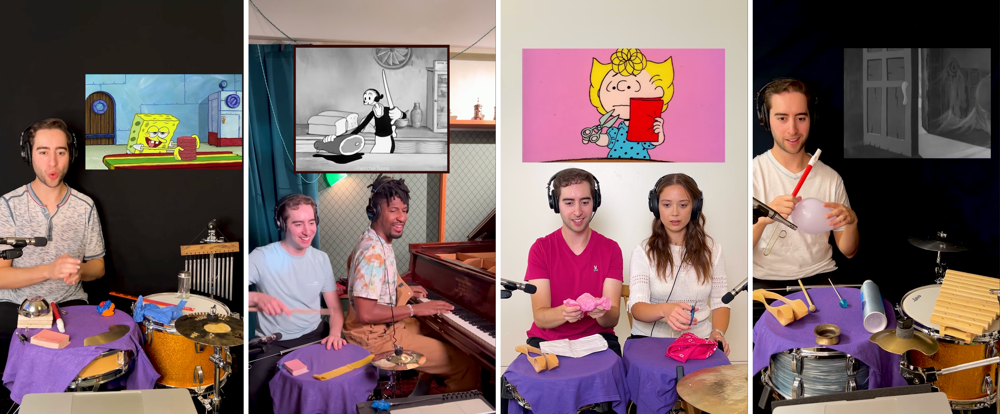

[MEDIAART 2B06](../README.md)

-------------------------------------------------------------------------------

<h1 style="color: darkred;">Live Foley (Groups of 4)</h1>  

<figure style="width: 100%; margin: auto;">
  
  <figcaption style="text-align: center; font-style: italic; margin-top: 0.5em;">
    Screenshots from live Foley performances by content creator and musician Josh Harmon
  </figcaption>
</figure>

For this assignment, you will create a **30-second live Foley performance** using **multiple cameras and audio recording devices**. The focus is on capturing both **subtle and louder live Foley sounds** from different perspectives.

During **post-production**, the goal is to work with **Premiere Pro and Reaper** to professionally edit **multiple camera angles and microphone recordings** into a single dynamic audiovisual piece. You will use **picture-in-picture** to visualize the provided video clip corresponding to your live Foley performance.

> ❗ **Attendance and engagement are part of the rubric.**  
You are expected to work actively during class time and participate in all in-class activities.

---

## Project Overview

- **Format:** 30-second multi-camera video  
- **Cameras:** Manual (M) Mode / Video / Three-camera setup / Cameras on tripod
- **Lenses:** Use available lenses at your discretion  
- **Audio:** Recorded separately using **multiple Zoom H4n handheld recorders and microphones**  
- **Location:** Assigned workstations in **Togo Salmon Hall / McMaster U**
- **Collaboration:**  
  - **4 groups per station** for technical setup and support  
  - **Submit in groups of 4 students** (each group submits their own project)

## Examples  

Live Foleys by **Josh Harmon**
→ Popular content creator and musician known for his viral sound effects videos, where he uses drums and other instruments to recreate cartoon and cinematic sounds.  
🌐 [Instagram](https://www.instagram.com/josh.harmon/){:target="_blank"}    

**Live Foley Example** by Paul Graves  
→ Live Foley example for theatre: a live human performance where sound effects are created and performed in real time.
▶️ [Video](https://www.youtube.com/watch?v=Qpr1tY-XKMs){:target="_blank"}    

---

## Activities  
**Complete the following in order. Ask the professor or TAs for support or feedback.**  

<ul>
  <li><a href="#idea">1. Planning [before Thursday]</a></li> - **Complete before class**
  <li><a href="#setup">2. Group Organization & Setup</a></li>
  <li><a href="#recording">3. Recording</a></li>
  <li><a href="#wrap-up">4. Equipment Wrap-Up</a></li>
  <li><a href="#premiere">5. Post-Production: Assemble in Premiere Pro</a></li>
</ul>

---

<h3 id="planning" style="color: darkred;">1. Planning [before Thursday]</h3>

> ❗ You must arrive prepared, with your planning completed and the objects you will use for your live Foley.  

You will be given a **royalty-free clip from an old silent film**.  
Before Thursday, your group must define your **creative and technical approach**, including **clear roles for each person**:

- **Three students** performing live Foley sounds on set (each producing different sounds)
- **One student** monitoring the cameras and sound recorders

You must **practice both individually and collectively** before Thursday so that your group is ready to perform the scene **2–3 times efficiently** during the production session.

You may use **any objects or instruments**, but **all sound must be produced live**.  
> **No added sound is allowed in post-production.**  
All objects or instruments used should be **created, assembled, or adapted by your group**.

For inspiration, you may watch the example below to explore different approaches and objects commonly used in Foley work.

### How This Woman Creates God of War’s Sound Effects | Obsessed | WIRED

<iframe width="560" height="315" src="https://www.youtube.com/embed/WFVLWo5B81w?si=7rUZplgVAk0stNCf" title="YouTube video player" frameborder="0" allow="accelerometer; autoplay; clipboard-write; encrypted-media; gyroscope; picture-in-picture; web-share" referrerpolicy="strict-origin-when-cross-origin" allowfullscreen></iframe>  

   

---

## Brainstorming Document

Create a **planning document** outlining the **objects and/or instruments** you need to bring and the **specific sounds** you will create based on the provided video clip.  
This document **does not have a fixed format**; use whatever structure helps your group plan clearly and effectively.

You can use the questions below to guide your preparation:

**Creative & Sound Design**
- What types of sounds does the clip require (footsteps, fabric, impacts, ambience, textures)?
- What objects or instruments can you use to re-create each of these sounds?
- Will you buy and/or how will you create, modify, or adapt these objects?
- Which sounds need to be subtle, and which need to be louder and more prominent?
- How will you vary rhythm, timing, and intensity to match the on-screen action?
- How will you avoid overlapping or masking each other’s sounds?

**Roles & Technical Approach**
- Who is responsible for each sound?
- Who will get each of the objects or instruments you must bring?
- Who is monitoring cameras and audio levels, and how will they communicate issues during recording?
- How many times can your group realistically perform the scene without stopping?

### Submission

- ➡️ **Export as PDF**
- 📄 **Filename:** `Group-#-Brainstorming.pdf`

---

<h3 id="setup" style="color: darkred;">2. Group Organization & Setup [40m]</h3>

You will be assigned to a **station (4 groups per station)**.

Each group is responsible for:
- Setting up cameras, lights, and audio **together**
- Following the [W5 – Tech Walkthrough](../TechWalks/TW-W5.md){:target="_blank"}
- Checking the photos and notes you recorded during lecture time

Station locations and group assignments will be:
- Posted on **Avenue to Learn**
- Printed and posted in the space
- Shown on slides in class

---

## Space Configuration

As a larger group (all four groups sharing the station), you will:

- Define and set up a **main working area** to place all objects and instruments.  
  You may be seated with a table in front of you, working on the floor, or using another configuration.  
  Decide this **collectively**, ensuring that all groups are comfortable with the overall setup.

- Set up the microphones by placing them on **mic stands** and connecting them to the **Zoom H4n recorders**, which should be mounted on **tripods**.  
  You may reposition microphones as needed depending on each group’s performance.  
  Follow the setup outlined in the **Tech Walkthrough**:

  - **Audio Device 1 — Sennheiser Condenser (ME 80):**  
    Capture **subtle, low-volume, detailed sounds**
  - **Audio Device 2 — RØDE VideoMic NTG (On-Camera Shotgun):**  
    Capture **medium to loud sounds** and provide **audio directly synced to video**
  - **Audio Device 3 — Zoom H4n (Ambient / Overhead):**  
    Capture the **overall soundscape** of the Foley performance

- Set up **all three cameras on tripods**.  
  Cameras may be repositioned depending on the needs of each group:

  - **Camera A — Front / Wide Shot:**  
    Primary documentation of the Foley setup
  - **Camera B — Side / Wide Shot:**  
    Provides a **secondary perspective** showing spatial relationships and lateral movement
  - **Camera C — Back / Overhead Angle:**  
    Captures a **top-down or upper-angle view** of the Foley performance

- Set up lighting. You may use **one, two, or all three lights**.  
  Each group may determine the **intensity and colour temperature** of the lights.

⚠️ *Handle all equipment with care, especially lighting gear.  
Divide tasks evenly and support one another during setup.*

---

## Camera Settings

- All cameras **on tripods**
- Set the camera to **Video Mode**
- Set the **Aspect Ratio** to **16:9**
- Set the **Resolution** to **1920 × 1080**
- Set the **Frame Rate** to **30 fps**
- Activate the **Grid**
- Set the lens to **Manual Focus (MF)**
- Set up **Custom White Balance**  
  > Tip: Use a **balance card set** or a **white sheet of paper**
- Use **Evaluative / Matrix Metering**
- **Image Stabilization OFF**
- Continue working in **Manual Mode (M)**  
  > Each group may set its own **aperture, shutter speed, and ISO**

---

<h3 id="setup" style="color: darkred;">3. ❗ Station Check-In ❗</h3>

Before moving on to the next stage, call the **TA or instructor assigned to your station**.  
They will verify that everything has been **set up correctly** before you continue to the recording step.

---  

<h3 id="recording" style="color: darkred;">4. Recording [2h]</h3>

Each group records **two to three full takes**.

- Organize a clear recording order within your **station**
- Time per group: **30 minutes**
- Each group is responsible for **self-managing time** throughout the activity

While other groups are recording, **your group must remain in the space and support the recording group**.

Before pressing record, confirm that:

- All microphones are connected and powered  
- Each recorder has **enough battery and storage**  
- Audio levels are checked on **every device**  
- Cameras are recording and framed correctly  
- Lights are stable and not overheating  
- Foley objects are prepared and within reach  

> ❗ Each group (4 students) is **responsible** for the quality of its own recording.  
> You must check **all camera and audio settings** before recording.

---

### Recording & Syncing Footage

- When ready:
  - Press **record on all cameras**
  - Perform a **single hand clap**
  - Wait **2–3 seconds**, then begin speaking

- **Do not stop recording** on any camera until the end of the take  
- Record the full live Foley performance as **one continuous clip** on all cameras and audio recording devices  

- Repeat the same process for the **second and third takes**

---  

<h3 id="wrap-up" style="color: darkred;">4. Equipment Wrap-Up [20m]</h3>

When all groups have finished:
- Power off all equipment
- Store cameras, lenses, lights, and audio gear **properly in their bags**
  > Use the provided spreadsheet to place each piece of recording equipment in the correct bag, matching the equipment number.
- Leave equipment at the station for the instructor to collect

⚠️ *Handle all equipment with care, especially lighting gear.  
Divide tasks evenly and support one another during wrap-up.*

---

<h3 id="premiere" style="color: darkred;">5. Post-Production: Assemble in Premiere Pro [Begin in Class]</h3>

Check:  
- **[W1 - Tutorials](../Tutorials/index.html?file=T-W1.json){:target="_blank"} - Premiere Pro Fundamentals**  
- **[W2 - Tutorials](../Tutorials/index.html?file=T-W2.json){:target="_blank"} - Importing Camera Footage & Multi-Camera Editing in Premiere Pro**
- **[W5 - Tutorials](../Tutorials/index.html?file=T-W2.json){:target="_blank"} - Reaper

Specifications:  

- **Resolution:** 1920 × 1080  
- Import footage from **all three cameras**
- **Synchronize the audio and image from all three cameras**  
  *(Do this before trimming or sequencing clips)*
- Use cuts to create visual rhythm
- **Total duration:** 30 seconds
- **Allowed transition:** Jump cuts
- Add Title and Credits
- 🚫 No added Music or external (not live) sound effects

Export video:
- **Format:** 1920×1080, H.264, MP4
- **Filename:** `Group-#-LiveFoley.mp4`

---

### Project Info PDF

Create a **one-page document** including:

- **One representative still image**
- Title
- Year
- Authors
- **3/4-line artistic description**

➡️ **Export as PDF**  
📄 **Filename:** `Group-#-LiveFoley.pdf`

---

<h3 style="color: darkred;">📤 Submission (in pairs) </h3>

| Item                               | Required Filename                      |
|------------------------------------|----------------------------------------|
| Brainstorming PDF                  | `Group-#-Brainstorming.pdf`            |
| Final LiveFoley MP4                | `Group-#-LiveFoley.mp4`                |
| Project Description PDF            | `Group-#-LiveFoley.pdf`                |

> ⚠️ **Follow the submission protocols carefully. Incorrect submissions may result in lost points.**

---

## Assessment Notes

- This is a **learning-focused assignment**
- Minor technical imperfections are acceptable **if decisions are intentional and clearly applied**
- Risk-taking and experimentation are encouraged within the assignment constraints

For an **A+**, the work should demonstrate:

- **Strong and intentional composition**, framing, and camera placement across all shots  
- **Effective use of chiaroscuro lighting**, showing control over contrast, shadow, and light direction  
- **Clear visual and conceptual coherence**, with lighting choices supporting the interview’s tone or presence  
- **High-quality audio**, with clean sound and successful synchronization across cameras  
- **Thoughtful editing**, including pacing, shot selection, and transitions that enhance clarity and rhythm  
- **Originality and artistry**

> ❗ **Attendance and engagement are part of the rubric.**  
You are expected to work actively during class time and participate in all in-class activities.

________________________________________________________________________

Credits: Jessica A. Rodríguez

**AI Disclosure**:  
Microsoft CoPilot and ChatGPT was used for **editing and clarity only**, as well as to create some to the **image visualizations**. AI is not used to generate original course content.
