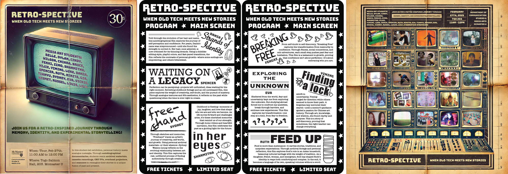

[← MEDIAART 3I03](README.md) | [Project 1 Overview](p1AutoDoc.md)

---

<h1 style="color: darkred;"> Class Exhibition — Final Presentation of Project 1 </h1>  

<figure style="width: 100%; margin: auto;">
  
  <figcaption style="text-align: center; font-style: italic; margin-top: 0.5em;">
    Examples of Graphic Design created for last year's Class Exhibition
  </figcaption>
</figure>

---

The Class Exhibition is the public presentation of your autobiographical documentary. This event is a **collective responsibility** and should be approached as a **professional creative production**, not simply a screening of individual work.

Specific details (date, time, location, equipment, and schedules) will be provided on **Avenue to Learn**.

💡 *Reminder:*  
This exhibition represents not only your individual project, but the collective work of the class. Care, responsibility, and collaboration matter.  

---

<h2 style="color: darkred;"> Final Project Materials (Required) </h2>

To be included in the exhibition, you must submit the following materials by the deadlines communicated on Avenue to Learn.

### 1. Final Video
- Final version of your documentary
- English subtitles required
- Must meet all technical requirements outlined in Project 1
- Videos must be submitted **at least two (2) days before the exhibition**
  - Late submissions may not be included in the exhibition

> The instructor will prepare and format all videos for the exhibition displays.

### 2. Project Title
- Choose a **clear and compelling title**
- Do **not** include the course name
- Think of this as a **professional portfolio piece**

### 3. Project Description (100–150 words)
Your description should:
- Briefly introduce the concept and theme of your documentary
- Provide context for viewers encountering your work in the exhibition space

### 4. High-Quality Screenshot
- Chosen image should clearly represent the theme, the aesthetic, and the tone of your documentary
- Good contrast and clarity (no pixelation, compression artifacts, or motion blur)

📌 **Important:**  
Final **title, project description, and high-quality screenshot must be submitted at least one (1) week before the exhibition** in order to be included in exhibition materials (posters, programs, labels, or other visual elements).

---

<h3 style="color: darkred;"> Exhibition Presence </h3>

Students are expected to arrive on time
- Check in with the instructor or student coordinator

During the exhibition:
- Be mindful of the space and equipment
- Respect the work of others
- Present yourself and your work professionally

## Contingencies & Flexibility

Live events involve shared equipment, time constraints, and unpredictable conditions.  
If technical or logistical issues arise during setup or the exhibition, students are expected to:

- remain flexible and solution-oriented
- communicate promptly with the instructor or student coordinator
- support peers and help troubleshoot when appropriate

Professionalism includes the ability to adapt calmly and collaboratively.

---

<h3 style="color: darkred;"> Artwork Documentation (Required) </h3>

As part of your final submission, you must document your project **in the exhibition context**.

### Documentation Requirements
Capture **5–10 photographs** showing:
- Your video playing in the exhibition space
- Wide shots situating your work within the room
- Close-ups of the screen or projection
- Audience interaction (when appropriate)

These images will be submitted after the exhibition as part of your final documentation.

---

## Grading & Expectations (Maintenance-Based System)

Maintaining your grade for the Class Exhibition requires:

- **Uploading all required materials on time**, including:
  - final video **at least two days before** the Class exhibition
  - project title, project description, and high-quality screenshot **at least one week before** the Class exhibition
- Being present and participating professionally during the exhibition
- Respecting shared time, equipment, and peer labor

Failure to upload required materials by the stated deadlines or to fulfill exhibition responsibilities may signal a **break in maintenance**, even if your individual project is otherwise complete., even if your individual project is complete.

---
