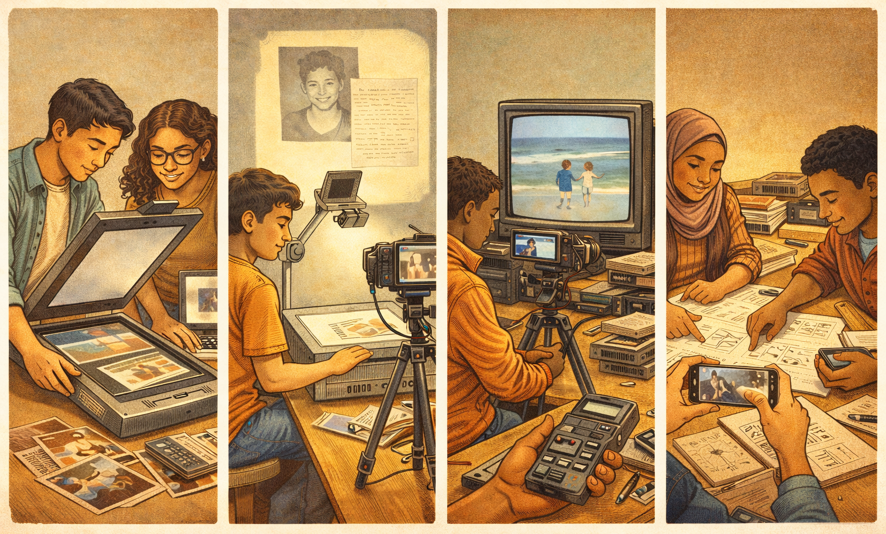

[← MEDIAART 3I03](README.md) | [Project 1 Overview](p1AutoDoc.md)

---

<h1 style="color: darkred;">P1 – In-Class Work I</h1>  

<figure style="width: 100%; margin: auto;">
  
</figure>

---
### Analogue Experimentation · Brainstorming (Process-Focused Session)

This first class-work session focuses on **hands-on experimentation** with analogue media technologies and the initial development of your project idea. The goal is not to produce finished material, but to **test, observe, and think through making**.

This session establishes your engagement with Project 1 and is an important moment for maintaining your grade through active participation and completed process work.  

💡 *Reminder:* This project values **process over perfection**. Use this time to test ideas, take risks, and let the technologies inform your thinking.  

---

## What to Bring to Class (Required)

You must arrive prepared with:

- **A USB drive** containing:
  - Images and/or short videos from your **personal archives**
  - These can include family photos, personal videos, screenshots, scanned images, or other personal media you feel comfortable working with
 
- **Your personal smartphone**
  - You will use your phone to record short test videos, audio, and process documentation

- **Optional but strongly encouraged:**  
  - **Small personal objects** (letters, notebooks, photographs, printed images, fabrics, objects, etc.)  
  - These can be used for scanning or projection during experimentation

> ⚠️ **Important:**  
> Arriving without archival materials will significantly limit your ability to participate fully in the experimentation phase.

---

<h2 style="color: darkred;"> Part 1 — Analogue Experimentation (≈ 40 minutes) </h2>

### Available Stations

- **Station 1 — Scanners**
  - Two flatbed scanners connected to separate computers
  - Explore scanning photos, letters, or objects
  - Experiment with movement during scanning to create distortions

- **Station 2 — Overhead Projector**
  - Two Light overhead projectors
  - Project photos, letters, drawings, or objects
  - Record the projection or details of the projection surface using your phone

- **Station 3 — CRT TVs**
  - Three-Four CRT televisions
  - Play images or videos from your USB and record the screen output using your phone
  - Experiment with framing, focus, glare, and screen texture

- **Station 4 — Hand Recorders (Voice & Sound)**
  - Portable audio recorders
  - Record voice tests, ambient sounds, or spoken notes
  - This station is for **audio experimentation only**  

### Minimum Experimentation Requirements

During the 40-minute experimentation block, you **must**:

- Visit **at least two (2)** stations  
  *(you may explore up to three if time allows)*

- At **each station**, produce **at least one test outcome**, such as:
  - A short video clip (5–30 seconds)
  - A short audio recording
  - A series of still images documenting the process or result

- Actively experiment using:
  - Media from your USB **and/or**
  - Personal objects brought to class

Acceptable outputs include:
- Short recordings
- Fragmented tests
- Process documentation photos taken for later reference

> ⚠️ **Important:**  
> Simply observing a station without testing it yourself does **not** meet the expectations for this class work.

---

<h2 style="color: darkred;"> Part 2 — Brainstorming & Storyboard Draft (≈ 30 minutes) </h2>

After experimentation, you will shift from testing to **reflection and planning**.

Using what you observed across the stations, you will:
- Identify a **personal story, memory, or theme** you want to explore
- Decide which analogue processes felt meaningful or promising
- Begin shaping a **clear narrative structure**

You will then complete a **draft storyboard** using the **template provided by the instructor**.

This storyboard is not final. It is a **working document** that will evolve as you record and edit your project.

---

<h2 style="color: darkred;"> 📤 Required Upload — Class Work I  </h2>
**Due after class**

### Draft Brainstorm + Storyboard (Required Template)

You must submit the **completed Brainstorm + Storyboard template** provided by the instructor.

The template must include:

- **Tentative project title**
- **Short story/focus description** (2–3 lines)
- **Planned analogue technologies**
- **Brief narrative outline**:
  - Intro (1–2 sentences)
  - Middle (1–2 sentences)
  - Ending (1–2 sentences)
- **Planned archival materials**

- **File format:** PDF  
- **File name:**  
  `Lastname-Name-P1storyboard.pdf`

⚠️ **Important:**  
This must be a **completed draft**. Submissions that are blank, mostly empty, or missing required sections will not meet the expectations for Class Work I.

---

## Grading & Expectations (Maintenance-Based System)

This course uses a **maintenance-based grading system**. All students begin the term at **100 points**, and grades are maintained through **consistent engagement, preparation, and completion of process work**.

For **Class Work I**, maintaining your grade means:

- Arriving prepared with archival materials (USB and/or objects)
- Attending the full class session
- Actively experimenting at **2–3 analogue stations**
- Engaging directly with the technologies (not only observing)
- Submitting a **completed draft storyboard** using the provided template

Missing this upload, arriving unprepared, or not engaging with experimentation may signal a **break in maintenance**, which can result in a grade adjustment later in the term.

This session lays the **foundation** for your entire project. The care and curiosity you bring here will directly shape the clarity and depth of your final documentary.

---
