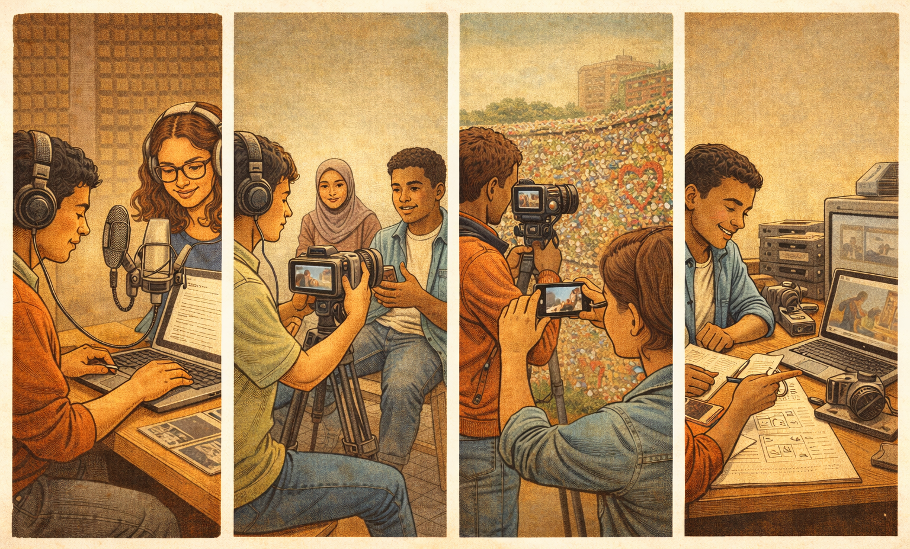
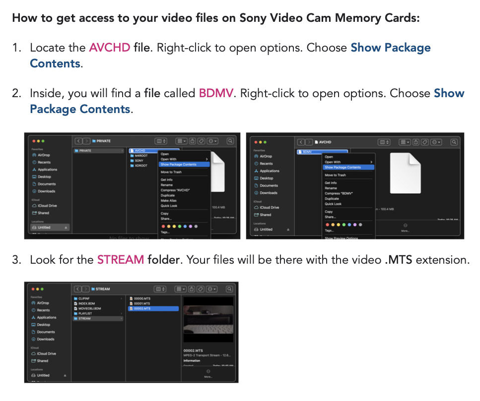

[← MEDIAART 3I03](README.md) | [Project 1 Overview](p1AutoDoc.md)

---

<h1 style="color: darkred;">P1 – In-Class Work II</h1>  

---
### Narrative Development · Scratch Voice · Visual Recording (Production Session)

This class-work session focuses on **committing to your story** and **recording all visual materials** needed for your autobiographical documentary.

Unlike Class Work I (exploration), this session is about **intentional production**. You will move from planning to execution, guided by your narration and brainstorm document.

This is a **3-hour production session**. You are expected to leave class with **all (or nearly all) visual materials recorded**.

---

## What to Bring to Class (Required)

You must arrive prepared with:

- **Your completed Brainstorm Document (from Class Work I)**
- **A USB drive** containing:
  - Images and/or short videos from your personal archives
- **Your personal smartphone**
  - You will use your phone to record a scratch version of your narration
- **Personal archival materials**, such as:
  - Printed photographs
  - Letters or paper materials
  - Personal objects (books, fabrics, photos, small objects, etc.)
- **Headphones** (recommended, for listening to your scratch narration)

> ⚠️ **Important:**  
> This session depends on preparation. Arriving without materials will limit your ability to complete the required recordings.

---

## Workflow Note (Important)

You may complete both of the following activities in any order during the class session.

You are responsible for managing your time so that **both parts are completed** by the end of class.

---

<h2 style="color: darkred;"> Narrative & Voice Script (≈ 30–40 minutes) </h2>

You will begin by **creating a draft version of your narration**.

During this time, you will:
- Review your brainstorm document and write a narrative script, thinking carefully about:
  - a clear beginning, middle, and ending
- Ensure the script has:
  - natural pacing and tone
  - a total length of **approximately 2–3 minutes**
- This script does not need to be perfect, this is a draft (or first) version.

**Guideline:**  
For a **1-minute documentary**, aim for **90–110 words of narration**.  
*This allows space for pauses, silence, and visual moments without voice-over.*

### Scratch Voice Recording

Using your **personal smartphone**, record a **test (scratch) version** of your narration.

You should:
- Record yourself reading the full script aloud
- Listen back at least once
- Note pacing, tone, and clarity

> This recording is **temporary** and will be replaced by a professional studio recording in Class Work III.

---

<h2 style="color: darkred;"> Visual Recording Session (≈ 2 hours) </h2>

Using the analogue media stations, record all visual materials needed for your documentary.

### Recording Note (Very Important)

For **Class Work II**, **professional video cameras will be available at each station**.

- You **must use the provided professional cameras** to record your visuals
- **Cellphones are not permitted** for visual recording in this session
- This ensures your footage meets the technical requirements for the final project

You are expected to:
- Record visuals guided by your narration
- Capture material for the **intro, middle, and ending**
- Record multiple takes or variations when possible
- ❗ Save all of your files in your USB before leaving class ❗

Available Equipment / Stations  

- **Station 1:**
  - **Three Scanners**
  - **Light Table** - access to a printer and translucent printing vellum
  - **Hand recorders**
   
- **Station 2:**
  - **One CRT TVs (Toshiba)**
    
- **Station 3:** 
  - **Two Monitors (Commodore)** with **black backdrop**
    
- **Station 4:**
  - **Overhead Light Projector**
  - **Two Monitors (Sony)** with **speaker** - TSH 203
     
- **Station 5:** 
  - **One CRT TV (Toshiba)**
  - **Professional mic setup**  

### Note for Sony Video Cameras

---

<h2 style="color: darkred;"> 📤 Required Upload — Class Work II  </h2>
**Due after class**

You must upload the following three items:

1. **Written Narration Script**
   - Complete draft of your voice-over text
   - **File format:** PDF
   - **File name:** `Lastname-Name-Script.pdf`

2. **Scratch Voice Recording**
   - Recorded using your smartphone
   - **File format:** MP3 or WAV
   - **File name:** `Lastname-Name-Script.pdf`

3. **Visual Materials Breakdown**
   - A short breakdown showing what you recorded
   - Include **stills, screenshots, or photos** from your recordings
   - Clearly label materials for Intro, Middle, & Ending
   - **File format:** PDF
   - **File name:** `Lastname-Name-Materials.pdf`

> You do not need to upload individual video files; you must clearly demonstrate that you recorded the materials needed to proceed to editing.

---

## Grading & Expectations (Maintenance-Based System)

To maintain your grade for **Class Work II**, you are expected to:
- Complete both activities during the session
- Manage your time responsibly
- Upload all three required items on time

Incomplete uploads or missing components may signal a **break in maintenance**.

---

<h2 style="color: darkred;"> After Class Work II (Important) </h2>

During this week, you are expected to:
- Revise and refine your **written narration script**
- Practice reading your script aloud
- Adjust pacing, tone, and emphasis in preparation for the final recording

Final voice recording will take place during [**Class Work III**](P1-InClassWork-III.md) in the audio studio. Arriving prepared will allow you to focus fully on recording and editing your rough cut.

---

