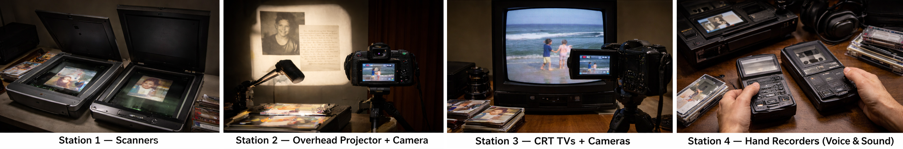

[← MEDIAART 3I03](README.md) | [Project 1 Overview](p1AutoDoc.md)

---

<h1 style="color: darkred;">P1 – In-Class Work III</h1>  

<figure style="width: 100%; margin: auto;">
  
</figure>

---
### Analogue Experimentation · Brainstorming (Process-Focused Session)

---

## What to Bring to Class (Required)

---

<h2 style="color: darkred;"> Part 1 — Analogue Experimentation (≈ 40 minutes) </h2>

---

<h2 style="color: darkred;"> Part 2 — Brainstorming & Storyboard Draft (≈ 30 minutes) </h2>

---

<h2 style="color: darkred;"> 📤 Required Upload — Class Work I  </h2>
**Due after class**

---

## Grading & Expectations (Maintenance-Based System)

This

---
