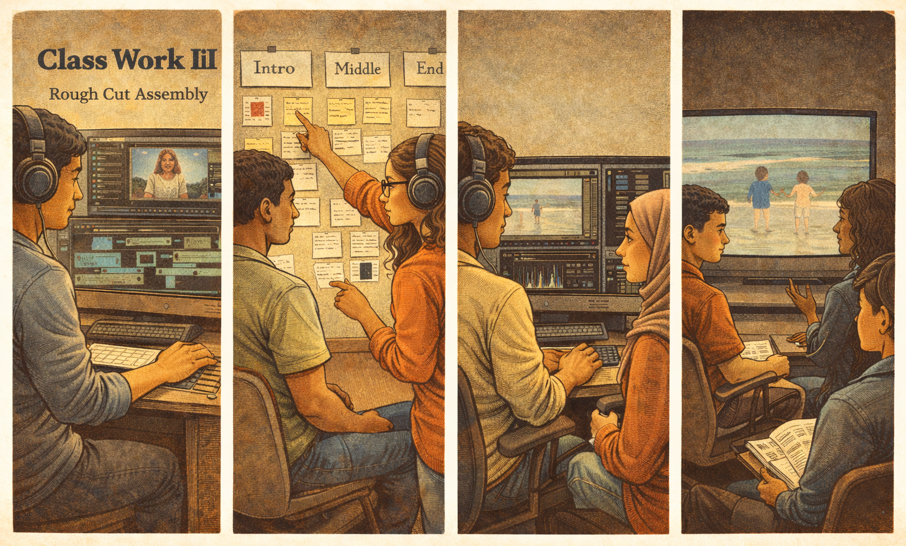

[← MEDIAART 3I03](README.md) | [Project 1 Overview](p1AutoDoc.md)

---

<h1 style="color: darkred;">P1 – In-Class Work III</h1>  

---
### Final Voice Recording · Editing · Rough Cut Assembly

This class-work session focuses on **final voice recording** and **assembling your documentary into a rough cut**. By the end of this day, you should have a **coherent, near-complete version** of your autobiographical documentary.

This is a **production and post-production session**. You are expected to work independently, manage your time carefully, and move between recording and editing as needed.

---

## What to Bring to Class (Required)

You must arrive prepared with:

- **Final narration script**
  - Printed or easily accessible (no major edits expected on recording day)

- **All recorded visual materials**
  - Organised on your computer, USB, or cloud storage
  - Ready to import into your editing software

- **Scratch narration recording**
  - From Class Work II (or an updated test version)
  - Used for pacing and reference during editing

> ⚠️ **Important:**  
> Class Work III is a production-intensive session. Arriving without these materials will limit the work you will complete.

---

<h2 style="color: darkred;"> Audio Recording Studio (Voice Recording) </h2>

The **audio recording studio** will be available during this class for a total of **6 hours**:
- **3 hours during class**
- **+ 3 additional hours** (same day)

> All sound equipment will be **fully set up for voice recording**.

### Recording Structure & Sign-Up

- A **sign-up spreadsheet** will be provided at the beginning of class
- Recording sessions will be done in **pairs**
  - You will help each other with setup, timing, and basic direction
- **Each session is 20 minutes total**:
  - **10 minutes per student**
- Sessions are **strictly timed**
  - Please arrive prepared and respect the schedule

> ⚠️ **Important:**  
> You must arrive with your **finalized narration script** ready to record.  
> There will be no extra time for rewriting in the studio.

### Voice Recording Expectations

During your recording session:
- Record your narration **2–3 times** if time allows
- Focus on: clarity, pacing, and emotional tone
- Avoid rushing — pauses and breath are part of the performance

> ⚠️ Do **not** exceed your allocated recording time.  

---

<h2 style="color: darkred;"> Editing & Rough Cut Assembly </h2>

When not in the audio studio, you are expected to be **editing your project**.

You will:
- Aspect ratio: **4:3** (min `1024 x 768 px`)
- Assemble your documentary into a **single timeline**
- Start using your **scratch narration** (or an updated test recording)
  > You will replace this with the final voice recording once done
- Ensure **narrative cohesion** across intro, middle, & ending
- Adjust pacing so the voice and visuals work together intentionally  
  > Your voice should guide the structure of the edit.

### Rough Cut

- Includes **all narration** (final or near-final)
- Includes **all primary visuals**
- Clearly communicates the story and structure
- Is focused on **clarity, pacing, and narrative flow**, not polish

### Sound & Music at Rough Cut Stage

- **Music is optional** at this stage
- You may submit:
  - narration only, **or**
  - narration with very subtle, temporary music
- Any music used must be **royalty-free**
- Music should:
  - sit quietly under the narration
  - never overpower or distract from the voice
- Silence and ambient sounds are **strongly encouraged** where appropriate

> If the story does not work without music, the narrative or pacing needs further refinement.

### Royalty-Free Music & Sound Resources

You may use **royalty-free music and sounds** from the following sources:

- **FreePD** — <a href="https://freepd.com" target="_blank">https://freepd.com</a>  
- **Pixabay Music** — <a href="https://pixabay.com/music/" target="_blank">https://pixabay.com/music/</a>  
- **YouTube Audio Library** — <a href="https://www.youtube.com/audiolibrary" target="_blank">https://www.youtube.com/audiolibrary</a>  
- **Freesound** — <a href="https://freesound.org" target="_blank">https://freesound.org</a>
  > ⚠️ **Important:** If using Freesound, make sure the sound is **clearly marked as royalty-free** and follow any **attribution requirements** listed on the file page.

---

<h2 style="color: darkred;"> 📤 Required Upload — Class Work III </h2>
**Due after class**

Upload: **Rough Cut Version**
- Duration: **2–3 minutes**
- Aspect ratio: **4:3** (min `1024 x 768 px`)
- Includes:
  - final or near-final narration
  - all major visuals
  - optional: sound elements (music, ambient sound, silence)
    
- **File format:** MP4
- **File name:** `Lastname-Name-RoughCut.mp4`

> ⚠️ **Important:**  
> Completing and submitting a rough cut is **required** in order to participate in the **Rough Cut Submission + Critique Activity**.
> > You must submit it **at least one day** before the in-class critique session/class.
> Students without a rough cut will not be able to take part in the in-class critique. 

---

## After Class Work III (Important)

Between **Class Work III** and the **Rough Cut Submission + Critique Activity**, you are required to:

- Start preparing your **final title, project description, and high-quality screenshot** (instructions on the link below). You must upload these at least **one (1) week before the exhibition** so they can be included in the exhibition design materials.
- Carefully read and follow the instructions for the [**Class Exhibition**](P1-Exhibition.md).

---

# Grading & Expectations (Maintenance-Based System)

For **Class Work III**, maintaining your grade means:

- Arriving with a finalized narration script
- Recording your voice at the Sound Studio with professional equipment
- Actively editing throughout the session
- Producing and submitting a **complete rough cut**
- Respecting studio protocols and peer recording time

Incomplete recording, lack of editing progress, or missing submissions may signal a **break in maintenance**.

---
