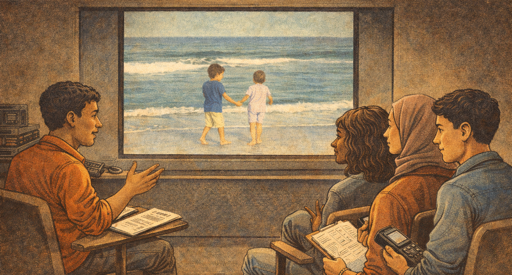

[← MEDIAART 3I03](README.md) | [Project 1 Overview](p1AutoDoc.md)

---

<h1 style="color: darkred;">Rough Cut Submission + Critique Activity</h1>  

To participate in the **Rough Cut Screening and Peer Critique**, you must upload your **rough cut** at least **one (1) day before** the scheduled critique session.

🚨 **Late or last-minute submissions will not be screened.**

This is not a penalty — it is a matter of:
- preparing the screening in advance
- respecting the time and attention of your peers and the instructor
- ensuring a meaningful critique environment

Students who do not submit on time:
- will not have their work screened
- will still be expected to participate as reviewers

---

<h2 style="color: darkred;"> In-Class Critique Structure </h2>

- The class will be divided into **three groups**
- Each group will be assigned **one other group’s rough cuts**
- All students must watch attentively and complete a **Peer Review Sheet** for each assigned project

This activity is about **listening, observing, and responding thoughtfully** to work in progress.

### Expectations for Participation

To maintain your grade, you are expected to:
- Submit your rough cut on time
- Attend the full critique session
- Watch assigned rough cuts attentively
- Complete and submit a Peer Review Sheet (provided by the instructor)

The quality of your participation matters more than agreement or taste.  
Your job is not to decide whether a project is good or bad.  
Your job is to help the maker understand how their story is landing right now.  

---

## Grading & Expectations (Maintenance-Based System)

For the **Rough Cut Submission + Critique Activity**, maintaining your grade means:

- Uploading your rough cut **at least one (1) day before** the critique session
- Attending the full session and participating professionally
- Completing and submitting the **Peer Review Sheet** for each assigned project
- Respecting the time, attention, and work of your peers

Missing the deadline, arriving unprepared, or not completing peer feedback may signal a **break in maintenance**, which can affect your overall standing in the course.

---

<h2 style="color: darkred;"> After Class Rough Cut Submission + Critique Activity (Important) </h2>

- Complete the **final version of your video**, including:
  - English subtitles  
  - A title at the beginning  
  - Credits at the end
- Upload your **final video** at least **two (2) days before the exhibition** in order to be included.
- Upload your **final title, project description, and high-quality screenshot** (instructions on the link below) and upload them at least **one (1) week before the exhibition** so they can be included in the exhibition design materials.
- Carefully read and follow the instructions for the [**Class Exhibition**](P1-Exhibition.md).

🚨 **Late submissions may result in your work not being included in the exhibition.**

---

