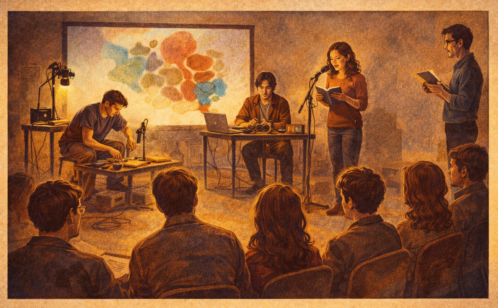

[← MEDIAART 3I03](README.md) | [Project 2 Overview](p2PerfStory.md)

---

<h1 style="color: darkred;">Class Rehearsal + Critique Activity</h1>  

The **Class Rehearsal + Critique Activity** is the **first full concert-style run** of your performative storytelling project.

This session is not for experimentation or adding new elements.  
It is a **concert-ready rehearsal** focused on:
- timing
- coordination
- cue clarity
- refinement

All groups must arrive prepared to perform their work **as it currently exists**.

---

<h2 style="color: darkred;"> Structure of the Class Rehearsal </h2>

This activity will begin **at the scheduled class time, sharp**. The instructor will provide the order on Avenue To Learn.  

Each group will have **20–25 minutes total**, which includes:

1. **Setup**  
   *(while the before group removes their materials)*
3. **Single Performance Round** (8–10 minutes)
4. **In-Class Critique & Spoken Feedback**
5. **Strike / Removal of Materials**  
   *(while the next group sets up)*

⚠️ Because time is shared, **groups must respect time limits**.  
Late arrivals or slow setup will reduce performance or critique time.

## Performance Requirements

- This rehearsal takes place in the **concert space**
- Each group will perform **one (1) full round only**
- The performance must be:
  - structurally complete
  - concert-ready
  - within the **8–10 minute duration**
- No additional lighting, sound, visual, or structural elements may be introduced during this session

This rehearsal is about **refinement**, not redesign.

Groups must:
- set up efficiently
- follow their defined cues
- strike quickly and carefully after their round

---

<h2 style="color: darkred;"> Structure of the Critique Activity </h2>

- The instructor will facilitate the critique flow
- After each performance:
  - peers will offer **spoken feedback**
- The instructor will distribute a **Peer Assessment Sheet**, similar in format to Project 1.

This activity is about **listening, observing, and responding thoughtfully** to live work.

## Grading & Expectations (Maintenance-Based System)

For the **Class Rehearsal + Critique Activity**, maintaining your grade means:

- Arriving on time and fully prepared
- Performing a complete, concert-ready version of your work
- Respecting time limits and shared space
- Participating professionally in critique
- Completing peer assessment materials

Arriving unprepared, introducing unapproved changes, or disengaging from critique may signal a **break in maintenance**.

---

<h2 style="color: darkred;"> After Class Rehearsal + Critique (Important) </h2>

After this session, groups may make **small, targeted refinements** based on the feedback received.

These changes must be:
- discussed with the instructor
- focused on timing, clarity, pacing, or coordination
- **not** structural, conceptual, or technical redesigns

### Independent Rehearsal (Strongly Recommended)

Groups are **strongly encouraged** to rehearse independently between this session and the **Concert Rehearsal**, even if:
- the full technical setup is not available
- lighting is simulated
- sound is approximate

Independent rehearsal should focus on:
- timing and duration
- cue execution
- coordination between roles
- transitions and flow

### Preparation for Concert Rehearsal (Required)

By the time of the **Concert Rehearsal**/**Open Performance**:
- your performance must be **fully defined**
- no further changes to structure, roles, or technical setup will be permitted
- all performers must arrive **concert-ready**

🚨 It is your responsibility to carefully read the instructions for the **Concert Rehearsal** (available on [**Open Performance**](P2-OpenPerformance.md)) in advance in order to understand expectations, timing, and conduct.

---
