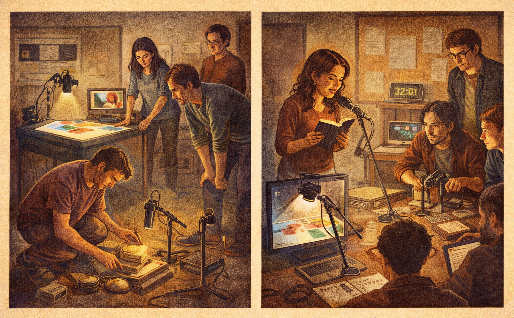

[← MEDIAART 3I03](README.md) | [Project 2 Overview](p2PerfStory.md)

---

<h1 style="color: darkred;">P2 — Group Rehearsal</h1>  

---

### Instructor-Guided Rehearsal Session  
*(Structure · Timing · Coordination)*

Group Rehearsals are **focused working sessions** designed to help you test, refine, and stabilize your live performance before the **Class Rehearsal + Critique Activity**.

These rehearsals are not performances. They are spaces to:
- test structure and pacing
- practice cues and transitions
- identify technical or coordination issues
- receive instructor feedback

---

## Rehearsal Sign-Up (Required)

Each group must:
- sign up for **at least one (1)** rehearsal (1 hour) with the instructor
- may sign up for **up to two (2)** rehearsals if desired

A sign-up spreadsheet will be provided on **Avenue to Learn**.

---

<h2 style="color: darkred;">Rehearsal</h2>

## Preparation (Required)

You must arrive **fully prepared** with:
- all materials, objects, instruments, and props
- a near-final **performance score**
- a clear understanding of your role and cues

🚨 **Unprepared groups will not be able to use rehearsal time effectively.**

---

## Rehearsal Setup & Equipment

The instructor will provide:
- Light table
- Live camera setup for visuals
- Microphones for:
  - live sound
  - spoken word performer

This rehearsal will take place in a **rehearsal space**, **not** the concert hall.

🚨 **Important limitations:**
- There will be **no theatrical lighting**
- This rehearsal focuses on:
  - structure
  - coordination
  - timing
  - cue logic

Lighting ideas should be **imagined and verbally noted**, not executed.

---

## Rehearsal Expectations

### Number of Rounds

Each group must aim to complete:
- **at least 2 full rounds**
- **preferably 3 rounds** if time allows

A *round* means:
- running the performance from beginning to end
- following your **performance score**
- respecting your planned duration (8–10 minutes)

Between rounds, pause briefly to:
- adjust cues
- clarify transitions
- address technical or coordination issues

---

### Timekeeping & Coordination

- The **Coordinator** must:
  - track time during each round
  - note sections that feel rushed or too slow
- Lighting cues should be **spoken or signaled verbally** during rehearsal

---

## Documentation (Required)

The **Coordinator** is responsible for:
- recording each rehearsal round (video or audio)
- ensuring recordings are clear enough for later analysis

These recordings are:
- for **internal group use only**
- not submitted or shared publicly

They should be used to:
- analyze pacing
- identify breakdowns in coordination
- prepare revisions before the next rehearsal or critique

---

## Instructor Support

During rehearsals, the instructor will:
- assist with technical setup as needed
- help troubleshoot live sound and visuals
- offer **conceptual feedback**
- suggest strategies for:
  - pacing
  - cue clarity
  - coordination
  - audience experience

---

<h2 style="color: darkred;"> 📤 Required Upload</h2>
**Due before Class Rehearsal + Critique Activity**

Each group must finalize their **Project Document**.

This document must include:

1. **Final Project Title**
2. **List of Authors** ((add country of origin & roles)
3. **Final Description** (1 paragraph)
4. **List of Final Materials / Elements**
5. **Final Technical Needs**
6. **Final Floor Plan**
7. **Final Performance / Visual Score**

**File format:** PDF  
**File name:** `GroupName-P2-FinalProject.pdf`

---

## Grading & Expectations (Maintenance-Based System)

To maintain your grade for **Group Rehearsal**, you are expected to:
- sign up and attend the required rehearsal(s)
- arrive on time and prepared
- participate actively and professionally
- use rehearsal time productively

Failure to prepare, attend, or engage meaningfully may signal a **break in maintenance** and will impact subsequent activities.

---

<h2 style="color: darkred;">After Group Rehearsal (Important)</h2>

Before the [**Class Rehearsal + Critique Activity**](P2-ClassRehearsal-Critique.md), you are expected to:
- gather all final required materials
- read the instructions for the Class Rehearsal + Critique Activityactivity to understand expectations

## Independent Rehearsal (Strongly Recommended)

In addition to instructor-led rehearsals, groups are **strongly encouraged** to rehearse independently, even if:
- not all equipment is available
- lighting is simulated
- sound is approximate

Focus on:
- timing
- transitions
- cue logic
- collective coordination

This preparation is essential for success in the **Class Rehearsal + Critique Activity**.

---

